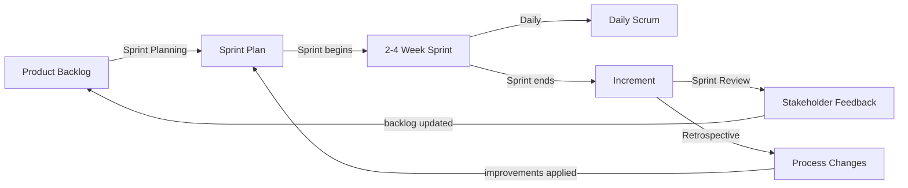

# CSE 403: Agile and Scrum — Deep Dive

This file expands on the Agile and Scrum sections introduced in [[SDLC Models]]. It covers the Agile Manifesto's principles, Scrum mechanics, XP practices, and the trade-offs of Agile versus plan-driven approaches.

---

## The Agile Manifesto in Depth

The **Agile Manifesto** (2001) was signed by 17 software practitioners who had grown frustrated with heavyweight, document-centric processes. The four value statements are:

1. **Individuals and interactions** over processes and tools
2. **Working software** over comprehensive documentation
3. **Customer collaboration** over contract negotiation
4. **Responding to change** over following a plan

Critically, the manifesto does not say processes, documentation, contracts, or plans have no value — it says the items on the left are valued *more*. This is a subtle but important distinction. A team that produces no documentation or ignores contracts in the name of "being Agile" is misapplying the manifesto.

### The Twelve Principles

Behind the four values are twelve principles, including:

- Deliver working software frequently (weeks, not months)
- Welcome changing requirements, even late in development
- Business people and developers must work together daily
- Build projects around motivated individuals; give them the environment and trust they need
- The most efficient and effective method of conveying information is face-to-face conversation
- Working software is the primary measure of progress
- Sustainable pace — Agile processes promote sustainable development; the team should be able to maintain constant pace indefinitely
- Continuous attention to technical excellence and good design enhances agility
- Simplicity — the art of maximizing the amount of work not done — is essential

---

## Scrum in Depth

**Scrum** is the most widely adopted Agile framework. It is a **lightweight process framework** — it prescribes roles, events, and artifacts, but does not prescribe engineering practices (that is XP's domain).

### Scrum Roles

**Product Owner (PO)**: The single person accountable for maximizing the value of the product. The PO:
- Owns and continuously refines the **Product Backlog**
- Prioritizes backlog items according to business value
- Is available to answer developer questions about requirements
- Accepts or rejects completed Sprint increments

The PO is NOT a committee. Having multiple people act as PO creates conflicting priorities that stall the team.

**Scrum Master (SM)**: A servant-leader responsible for the health of the Scrum process. The SM:
- Facilitates Scrum events
- Removes **impediments** (blockers that prevent the team from making progress)
- Coaches the team on Scrum principles
- Protects the team from external interruptions during a Sprint

The SM is NOT a project manager in the traditional sense. They have no authority over the Development Team's technical decisions.

**Development Team**: A self-organizing, cross-functional group of 3–9 people who do the work. "Cross-functional" means the team collectively has all skills needed to deliver a Done increment (design, development, testing) — no external dependencies are required within the Sprint.

### Scrum Artifacts

**Product Backlog**: An ordered list of everything that might be needed in the product. Every item is a **Product Backlog Item (PBI)**, often written as a **User Story**: "As a [user type], I want [goal] so that [benefit]."

PBIs near the top of the backlog are refined (small, estimated, detailed). Items near the bottom may be large, vague epics. This gradual refinement is called **backlog grooming** or **backlog refinement**.

**Sprint Backlog**: The set of PBIs selected for the current Sprint, plus a plan for delivering them. Owned by the Development Team. It is a forecast, not a commitment — the team can adjust it during the Sprint if they learn something new.

**Increment**: The sum of all completed PBIs at the end of a Sprint. It must meet the **Definition of Done (DoD)** — a shared checklist of quality criteria (e.g., "all code reviewed, all tests passing, deployed to staging") that must be met for a PBI to be considered complete.

### Scrum Events

**Sprint Planning**: At the start of each Sprint. The PO presents the top-priority PBIs. The team selects how many they can complete (based on **velocity** — their average output per Sprint) and defines a **Sprint Goal** — a single objective that gives the Sprint coherence.

**Daily Scrum (Stand-up)**: A 15-minute daily event for the Development Team. Each member answers three questions:
- What did I complete since the last Daily Scrum?
- What will I complete before the next one?
- Is anything blocking my progress?

The Daily Scrum is NOT a status report to management. It is a planning event for the team to coordinate.

**Sprint Review**: At the end of each Sprint. The team demonstrates the Increment to stakeholders. The Product Owner reviews what was Done and what was not. Stakeholders provide feedback that is incorporated into the Product Backlog.

**Sprint Retrospective**: After the Sprint Review, before the next Sprint. The team reflects on their **process** (not the product): what went well, what did not, and what one concrete improvement they will implement next Sprint.

### Velocity and Estimation

**Velocity** is the amount of work (measured in **story points**) a team completes per Sprint. Story points are a relative measure of complexity — a 5-point story is roughly twice as complex as a 2-point story, but not necessarily twice as long. Points are assigned by team consensus, often using **Planning Poker** to avoid anchoring bias.

After a few Sprints, velocity stabilizes and becomes a reliable forecasting tool. If the team's average velocity is 30 points/Sprint and there are 150 points of backlog remaining, the team is roughly 5 Sprints (10–20 weeks) from completion.

---

## Extreme Programming (XP) Practices in Depth

**XP** provides the engineering practices that Scrum leaves unspecified. XP and Scrum are commonly combined — Scrum for project management, XP for technical practices.

### Test-Driven Development (TDD)

**Test-Driven Development** inverts the normal coding sequence. The cycle is:

1. Write a failing test for the next desired behavior
2. Write just enough production code to make the test pass
3. Refactor: clean up both the test and production code without changing behavior

This is called **Red-Green-Refactor**. The discipline of writing the test first forces the developer to think about the interface and expected behavior before implementation. It also guarantees that every behavior has a test — eliminating the "I'll write tests later" failure mode.

### Pair Programming

**Pair Programming** places two developers at one workstation. The **driver** writes code; the **navigator** reviews in real time, thinking strategically about direction and catching errors. They switch roles frequently.

Research shows pair programming reduces defect rates significantly — two people are less likely to share the same blind spot. The knowledge transfer benefit is also substantial: junior developers learn rapidly by pairing with seniors.

The objection that it halves throughput (two people doing one person's work) is empirically false. The reduced defect rate and the elimination of lengthy code review cycles mean total delivery time is often comparable.

### Continuous Integration (CI)

**Continuous Integration** means every developer integrates their code into the shared repository multiple times per day. Each integration triggers an automated build and test run. If the build breaks, fixing it becomes the team's top priority.

The rationale: if you integrate infrequently, each integration becomes a major event with many conflicts and failures to debug simultaneously. Daily integration means conflicts are small, localized, and cheap to resolve.

### Refactoring

**Refactoring** is the disciplined process of restructuring existing code — improving its internal structure — without changing its external behavior. It is NOT rewriting or fixing bugs. Common refactorings include: extracting a method, renaming a variable for clarity, removing duplication.

The test suite is what makes refactoring safe: if all tests still pass after a structural change, you have not changed behavior. Without tests, refactoring is risky guesswork.

---

## Agile vs. Plan-Driven Trade-offs

| Dimension | Agile | Plan-Driven (Waterfall) |
|---|---|---|
| Requirements | Expected to change; welcomed | Fixed upfront; change is costly |
| Customer involvement | Continuous collaboration | Primarily upfront and at delivery |
| Documentation | Minimal; just enough | Comprehensive; formal artifacts |
| Risk management | Inherent in iteration (fail fast) | Explicit risk analysis phases |
| Team size | Small, co-located, self-organizing | Can scale to large, distributed teams |
| Contract type | Time-and-materials | Fixed-price, fixed-scope |
| Regulatory fit | Poor (lacking formal artifacts) | Good (documentation-heavy) |

---

## Related

- [[SDLC Models]]
- [[Waterfall Details]]
- [[Requirements Engineering]]
- [[Testing Fundamentals]]
- [[Version Control Fundamentals]]

---

## Industry Standard Terms

| Course Term | Industry / Standard Term |
|---|---|
| Scrum Master | Agile Coach, Process Facilitator |
| Product Backlog | Feature Backlog, Icebox |
| Sprint | Iteration, Time-box |
| Definition of Done | DoD, Acceptance Criteria (at team level) |
| Backlog Grooming | Backlog Refinement |
| Story Points | Effort Points, Complexity Points |
| Planning Poker | Estimation Poker, Scrum Poker |
| Daily Scrum | Stand-up, Daily Sync |
| Sprint Review | Demo, Show-and-Tell |
| Sprint Retrospective | Retro, Post-mortem (loosely) |
| TDD | Test-First Development |
| CI | Continuous Integration, CI/CD pipeline (broader) |
