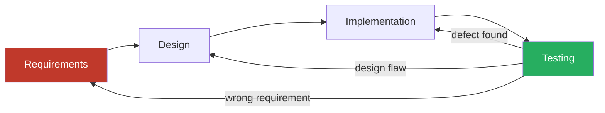

# CSE 403: Waterfall Model — Deep Dive

This file expands on the Waterfall model introduced in [[SDLC Models]]. It covers the historical context, phase artifacts, the feedback problem, and why Waterfall persists despite its known limitations.

---

## Historical Context

The Waterfall model is often attributed to Winston Royce's 1970 paper "Managing the Development of Large Software Systems." The irony is that Royce actually presented Waterfall as a **flawed model** in that same paper — he used it as a baseline to argue against, proposing iterative refinements as the correct approach. The industry largely ignored the caveats and adopted the sequential structure as the standard.

The model was inspired by manufacturing and construction, where "phases" like blueprint → fabrication → assembly are natural and reverting is genuinely expensive. The assumption was that software could be managed the same way.

---

## Phases and Their Artifacts

Each Waterfall phase has a defined set of deliverables that act as the contract for the next phase:

### (1) Requirements Phase

The **requirements phase** produces the **Software Requirements Specification (SRS)**. This document must capture:
- **Functional requirements**: what the system must do (features, behaviors, inputs/outputs)
- **Non-functional requirements**: performance targets, security requirements, reliability constraints, usability standards

The SRS is treated as a contract. Once signed off, changes to it are controlled through a **change control process**, which is deliberately slow and bureaucratic to discourage scope creep.

### (2) Design Phase

The design phase transforms the SRS into a system blueprint. It typically produces:
- **High-level design (HLD)**: system architecture, major components, data flow between subsystems
- **Low-level design (LLD)**: module-level design, class diagrams, database schemas, API specifications

The HLD is often reviewed by architects; the LLD is reviewed by senior developers. Design is complete when every requirement in the SRS can be traced to a design element.

### (3) Implementation Phase

Developers write code according to the LLD. In strict Waterfall, developers are not expected to make architectural decisions — those were resolved in design. Coding is treated as a largely mechanical translation of design into a programming language.

In practice, this assumption breaks down constantly. Design documents are never complete enough to eliminate ambiguity, so developers make implicit design decisions during coding that may contradict the design phase's intent.

### (4) Verification (Testing) Phase

After all code is written, the testing team executes tests against the requirements in the SRS. Testing in Waterfall is typically:
- **Black-box**: testers verify behavior against the SRS without needing to understand the code
- **System-level**: the full integrated system is tested, not individual units

Finding defects in this phase means returning to implementation (or possibly design) — a costly and disruptive backward move in a phase-gated model.

### (5) Maintenance Phase

Once deployed, the system enters maintenance. This covers:
- **Corrective maintenance**: fixing bugs discovered post-deployment
- **Adaptive maintenance**: modifying the system as the environment changes (OS updates, API changes)
- **Perfective maintenance**: adding features or improving performance

Maintenance is often treated as a separate, ongoing mini-Waterfall cycle.

---

## The Feedback Problem

The fundamental structural flaw in Waterfall is that **feedback loops are too long**. The only time real feedback arrives is during testing (when the customer sees working software for the first time) and maintenance. By then, the investment in the wrong direction is enormous.

The red-to-green arrow represents the worst case: a requirement was wrong, and it is only discovered in testing. The entire chain must be revisited. Studies have shown that **the cost to fix a defect increases by an order of magnitude for each phase it crosses** — a defect discovered in testing may cost 100x more to fix than the same defect discovered in requirements.

---

## Modified Waterfall (Royce's Actual Proposal)

Royce's paper actually proposed a **modified Waterfall** with two key additions:
1. **Iterative feedback between adjacent phases** — explicit backward arrows between each pair of consecutive phases
2. **A preliminary design phase** — build a pilot prototype before committing to the full design

This modified model is much closer to what modern iterative models do, but it never became as widely adopted as the simplified linear version.

---

## Waterfall in Modern Practice

Despite its well-documented limitations, Waterfall or Waterfall-like processes persist in:

- **Government and defense contracting**: Fixed-price contracts require a fixed scope. The SRS becomes a legal document, and change requests go through formal procurement procedures.
- **Regulated industries**: FDA medical device software, FAA aviation software, and similar domains require formal phase documentation for regulatory approval. The documentation artifacts Waterfall produces are exactly what regulators want to see.
- **Embedded and safety-critical systems**: When the cost of a post-deployment defect is catastrophic (a pacemaker firmware bug, an aircraft flight control error), the upfront investment in complete specification is justified.

---

## Related

- [[SDLC Models]]
- [[Agile and Scrum Details]]
- [[Requirements Engineering]]

---

## Industry Standard Terms

| Course Term | Industry / Standard Term |
|---|---|
| Waterfall | Plan-driven development, Sequential lifecycle |
| SRS | Software Requirements Specification, PRD (Product Requirements Document) |
| HLD | System Architecture Document, High-Level Design |
| LLD | Detailed Design Document, Module Design Specification |
| Change Control Process | Change Control Board (CCB), Change Request (CR) process |
| Corrective Maintenance | Bug fix, Hotfix |
| Adaptive Maintenance | Patching, Environment migration |
| Perfective Maintenance | Feature enhancement, Performance tuning |
