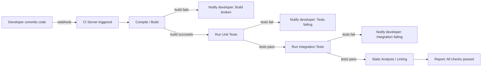

# CSE 403: Automated Testing and Continuous Integration

**Automated testing** is the practice of encoding test cases as executable code so that they can be run without human intervention. **Continuous Integration (CI)** is the practice of running that automated test suite automatically on every code change, providing rapid feedback to developers. Together, they form the infrastructure that makes large-scale software development manageable.

---

## Why Automation Is Necessary

Manual testing does not scale. As a codebase grows, the number of behaviors to test grows with it. Consider:

- A system with 100 features needs 100 feature tests. Manual regression testing before every release could take days.
- A team committing code multiple times per day cannot wait for overnight manual test runs.
- Human testers are inconsistent — different runs of the same manual test may produce different results due to human variation.

Automated tests are:
- **Fast**: a unit test suite for a large codebase runs in seconds
- **Deterministic**: the same test produces the same result every time (for deterministic code)
- **Cheap at scale**: writing a test costs time once; running it costs nothing thereafter

---

## Test Frameworks

**Test frameworks** provide the infrastructure for writing, organizing, and running automated tests. They provide:
- A way to declare test cases (usually annotated methods or functions)
- Assertion utilities (e.g., `assertEqual`, `assertThrows`, `assertTrue`)
- Test runners that execute all declared tests and report results
- Setup/teardown hooks for common initialization/cleanup

Common frameworks:
- **JUnit** (Java): the canonical unit testing framework, widely imitated
- **pytest** (Python)
- **Jest** (JavaScript/TypeScript)
- **NUnit** / **xUnit** (.NET)

### JUnit Example

A typical JUnit 5 test class:

```java
import org.junit.jupiter.api.*;
import static org.junit.jupiter.api.Assertions.*;

class CalculatorTest {

    Calculator calculator;

    @BeforeEach
    void setUp() {
        calculator = new Calculator();
    }

    @Test
    void addPositiveNumbers() {
        assertEquals(5, calculator.add(2, 3));
    }

    @Test
    void divideByZeroThrows() {
        assertThrows(ArithmeticException.class,
            () -> calculator.divide(10, 0));
    }

    @AfterEach
    void tearDown() {
        // cleanup if needed
    }
}
```

The `@BeforeEach` and `@AfterEach` hooks ensure each test starts with a fresh `Calculator` instance — tests must not share mutable state.

---

## Test Doubles

A **test double** is an object that replaces a real dependency in a unit test. The term is a generalization; there are several specific subtypes. See [[Mock-Based Testing]] for how test doubles are implemented using Mockito in practice.

**Mock**: A pre-programmed object that records calls made to it and can verify that specific methods were called with specific arguments. Mocks make assertions about *behavior* (interactions), not just output.

**Stub**: An object that returns hardcoded responses to method calls. Stubs provide controlled indirect input to the unit under test without verifying how it was called.

**Fake**: A working implementation of a dependency that uses a simplified mechanism (e.g., an in-memory database instead of a real relational database). Fakes have real logic but are not suitable for production.

**Spy**: A wrapper around a real object that records how it was called, allowing assertions about interactions while still using the real implementation.

**Dummy**: An object passed to fill a parameter slot but never actually used in the test.

The key rule: **unit tests should use test doubles for all external dependencies** — file systems, databases, network calls, clocks, and random number generators. This keeps unit tests fast and deterministic.

---

## Test Organization and Structure

### The AAA Pattern

Tests should be structured using the **Arrange-Act-Assert (AAA)** pattern:
- **Arrange**: set up the test state (create objects, configure mocks, set inputs)
- **Act**: invoke the unit under test with the specified inputs
- **Assert**: verify that the output or side effects match expectations

This pattern makes tests easy to read and diagnose. A failing test immediately indicates which assertion failed and what the wrong value was.

### Test Independence

Each test must be fully independent of all other tests:
- Tests must not share mutable state (static variables, shared objects)
- Tests must not depend on execution order
- A test must be able to pass or fail regardless of which other tests run

Violation of test independence creates **flaky tests** — tests that pass or fail depending on execution order or environment state, which are extremely costly to diagnose.

### Naming Conventions

Test names should be descriptive: they serve as documentation and as failure diagnostics. A test named `test1` is useless when it fails. A test named `divideByZeroShouldThrowArithmeticException` immediately communicates intent.

---

## Continuous Integration (CI)

**Continuous Integration** is the practice of integrating every developer's code into the shared repository frequently (multiple times per day) and automatically verifying each integration with a build and test run.

The goal of CI is to detect integration problems and regressions immediately — within minutes of the commit that caused them — rather than hours or days later when the context has been lost and the blast radius is larger.

### The CI Pipeline

A **CI pipeline** is the automated sequence of steps that runs on every commit:



Each stage gates the next. If the build fails, there is no point running tests. If unit tests fail, there is no point running slower integration tests.

### CI Server Tools

Common CI servers:
- **Jenkins**: open-source, highly configurable, self-hosted
- **GitHub Actions**: tightly integrated with GitHub, YAML-based pipeline definition
- **GitLab CI**: built into GitLab
- **CircleCI**, **Travis CI**: cloud-based CI services

All follow the same basic model: a configuration file in the repository defines the pipeline steps, and the CI server executes those steps whenever a commit or pull request triggers it.

### The "Broken Build" Contract

The most important cultural norm in CI is: **a broken build must be fixed immediately**. The moment the CI pipeline reports failure, the developer who introduced the failure is responsible for fixing it before doing anything else.

The reason: if a broken build is left unrepaired, every subsequent commit either:
- Stacks on top of a broken base, making it harder to identify what caused the original failure
- Passes tests that are now meaningless because the pipeline is already failing

Broken builds block the entire team. CI only provides value if the pipeline stays green.

---

## Test Flakiness

A **flaky test** is one that sometimes passes and sometimes fails without any change to the code. Flaky tests are highly damaging because:
- They cause developers to ignore CI failures ("it's probably just a flaky test")
- Once developers stop trusting CI, its value as a safety net is destroyed
- Each flaky test failure requires human investigation to determine if it represents a real bug

Common causes of flakiness:
- **Timing dependencies**: tests that sleep for a fixed duration and assume an asynchronous operation completes in that time
- **Shared mutable state**: tests that pass or fail depending on which other tests ran first
- **Non-determinism**: tests that depend on random number generation or undefined behavior
- **External service dependencies**: tests that call real external services that may be unavailable
- **Order-dependent assertions**: tests that assert on an unordered collection (e.g., checking that `{A, B}` equals a set that may be returned as `{B, A}`)

Fixing flaky tests requires finding and eliminating the source of non-determinism. This often means introducing test doubles for time and randomness, ensuring proper setup/teardown, or using appropriate synchronization primitives for async code.

---

## Code Coverage in CI

CI pipelines often integrate **code coverage reporting** — running the test suite with coverage instrumentation and reporting the percentage of statements, branches, or lines exercised. See [[Coverage-Based Testing]] for a full treatment of coverage criteria, the CFG, and MC/DC. Coverage reports can:
- Fail the build if coverage drops below a threshold (e.g., must maintain 80% line coverage)
- Show coverage diffs on pull requests (what code in this PR is untested?)
- Identify completely untested modules

Coverage enforcement prevents the common pattern where new features are added without any tests, gradually eroding the quality of the test suite.

---

## Related

- [[Testing Fundamentals]]
- [[Test Design Techniques]]
- [[Testing and Continuous Integration]]
- [[Mock-Based Testing]]
- [[Coverage-Based Testing]]
- [[Version Control Fundamentals]]
- [[Agile and Scrum Details]]

---

## Industry Standard Terms

| Course Term | Industry / Standard Term |
|---|---|
| Continuous Integration | CI, CI/CD (when combined with deployment) |
| CI Pipeline | Build pipeline, Workflow, Action |
| Broken Build | Red build, Build failure |
| Test Double | Mock (often used loosely for all subtypes) |
| Flaky Test | Non-deterministic test, Flakey test |
| Coverage Threshold | Coverage gate, Quality gate |
| AAA Pattern | Arrange-Act-Assert, Given-When-Then (BDD variant) |
| Integration Test | Service test, API test (overlapping terms) |
