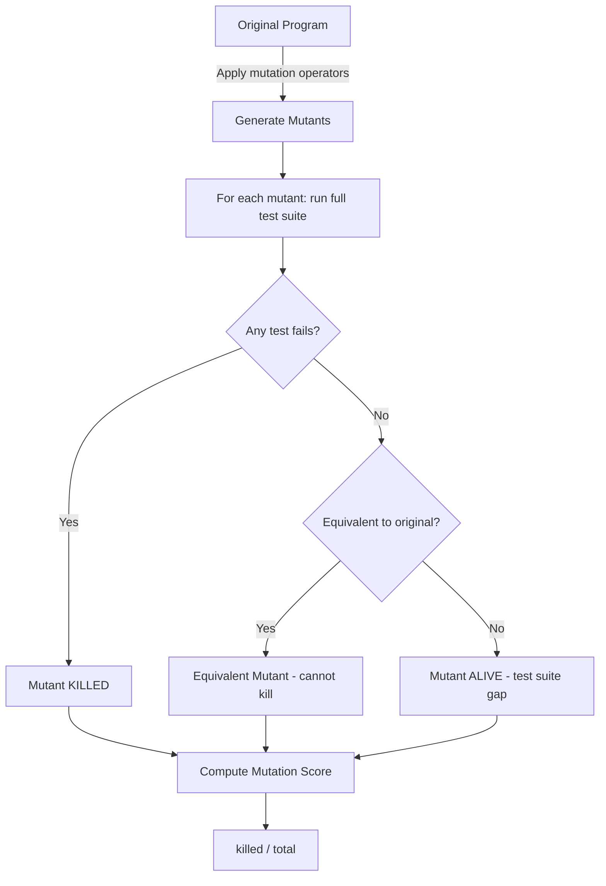
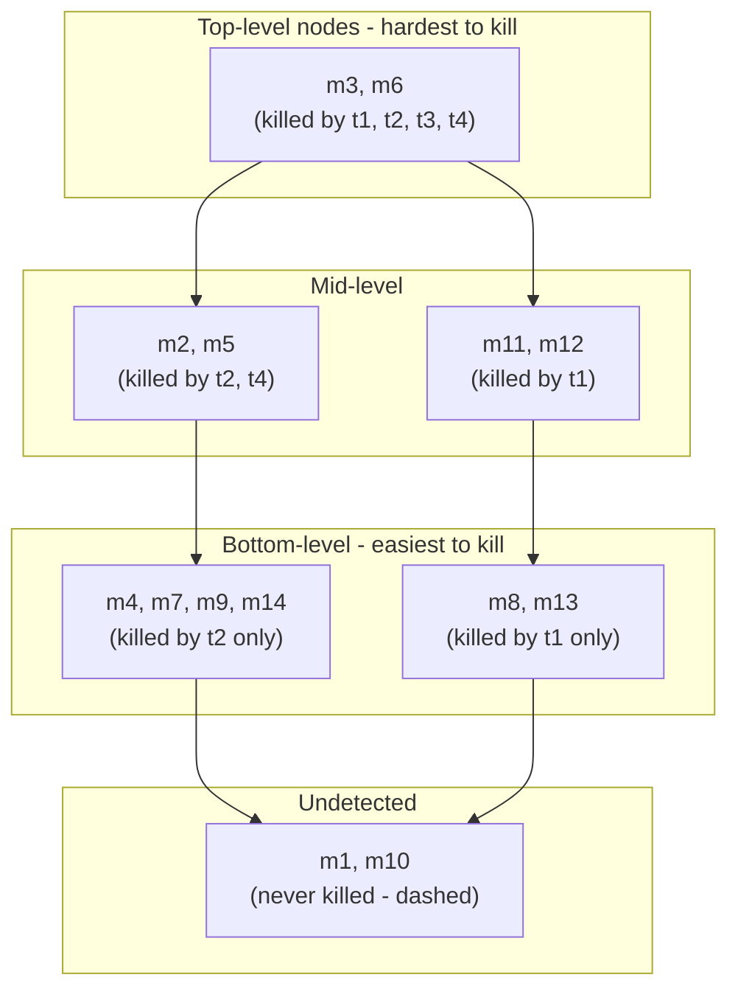

# CSE 403: Mutation Testing

**Mutation testing** is a technique for measuring the quality of a test suite by automatically generating slightly modified versions of a program and checking whether the test suite detects the introduced faults. It answers the question: if a real bug existed here, would your tests catch it?

## Why Structural Coverage Is Insufficient

**Condition coverage** requires every boolean condition in the program to evaluate to both true and false. More generally, structural coverage criteria (see [[Coverage-Based Testing]]) guarantee that certain syntactic constructs are exercised, but they say nothing about whether the tests would catch a real fault. A test suite can achieve 100% branch coverage while still failing to distinguish the original program from a subtly broken version. Mutation testing fills this gap by treating test quality as an empirical question: produce synthetic faults, run the suite, and measure the kill rate.

## Core Concepts

A **mutation** is a single syntactic change applied to the source program. A **mutant** is the new, modified program produced by applying that mutation. Mutations are generated automatically by **mutation operators** — transformation rules that encode the kinds of small mistakes real programmers make.

### Mutation Operators

Mutation operators substitute common syntactic constructs with plausible alternatives:

| Operator Category | Example Original | Example Mutant |
|---|---|---|
| Relational operator replacement | `lhs < rhs` | `lhs <= rhs` |
| Arithmetic operator replacement | `a + b` | `a - b` |
| Statement deletion | `stmt;` | *(no-op / removed)* |
| Constant replacement | `return 0;` | `return 1;` |
| Return value mutation | `return result;` | `return null;` or `return 0;` |
| Variable replacement | `a` | `b` (same type) |

These operators are deliberately small. Each mutant differs from the original by exactly one syntactic element. This design is intentional and grounded in two theoretical assumptions discussed below.

### Running Mutation Testing

1. Generate all mutants by applying each mutation operator at each applicable site.
2. For each mutant, run the entire test suite against it independently.
3. If **any test fails** on a mutant, the mutant is **killed** — the test suite detected the synthetic fault.
4. If **all tests pass** on a mutant, the mutant is **alive** — the test suite failed to detect this fault.

The **mutation score** is:

$$\text{Mutation Score} = \frac{\text{killed mutants}}{\text{total mutants}}$$

A higher mutation score indicates a stronger test suite. A score of 1.0 means every generated mutant was detected.

## Theoretical Foundations

Two core hypotheses justify why killing simple, single-edit mutants is a meaningful proxy for catching real bugs.

### Competent Programmer Hypothesis

The **competent programmer hypothesis** states that programmers tend to write programs that are close to correct — real faults are typically small, syntactically valid mistakes rather than wildly incorrect code. A developer who writes `<=` when they meant `<`, or forgets to negate a condition, is exhibiting exactly the kind of fault that mutation operators model. This means mutants are not arbitrary noise; they are plausible approximations of actual bugs introduced during development.

### Coupling Effect

The **coupling effect** is the observation that test cases capable of detecting simple faults (single mutations) tend also to be capable of detecting more complex faults (combinations of mutations). In other words, a test suite that kills individual mutants will likely also expose bugs that involve multiple interacting mistakes. This makes mutation score a practical upper-bounded measure: you do not need to enumerate all possible compound faults to trust the suite.

## Concrete Example: `min(int a, int b)`

Consider the following minimal function:

```java
int min(int a, int b) {
    return a < b ? a : b;
}
```

Four mutants can be generated:

| Mutant | Modified Code | Description |
|---|---|---|
| M1 | `return a;` | Always returns `a`, ignores `b` |
| M2 | `return b;` | Always returns `b`, ignores `a` |
| M3 | `return a >= b ? a : b;` | Flipped condition — returns max instead |
| M4 | `return a <= b ? a : b;` | Uses `<=` instead of `<` |

### Killing M1, M2, M3

A test case with `a=1, b=2` (expecting result `1`) kills M1 (returns `1`, correct), M2 (returns `2`, wrong — killed), and M3 (returns `2`, wrong — killed). A test with `a=2, b=1` (expecting result `1`) kills M1 (returns `2`, wrong — killed). Together, straightforward tests kill M1, M2, and M3 easily.

### M4: An Equivalent Mutant

M4 uses `a <= b` instead of `a < b`. Consider any input:

- When `a < b`: both `a < b` and `a <= b` are true, so both return `a`. Same result.
- When `a > b`: both conditions are false, so both return `b`. Same result.
- When `a == b`: the original `a < b` is false, returns `b` (which equals `a`); M4 `a <= b` is true, returns `a` (which equals `b`). Same result.

No test case can distinguish M4 from the original — they are **observationally equivalent**. M4 is an **equivalent mutant**: a mutant whose output matches the original for all possible inputs. Equivalent mutants cannot be killed by any test.

### M1 and M3: Redundant Mutants

**Redundant mutants** are mutants that are killed by exactly the same set of test cases, providing no additional information about test suite quality. M1 (`return a`) and M3 (returns max) are both caught by the same test: `a=1, b=2` where the expected result is `1`. Neither adds independent diagnostic value. Their presence inflates the denominator of the mutation score without contributing distinct information.

## Challenges

### Equivalent Mutants

Detecting equivalent mutants is **undecidable** — it reduces to the halting problem (determining whether two programs produce identical output for all inputs is not computable in general). In practice, equivalent mutants must be identified manually or approximated heuristically. They waste engineering effort because developers inspect live mutants to understand test gaps, and equivalent mutants create false alarms. An equivalent mutant also caps the achievable mutation score below 100%, because no test can ever kill it.

### Redundant Mutants

Redundant mutants inflate the total mutant count without adding signal. They also make it harder to assess progress and remaining effort: if many live mutants are redundant (requiring the same test to kill them), the developer cannot tell whether the real coverage gap is large or small. Mutation operator selection and subsumption-based reduction techniques attempt to minimize redundancy.

### Scalability

For a large codebase, the number of possible mutants grows proportionally to the number of applicable syntactic sites. Running the full test suite against each mutant independently is expensive. Techniques used in practice to manage this include:

- **Mutant sampling**: test a random subset of all possible mutants
- **Selective mutation**: use only a curated subset of mutation operators known to produce high-signal mutants
- **Test suite parallelism**: run mutant evaluations in parallel
- **Weak mutation**: approximate kill detection using intermediate program state rather than final output



## Mutation Testing vs. Mutation Analysis

The same underlying infrastructure — generating mutants from a program — is used for two distinct purposes, and it is important to keep them separate:

**Mutation testing**: The program and mutation operators are the inputs. The primary output is **new tests**. You generate mutants, observe which ones are not killed, and write tests specifically designed to distinguish those mutants from the original. The goal is test generation — you are using mutants as a specification of what tests to write.

**Mutation analysis**: The existing tests, the program, and mutation operators are all inputs. The primary output is an **adequacy score** — the mutation score (e.g., 80%) — for the existing test suite. You are not writing new tests; you are measuring the quality of what you already have. This is a diagnostic and assessment mode.

The key question these raise: how expensive is mutation testing, and is the mutation score a meaningful measure of test quality? The cost is high — every mutant requires a full test suite run — but the score has proven empirically to correlate with real-fault detection capability.

## Productive Mutants

The traditional view of mutation testing is binary: **detectable mutants are good** (they lead to tests) and **equivalent mutants are bad** (they cannot lead to tests). This view is too simplistic. The more nuanced and correct framing is the concept of **productive mutants**.

### Formal Definition

A mutant is **productive** if and only if:
1. It is **detectable** and it **elicits an effective test** — a test that meaningfully distinguishes the mutant from the original and improves the test suite's ability to catch real faults, or
2. It is **equivalent** and it **advances code quality or knowledge** — for example, by revealing that a particular code construct is semantically redundant, or by surfacing a question about the specification.

### Simplified Explanation

Productive = actually useful to a developer. Detectable does not automatically mean useful, and equivalent does not automatically mean useless. The core question for any mutant is always: does showing this mutant to a developer improve the test suite or the code?

### Example: Detectable but Unproductive (Example 3)

Consider a program that constructs a `HashSet` with initial capacity `a * b`:

```java
Set cache = new HashSet(a * b);
```

A mutation operator changes this to:

```java
Set cache = new HashSet(a + b);
```

This mutant is **detectable**: there exist inputs where `a * b != a + b` and the different initial capacity causes the set's internal behavior to differ in ways a test could observe. However, it is **not productive**. The initial capacity argument to `HashSet` is only a performance hint — the `HashSet` will resize automatically regardless of the initial value. A test that kills this mutant would only be testing Java's `HashSet` implementation details, not the logic of the program under test. Showing this mutant to a developer wastes their time.

### Example: Not Detectable but Not Unproductive (Example 2)

Consider a program that computes an average in two ways simultaneously — the variable `avg` accumulates a running partial average while `sum` accumulates the total for a separate final computation:

```java
// Original
avg = avg + (nums[i] / len);

// Mutant
avg = avg * (nums[i] / len);
```

This mutant is **not detectable**: `avg` is computed but the final return value is `sum / len`, so no test can distinguish the original from the mutant by observing the output. However, it is **not unproductive**. The fact that `avg` is computed but never used in the return value is surprising — it reveals a potential dead code issue or a discrepancy between what the programmer intended and what the program actually computes. Showing this to a developer is useful: it surfaces a question about whether `avg` should have been used instead.

### Practical Application: Mutation Testing at Google

Google's mutation testing infrastructure (described in the reading "Practical Mutation Testing at Scale: A View from Google") surfaces live mutants inline in code review. A developer reviewing a change sees a note like:

> Changing this 1 line to `if (a != b || b == 1)` does not cause any test exercising them to fail. Consider adding test cases that fail when the code is mutated.

The developer is given two options: **Please fix** (the mutant is productive — add a test) or **Not useful** (the mutant is not productive — dismiss it). This human feedback loop is the practical implementation of the productive mutants concept at scale.

## Mutant Subsumption

When there are many mutants and tests, it becomes useful to understand which mutants are more "powerful" in the sense that killing them implies killing others. This is the idea of **mutant subsumption**.

### The Subsumption Table

For any set of mutants and tests, we can build a subsumption table: a matrix where each row is a mutant and each column is a test. Each cell records whether that test detected that mutant. Detection can happen in two ways:
- **Assertion failure**: the test observed an incorrect output value.
- **Exception**: the mutant caused an uncaught exception that the original did not.

A mutant with no detection (all cells empty) is either equivalent or requires a test not yet written.

The example from lecture involves 14 mutants ($m_1$ through $m_{14}$), all applying different replacements to the `<` operator, and 4 tests ($t_1, t_2, t_3, t_4$):

| Mutant | Operator | $t_1$ | $t_2$ | $t_3$ | $t_4$ |
|---|---|---|---|---|---|
| $m_1$ | `<` → `!=` | pass | pass | pass | pass |
| $m_2$ | `<` → `==` | pass | **kill** | pass | **kill** |
| $m_3$ | `<` → `<=` | **kill*** | **kill*** | **kill*** | **kill*** |
| $m_4$ | `<` → `>` | pass | **kill** | pass | pass |
| $m_5$ | `<` → `>=` | pass | **kill** | pass | **kill** |
| $m_6$ | `<` → `true` | **kill*** | **kill*** | **kill*** | **kill*** |
| $m_7$ | `<` → `false` | pass | **kill** | pass | pass |
| $m_8$ | `<` → `!=` | **kill** | pass | pass | pass |
| $m_9$ | `<` → `==` | pass | **kill** | pass | pass |
| $m_{10}$ | `<` → `<=` | pass | pass | pass | pass |
| $m_{11}$ | `<` → `>` | **kill** | pass | pass | pass |
| $m_{12}$ | `<` → `>=` | **kill** | pass | pass | pass |
| $m_{13}$ | `<` → `true` | **kill** | pass | pass | pass |
| $m_{14}$ | `<` → `false` | pass | **kill** | pass | pass |

(\* = exception-based detection)

$m_1$ and $m_{10}$ are never detected — they are either equivalent mutants or require additional tests.

### Subsumption Relation

**Mutant $m_A$ subsumes mutant $m_B$** if every test that kills $m_A$ also kills $m_B$. In other words, $m_A$ is "harder" to kill than $m_B$ — any test suite capable of killing $m_A$ automatically kills $m_B$ as well. Killing a subsuming mutant gives you more information: you know that all the mutants it subsumes are also killed.

This relation defines a partial order over mutants. Mutants that subsume many others are the highest-priority targets: a test suite that kills all top-level (maximally subsuming) mutants has implicitly killed the entire set of mutants they subsume.

## Dynamic Mutant Subsumption Graph (DMSG)

The **Dynamic Mutant Subsumption Graph (DMSG)** is a directed graph that visualizes the subsumption relation among mutants. Nodes represent groups of mutants with identical kill patterns (they are killed by exactly the same set of tests). An edge from node $A$ to node $B$ means every test killing the mutants in $A$ also kills the mutants in $B$ — $A$ subsumes $B$.

### Construction

From the subsumption table above, the DMSG groups mutants by their detection patterns:

- $\{m_4, m_7, m_9, m_{14}\}$: detected only by $t_2$. These four mutants have the same kill pattern.
- $\{m_8, m_{13}\}$: detected only by $t_1$.
- $\{m_2, m_5\}$: detected by $\{t_2, t_4\}$ — any test killing $m_2$ or $m_5$ also kills $m_4$, $m_7$, $m_9$, $m_{14}$ (since $t_2$ kills all of those).
- $\{m_{11}, m_{12}\}$: detected by $\{t_1\}$ — any test killing $m_{11}$ or $m_{12}$ also kills $m_8$ and $m_{13}$.
- $\{m_3, m_6\}$: detected by all four tests $\{t_1, t_2, t_3, t_4\}$ — killing either requires tests that kill everything below them in the graph.
- $\{m_1, m_{10}\}$: never detected. Rendered as a **dashed node** in the graph to indicate these are undetected (equivalent or unreachable) mutants.



### Interpreting the DMSG

The DMSG tells you which mutants to target first. To kill the maximal number of mutants with the minimum number of new tests, focus on the **top-level nodes** — those that subsume the most others. Killing $m_3$ and $m_6$ (which together require tests that cover all four test cases) automatically means $m_2$, $m_5$, $m_{11}$, $m_{12}$, $m_4$, $m_7$, $m_8$, $m_9$, $m_{13}$, and $m_{14}$ are also killed, since any test suite that kills $m_3$/$m_6$ must have run tests $t_1$ through $t_4$, which collectively kill the entire reachable graph.

The dashed node $\{m_1, m_{10}\}$ is excluded from the prioritization — these are the candidates for equivalent mutants (or undiscovered test gaps requiring further investigation).

## Related

- [[Coverage-Based Testing]] — structural coverage criteria that mutation testing supersedes in quality measurement
- [[Delta Debugging]] — automated input minimization to isolate failures
- [[Testing Fundamentals]] — testing levels, oracles, and regression testing
- [[Testing and Continuous Integration]] — CI context in which mutation analysis is applied

## Industry Standard Terms

| Course Term | Industry / Standard Equivalent |
|---|---|
| Mutation testing | Mutation testing (universally adopted term; also called "mutation analysis") |
| Mutation analysis | Mutation adequacy assessment / mutation score computation |
| Mutation operator | Fault model / syntactic transformation rule |
| Killed mutant | Detected fault / test-covered synthetic defect |
| Alive mutant | Surviving mutant / test gap indicator |
| Equivalent mutant | Semantically equivalent program variant |
| Mutation score | Mutation adequacy score / mutation kill rate |
| Productive mutant | Actionable mutant / useful mutant |
| Competent programmer hypothesis | Foundational assumption in fault-based testing literature |
| Coupling effect | Empirical justification for mutation-based test adequacy |
| Mutant subsumption | Dominance relation / subsumption ordering over mutants |
| DMSG | Dynamic Mutant Subsumption Graph (standard research term) |
| Top-level DMSG node | Dominator mutant / maximally subsuming mutant |
