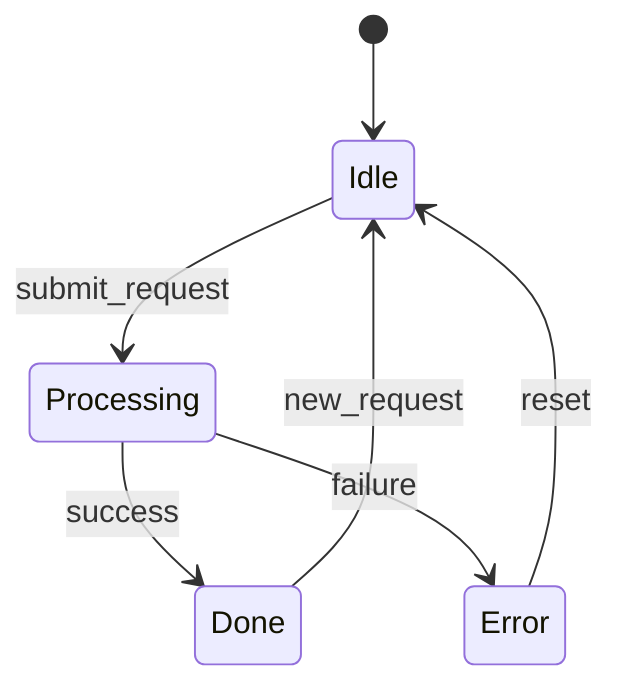
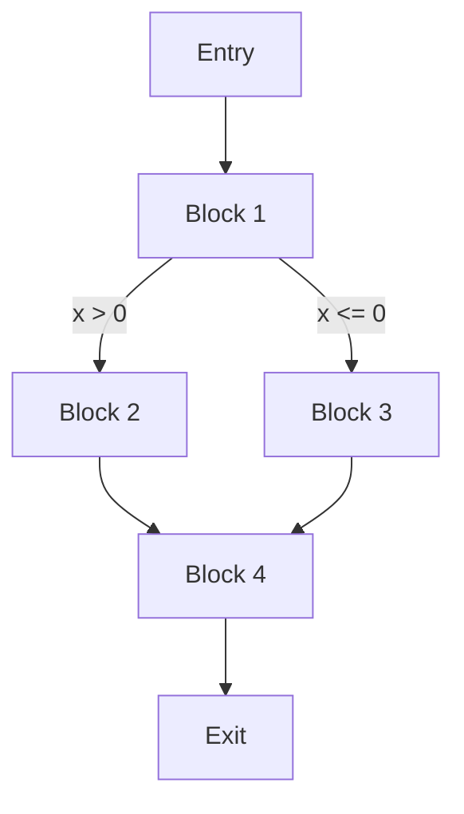
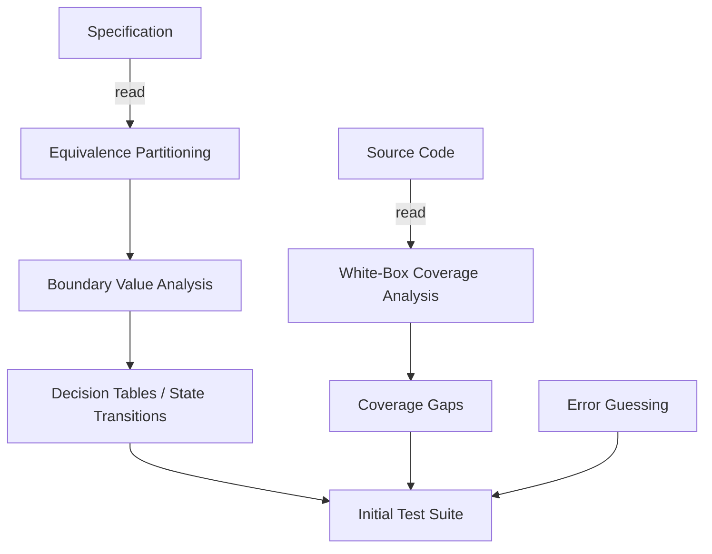

# CSE 403: Test Design Techniques

Writing tests is not the same as writing good tests. A good test is one that is likely to catch a real bug if one exists. **Test design techniques** are systematic methods for selecting inputs and test cases that maximize the probability of finding defects, without requiring exhaustive testing (which is impossible for all but trivial programs).

These techniques divide naturally into black-box (specification-based) and white-box (structural) approaches, introduced in [[Testing Fundamentals]].

---

## The Core Challenge: The Infinite Input Space

Any non-trivial program accepts an effectively infinite number of possible inputs. Testing all of them is impossible. The challenge is to choose a *small but representative* subset that will expose bugs if they exist.

This requires understanding where bugs tend to hide. Empirically, bugs concentrate at:
- **Boundaries**: the edges of valid input ranges
- **Special values**: zero, null, empty, maximum, minimum
- **Combinations**: inputs that individually work but interact incorrectly

Test design techniques are strategies for finding these high-value inputs systematically.

---

## Black-Box Techniques

### Equivalence Partitioning

**Equivalence partitioning** divides the input space into **equivalence classes** — groups of inputs that are expected to be treated identically by the program. The key assumption is that if the program works correctly for one input in a class, it will work correctly for all inputs in that class. Conversely, if there is a bug for one input in a class, there will likely be a bug for all.

The technique is:
1. Identify the input domain
2. Partition it into equivalence classes (valid and invalid)
3. Select one representative input from each class

**Example**: A function `validateAge(int age)` that accepts ages 0–120:
- Valid class: 0 ≤ age ≤ 120 (e.g., test with 45)
- Invalid class: age < 0 (e.g., test with -1)
- Invalid class: age > 120 (e.g., test with 150)

Three test cases cover the three classes. Testing with 30, 45, and 60 all within the valid range is redundant — they test the same equivalence class.

### Boundary Value Analysis

**Boundary value analysis (BVA)** extends equivalence partitioning with the observation that bugs disproportionately occur at the *boundaries* of equivalence classes — off-by-one errors, boundary inclusion/exclusion mistakes, and edge case logic.

For each boundary between equivalence classes, BVA tests:
- The value just below the boundary
- The boundary value itself
- The value just above the boundary

**Example**: For `validateAge(int age)` with valid range [0, 120]:

| Boundary | Just Below | On Boundary | Just Above |
|---|---|---|---|
| Lower (0) | -1 | 0 | 1 |
| Upper (120) | 119 | 120 | 121 |

This gives six targeted test cases, all in the region where off-by-one bugs live.

BVA is one of the most cost-effective test design techniques because boundary errors are among the most common defect types.

### Decision Table Testing

**Decision table testing** is used when the output depends on combinations of multiple input conditions. A decision table enumerates all relevant combinations of conditions and the expected action for each.

**Example**: A discount system where discount depends on membership status AND purchase amount:

| Condition | T1 | T2 | T3 | T4 |
|---|---|---|---|---|
| Is member? | Y | Y | N | N |
| Purchase > $100? | Y | N | Y | N |
| **Action: 20% discount** | X | | | |
| **Action: 10% discount** | | X | X | |
| **Action: No discount** | | | | X |

Each column is a test case. Decision tables ensure all condition combinations are covered, preventing the common mistake of only testing the "happy path."

### State Transition Testing

**State transition testing** applies when the system under test is a **state machine** — its behavior depends not just on the current input, but on its current state. The test technique involves:

1. Identifying all states
2. Identifying all valid transitions and their triggering events
3. Writing tests that cover all transitions (at minimum)

This is particularly applicable to UI testing, protocol testing, and any system with distinct operational modes.

Tests must cover each arrow: submitting a request, a successful completion, a failure, a reset from error, and starting a new request after completion. Tests that only ever traverse the "happy path" (Idle → Processing → Done → Idle) miss the error-handling transitions where bugs frequently lurk.

---

## White-Box Techniques

White-box techniques use knowledge of the source code to design tests that target specific structural elements.

### Control Flow Graph (CFG)

A **Control Flow Graph (CFG)** is a graph representation of all possible execution paths through a function. Each node represents a basic block (a sequence of statements with no branches), and each edge represents a control flow transfer (branch outcome, loop back-edge, function call return).

Coverage criteria are defined over the CFG:

- **Statement coverage**: every node visited at least once
- **Branch coverage**: every edge traversed at least once (both outcomes of every conditional)
- **Path coverage**: every root-to-leaf path traversed at least once

### Condition Coverage

**Condition coverage** requires that each atomic boolean sub-expression within a compound condition evaluates to both true and false at least once. This is distinct from branch coverage, which only requires the overall branch outcome to be true and false.

**Example**: `if (A && B)` has one branch with two outcomes (true/false). Branch coverage requires:
- Test where (A && B) is true: A=true, B=true
- Test where (A && B) is false: A=false (or B=false)

Condition coverage additionally requires:
- A evaluates to true (covered by A=true, B=true)
- A evaluates to false (covered by A=false)
- B evaluates to true (covered by A=true, B=true)
- B evaluates to false (covered by A=true, B=false)

**Modified Condition/Decision Coverage (MC/DC)** is a stricter variant required for safety-critical aviation software (DO-178C). It requires each condition to independently affect the outcome.

### Data Flow Testing

**Data flow testing** targets the relationship between where a variable is defined (assigned a value) and where it is used. A **def-use pair** is a pair (d, u) where d is a definition of a variable and u is a use of that variable, reachable from d without an intervening redefinition.

The intuition: bugs often occur when a wrong value is computed at a definition and then consumed at a use. Data flow criteria require covering these def-use pairs to ensure the right values propagate to the right places.

---

## Combinatorial Testing

**Combinatorial testing** addresses the explosion of possible input combinations when multiple parameters interact. Exhaustive testing of all combinations is infeasible, but research shows that most software faults are triggered by interactions of just 2–3 parameters.

**Pairwise testing** (also called **all-pairs testing**) guarantees that every pair of parameter values appears in at least one test case. For n parameters with k values each, pairwise testing requires O(k² log n) test cases instead of O(kⁿ) — a dramatic reduction.

Tools like **ACTS** (Automated Combinatorial Testing for Software) generate covering arrays that satisfy pairwise (or higher-strength) combinatorial coverage.

---

## Error Guessing

**Error guessing** is a technique based on experience and intuition: the tester uses their knowledge of common defect types, the domain, and the specific codebase to hypothesize where bugs are likely to hide and write targeted tests.

This is not rigorous, but experienced testers using error guessing often find bugs that systematic techniques miss. It complements systematic techniques rather than replacing them.

Common heuristics:
- Off-by-one: test n-1, n, n+1 for any limit n
- Null/empty inputs: test with null, empty string, empty collection
- Integer overflow: test near MAX_INT
- Division: test with denominator = 0
- Sorting: test with already-sorted, reverse-sorted, all-equal input

---

## Selecting and Combining Techniques

In practice, no single technique is sufficient. A robust test design strategy:

1. Start with **equivalence partitioning** to understand the input structure
2. Apply **boundary value analysis** to all boundaries found
3. Use **decision tables** or **state transitions** for multi-condition or stateful behavior
4. Apply **white-box criteria** (branch coverage at minimum) to verify no code paths are untested
5. Apply **error guessing** from domain knowledge to supplement

---

## Related

- [[Testing Fundamentals]]
- [[Coverage-Based Testing]]
- [[Automated Testing and CI]]
- [[Testing and Continuous Integration]]
- [[Static and Dynamic Analysis]]

---

## Industry Standard Terms

| Course Term | Industry / Standard Term |
|---|---|
| Equivalence Partitioning | Equivalence Class Testing |
| Boundary Value Analysis | BVA, Edge Case Testing |
| Decision Table Testing | Cause-Effect Table Testing |
| Control Flow Graph | CFG, Program Flow Graph |
| Branch Coverage | Decision Coverage |
| MC/DC | Modified Condition/Decision Coverage (DO-178C standard) |
| Pairwise Testing | All-pairs Testing, Combinatorial Testing |
| Error Guessing | Exploratory Testing (overlaps) |
| Data Flow Testing | Def-Use Analysis |
| State Transition Testing | State-based Testing, FSM Testing |
