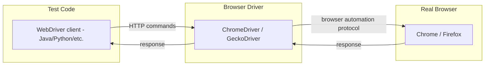

# CSE 403: UI Testing and WebDriver

**UI testing** (User Interface testing) verifies that the user-facing layer of an application behaves correctly from the user's perspective. Unlike unit tests that test functions in isolation, UI tests interact with the actual rendered interface — clicking buttons, filling forms, navigating pages, and asserting on what the user would observe.

UI testing is a form of end-to-end (E2E) system testing. Where a unit test asks "does this function return the right value?", a UI test asks "does clicking this button cause the right page to appear?" The distinction is significant: a unit test may pass while the UI is completely broken, because the two layers can fail independently.

See [[Testing and Continuous Integration]] for how UI tests fit into the overall testing pyramid.

## WebDriver

**WebDriver** is a browser automation API. It provides a programmatic interface to control a web browser (Chrome, Firefox, Safari, etc.) as if a human user were physically interacting with it.

### Architecture

The WebDriver protocol is a client-server architecture:



The **WebDriver client** (your test code) sends HTTP commands to a **browser driver** (e.g., ChromeDriver for Chrome, GeckoDriver for Firefox). The browser driver translates those commands into actual browser actions — navigating to URLs, clicking DOM elements, typing text, reading element content.

### What WebDriver Tests Can Do

Tests written with WebDriver can:
- Navigate to URLs
- Find elements by CSS selector, XPath, or element ID
- Click elements (buttons, links, checkboxes)
- Type into text fields and forms
- Read element text and attributes
- Assert on page state (element presence, element text, URL)
- Take screenshots

The live coding demo for this lecture is available at: `github.com/rjust/testing-ui`

### Example Pattern

```java
// Navigate to the application
driver.get("http://localhost:8080");

// Find a button by CSS selector and click it
WebElement button = driver.findElement(By.cssSelector("#submit-btn"));
button.click();

// Assert that the resulting page contains expected text
WebElement result = driver.findElement(By.id("result"));
assertEquals("Success", result.getText());
```

## Key Challenges of UI Testing

UI tests sit at the top of the testing pyramid: they provide the most realistic view of user-visible behavior but come with significant costs.

### Flakiness

UI tests are **notoriously flaky** — they may pass when run once and fail when run again on identical code, with no code change in between. The root cause is **timing**: UI tests depend on page load times, animations, network latency, and rendering speed. A test that clicks a button before the page has finished loading will fail even if the application logic is correct. Proper explicit waits (waiting for elements to become visible or clickable before interacting) reduce but do not eliminate flakiness.

### Brittleness

UI tests are **brittle** — they break when the UI structure changes, even if the underlying functionality is correct. If a CSS class name changes, an element is moved to a different location in the DOM, or a button's ID is renamed, the test's element locators become invalid and the test fails. This requires constant maintenance as the UI evolves, completely independent of whether the application logic changed.

### Slowness

Each UI test requires launching a real browser instance, loading real pages, and waiting for real rendering. A single UI test may take seconds; a full suite may take minutes or hours. By contrast, unit tests run in milliseconds. This makes UI tests unsuitable for running on every save during development.

### Maintenance Cost

Combining brittleness and slowness, UI tests have a **high maintenance cost**. Teams must continuously update locators as the UI evolves, diagnose spurious failures due to timing, and manage slow test suites that delay CI pipelines.

| Challenge | Root Cause | Mitigation |
|-----------|-----------|-----------|
| Flakiness | Timing dependencies | Explicit waits, retry logic |
| Brittleness | Locator coupling to UI structure | Stable IDs, page object pattern |
| Slowness | Real browser execution | Run in parallel, limit scope |
| Maintenance cost | Accumulation of brittleness | Keep suite small, focused on critical paths |

## Trade-offs: UI Tests in Context

Despite all these challenges, UI tests serve a purpose that no other test type can fully replace: they verify that the entire stack — from frontend to backend — works correctly together from a user's perspective. A unit test of an HTTP handler cannot tell you whether clicking the button on the page actually triggers that handler. Only an end-to-end test through the real browser can confirm the complete user journey works.

The practical answer is not to abandon UI tests but to use them **selectively** — cover only the most critical user workflows end-to-end, and rely on unit and integration tests for everything else.

## Related

- [[Testing and Continuous Integration]]
- [[Automated Testing and CI]]
- [[Mock-Based Testing]]
- [[Testing Fundamentals]]

## Industry Standard Terms

| Course Term | Industry Equivalent |
|-------------|---------------------|
| UI testing | End-to-end (E2E) testing, browser automation testing |
| WebDriver | Selenium WebDriver, Playwright, Puppeteer, Cypress (all solve the same problem) |
| Browser driver | ChromeDriver, GeckoDriver |
| Flaky test | Non-deterministic test, intermittent test |
| Brittleness | Test fragility, locator coupling |
