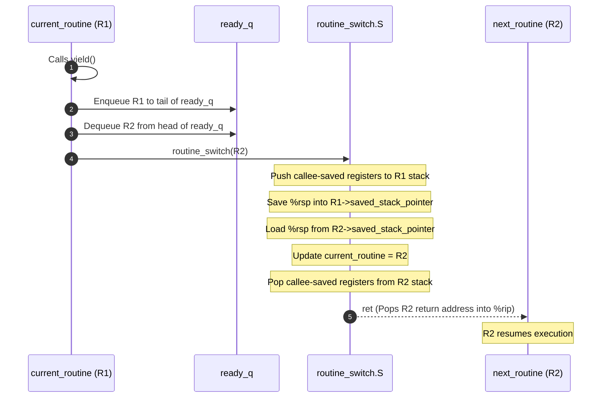
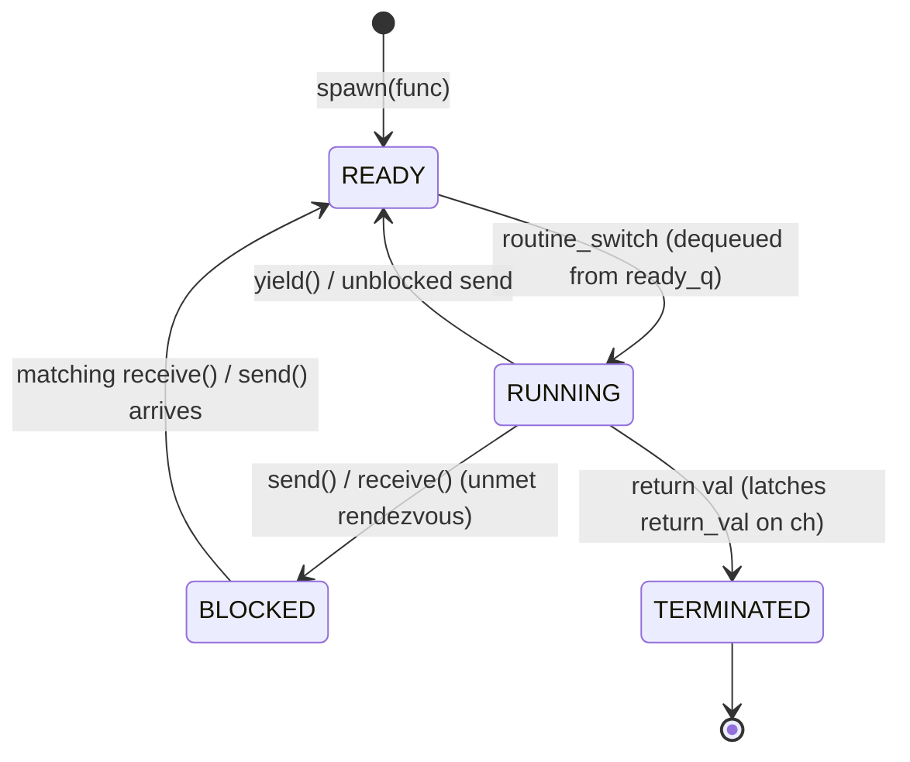

# Concurrency, Parallelism, and Rust: Coroutines

A coroutine is a cooperative, user-space execution context that can suspend and resume its execution without operating system intervention, enabling lightweight concurrency on top of a single physical execution thread.

---

## Coroutines Motivation & Overview

Modern concurrent systems often need to coordinate thousands or millions of independent execution workflows simultaneously (such as network socket handlers, event-driven pipelines, or asynchronous worker tasks).

### The Limits of Operating System Threads
Standard operating system threads (such as POSIX `pthreads` on Linux) are designed for general-purpose preemption, but they impose significant resource overhead:
- **Heavy Memory Footprint**: Every OS thread requires a substantial, dedicated stack allocated by the kernel (typically 2MB to 8MB by default). Allocating tens of thousands of OS threads quickly exhausts virtual and physical memory.
- **Costly Kernel Transitions**: Managing and scheduling OS threads requires crossing the user/kernel privilege boundary via hardware interrupts and system calls (`sys_clone`, context switch interrupts), introducing register flushes, CPU pipeline stalls, and TLB invalidations.
- **Preemptive Interference**: Because the OS kernel scheduler preempts threads arbitrarily based on hardware timer slices, developers must safeguard every shared mutable memory access with heavy synchronization primitives (mutexes, spinlocks, semaphores) to avoid data races.

### The Coroutine Abstraction
A **coroutine** (cooperative routine) solves these limitations by implementing concurrency entirely within user space:
- **Cooperative Multitasking**: Coroutines are strictly **non-preemptable**. A coroutine retains control of the CPU core until it voluntarily yields execution (`yield()`), blocks waiting on a synchronization primitive (`send()` or `receive()`), or completes its execution and returns.
- **Zero OS Involvement**: Context switches occur entirely in user-space assembly code (`routine_switch.S`). No kernel traps, privilege boundary crossings, or system calls occur during a switch.
- **Minimal State Overhead**: A coroutine is simply a heap-allocated control block (`struct Routine`) paired with a compact, dedicated execution stack (`private_stack`, often as small as 16KB–64KB).

---

## Architecture & Core Mechanics

The coroutine runtime manages execution contexts using user-space data structures, a centralized scheduling queue, and an assembly context-switch trampoline.

### Coroutine Memory Layout
The system address space is divided into distinct segments hosting the coroutine infrastructure:

![[Memory layout of coroutines.png]]

1. **Main Stack (`0xFF...FF`)**:
   - The default stack of the OS process/thread where `main()` starts.
   - Used for initializing the runtime and executing top-level non-coroutine operations.
2. **Heap**:
   - Houses dynamically allocated `struct Routine` instances.
   - Each routine contains its own dedicated stack (`private_stack`) directly within its heap allocation. Local variables, function parameters, and activation frames for that routine reside inside its private heap stack.
3. **Data Segment (`0x00...00`)**:
   - **`current_routine`**: A global pointer (`Routine* current_routine`) holding the memory address of the coroutine currently executing instructions on the CPU.
   - **`ready_q`**: A global FIFO run queue (`head` and `tail` pointers) holding all runnable routines waiting for their turn on the CPU.

### The `struct Routine` Control Block
Every coroutine is represented by a control structure:

```c
#define STACK_ENTRIES 4096 // e.g., 32KB stack (4096 * 8 bytes)

typedef struct Routine {
    void* saved_stack_pointer;              // MUST be at offset 0 for routine_switch.S
    uint64_t private_stack[STACK_ENTRIES];  // Dedicated stack for this coroutine
    struct Routine* next_in_queue;          // Queue link pointer for ready_q or channel queues
    SendableData channel_data;              // Message payload passed during channel rendezvous
    // Additional runtime metadata (associated channels, flags, return values)
} Routine;

```

> **Offset 0 Invariant**: The assembly context switch (`routine_switch.S`) assumes that `saved_stack_pointer` is the very first field in `struct Routine` (offset `0(%rdi)`). This allows the assembly code to load and store the stack pointer directly through the struct pointer with zero arithmetic overhead.

### Core Runtime API
The coroutine runtime is driven by three foundational functions:

```c
void coroutine_init(void);
Channel* spawn(SendableData (*func)(Channel*));
bool yield(void);
```

1. **`coroutine_init()`**:
   - Initializes the global `ready_q` to empty.
   - Converts the calling thread (`main()`) into the root `struct Routine`, setting `current_routine = main_routine`.
2. **`spawn(func)`**:
   - Allocates a new `struct Routine` on the heap.
   - Creates a dedicated communication channel (`Channel*`) for passing arguments and return values.
   - Sets up the initial stack frame on `private_stack`: writes a fabricated return address and register setup so that when switched to, the CPU starts executing `func(ch)`.
   - **Scheduling Behavior**: The runtime enqueues the new routine onto `ready_q`. Depending on runtime policy:
     - *Lazy Spawn*: Adds the new routine to `ready_q` and continues executing the parent routine.
     - *Eager Spawn*: Adds the current routine to `ready_q` and immediately context switches to the newly spawned child.
3. **`yield()`**:
   - Voluntarily relinquishes the CPU core.
   - If `ready_q` is empty, returns `false` (no other coroutine is available to run, so the current routine continues).
   - If `ready_q` contains waiting routines:
     1. Enqueues `current_routine` to the tail of `ready_q`.
     2. Dequeues the next runnable routine from the head of `ready_q`.
     3. Calls `routine_switch(next)` to switch execution contexts.
     4. When eventually switched back, returns `true`.



---

## Low-Level Assembly Context Switch: `routine_switch.S`

The low-level context switch is implemented in assembly because C compilers do not expose direct primitives to overwrite the CPU stack pointer (`%rsp`) or manipulate the instruction pointer (`%rip`).

### C Signature & Prototype
```c
void routine_switch(Routine* next);
```

Under the x86-64 System V AMD64 ABI:
- The argument `next` is passed in register `%rdi`.
- The `call routine_switch` instruction pushes the 8-byte return address (the next instruction in the caller) onto the active stack and decrements `%rsp` by 8.
- **Callee-Saved Registers**: The ABI mandates that `%rbx`, `%rbp`, `%r12`, `%r13`, `%r14`, and `%r15` must be preserved across function calls. All caller-saved registers (`%rax`, `%rcx`, `%rdx`, `%rsi`, `%r8`–`%r11`) were already saved by the caller if their values were needed.

### Assembly Implementation (`routine_switch.S`)
```assembly
.global routine_switch
.text

// void routine_switch(Routine* next);
routine_switch:
    // Save callee-saved registers on the stack.
    // Whoever called routine_switch was responsible for saving the caller-saved registers.
    push %r12
    push %r13
    push %r14
    push %r15
    push %rbx   // Callee-saved: holds caller's local variables that must survive across the switch.
    push %rbp   // Callee-saved: frame pointer that anchors the caller's stack frame.

    // Save our stack pointer to the first field of the global current_routine defined in coroutine.c.
    mov current_routine(%rip), %rsi // Caller-saved scratch: safe to use because routine_switch only takes 1 argument.
    mov %rsp, (%rsi)

    // Set our stack pointer to the saved stack pointer in `next`.
    mov (%rdi), %rsp

    // Set `current_routine` to `next`.
    mov %rdi, current_routine(%rip)

    // Restore callee-saved registers from the stack.
    pop %rbp    // Restores next routine's frame pointer.
    pop %rbx    // Restores next routine's local variables.
    pop %r15
    pop %r14
    pop %r13
    pop %r12

    ret
```

### Equivalent C Mental Model
```c
// Conceptual C equivalent of routine_switch.S
void routine_switch(Routine* next) {
    // 1. Push callee-saved registers to current routine's stack
    // (Pushed in assembly: %r12, %r13, %r14, %r15, %rbx, %rbp)

    // 2. Save stack pointer into current routine's header (offset 0)
    current_routine->saved_stack_pointer = rsp;

    // 3. Pivot execution to next routine's stack
    rsp = next->saved_stack_pointer;

    // 4. Update global current_routine reference
    current_routine = next;

    // 5. Pop callee-saved registers from the new stack
    // (Restored in LIFO order: %rbp, %rbx, %r15, %r14, %r13, %r12)

    // 6. Return into next routine's execution context
    // ret pops the return address off the newly activated stack
}
```

---

## Channels: Synchronization & Inter-Routine Communication

Coroutines do not communicate via shared memory with locks; instead, they communicate through **Channels** based on Tony Hoare's Communicating Sequential Processes (CSP) model.

### What is a Channel?
**Channel**: A typed, synchronized communication pipe that allows coroutines to pass data messages (`SendableData`) to one another without data races or low-level memory locking.
- **`SendableData`**: Defined as a type-erased pointer:
  ```c
  typedef void* SendableData;
  ```
  This allows passing arbitrary pointers to heap structures or primitive numeric values cast to `(SendableData)`.
- **Multiplexing**: Any number of coroutines can share a single `Channel*`. Multiple senders and multiple receivers can coordinate over the same channel descriptor.

### Unbuffered Rendezvous Semantics
The runtime uses unbuffered, rendezvous channels:
- A `send()` call **blocks** until another coroutine consumes the message via `receive()`.
- A `receive()` call **blocks** until another coroutine supplies a message via `send()`.
- Data transfer only occurs when both the sender and the receiver have met at the channel rendezvous point.

```c
typedef struct Channel {
    Queue blocked_senders;    // FIFO queue of routines blocked waiting to send
    Queue blocked_receivers;  // FIFO queue of routines blocked waiting to receive
    bool has_terminated;      // True if the owning coroutine has finished executing
    SendableData return_val;  // Cached terminal return value
} Channel;
```

### Channel Operations & Queue Mechanics

#### 1. `send(Channel* ch, SendableData data)`
When a coroutine invokes `send(ch, data)`:
- **Case A: Receiver Already Waiting**:
  If `ch->blocked_receivers` is not empty, a receiver is already waiting for data:
  1. Dequeue the waiting receiver routine $R_{\text{recv}}$ from `ch->blocked_receivers`.
  2. Deliver `data` directly into $R_{\text{recv}}$'s data slot (`R_recv->channel_data = data`).
  3. Enqueue $R_{\text{recv}}$ into `ready_q` so it can be scheduled to run.
  4. The sender does not need to block; it continues executing (or optionally yields).
- **Case B: No Receiver Waiting**:
  If `ch->blocked_receivers` is empty, no one is ready to consume the data:
  1. Store `data` in `current_routine->channel_data`.
  2. Enqueue `current_routine` into `ch->blocked_senders` using `yieldOnto(&ch->blocked_senders)`.
  3. Deschedule `current_routine`: dequeue the next ready coroutine from `ready_q` and call `routine_switch(next)`.

```c
void send(Channel* ch, SendableData data) {
    if (ch->blocked_receivers.empty()) {
        // No receiver waiting: store data in our routine struct and block
        current_routine->channel_data = data;
        yieldOnto(&ch->blocked_senders);
        // When we wake up here, a receiver has consumed our data
    } else {
        // Receiver waiting: transfer data directly and wake receiver
        Routine* r = ch->blocked_receivers.pop();
        r->channel_data = data;
        ready_q.push(r);
    }
}
```

#### 2. `receive(Channel* ch)`
When a coroutine invokes `receive(ch)`:
- **Case A: Channel is Terminated / Coroutine Has Returned**:
  If `ch->has_terminated` is true:
  - The coroutine associated with this channel has exited and returned its final value.
  - Returns `ch->return_val` immediately without blocking.
- **Case B: Sender Already Waiting**:
  If `ch->blocked_senders` is not empty:
  1. Dequeue the waiting sender routine $R_{\text{send}}$ from `ch->blocked_senders`.
  2. Extract `data` from $R_{\text{send}} \to \text{channel\_data}$.
  3. Enqueue $R_{\text{send}}$ into `ready_q` so it can resume execution.
  4. Return `data` to the caller.
- **Case C: No Sender Waiting**:
  If `ch->blocked_senders` is empty:
  1. Suspend the current routine onto the channel's blocked receiver queue via `yieldOnto(&ch->blocked_receivers)`.
  2. Deschedule `current_routine`: dequeue the next ready coroutine from `ready_q` and call `routine_switch(next)`.
  3. When awakened (by a future `send()`), retrieve the transferred message and return it.

#### Channels: Receive Pseudocode
```c
SendableData receive(Channel* ch) {
    // Fast-path: if the coroutine terminated, return cached result
    if (ch->has_terminated) {
        return ch->return_val;
    }

    if (ch->blocked_senders.empty()) {
        // No sender waiting: yield execution onto the channel's wait queue
        yieldOnto(&ch->blocked_receivers);
        
        // ... now that we're back now what?
        // When routine_switch returns execution here, a matching send() has
        // already popped us from blocked_receivers, written the incoming data
        // into current_routine->channel_data, and placed us on ready_q.
        // Therefore, our data is ready to be returned immediately:
        return current_routine->channel_data;
    } else {
        // Sender is waiting: rendezvous and consume its message
        Routine* r = ch->blocked_senders.pop();

        // ... somehow get data from r
        // The sender r stored its data payload in its Routine descriptor:
        SendableData data = r->channel_data;

        // Wake the blocked sender so it can continue execution
        ready_q.push(r);

        return data;
    }
}
```

##### Resolving the Pseudocode Questions
- **`// ... somehow get data from r`**:
  - The blocked sender routine `r` stored its payload in its own `struct Routine` descriptor before suspending (`r->channel_data = data`).
  - When the receiver finds `r` waiting in `ch->blocked_senders`, it simply reads `SendableData data = r->channel_data;`.
  - The receiver then enqueues `r` onto `ready_q` so the sender can resume execution now that its message has been consumed.
- **`... // now that we're back now what?`**:
  - Calling `yieldOnto(&ch->blocked_receivers)` puts `current_routine` to sleep on the channel's receiver wait queue and yields the processor.
  - While this routine is asleep, a matching `send(ch, data)` arrives. The sender pops this routine from `ch->blocked_receivers`, writes the incoming payload directly into `this_routine->channel_data = data`, and enqueues this routine back onto `ready_q`.
  - When the scheduler later selects this routine and `routine_switch` returns, execution resumes directly on the line following `yieldOnto(...)`.
  - Because the sender already delivered the payload into `current_routine->channel_data`, the receiver needs no further waiting: it immediately returns `current_routine->channel_data`.


#### What Does `yieldOnto(Queue* q)` Do?
Standard `yield()` enqueues `current_routine` back onto the global `ready_q`. In contrast, `yieldOnto(Queue* q)`:
1. Enqueues `current_routine` into the specified waiting queue `q` (such as `ch->blocked_receivers` or `ch->blocked_senders`).
2. Dequeues the next runnable routine from the global `ready_q`.
3. Calls `routine_switch(next)` to transfer CPU execution.
4. When another routine eventually moves `current_routine` back to `ready_q` and the scheduler selects it, `routine_switch` returns directly into the instruction following `yieldOnto`.

### Why Returned Coroutines Yield an "Endless Stream" of Values

Consider this lecture code example:

```c
SendableData func(Channel* ch) {
    int64_t val = (int64_t) receive(ch); // Receives 6 sent by main()
    assert(val == 6);
    return (SendableData) 7;             // Routine finishes and returns 7
}

int main() {
    coroutine_init();

    Channel* ch = spawn(func);
    send(ch, (SendableData) 6);          // Blocks until func consumes 6

    int64_t val = (int64_t) receive(ch); // Receives 7
    assert(val == 7);

    val = (int64_t) receive(ch);         // Receives 7 again!
    assert(val == 7);
}
```

#### The Latching Return Mechanism Explained
1. **Preventing Deadlocks on Dead Coroutines**:
   When `func` finishes and executes `return (SendableData) 7;`, the coroutine terminates. Its execution stack is discarded, and it will never run again.
   If `receive(ch)` required an active sender to rendezvous, any subsequent call to `receive(ch)` would block forever, deadlocking `main()` because the partner routine is dead and can never issue another `send()`.
2. **Channel Latching**:
   To prevent this deadlock, the coroutine runtime wraps every coroutine entry point in a stub. When the user function returns:
   - The runtime captures the return value: `ch->return_val = 7`.
   - The runtime sets a permanent completion flag: `ch->has_terminated = true`.
   - Any waiting routines in `ch->blocked_receivers` are moved to `ready_q`.
3. **Stream Semantics**:
   All future calls to `receive(ch)` hit the fast-path: they observe `ch->has_terminated == true` and immediately return `ch->return_val` (`7`) without blocking. The channel acts as a permanent result latch (similar to a resolved Promise or Future), broadcasting the final return value indefinitely.

---

## Concrete Walkthrough & Execution Trace

To see how stack pointers, registers, and memory frames shift during execution, we trace both the assembly context switch and coroutine scheduling interleavings.

### Step-by-Step Trace of `routine_switch.S`

The following sequence details how the CPU switches execution from `Routine 1` (currently executing) to `Routine 2` (suspended on the heap).

#### Step 1: Initial State Before Switch
`Routine 1` is actively executing. `Routine 2` is suspended with its previous stack pointer saved at `0xC0`. On `r2 stack`, a return address is already stored at `0xC0`.

![[routine_switch 1.png]]

#### Step 2: The `call routine_switch(next)` Instruction
`Routine 1` calls `routine_switch(Routine 2)`. The hardware `call` instruction pushes the 8-byte return address (inside `yield()`) onto `Routine 1`'s stack at address `0xB0`, and `%rsp` points to `0xB0`.

![[routine switch 2.png]]

#### Step 3: Saving `%rsp` to `current_routine->saved_stack_pointer`
Inside `routine_switch.S`, the callee-saved registers are pushed (`%r12`, `%r13`, `%r14`, `%r15`, `%rbx`, `%rbp`), and the assembly executes:
```assembly
mov current_routine(%rip), %rsi # Loads current_routine pointer into scratch register %rsi
mov %rsp, (%rsi)                # Saves updated stack pointer (0xB0) into Routine 1's struct (offset 0)
```
Now `Routine 1`'s context is completely frozen in its heap control block.

![[routine_switch 3.png]]

#### Step 4: Pivoting to `next` and Loading its Saved `%rsp`
The assembly first pivots `%rsp` to `Routine 2`'s saved stack pointer (`0xC0`), then updates `current_routine = next`:
```assembly
mov (%rdi), %rsp                # Sets %rsp to Routine 2's saved stack pointer (0xC0)
mov %rdi, current_routine(%rip) # Updates current_routine global pointer to Routine 2
```
The CPU's stack pointer `%rsp` has now transitioned entirely to `Routine 2`'s private stack (`0xC0`)!

![[routine switch 4.png]]

#### Step 5: The `ret` Instruction Resumes `Routine 2`
After popping `Routine 2`'s callee-saved registers in reverse LIFO order (`%rbp`, `%rbx`, `%r15`, `%r14`, `%r13`, `%r12`) to restore its frame pointer (`%rbp`) and preserved variables (`%rbx`), the assembly executes `ret`:
```assembly
ret
```
The `ret` instruction pops the 8-byte return address off `Routine 2`'s stack into `%rip`. `%rsp` increments past the return address, and the CPU resumes executing instructions inside `Routine 2` exactly where it previously called `routine_switch`!

![[routine switch 5.png]]

---

### Scheduling Interleavings: Possible vs. Impossible Combinations

Consider the following program:

```c
SendableData testRoutine(Channel* ch) {
    printf("*** testRoutine A\n");
    return (SendableData) 0;
}

int main() {
    coroutine_init();

    Channel* ch = spawn(testRoutine);
    printf("*** main A\n");
    printf("*** main B\n");
    yield();
}
```

#### Valid Interleaving 1: Lazy Spawn
If `spawn()` places `testRoutine` on `ready_q` and returns immediately to `main`:
```
Trace:
  1. main() calls spawn(testRoutine) -> testRoutine added to ready_q
  2. main() prints "*** main A\n"
  3. main() prints "*** main B\n"
  4. main() calls yield() -> main enqueued on ready_q, testRoutine dequeued
  5. testRoutine runs and prints "*** testRoutine A\n"
  6. testRoutine terminates
```
**Output**:
```
*** main A
*** main B
*** testRoutine A
```

#### Valid Interleaving 2: Eager Spawn
If `spawn()` enqueues `main` onto `ready_q` and immediately context-switches into `testRoutine`:
```
Trace:
  1. main() calls spawn(testRoutine) -> switches immediately to testRoutine
  2. testRoutine runs and prints "*** testRoutine A\n"
  3. testRoutine terminates -> switches back to main()
  4. main() resumes and prints "*** main A\n"
  5. main() prints "*** main B\n"
  6. main() calls yield() -> no other routines in ready_q, returns immediately
```
**Output**:
```
*** testRoutine A
*** main A
*** main B
```

#### Impossible Interleaving
The following output is **physically impossible**:
```
*** main A
*** testRoutine A
*** main B
```

**Why it cannot occur**:
Coroutines are **non-preemptable**. Once `main()` begins executing after `spawn()`, it prints `*** main A\n`. Because there is no call to `yield()`, `send()`, or `receive()` between `main A` and `main B`, no context switch can possibly trigger. In the absence of kernel timer preemption, user code runs uninterrupted until it cooperatively yields control.

---

## Edge Cases, Failure Modes & Mitigations

Cooperative user-space runtimes introduce unique failure modes that differ fundamentally from kernel-threaded environments.

### 1. Non-Preemptive Starvation (Rogue Loops)
- **Failure Mode**: If any coroutine enters an infinite computation (`while(1) {}`) or executes a CPU-intensive loop without calling `yield()`, the entire application freezes on that thread. All other coroutines on `ready_q` starve indefinitely.
- **Mitigation**: Cooperative systems rely on the **programmer contract**: long-running computations must periodically insert cooperative yield points (`yield()`) or use asynchronous non-blocking event loops.

### 2. Private Stack Overflow
- **Failure Mode**: Unlike OS thread stacks which are protected by virtual memory guard pages (`mprotect` with `PROT_NONE`), a coroutine's `private_stack` is a fixed-size buffer inside a heap object (`uint64_t private_stack[STACK_ENTRIES]`). Deep recursion or large stack allocations (`char buffer[65536]`) overflow silently past the stack boundary, corrupting adjacent heap metadata and neighboring coroutines.
- **Mitigation**:
  - Allocate stack buffers using `mmap()` with an unmapped guard page at the bottom boundary.
  - Keep stack frames small by allocating large structures on the heap rather than the stack.

### 3. Channel Deadlocks & Cyclic Dependencies
- **Failure Mode**: When coroutines communicate over channels, the dependency relationships between senders and receivers form a directed communication graph:
  - If Coroutine $A$ waits to receive from $B$, and Coroutine $B$ waits to receive from $A$, both are placed into `blocked_receivers`.
  - If all active coroutines become blocked in channel queues, `ready_q` becomes empty, causing a permanent runtime stall (deadlock).
- **Mitigation**: The communication graph across channels must remain a **Directed Acyclic Graph (DAG)**. System designs must establish strict channel ordering rules to prevent cyclic wait dependencies.

### 4. Memory Reclamation & Use-After-Free
- **Failure Mode**: If a coroutine terminates and its memory (`struct Routine`) is freed immediately while another routine holds a pointer to it or its associated `Channel*`, subsequent channel accesses cause undefined behavior or use-after-free crashes.
- **Mitigation**: Decouple channel lifetime from coroutine lifetime. Channels remain allocated on the heap as long as references exist, allowing receivers to safely read the latched terminal return value even after the producer coroutine has exited.

---

## Formal Analysis / Protocol Specification

### Formal Definition

Let the set of all coroutines in the runtime system be $\mathcal{R}$. At any instant $t$, every coroutine $r \in \mathcal{R}$ exists in exactly one state from the state set:

$$\mathcal{S} = \{\text{RUNNING}, \text{READY}, \text{BLOCKED}, \text{TERMINATED}\}$$



#### State Invariants
1. **Single Execution Invariant**:
   On a single-core runtime, exactly one coroutine occupies the `RUNNING` state:
   $$|\{r \in \mathcal{R} \mid \text{State}(r) = \text{RUNNING}\}| = 1 \iff \text{current\_routine} \neq \text{NULL}$$

2. **System Conservation Invariant**:
   The total number of coroutines in the system equals the sum of coroutines distributed across all runtime queues:
   $$|\mathcal{R}| = 1 + |\text{ready\_q}| + \sum_{ch \in \mathcal{C}} \left( |ch.\text{blocked\_senders}| + |ch.\text{blocked\_receivers}| \right) + |\mathcal{R}_{\text{TERMINATED}}|$$

3. **Cooperative Progress Invariant**:
   A coroutine transitions out of `RUNNING` if and only if it explicitly invokes an operation from the cooperative transition set $\mathcal{T}$:
   $$\text{Transition}(\text{RUNNING} \to s) \iff \text{Op} \in \{\text{yield}(), \text{send}_{\text{block}}(), \text{receive}_{\text{block}}(), \text{return}\}$$

### Simplified Explanation
A coroutine is in one of four states: running on the CPU, waiting in line to run (`ready_q`), stuck waiting for someone on a channel (`blocked`), or completely finished (`terminated`). Because there is no OS timer interrupting it, a running coroutine will NEVER stop running unless it explicitly chooses to pause itself or finishes its work.

---

## Deep Dive

### Stackful vs. Stackless Coroutines
Coroutines in modern programming languages fall into two architectural categories:

| Feature | Stackful Coroutines (Fibers / Green Threads) | Stackless Coroutines (Rust `async` / JS Promises) |
| :--- | :--- | :--- |
| **Execution Stack** | Owns a dedicated, heap-allocated execution stack (`private_stack`). | Does **not** possess a dedicated stack; runs on the caller's stack. |
| **Yield Location** | Can yield from arbitrarily deep nested function calls (`foo() -> bar() -> yield()`). | Can only yield at top-level `await` suspension points. |
| **Compiler Transformation** | Minimal; relies on assembly stack-pointer swap (`routine_switch.S`). | Heavy; the compiler rewrites the function into an enum state machine. |
| **Memory Footprint** | Fixed per routine (typically 4KB–64KB). | Proportional to live local variables across `await` points (bytes to words). |
| **Implementations** | This lecture design, Go goroutines, Lua coroutines, Windows Fibers. | Rust `async/await`, C++20 coroutines, Python `asyncio`, JavaScript. |

### Context Switch Latency: Assembly Swap vs. Kernel Interrupt
The performance disparity between cooperative coroutine switches and OS thread switches is substantial:

- **Coroutine Context Switch (`routine_switch.S`)**:
  - Requires saving/restoring 6 callee-saved registers and pivoting `%rsp`.
  - Executes approximately 12–16 machine instructions entirely in user-space L1 cache.
  - Cost: **~5–10 nanoseconds**.
- **OS Kernel Thread Context Switch**:
  - Requires timer interrupt or system call trap, transitioning CPU from Ring 3 (User) to Ring 0 (Kernel).
  - Saves full architectural register state, updates kernel process control blocks, flushes memory management state if crossing process boundaries, and triggers CPU branch target buffer and cache line evictions.
  - Cost: **~1,000–2,000 nanoseconds (1–2 microseconds)**.

Coroutines are approximately two orders of magnitude faster to switch than OS threads, allowing programs to handle massive concurrent connection volumes on a single CPU core.

---

## Industry Standard Terms

| Course Term | Industry / Standard Term |
| :--- | :--- |
| **Routine (`struct Routine`)** | Fiber / Green Thread / Stackful Coroutine |
| **`routine_switch.S`** | Context Switch Trampoline / Stack Swap Stub |
| **`yield()`** | Cooperative Yield / Cooperative Descheduling |
| **`ready_q`** | Run Queue / Ready List |
| **`current_routine`** | Active Task Context Pointer / Current Thread Control Block |
| **`Channel*`** | CSP Channel / Unbuffered Rendezvous Channel |
| **`SendableData` (`void*`)** | Type-Erased Message Payload / Generic Message Box |
| **Latching Return Value** | Channel Completion Latch / Promise / Future Result |

---

## Related

- [[Concurrency, Parallelism, and Rust/The Concurrent Mindset|The Concurrent Mindset]] — Concurrency drivers, task parallelism, and dataflow dependency graphs
- [[CSE351 Index|CSE351: The Hardware/Software Interface]] — x86-64 stack frame layout, `%rsp`, `%rip`, and calling conventions
- [[CSE333 Index|CSE333: Systems Programming]] — POSIX threads (`pthreads`), mutexes, and kernel-level concurrency
- [[CSE451 Index|CSE451: Operating Systems]] — Kernel thread scheduling, preemptive multitasking, and process control blocks (PCBs)