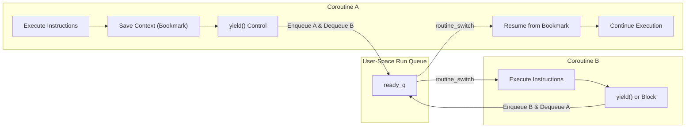
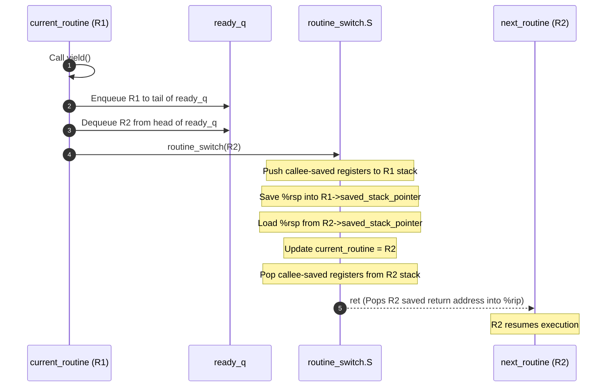
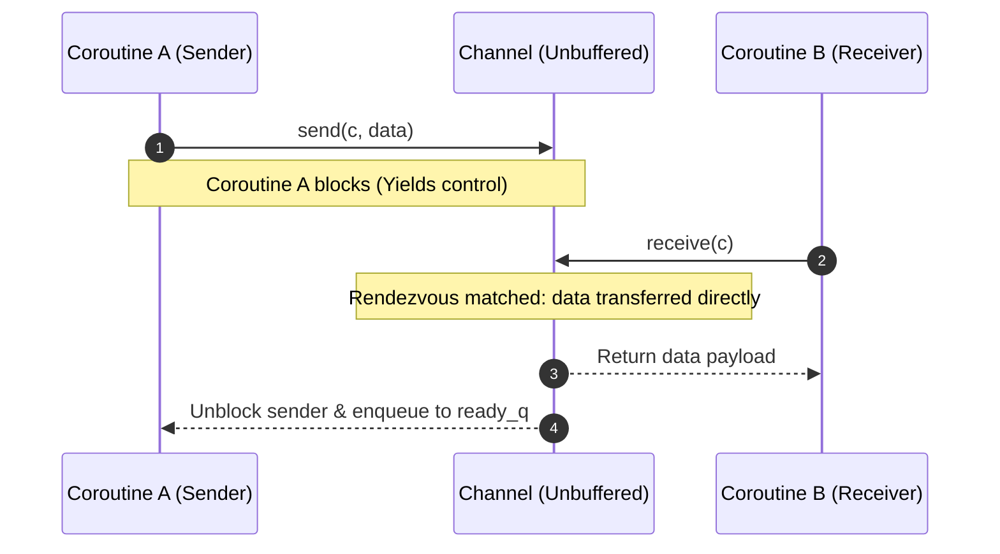
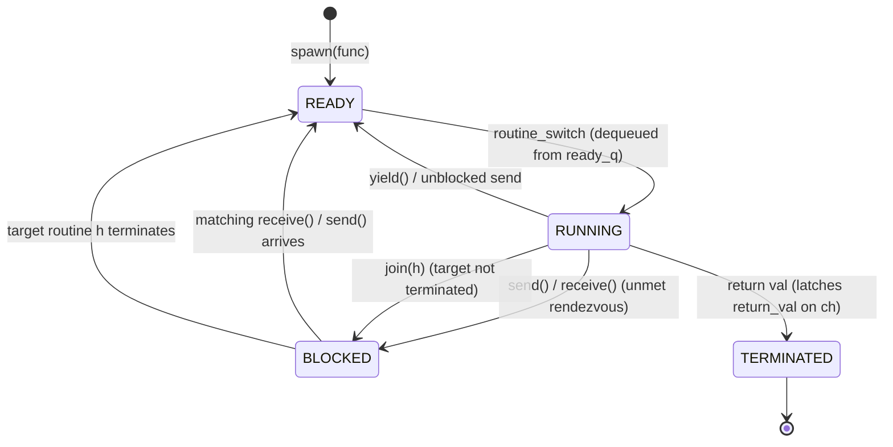

# Concurrency, Parallelism, and Rust: Coroutines

A coroutine is a cooperative, user-space execution context that can pause and resume its execution at explicit yield points without operating system kernel intervention, enabling lightweight concurrency and structured inter-task data transfer on top of a single physical execution thread.

---

## Coroutines Motivation & Overview

Modern concurrent software frequently coordinates thousands or millions of concurrent workflows—such as asynchronous network socket handlers, event-driven pipelines, or computational tasks.

### The Limits of Operating System Threads
Standard operating system threads (such as POSIX `pthreads` on Linux) rely on kernel-level preemptive multitasking, which imposes significant resource and architectural overhead:
- **Heavy Memory Footprint**: Every OS thread requires a substantial execution stack allocated and managed by the kernel (typically 2MB to 8MB by default). Allocating tens of thousands of OS threads rapidly exhausts both physical memory and virtual address space.
- **Costly Kernel Privilege Transitions**: Managing, suspending, and scheduling OS threads requires crossing the user/kernel privilege boundary (Ring 3 to Ring 0) via hardware interrupts and system calls (`sys_clone`, `futex`). These transitions trigger CPU pipeline flushes, register dumps, and Translation Lookaside Buffer (TLB) invalidations.
- **Preemptive Interference & Race Hazards**: Because the OS kernel scheduler preempts threads arbitrarily based on hardware timer slices, developers must guard every access to shared mutable memory with heavy synchronization primitives (mutexes, spinlocks, semaphores) to prevent data races.

### The Coroutine Abstraction
A **coroutine** (cooperative routine) solves these limitations by implementing concurrency entirely within user space:
- **Cooperative Multitasking**: Coroutines are strictly **non-preemptable**. An active coroutine retains exclusive control of the CPU worker thread until it voluntarily yields execution (`yield()`), blocks waiting on a synchronization primitive (`send()`, `receive()`, or `join()`), or terminates its execution.
- **Zero OS Kernel Involvement**: Context switches occur entirely in user-space assembly code (`routine_switch.S`). No kernel traps, privilege boundary crossings, or system calls occur during a switch.
- **Minimal State Overhead**: A coroutine is represented by a compact heap-allocated control block (`struct Routine`) paired with a dedicated user-space execution stack (`private_stack`, typically 8KB to 32KB).
- **Dependency-Respecting Control Flow**: Coroutines provide a natural programming abstraction that respects computational dependencies, forming a direct bridge to task parallelism and directed acyclic graph (DAG) dataflow on a single core.

### The Bookreading Analogy
Consider a person reading two separate books simultaneously:
- **Sequential Subroutine**: Reading Book A from cover to cover before ever opening Book B.
- **Preemptive Multitasking (OS Threads)**: An external alarm rings at unpredictable intervals, forcing the reader to drop Book A mid-sentence, record the exact word and line, and pick up Book B.
- **Cooperative Multitasking (Coroutines)**: The reader reaches the end of a section or chapter in Book A, places a bookmark at the exact page and line, voluntarily sets Book A down, and opens Book B to its saved bookmark.

To resume Book A later, the reader requires explicit **bookkeeping**: preserving the exact execution context (the bookmark) so that when control returns, execution resumes seamlessly from that saved point.



### Cooperative vs. Preemptive Multitasking
Coroutines enforce a cooperative operational contract:
- **Non-Preemptable Execution**: An active coroutine cannot be interrupted asynchronously by an OS hardware timer interrupt. Control switches away from the active routine **only** when the coroutine explicitly cooperates by calling `yield()`, blocking on a channel operation (`send()` / `receive()`), blocking on a handle (`join()`), or returning.
- **Elimination of Single-Core Data Races**: Because context switches happen only at explicit, programmer-defined yield points, code executing between suspension points is strictly atomic with respect to other coroutines running on that worker thread.
- **Microsecond to Nanosecond Efficiency**: Switching between coroutines requires only saving and restoring a handful of CPU registers in user memory, bypassing kernel schedulers and TLB invalidation.

### The Risk of Non-Cooperation (Starvation)
Because preemption is absent, cooperative runtimes rely on the **programmer contract**:
- If an active coroutine enters an infinite computation (`while(1) {}`) or executes a CPU-heavy loop without calling `yield()` or a blocking channel operation, it permanently starves all other coroutines waiting in `ready_q`.
- The worker thread remains locked into that rogue routine indefinitely.

### Many Flavors of Coroutines: The Architectural Design Space
Coroutine runtime implementations vary across several dimensions:
- **Yield Return Values**: Does `yield()` return data? In basic cooperative schedulers, `yield()` returns a boolean indicating whether a switch occurred. In generator-style coroutines, `yield(value)` emits an intermediate value to the consumer.
- **Yielding from Nested Frames**: Can regular helper functions yield? In **stackful coroutines** (such as the runtime implemented here), any nested function on the call stack can invoke `yield()`. In **stackless coroutines** (such as Rust `async`/`await`), only top-level async state machines can suspend execution.
- **Transfer Target (Symmetric vs. Asymmetric)**:
  - *Asymmetric Coroutines*: Provide distinct operations to invoke a routine (`spawn`/`resume`) and suspend back to the central scheduler (`yield`). Control always routes through a central run queue.
  - *Symmetric Coroutines*: Provide a single direct transfer primitive (`yield_to(target)`), allowing a coroutine to explicitly hand execution directly to a specified peer routine.
- **Spawn Policy (Lazy vs. Eager)**: Does `spawn()` immediately switch to the new coroutine, or does it merely enqueue it?
  - *Lazy Spawn*: Allocates the routine, pushes it onto `ready_q`, and allows the creator (parent) to continue executing.
  - *Eager Spawn*: Enqueues the parent onto `ready_q` and immediately context-switches execution to the newly spawned child.
- **Switch Requirement on Yield**: Does `yield()` always switch? If `ready_q` is empty, `yield()` cannot switch to another routine; it immediately returns `false`, and the current routine continues running.

---

## Architecture & Core Mechanics

The coroutine runtime manages execution contexts using user-space memory structures, a centralized run queue, and an assembly context-switch trampoline.

### Coroutine Memory Layout
The system virtual address space is organized into distinct segments hosting the coroutine infrastructure:

![[Memory layout of coroutines.png]]

1. **Main Stack (`0xFF...FF`)**:
   - The primary stack created by the OS kernel when `main()` starts.
   - Used for runtime initialization (`coroutine_init()`) and executing top-level non-coroutine operations.
2. **Heap**:
   - Houses dynamically allocated `struct Routine` instances.
   - Each coroutine owns a dedicated private stack (`private_stack`) allocated directly within its `struct Routine` heap block. Local variables, function arguments, and activation frames for that routine reside within this buffer.
3. **Data Segment (`0x00...00`)**:
   - **`current_routine`**: A global pointer (`Routine* current_routine`) holding the memory address of the coroutine currently executing on the CPU core.
   - **`ready_q`**: A global FIFO run queue (managed via head and tail pointers) holding all runnable routines awaiting CPU execution.

### The `struct Routine` Control Block
Every coroutine is represented by a control structure:

```c
#define STACK_ENTRIES 4096 // 32KB stack frame (4096 * 8 bytes)

typedef struct Routine {
    void* saved_stack_pointer;              // Saved stack pointer (%rsp); MUST reside at offset 0
    uint64_t private_stack[STACK_ENTRIES];  // Dedicated execution stack for this routine
    struct Routine* next_in_queue;          // Linked-list pointer for ready_q or channel queues
    SendableData channel_data;              // Message payload slot for channel rendezvous
    bool has_terminated;                    // Status flag: true if routine has exited
    SendableData return_val;                // Cached return value delivered upon termination
} Routine;
```

> **Offset 0 Invariant**: The assembly context switch (`routine_switch.S`) assumes that `saved_stack_pointer` is the very first field in `struct Routine` (offset `0(%rdi)`). This allows the assembly code to load and store the stack pointer directly through the struct pointer with zero arithmetic offset overhead.

### Core Coroutine API Mechanics

| API Function | Operational Behavior | Queue Mechanics & Context Switch |
| :--- | :--- | :--- |
| `void coroutine_init(void)` | Initializes the runtime and bootstraps the calling thread. | Clears `ready_q`, initializes `current_routine` to anchor `main()`. |
| `Channel* spawn(SendableData (*func)(Channel*))` | Creates and initializes a new coroutine context. | Heap-allocates `struct Routine`, formats initial stack frame with entry trampoline and target function, creates a default communication channel, and enqueues to `ready_q`. |
| `bool yield(void)` | Voluntarily relinquishes the CPU to another runnable routine. | If `ready_q` is empty, returns `false`. Otherwise, enqueues `current_routine` to `ready_q`, dequeues the head routine, invokes `routine_switch()`, and returns `true` upon resumption. |
| `void join(Routine* h)` | Suspends caller until target coroutine `h` completes. | If `h` has already terminated, returns immediately. Otherwise, suspends calling routine until `h` exits and signals completion. |



---

## Low-Level Assembly Context Switch: `routine_switch.S`

The low-level context switch is implemented in assembly because standard C compilers do not provide primitives to directly overwrite the CPU stack pointer (`%rsp`) or manipulate the instruction pointer (`%rip`).

### C Signature & x86-64 System V AMD64 ABI
```c
void routine_switch(Routine* next);
```

Under the x86-64 System V AMD64 ABI:
- The argument `next` is passed in register `%rdi`.
- The `call routine_switch` instruction pushes the 8-byte return address (the next instruction in the calling function) onto the active stack and decrements `%rsp` by 8.
- **Callee-Saved Registers**: The ABI mandates that `%rbx`, `%rbp`, `%r12`, `%r13`, `%r14`, and `%r15` must be preserved across function calls. Any function modifying these registers must save them on the stack and restore them prior to returning.
- **Caller-Saved Registers**: Registers `%rax`, `%rcx`, `%rdx`, `%rsi`, `%r8`–`%r11` are scratch registers. Whoever called `routine_switch` was responsible for spilling them to the stack if their values were needed across the call.

### Assembly Implementation (`routine_switch.S`)
```assembly
.global routine_switch
.text

// void routine_switch(Routine* next);
routine_switch:
    // 1. Save callee-saved registers on current routine's stack.
    // Whoever called routine_switch was responsible for saving caller-saved registers.
    push %r12
    push %r13
    push %r14
    push %r15
    push %rbx   // Callee-saved: holds caller's local variables surviving across switch.
    push %rbp   // Callee-saved: base frame pointer anchoring caller's stack frame.

    // 2. Save current stack pointer to offset 0 of the global current_routine.
    mov current_routine(%rip), %rsi // Caller-saved scratch: safe because routine_switch has 1 argument (%rdi).
    mov %rsp, (%rsi)                // Write %rsp into current_routine->saved_stack_pointer.

    // 3. Set CPU stack pointer to the saved stack pointer in `next`.
    mov (%rdi), %rsp                // Read next->saved_stack_pointer (offset 0) into %rsp.

    // 4. Update global current_routine to point to `next`.
    mov %rdi, current_routine(%rip)

    // 5. Restore callee-saved registers from target routine's stack in LIFO order.
    pop %rbp    // Restores next routine's frame pointer.
    pop %rbx    // Restores next routine's local variables.
    pop %r15
    pop %r14
    pop %r13
    pop %r12

    // 6. Return into target routine context.
    ret         // Pops saved %rip off newly activated stack and jumps to it.
```

### Equivalent C Mental Model
```c
// Conceptual C equivalent of routine_switch.S
void routine_switch(Routine* next) {
    // 1. Push callee-saved registers to active routine's stack:
    //    stack_push(%r12, %r13, %r14, %r15, %rbx, %rbp);

    // 2. Save updated stack pointer into current routine control block (offset 0)
    current_routine->saved_stack_pointer = rsp;

    // 3. Pivot CPU execution to target routine's stack
    rsp = next->saved_stack_pointer;

    // 4. Update global tracking pointer
    current_routine = next;

    // 5. Restore callee-saved registers from the new stack:
    //    stack_pop(%rbp, %rbx, %r15, %r14, %r13, %r12);

    // 6. Resume execution in target routine
    //    'ret' instruction pops target return address into %rip
}
```

---

## Channels & Inter-Coroutine Communication (CSP Model)

Coroutines avoid raw shared-memory concurrency by communicating via **Channels**, patterned after Tony Hoare’s Communicating Sequential Processes (CSP) formalism.

### What is a Channel?
**Channel**: A synchronized communication pipe that transfers data payloads (`SendableData`) between coroutines while coordinating execution order without data races or low-level locks.
- **`SendableData`**: Defined as an opaque pointer:
  ```c
  typedef void* SendableData;
  ```
  This enables transferring arbitrary pointers to heap-allocated objects or primitive integer values cast to `(SendableData)`.
- **Multiplexing**: Channels support many-to-many communication. Any number of coroutines can share a single `Channel*` descriptor to coordinate message exchange.

### Communication Without Channels is Unsafe
Directly sharing raw global variables between coroutines without channel synchronization leads to non-deterministic temporal anomalies:

```rust
// UNSAFE: Shared global variable without channel synchronization
static mut MY_GLOBAL: i32 = 1;

fn worker() {
    unsafe { MY_GLOBAL = 2; }
}

fn main() {
    let h = spawn(worker);
    unsafe { print(MY_GLOBAL); } // Non-deterministic output: prints 1 or 2!
    join(h);
}
```

Because the scheduling interleaving between `spawn()` and the subsequent `print()` statement depends on the runtime's spawn policy (lazy vs. eager), `MY_GLOBAL` may be read before or after `worker` runs.

### Channels Enforce Causal Consistency
Channels enforce a formal **causal happens-before relationship** across independent coroutine contexts:

```rust
// SAFE: Explicit synchronization via Channel handoff
static mut MY_GLOBAL: i32 = 1;

fn worker(c: Channel) {
    unsafe { MY_GLOBAL = 2; }
    send(c, null); // Signal completion (blocks until recv)
}

fn main() {
    let (h, c) = spawn(worker);
    let _ = recv(c); // Blocks until worker executes send()
    unsafe { print(MY_GLOBAL); } // Guaranteed to ALWAYS print 2!
    join(h);
}
```

Because `recv(c)` blocks `main` until `worker` executes `send(c, null)`, the write `MY_GLOBAL = 2` strictly happens-before the read, establishing deterministic causality.

### Unbuffered Rendezvous Semantics
The runtime uses unbuffered, synchronous rendezvous channels:
- A `send(ch, data)` call **blocks** the sender until a receiver invokes `receive(ch)`.
- A `receive(ch)` call **blocks** the receiver until a sender provides data via `send(ch, data)`.
- Data transfer occurs only when both sender and receiver meet at the channel rendezvous point.



### Channel Data Structure & Queue Mechanics
Each channel maintains internal wait queues for blocked routines:

```c
typedef struct Channel {
    Queue blocked_senders;    // FIFO queue of routines suspended waiting to send
    Queue blocked_receivers;  // FIFO queue of routines suspended waiting to receive
    bool has_terminated;      // True if the coroutine owning this channel has exited
    SendableData return_val;  // Cached terminal return value
} Channel;
```

#### 1. `send(Channel* ch, SendableData data)`
When a coroutine invokes `send(ch, data)`:
- **Case A: Receiver Already Waiting**:
  If `ch->blocked_receivers` is not empty, a receiver is already suspended waiting for data:
  1. Dequeue the waiting receiver routine $R_{\text{recv}}$ from `ch->blocked_receivers`.
  2. Deliver `data` directly into $R_{\text{recv}}$'s payload slot (`R_recv->channel_data = data`).
  3. Enqueue $R_{\text{recv}}$ into `ready_q` so it can be scheduled to run.
  4. The sender does not need to block; it continues executing (or yields, depending on policy).
- **Case B: No Receiver Waiting**:
  If `ch->blocked_receivers` is empty, no routine is ready to consume the data:
  1. Store `data` in `current_routine->channel_data`.
  2. Enqueue `current_routine` into `ch->blocked_senders` using `yieldOnto(&ch->blocked_senders)`.
  3. Deschedule `current_routine`: dequeue the next ready coroutine from `ready_q` and call `routine_switch(next)`.

```c
void send(Channel* ch, SendableData data) {
    if (ch->blocked_receivers.empty()) {
        // No receiver waiting: record data in our control block and suspend
        current_routine->channel_data = data;
        yieldOnto(&ch->blocked_senders);
        // When routine_switch returns here, a receiver has consumed our data
    } else {
        // Receiver waiting: deliver data directly and wake the receiver
        Routine* r = ch->blocked_receivers.pop();
        r->channel_data = data;
        ready_q.push(r);
    }
}
```

#### 2. `receive(Channel* ch)`
When a coroutine invokes `receive(ch)`:
- **Case A: Channel is Terminated / Coroutine Has Returned**:
  If `ch->has_terminated` is true:
  - The coroutine associated with this channel has exited and returned its final value.
  - Returns `ch->return_val` immediately without blocking.
- **Case B: Sender Already Waiting**:
  If `ch->blocked_senders` is not empty:
  1. Dequeue the waiting sender routine $R_{\text{send}}$ from `ch->blocked_senders`.
  2. Extract `data` from $R_{\text{send}} \to \text{channel\_data}$.
  3. Enqueue $R_{\text{send}}$ into `ready_q` so it can resume execution.
  4. Return `data` to the caller.
- **Case C: No Sender Waiting**:
  If `ch->blocked_senders` is empty:
  1. Suspend the calling routine onto the channel's wait queue via `yieldOnto(&ch->blocked_receivers)`.
  2. Deschedule `current_routine`: dequeue the next ready coroutine from `ready_q` and call `routine_switch(next)`.
  3. When awakened (by a future `send()`), retrieve the transferred message and return it.

```c
SendableData receive(Channel* ch) {
    // Fast-path: if the coroutine terminated, return cached latch result
    if (ch->has_terminated) {
        return ch->return_val;
    }

    if (ch->blocked_senders.empty()) {
        // No sender waiting: yield execution onto the channel's wait queue
        yieldOnto(&ch->blocked_receivers);
        
        // When routine_switch returns execution here, a matching send() has
        // popped us from blocked_receivers, written incoming data into
        // current_routine->channel_data, and placed us on ready_q.
        // Therefore, our payload is ready immediately:
        return current_routine->channel_data;
    } else {
        // Sender is waiting: rendezvous and consume its message
        Routine* r = ch->blocked_senders.pop();

        // Retrieve data stored by the sender in its Routine descriptor:
        SendableData data = r->channel_data;

        // Wake the blocked sender so it can continue execution
        ready_q.push(r);

        return data;
    }
}
```

#### What Does `yieldOnto(Queue* q)` Do?
Standard `yield()` enqueues `current_routine` back onto the global `ready_q`. In contrast, `yieldOnto(Queue* q)`:
1. Enqueues `current_routine` into the specified waiting queue `q` (such as `ch->blocked_receivers` or `ch->blocked_senders`).
2. Dequeues the next runnable routine from the global `ready_q`.
3. Calls `routine_switch(next)` to transfer CPU execution.
4. When another routine eventually moves `current_routine` back to `ready_q` and the scheduler selects it, `routine_switch` returns directly into the instruction following `yieldOnto`.

### Latching Return Values & Endless Return Streams

Consider the following program pattern:

```c
SendableData func(Channel* ch) {
    int64_t val = (int64_t) receive(ch); // Receives 6 sent by main()
    assert(val == 6);
    return (SendableData) 7;             // Routine finishes and returns 7
}

int main() {
    coroutine_init();

    Channel* ch = spawn(func);
    send(ch, (SendableData) 6);          // Blocks until func consumes 6

    int64_t val = (int64_t) receive(ch); // Receives 7
    assert(val == 7);

    val = (int64_t) receive(ch);         // Receives 7 again!
    assert(val == 7);
}
```

#### The Latching Return Mechanism Explained
1. **Preventing Deadlocks on Terminated Coroutines**:
   When `func` finishes and executes `return (SendableData) 7;`, the coroutine terminates. Its execution stack is discarded, and it will never execute instructions again. If `receive(ch)` required an active sender to rendezvous, any subsequent call to `receive(ch)` would block forever, deadlocking `main()` because the terminated routine can never issue another `send()`.
2. **Channel Latching**:
   To prevent deadlocks, the runtime wraps every coroutine entry point in a stub. When the function returns:
   - The runtime records the return value: `ch->return_val = 7`.
   - The runtime sets a permanent completion flag: `ch->has_terminated = true`.
   - Any routines suspended in `ch->blocked_receivers` are moved to `ready_q`.
3. **Endless Stream Semantics**:
   All future calls to `receive(ch)` take the fast-path: they observe `ch->has_terminated == true` and immediately return `ch->return_val` (`7`) without blocking. The channel acts as a permanent result latch (equivalent to a resolved Promise or Future), broadcasting the final value indefinitely.

### Channel Flavors & Synchronization Patterns

#### 1. Buffered vs. Unbuffered Channels
- **Unbuffered (Rendezvous)**: Direct synchronous handoff (`send` blocks until `receive`, `receive` blocks until `send`). Used in HW1.
- **Buffered Channels**: The channel maintains an internal circular ring buffer. `send` writes into the buffer without blocking until capacity is full; `receive` reads from the buffer without blocking until capacity is empty.

#### 2. Channel Data Safety & Pointer Ownership
In C runtimes, `SendableData` is defined as `void*`. While this allows arbitrary data transmission, it introduces severe memory safety risks:
- **Dangling Pointers & Double-Free**: If a sender transfers a heap pointer over a channel and both sender and receiver subsequently call `free()`, memory corruption occurs.
- **Linear Ownership Transfer**: Systems must enforce strict ownership transfer: once a pointer is sent via `send()`, the sender must relinquish ownership and never dereference or deallocate it again.

#### 3. Barrier Synchronization Across Many Coroutines
- **Problem**: Suppose an application spawns 100 worker coroutines, but requires that none of them begin processing until `main()` finishes initialization and signals a global release.
- **Solution (Barrier Channel Pattern)**:
  - Create a single shared barrier channel `barrier_ch` and pass it to all 100 coroutines during `spawn()`.
  - At the start of each worker routine, invoke `receive(barrier_ch)`. All 100 workers suspend into `barrier_ch->blocked_receivers`.
  - When `main()` is ready to release all 100 routines:
    - *Iterative Release*: `main()` executes a loop running `send(barrier_ch, NULL)` 100 times, unblocking each worker sequentially.
    - *Constant-Space $O(1)$ Broadcast via Latching*: Instead of sending 100 discrete messages, `main()` closes or terminates the channel (or returns from a coordinator routine). Because the channel transitions to `has_terminated = true`, all 100 suspended receivers are immediately moved to `ready_q`, and all future calls to `receive(barrier_ch)` pass without blocking, achieving barrier release in $O(1)$ space and $O(1)$ synchronization complexity.

---

## Concrete Walkthrough & Execution Trace

### Walkthrough 1: Interleaving Permutations & Yield Trace

Consider a scenario where `main` spawns `my_routine`, and both functions alternate printing and yielding:

```rust
fn my_routine() {
    for i in 0..2 {
        print("!");
        yield();
    }
}

fn main() {
    let h = spawn(my_routine); // Enqueues my_routine to ready_q
    for i in 0..2 {
        print("?");
        yield();
    }
    join(h);
}
```

#### Output Permutations & Library Semantics
Under cooperative scheduling, the exact sequence of `?` and `!` printed depends on the runtime library's implementation policies:
- If `spawn()` uses **lazy spawn**, `main` prints `?` first.
- If `spawn()` uses **eager spawn**, `my_routine` prints `!` first.
- If both routines yield at each iteration, execution strictly interleaves.

#### Cycle-by-Cycle Execution Trace (Lazy Spawn Policy)

```
Initial State (t = 0):
  current_routine: Main (instruction pointer: line 8)
  ready_q: []

Trace:
  1. t = 1: Main calls spawn(my_routine).
     - Routine control block allocated on heap.
     - my_routine added to run queue.
     - ready_q: [my_routine]
  2. t = 2: Main prints "?" and calls yield().
     - Main enqueued to tail: ready_q: [my_routine, Main]
     - Head dequeued: my_routine.
     - routine_switch(Main -> my_routine).
  3. t = 3: my_routine prints "!" and calls yield().
     - my_routine enqueued to tail: ready_q: [Main, my_routine]
     - Head dequeued: Main.
     - routine_switch(my_routine -> Main).
  4. t = 4: Main prints "?" and calls yield().
     - Main enqueued to tail: ready_q: [my_routine, Main]
     - Head dequeued: my_routine.
     - routine_switch(Main -> my_routine).
  5. t = 5: my_routine prints "!" and terminates.
     - my_routine marked terminated; does not re-enqueue.
     - Head dequeued: Main.
     - routine_switch(my_routine -> Main).
  6. t = 6: Main calls join(h).
     - Target routine h is already terminated.
     - join() returns immediately. Main exits.

Final Output Sequence:
  ? ! ? !
```

---

### Walkthrough 2: Scheduling Interleavings: Lazy Spawn vs. Eager Spawn vs. Impossible Interleaving

Consider the following program:

```c
SendableData testRoutine(Channel* ch) {
    printf("*** testRoutine A\n");
    return (SendableData) 0;
}

int main() {
    coroutine_init();

    Channel* ch = spawn(testRoutine);
    printf("*** main A\n");
    printf("*** main B\n");
    yield();
}
```

#### Valid Interleaving 1: Lazy Spawn
If `spawn()` places `testRoutine` on `ready_q` and returns immediately to `main`:
```
Trace:
  1. main() calls spawn(testRoutine) -> testRoutine added to ready_q
  2. main() prints "*** main A\n"
  3. main() prints "*** main B\n"
  4. main() calls yield() -> main enqueued on ready_q, testRoutine dequeued
  5. testRoutine runs and prints "*** testRoutine A\n"
  6. testRoutine terminates
```
**Output**:
```
*** main A
*** main B
*** testRoutine A
```

#### Valid Interleaving 2: Eager Spawn
If `spawn()` enqueues `main` onto `ready_q` and immediately context-switches into `testRoutine`:
```
Trace:
  1. main() calls spawn(testRoutine) -> switches immediately to testRoutine
  2. testRoutine runs and prints "*** testRoutine A\n"
  3. testRoutine terminates -> switches back to main()
  4. main() resumes and prints "*** main A\n"
  5. main() prints "*** main B\n"
  6. main() calls yield() -> ready_q is empty, yield() returns false immediately
```
**Output**:
```
*** testRoutine A
*** main A
*** main B
```

#### Impossible Interleaving
The following output is **physically impossible** under cooperative scheduling:
```
*** main A
*** testRoutine A
*** main B
```

**Proof of Impossibility**:
Coroutines are strictly **non-preemptable**. Once `main()` begins executing after `spawn()`, it prints `*** main A\n`. Because there is no call to `yield()`, `send()`, or `receive()` between `main A` and `main B`, no context switch can trigger. In the absence of kernel timer preemption, user code executes uninterrupted until it cooperatively yields control.

---

### Walkthrough 3: Step-by-Step Assembly Context Switch Trace (`routine_switch.S`)

The following sequence details how CPU registers and stack pointers shift when switching execution from `Routine 1` (currently executing) to `Routine 2` (suspended on the heap).

#### Step 1: Initial State Before Switch
`Routine 1` is actively executing instructions. `Routine 2` is suspended with its saved stack pointer at address `0xC0`. On `Routine 2`'s private stack, a saved return address resides at `0xC0`.

![[routine_switch 1.png]]

#### Step 2: The `call routine_switch(next)` Instruction
`Routine 1` calls `routine_switch(Routine 2)`. The hardware `call` instruction pushes the 8-byte return address (inside `yield()`) onto `Routine 1`'s stack at address `0xB0`, and `%rsp` points to `0xB0`.

![[routine switch 2.png]]

#### Step 3: Saving `%rsp` to `current_routine->saved_stack_pointer`
Inside `routine_switch.S`, the callee-saved registers are pushed (`%r12`, `%r13`, `%r14`, `%r15`, `%rbx`, `%rbp`), and the assembly executes:
```assembly
mov current_routine(%rip), %rsi # Load current_routine pointer into scratch register %rsi
mov %rsp, (%rsi)                # Save updated stack pointer into Routine 1's struct (offset 0)
```
Now `Routine 1`'s context is completely frozen in its heap control block.

![[routine_switch 3.png]]

#### Step 4: Pivoting to `next` and Loading its Saved `%rsp`
The assembly pivots `%rsp` to `Routine 2`'s saved stack pointer (`0xC0`), then updates `current_routine = next`:
```assembly
mov (%rdi), %rsp                # Load Routine 2's saved stack pointer (0xC0) into %rsp
mov %rdi, current_routine(%rip) # Update current_routine global pointer to Routine 2
```
The CPU's stack pointer `%rsp` has now transitioned entirely to `Routine 2`'s private stack (`0xC0`).

![[routine switch 4.png]]

#### Step 5: The `ret` Instruction Resumes `Routine 2`
After popping `Routine 2`'s callee-saved registers in reverse LIFO order (`%rbp`, `%rbx`, `%r15`, `%r14`, `%r13`, `%r12`) to restore its frame pointer (`%rbp`) and preserved variables (`%rbx`), the assembly executes `ret`:
```assembly
ret
```
The `ret` instruction pops the 8-byte return address off `Routine 2`'s stack into `%rip`. `%rsp` increments past the return address, and the CPU resumes executing instructions inside `Routine 2` exactly where it previously called `routine_switch`!

![[routine switch 5.png]]

---

### Walkthrough 4: Infinite Generator Stream (Fibonacci Producer-Consumer)

An infinite stream producer generating Fibonacci numbers via an unbuffered channel:

```rust
fn numbers(c: Channel) {
    let mut x = 0;
    let mut y = 1;
    loop {
        let sum = x + y;
        send(c, sum); // Blocks until main calls recv(c)
        x = y;
        y = sum;
    }
}

fn main() {
    let (h, c) = spawn(numbers);
    for i in 0..3 {
        let val = recv(c); // Unblocks numbers, receives sum
        print(val);
    }
    // Main exits loop and terminates without joining h.
}
```

```
Execution Trace:
  1. Main spawns numbers(c). numbers added to ready_q.
  2. Main calls recv(c) -> Channel has no sender waiting. Main blocks on c->blocked_receivers and yields CPU.
  3. numbers runs: calculates sum = 1, calls send(c, 1).
  4. Channel matches Rendezvous: 1 is delivered to Main. Main moved to ready_q.
  5. Main prints 1, loops, calls recv(c) -> blocks again.
  6. numbers proceeds: sum = 2, send(c, 2) matches Main's recv.
  7. Main prints 2, loops, calls recv(c) -> blocks again.
  8. numbers proceeds: sum = 3, send(c, 3) matches Main's recv.
  9. Main prints 3, finishes loop, and terminates.
  10. numbers remains permanently blocked on send(c, 5) because no receiver exists.
```

> **Producer Termination Note**: If `main()` had called `join(h)`, the program would deadlock permanently because `numbers` runs an infinite loop and never terminates. In generator architectures, producer lifecycles must be bounded by channel closing signals or cancellation tokens.

---

## Edge Cases, Failure Modes & Mitigations

Cooperative user-space runtimes introduce unique failure modes that differ fundamentally from preemptive kernel-threaded environments.

### 1. Non-Preemptive Starvation (Rogue Loops)
- **Failure Mode**: If any coroutine enters an infinite computation (`while(1) {}`) or executes a CPU-intensive loop without calling `yield()` or blocking on a channel, the entire application freezes on that thread. All other coroutines on `ready_q` starve indefinitely.
- **Mitigation**: Cooperative systems rely on the **programmer contract**: long-running computations must periodically insert cooperative yield points (`yield()`). Modern runtimes or compilers can insert automated yield checks at loop back-edges and function prologues.

### 2. Private Stack Overflow & Silent Heap Corruption
- **Failure Mode**: Unlike OS thread stacks, which are protected by virtual memory guard pages (`mprotect` with `PROT_NONE`), a coroutine's `private_stack` is a fixed-size buffer inside a heap object (`uint64_t private_stack[STACK_ENTRIES]`). Deep recursion or large stack allocations (`char buffer[65536]`) overflow past the stack boundary, silently corrupting adjacent heap metadata and neighboring coroutine structures.
- **Mitigation**:
  - Allocate stack buffers using `mmap()` with an unmapped guard page at the bottom boundary.
  - Keep stack frames compact by allocating large buffers on the heap rather than the stack.

### 3. Channel Deadlocks & Cyclic Wait Dependencies
- **Failure Mode**: When coroutines communicate over channels, the dependency relationships between senders and receivers form a directed communication graph:
  - If Coroutine $A$ waits to receive from $B$, and Coroutine $B$ waits to receive from $A$, both routines are placed into `blocked_receivers`.
  - Mutual blocking permanently stalls both routines.
- **Mitigation**: The communication graph across channels must remain a **Directed Acyclic Graph (DAG)**. System designs must establish strict channel ordering rules to prevent cyclic wait dependencies.

### 4. All Coroutines Blocked (System Idle / Runtime Deadlock)
- **Failure Mode**: If all active coroutines become blocked in channel wait queues (`blocked_senders` or `blocked_receivers`) or `join()` queues, `ready_q` becomes completely empty while unfinished routines remain.
- **Mitigation**: The runtime scheduler detects an empty `ready_q` while `total_active_routines > 0`, immediately halting execution and reporting a runtime deadlock rather than hanging in an infinite idle loop.

### 5. Pointer Ownership & Data Safety Across Channels
- **Failure Mode**: Transferring raw pointers (`void*`) over channels can lead to double-free or use-after-free bugs if both sender and receiver attempt to mutate or deallocate the referenced heap memory.
- **Mitigation**: Enforce strict linear ownership transfer or immutability (as guaranteed by Rust's ownership type system). Once sent, the sender relinquishes the pointer.

### 6. Channel Lifetime vs. Coroutine Lifetime
- **Failure Mode**: If a coroutine terminates and its memory (`struct Routine`) is freed immediately while another routine holds a pointer to its associated `Channel*`, subsequent channel accesses cause undefined behavior or use-after-free crashes.
- **Mitigation**: Decouple channel lifetime from coroutine lifetime. Channels remain allocated on the heap as long as references exist, allowing receivers to safely read the latched terminal return value even after the producer coroutine has exited.

---

## Formal Analysis / Protocol Specification

### Formal Definition
Let $\mathcal{R}$ be the set of all coroutines in the runtime system, and $\mathcal{C}$ be the set of all communication channels. At any instant $t$, every coroutine $r \in \mathcal{R}$ exists in exactly one state from the state set:

$$\mathcal{S} = \{\text{RUNNING}, \text{READY}, \text{BLOCKED}, \text{TERMINATED}\}$$



#### State Transition Function
The operational state transition function $\delta$ for a cooperative scheduler is defined as:

$$\delta(\text{RUNNING}, \text{yield}()) \longrightarrow \text{READY}$$
$$\delta(\text{RUNNING}, \text{send}(c, v) \land |c.\text{blocked\_receivers}| = 0) \longrightarrow \text{BLOCKED}$$
$$\delta(\text{RUNNING}, \text{receive}(c) \land |c.\text{blocked\_senders}| = 0 \land \neg c.\text{has\_terminated}) \longrightarrow \text{BLOCKED}$$
$$\delta(\text{BLOCKED}, \text{receive}(c) \land r \in c.\text{blocked\_senders}) \longrightarrow \text{READY}$$
$$\delta(\text{BLOCKED}, \text{send}(c, v) \land r \in c.\text{blocked\_receivers}) \longrightarrow \text{READY}$$
$$\delta(\text{RUNNING}, \text{join}(h) \land \neg h.\text{has\_terminated}) \longrightarrow \text{BLOCKED}$$
$$\delta(\text{RUNNING}, \text{return } v) \longrightarrow \text{TERMINATED}$$

#### System Invariants

1. **Single Execution Invariant**:
   On a single-core runtime worker thread, exactly one coroutine occupies the `RUNNING` state at any point in time:
   $$|\{r \in \mathcal{R} \mid \text{State}(r) = \text{RUNNING}\}| = 1 \iff \text{current\_routine} \neq \text{NULL}$$

2. **System Conservation Invariant**:
   The total number of coroutines in the system equals the sum of coroutines distributed across all runtime queues:
   $$|\mathcal{R}| = 1 + |\text{ready\_q}| + \sum_{c \in \mathcal{C}} \left( |c.\text{blocked\_senders}| + |c.\text{blocked\_receivers}| \right) + |\mathcal{R}_{\text{BLOCKED\_JOIN}}| + |\mathcal{R}_{\text{TERMINATED}}|$$

3. **Cooperative Progress Invariant**:
   A coroutine transitions out of `RUNNING` if and only if it explicitly invokes an operation from the cooperative transition set $\mathcal{T}$:
   $$\text{Transition}(\text{RUNNING} \to s) \iff \text{Op} \in \{\text{yield}(), \text{send}_{\text{block}}(), \text{receive}_{\text{block}}(), \text{join}_{\text{block}}(), \text{return}\}$$

4. **Causal Happens-Before Order ($\longrightarrow_c$)**:
   Let $\longrightarrow_c$ denote the causal happens-before relation enforced by an unbuffered channel $c$. For any write operation $W(x)$ preceding `send(c, v)` and any read operation $R(x)$ following `receive(c)`:

   $$W(x) \longrightarrow_c \text{send}(c, v) \longrightarrow_c \text{receive}(c) \longrightarrow_c R(x) \implies W(x) \longrightarrow_c R(x)$$

### Simplified Explanation
A coroutine is always in one of four states: actively executing on the CPU (`RUNNING`), waiting in line for its turn (`READY`), stuck waiting for someone on a channel or join handle (`BLOCKED`), or completely finished (`TERMINATED`). Because there is no OS timer interrupting it, a running coroutine will NEVER stop running unless it explicitly chooses to pause itself or finishes its work. When it hands a message through a channel, time stops for the sender until the receiver takes the message, ensuring that all writes made before sending are guaranteed to be seen by the receiver.

---

## Deep Dive

### Stackful vs. Stackless Coroutines
Modern languages implement coroutines using one of two primary architectural models:

| Dimension | Stackful Coroutines (Fibers / Green Threads) | Stackless Coroutines (`async`/`await`) |
| :--- | :--- | :--- |
| **Stack Allocation** | Each coroutine allocates a dedicated stack buffer in heap/user memory (e.g., 8KB–32KB). | No dedicated stack; state is saved in an auto-generated struct frame on the heap. |
| **Yield Capability** | Can suspend execution from arbitrarily deep nested function calls (`foo() -> bar() -> yield()`). | Can only yield (`await`) at explicit top-level async function boundaries. |
| **Compiler Transformation** | Minimal; relies on assembly stack-pointer swap (`routine_switch.S`). | Heavy; the compiler rewrites the function into an enum state machine. |
| **Memory Overhead** | Fixed per routine (kilobytes per pre-allocated stack). | Proportional to live local variables across `await` points (bytes to words). |
| **Implementations** | This lecture design, Go goroutines, Lua coroutines, Windows Fibers. | Rust `Future`/`async`, JavaScript `Promises`, C# `async`/`await`, Python `asyncio`. |

### Symmetric vs. Asymmetric Coroutines
- **Asymmetric Coroutines**: Feature asymmetric control operations: an invoker resumes/spawns a routine, and the routine yields back to the scheduler or invoker. Execution always returns to the central run queue or caller.
- **Symmetric Coroutines**: Feature a symmetric control operation (`yield_to(target_routine)`). Coroutines explicitly pass execution directly to another named coroutine without returning to a central scheduler.

### Context Switch Latency: User-Space Assembly Swap vs. Kernel Interrupt
The performance disparity between cooperative coroutine switches and OS thread switches is substantial:

- **Coroutine Context Switch (`routine_switch.S`)**:
  - Requires saving/restoring 6 callee-saved registers and pivoting `%rsp`.
  - Executes approximately 12–16 machine instructions entirely in user-space L1 CPU cache.
  - Cost: **~5–10 nanoseconds**.
- **OS Kernel Thread Context Switch**:
  - Requires timer interrupt or system call trap, transitioning CPU privilege from Ring 3 (User) to Ring 0 (Kernel).
  - Saves full architectural register state, updates kernel process control blocks, flushes memory management state if crossing process boundaries, and triggers CPU branch target buffer and cache line evictions.
  - Cost: **~1,000–2,000 nanoseconds (1–2 microseconds)**.

Coroutines are approximately two orders of magnitude faster to switch than OS threads, allowing programs to handle massive concurrent connection volumes on a single CPU core.

---

## Industry Standard Terms

| Course Term | Industry / Standard Term |
| :--- | :--- |
| **Routine (`struct Routine`)** | Fiber / Green Thread / Stackful Coroutine / User Thread |
| **`routine_switch.S`** | Context Switch Trampoline / Stack Swap Stub / Register Swap |
| **`yield()`** | Cooperative Yield / Cooperative Descheduling |
| **`join()`** | Task Join / Thread Await |
| **`ready_q`** | Run Queue / Task Scheduler / Ready Pool |
| **`current_routine`** | Active Task Context Pointer / Thread Control Block (TCB) |
| **`Channel*`** | CSP Channel / Unbuffered Rendezvous Channel / Go Channel |
| **`SendableData` (`void*`)** | Type-Erased Message Payload / Generic Message Box |
| **Latching Return Value** | Channel Completion Latch / Promise / Future Result |
| **Rendezvous** | Synchronous Handshake / Zero-Capacity Channel Transfer |

---

## Related

- [[Concurrency, Parallelism, and Rust/The Concurrent Mindset|The Concurrent Mindset]] — Concurrency drivers, task parallelism, and dataflow dependency graphs
- [[Hardware & Software Interface/CSE351 Index|CSE351: The Hardware/Software Interface]] — x86-64 stack frame layout, `%rsp` and `%rip` register manipulation, and calling conventions
- [[Systems Programming/CSE333 Index|CSE333: Systems Programming]] — POSIX threads (`pthreads`), mutexes, C memory management, and function pointers
- [[Operating Systems/CSE451 Index|CSE451: Operating Systems]] — Kernel thread schedulers, preemptive multitasking, and OS context switching vs user fibers
- [[Distributed Systems/Index|CSE452: Distributed Systems]] — CSP channel communication, message passing primitives, and causal consistency ordering