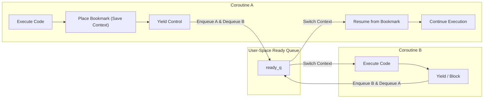
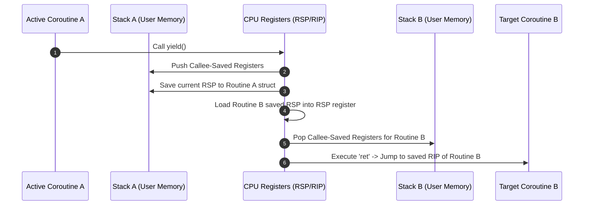
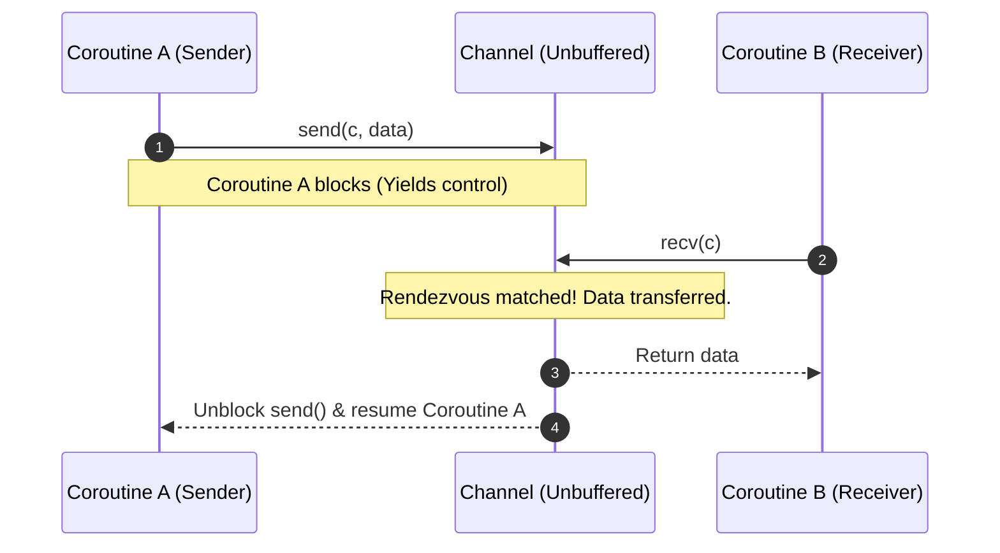

# Concurrency, Parallelism, and Rust: Coroutines

Coroutines are user-space, cooperative control-flow abstractions that allow execution to be suspended and resumed at explicit yield points. In concurrent programming, they provide lightweight, non-preemptive multitasking and structured inter-task data transfer via channels without the kernel context-switch overhead of OS threads.

---

## Coroutines Motivation & Overview

Standard programming functions follow a strict subroutine invocation model: when a function is called, it executes from its entry point to completion, returns a value, and its stack frame is destroyed. Coroutines generalize this execution model by allowing functions to suspend execution voluntarily (`yield`), preserve their complete state (instruction pointer, local variables, and call stack), and resume execution later from where they were paused.

### The Bookreading Analogy
Consider a person reading two separate books simultaneously:
- **Sequential Subroutine**: Reading Book A from cover to cover before ever opening Book B.
- **Preemptive Multitasking (OS Threads)**: An external timer rings, forcing the reader to drop Book A mid-sentence, record the exact word, and pick up Book B.
- **Cooperative Multitasking (Coroutines)**: The reader reaches the end of a chapter in Book A, places a bookmark at the exact page and line, voluntarily sets Book A down, and opens Book B to its saved bookmark.

To resume Book A later, the reader requires explicit **bookkeeping**: preserving the exact execution context (bookmark) so that when control returns, execution resumes seamlessly.



### Cooperative vs. Preemptive Multitasking
Coroutines operate under **cooperative multitasking**:
- **Non-Preemptable**: An active coroutine cannot be interrupted asynchronously by an OS hardware timer interrupt. Control changes **only** when the running coroutine explicitly cooperates by calling `yield()`, blocking on a channel operation (`send()` / `recv()`), or terminating.
- **Elimination of Data Races on Shared Memory**: Because context switches happen only at explicit yield points, code executing between yields is strictly atomic with respect to other coroutines running on the same worker thread.
- **Efficiency**: Context switches occur entirely in user space via compiler/assembly register swaps, bypassing expensive OS system calls (`sys_clone`, `switch_to`), kernel data structures, and TLB flushes.

#### The Risk of Non-Cooperation
Because preemption is absent, a coroutine containing an infinite loop that never invokes `yield()` or blocking operations will permanently starve all other coroutines managed by that worker thread.

---

## Architecture & Core Mechanics

A coroutine runtime maintains a set of user-space stacks, execution contexts, and a global scheduler queue.

### Core Data Structures
Each coroutine is represented by a control block (e.g., `struct Routine`), which encapsulates its private execution stack, saved stack pointer, and queue pointers:

```c
#define STACK_ENTRIES 1024

typedef struct Routine {
    void* saved_stack_pointer;              // Saved stack pointer (RSP) at suspension
    uint64_t private_stack[STACK_ENTRIES];  // Dedicated user-space stack frame
    struct Routine* next_in_queue;          // Linked-list node for the global ready queue
    // Additional fields: status flags, assigned channels, return values
} Routine;
```

The runtime maintains a global FIFO queue (`ready_q`) containing pointers to routines that are ready for execution:
- `enqueue(Routine* r)`: Appends a routine to the tail of `ready_q`.
- `dequeue()`: Removes and returns the routine at the head of `ready_q`.

### User-Space Context Switching (`routine_switch`)
When a coroutine suspends, the runtime saves its current CPU register state onto its private stack and restores the saved register state of the next target routine. The low-level context switch is performed in assembly:

```c
void routine_switch(Routine* current, Routine* next) {
    // 1. Push all callee-saved registers onto the current stack
    // 2. Save current stack pointer: current->saved_stack_pointer = RSP
    // 3. Load target stack pointer:  RSP = next->saved_stack_pointer
    // 4. Pop target callee-saved registers off the target stack
    // 5. Execute 'ret' instruction: pops saved Instruction Pointer (RIP)
    //    and jumps execution directly into the target coroutine context
}
```



### Core Coroutine API Mechanics

| API Function | Operational Behavior | Queue Mechanics & Context Switch |
| :--- | :--- | :--- |
| `spawn(func)` | Creates a new coroutine initialized with function `func`. | Allocates `Routine`, sets up initial stack frame with entry trampoline, enqueues to `ready_q`. May optionally switch immediately to the new routine or return a handle `h`. |
| `yield()` | Voluntarily suspends the active coroutine and gives up CPU time. | Enqueues current routine to `ready_q`, dequeues next ready routine, executes `routine_switch()`. Returns `false` if `ready_q` is empty. |
| `join(h)` | Waits for coroutine handle `h` to finish execution. | Blocks calling coroutine until routine `h` terminates, yielding CPU control to other ready routines. |

---

## Channels & Inter-Coroutine Communication

To perform useful work safely, coroutines transfer data and synchronize execution using **Channels**.

### Channel API & Semantics
Channels synchronize data transfer using `send` and `recv` operations:
- **`SendableData`**: Defined as an opaque pointer (`typedef void* SendableData`).
- **Unbuffered (Rendezvous) Channel**: Messages are handed off directly between sender and receiver. 
  - `send(c, data)`: Blocks the sending coroutine until another coroutine invokes `recv(c)` to consume the payload.
  - `recv(c)`: Blocks the receiving coroutine until a sender provides data on channel `c`.



### Channels Eliminate Memory Anomalies (Causal Consistency)
Directly sharing raw global memory between coroutines leads to non-deterministic temporal anomalies:

```rust
// UNSAFE: Shared global variable without channels
static mut MY_GLOBAL: i32 = 1;

fn worker() {
    unsafe { MY_GLOBAL = 2; }
}

fn main() {
    let h = spawn(worker);
    unsafe { print(MY_GLOBAL); } // Output is non-deterministic (1 or 2)!
    join(h);
}
```

Channels enforce a formal **causal consistency** (happens-before ordering) across execution contexts:

```rust
// SAFE: Synchronization via Channel
static mut MY_GLOBAL: i32 = 1;

fn worker(c: Channel) {
    unsafe { MY_GLOBAL = 2; }
    send(c, null); // Signal completion (blocks until recv)
}

fn main() {
    let (h, c) = spawn(worker);
    let _ = recv(c); // Blocks until worker signals
    unsafe { print(MY_GLOBAL); } // Guaranteed to ALWAYS print 2!
    join(h);
}
```

### Channel Flavors & Lifecycle Variations

1. **Buffering**:
   - *Unbuffered (Rendezvous)*: Direct synchronous handoff (`send` blocks until `recv`, `recv` blocks until `send`).
   - *Buffered*: Channel maintains a fixed ring buffer (`Circular Array`). `send` writes to buffer without blocking until full; `recv` consumes from buffer without blocking until empty.
2. **Termination & Endless Return Streams**:
   - When a coroutine function returns a final value `v`, the runtime configures the coroutine's channel to repeatedly broadcast `v` to subsequent `recv()` calls. This prevents downstream receivers from blocking forever on closed channels.

---

## Concrete Walkthrough & Execution Trace

### Scenario 1: Interleaved Yield Execution Trace

Consider `main` spawning `my_routine` where both functions output characters and yield:

```rust
fn my_routine() {
    for i in 0..2 {
        print("!");
        yield();
    }
}

fn main() {
    let h = spawn(my_routine); // Enqueues my_routine to ready_q
    for i in 0..2 {
        print("?");
        yield();
    }
    join(h);
}
```

```
Initial State (t = 0):
  Active Routine: Main (IP: line 8)
  ready_q: []

Trace:
  1. t = 1: Main calls spawn(my_routine).
     - Routine struct for my_routine allocated.
     - ready_q state: [my_routine]
  2. t = 2: Main prints "?" and calls yield().
     - Main enqueued to ready_q. ready_q: [my_routine, Main]
     - Dequeue head: my_routine.
     - routine_switch(Main -> my_routine).
  3. t = 3: my_routine prints "!" and calls yield().
     - my_routine enqueued. ready_q: [Main, my_routine]
     - Dequeue head: Main.
     - routine_switch(my_routine -> Main).
  4. t = 4: Main prints "?" and calls yield().
     - Main enqueued. ready_q: [my_routine, Main]
     - Dequeue head: my_routine.
     - routine_switch(Main -> my_routine).
  5. t = 5: my_routine prints "!" and terminates.
     - ready_q: [Main]
     - Dequeue head: Main.
     - routine_switch(my_routine -> Main).
  6. t = 6: Main calls join(h). my_routine is already terminated. Main proceeds and exits.

Final Output Sequence:
  ? ! ? !
```

### Scenario 2: Fibonacci Generator Stream

An infinite generator producing Fibonacci numbers via an unbuffered channel:

```rust
fn numbers(c: Channel) {
    let mut x = 0;
    let mut y = 1;
    loop {
        let sum = x + y;
        send(c, sum); // Blocks until main calls recv(c)
        x = y;
        y = sum;
    }
}

fn main() {
    let (h, c) = spawn(numbers);
    for i in 0..3 {
        let val = recv(c); // Unblocks numbers, receives value
        print(val);
    }
    // Main exits loop and terminates.
}
```

```
Execution Step:
  1. Main spawns numbers(c). numbers enqueued to ready_q.
  2. Main calls recv(c) -> Channel empty. Main blocks and yields CPU.
  3. numbers runs: calculates sum = 1, calls send(c, 1).
  4. Channel matches Rendezvous: Main receives 1 and unblocks.
  5. Main prints 1, loops, calls recv(c) -> blocks again.
  6. numbers proceeds: sum = 2, send(c, 2) matches Main's recv.
  7. Main prints 2, loops, calls recv(c) -> blocks again.
  8. numbers proceeds: sum = 3, send(c, 3) matches Main's recv.
  9. Main prints 3, finishes loop, and exits.
  10. numbers remains permanently blocked on send(c, 5) because no receiver exists.
```

---

## Edge Cases, Concurrency Hazards & Mitigations

### 1. Non-Cooperative Starvation
- **Hazard**: A coroutine executing an intensive computational loop without calling `yield()` or blocking operations locks out all other coroutines on the thread.
- **Mitigation**: Compilers or runtime libraries insert automatic yield checks (cooperative yield points) into loop headers or recursive function entries.

### 2. Channel Deadlocks & Cyclic Dependencies
- **Hazard**: If Coroutine A blocks on `recv(chan_B)` while Coroutine B blocks on `recv(chan_A)`, both routines are suspended permanently (`BLOCKED`).
- **DAG Rule**: The set of channel send and receive interactions forms a directed dependency graph. Schedulers must enforce acyclic dependency flow to prevent mutual blocking deadlock.

### 3. Both Routines Blocked (System Idle)
- **Hazard**: All active coroutines enter `BLOCKED` states waiting on channels or handles, leaving `ready_q` completely empty.
- **Mitigation**: The runtime scheduler detects an empty `ready_q` while coroutines remain un-joined, triggering a runtime deadlock error.

### 4. Pointer Ownership & Data Safety Across Channels
- **Hazard**: Transferring raw pointers (`void*`) over channels can lead to double-free or use-after-free bugs if both sender and receiver attempt to mutate or deallocate the memory.
- **Mitigation**: Enforce strict linear ownership transfer or immutability (as guaranteed by Rust's ownership type system).

---

## Formal Analysis / Protocol Specification

### Formal Definition
Let $R$ be the set of coroutines and $S(r) \in \{\text{READY}, \text{RUNNING}, \text{BLOCKED}, \text{TERMINATED}\}$ be the state of coroutine $r \in R$.

The state transition function $\delta$ for a cooperative scheduler is defined as:

$$\delta(\text{RUNNING}, \text{yield}()) \longrightarrow \text{READY}$$
$$\delta(\text{RUNNING}, \text{send}(c, v) \land \neg \text{HasReceiver}(c)) \longrightarrow \text{BLOCKED}$$
$$\delta(\text{BLOCKED}, \text{recv}(c) \land \text{HasSender}(c)) \longrightarrow \text{READY}$$

Let $\rightarrow_c$ denote the causal happens-before relation enforced by an unbuffered channel $c$. For any write operation $W(x)$ preceding `send(c, v)` and any read operation $R(x)$ following `recv(c, v)`:

$$W(x) \longrightarrow_c \text{send}(c, v) \longrightarrow_c \text{recv}(c, v) \longrightarrow_c R(x)$$

$$\implies W(x) \longrightarrow_c R(x)$$

### Simplified Explanation
If Coroutine A writes a value to memory and then sends a message on a channel, and Coroutine B receives that message before reading the memory, Coroutine B is guaranteed to see Coroutine A's write. The channel acts as a synchronized handoff point where time stops for the sender until the receiver takes the message.

---

## Deep Dive

### Stackful vs. Stackless Coroutines
Coroutines are broadly categorized by how their execution state is stored:

| Dimension | Stackful Coroutines (Fibers / Green Threads) | Stackless Coroutines (`async`/`await`) |
| :--- | :--- | :--- |
| **Stack Allocation** | Each coroutine allocates a dedicated stack array in heap/user memory (e.g., 8KB–1MB). | No dedicated stack; state is saved in an auto-generated struct frame on the heap. |
| **Yield Capability** | Can suspend execution from deeply nested inner helper functions. | Can only yield (`await`) at explicit top-level async function boundaries. |
| **Memory Overhead** | Higher memory footprint per routine due to pre-allocated stack frames. | Extremely low memory overhead (bytes to kilobytes per state machine). |
| **Examples** | HW1 C Coroutines, Go Goroutines, POSIX `ucontext`, Lua Coroutines. | Rust `Future`/`async`, JavaScript `Promises`, C# `async`/`await`. |

### Symmetric vs. Asymmetric Coroutines
- **Asymmetric Coroutines**: Contain two distinct control transfer operations: invoking a coroutine (resume/spawn) and suspending back to the caller/scheduler (`yield`). Control always yields back to the parent scheduler.
- **Symmetric Coroutines**: Provide a single control transfer mechanism (`yield_to(target_routine)`), allowing coroutines to explicitly delegate control directly to any specified destination routine.

---

## Industry Standard Terms

| Course Term | Industry / Standard Term |
| :--- | :--- |
| **Cooperative Routine** | Stackful Coroutine / Fiber / Green Thread / User Thread |
| **`ready_q`** | Run Queue / Task Scheduler / Ready Pool |
| **`routine_switch`** | User-Space Context Switch / Stack Swap / Register Swap |
| **Channel** | Unbuffered Channel / Synchronous Rendezvous Channel |
| **`SendableData`** | Opaque Payload / Untyped Message (`void*`) / Generic Pointer |

---

## Related

- [[Concurrency, Parallelism, and Rust/The Concurrent Mindset|The Concurrent Mindset]] — Foundational concurrency principles, task dependency graphs, and multi-core hardware drivers
- [[CSE351 Index|CSE351: The Hardware/Software Interface]] — x86-64 stack frames, stack pointer manipulation, and callee-saved registers
- [[CSE333 Index|CSE333: Systems Programming]] — C memory management, function pointers, and user-space execution contexts
- [[CSE451 Index|CSE451: Operating Systems]] — Kernel thread schedulers, preemptive multitasking, and OS context switching vs user fibers
- [[Distributed Systems/Index|CSE452: Distributed Systems]] — Channel communication, message passing primitives, and causal consistency ordering
