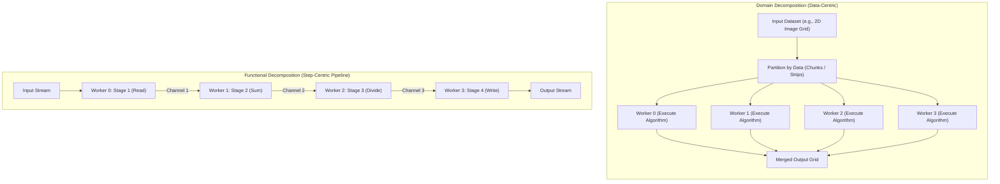
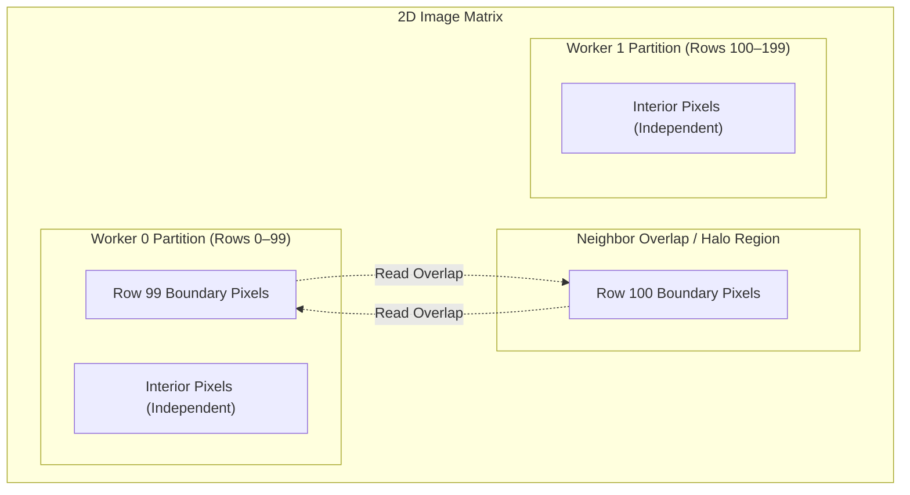

# Concurrency, Parallelism, and Rust: Decomposition

Decomposition is the foundational architectural process of breaking a computational problem into concurrent subproblems to expose parallel execution across multiple physical processing units while managing partitioning, synchronization, and communication overhead.

---

## Decomposition Motivation & Overview

To exploit multicore hardware architectures, software must abandon monolithic, single-threaded execution models. However, merely spawning additional execution threads does not guarantee faster performance. Before parallel execution is physically possible, a computation must be structured to reveal independent units of work.

### Concurrency vs. Parallelism: The Core Distinction

Understanding parallel systems begins with separating the abstract structure of a computation from its physical execution on hardware:

- **[[Concurrency, Parallelism, and Rust/The Concurrent Mindset|Concurrency]]**: A structural property of the program and its underlying task dependency graph. A program is concurrent if its tasks are composed such that several operations *could* execute simultaneously because they share no immediate causal dependencies (e.g., putting on socks before shoes).
  - Even on a single-core CPU with a single physical worker thread, a program can have a rich concurrent dependency graph. The operating system or runtime simply interleaves execution across time slices or cooperative yield points (as seen in [[Concurrency, Parallelism, and Rust/Coroutines|Coroutines]]).
- **Parallelism**: A physical property of an active execution of the dependency graph on hardware. A program executes in parallel when multiple physical processing units (CPU cores, execution units, or workers) *are* actively computing multiple instructions at the exact same physical instant.
- **The Dependency Constraint**: Parallelism is **strictly possible only where the dependency graph exposes concurrency**. If a computational dependency graph is strictly sequential ($A \longrightarrow B \longrightarrow C$), no amount of additional hardware cores can execute it in parallel. Exposing concurrency is the indispensable prerequisite for achieving parallel speedup.

### The Decomposition Mandate

To transition a sequential algorithm into a concurrent dependency graph, system designers must decompose the monolithic problem. There are two primary strategies for exposing concurrency:
1. **Domain Decomposition (Data-Centric)**: Partitioning the input or output data across workers running identical code.
2. **Functional Decomposition (Step-Centric)**: Partitioning the algorithmic steps across specialized workers connected in an execution pipeline.

---

## Architecture & Core Mechanics

The choice of decomposition strategy dictates how work is distributed, how workers communicate, and how hardware resources (such as CPU caches and memory buses) are utilized.



---

### 1. Domain Decomposition (Data Partitioning)

In **Domain Decomposition**, the primary data structure (such as an array, matrix, graph, or file collection) is divided into discrete chunks. Every worker executes the **same code** on its assigned subset of the data:

![[Domain Decomposition.png]]

- **Scaling Profile**: Domain decomposition scales naturally with dataset size and worker count. As data volume grows, the problem can be partitioned across more worker cores ($N$ workers operating on $M$ partitions).
- **Embarrassingly Parallel Workloads**: The ideal domain decomposition scenario where each worker executes its assigned chunk completely independently, requiring **zero communication or synchronization** with other workers (e.g., element-wise vector addition, independent ray tracing rays, or mapping operations). Under embarrassingly parallel conditions, speedup scales almost linearly with core count.
- **Non-Trivial Domain Decomposition & Neighbor Overlap**:
  - In most real-world algorithms, subproblems cannot execute in total isolation.
  - *Example: 2D Image Blurring (Stencil Computation)*. Each worker computes the blurred pixel values for an assigned horizontal strip or tile. However, computing the Gaussian blur for a pixel at the edge of a partition requires reading neighboring pixel values that reside inside an adjacent worker's partition:



  - **Neighbor Overlap (Halo / Ghost Cells)**: Workers must share or read boundary data. This introduces communication, synchronization barriers, and cache contention between workers.
  - Designing parallel algorithms requires addressing two fundamental architectural questions: **partitioning** (how to divide the data) and **load balancing** (how to keep all workers equally utilized).

---

### 2. Static Partitioning Strategies: Block vs. Cyclic

When tasks are distributed statically before execution begins, the allocation scheme directly affects CPU cache performance and workload balance:

| Partitioning Scheme | Description | [[Hardware & Software Interface/Cache/Spatial Locality|Spatial Cache Locality]] | Workload Balancing Behavior |
| :--- | :--- | :--- | :--- |
| **Block Distribution** | Contiguous chunks of data assigned to each worker (e.g., Worker 0 gets Rows 0–49; Worker 1 gets Rows 50–99). | **Optimal**: Highly cache-line friendly. Workers stream through contiguous memory addresses, maximizing L1/L2 cache line hits. | **Poor for Skewed Tasks**: If some rows require heavier computation than others (e.g., complex foreground vs. blank sky), workers with lighter blocks finish early and idle. |
| **Cyclic Distribution** | Interleaved round-robin assignment (e.g., Worker 0 gets Rows 0, 2, 4, 6...; Worker 1 gets Rows 1, 3, 5, 7...). | **Sub-optimal**: Workers skip across memory strides, degrading cache line utilization and risking false sharing if strides align within a 64-byte cache line. | **Optimal for Skewed Tasks**: Distributes computationally intense regions evenly across all workers, preventing single-worker stragglers. |

---

### 3. Dynamic Allocation & Load Balancing

In real-world systems, workers rarely finish at identical rates due to:
- **Workload Irregularity**: Computational complexity varies per data item (e.g., Mandelbrot set rendering where complex edge pixels take thousands of iterations while background pixels take one).
- **System Jitter**: OS thread preemption, page faults, and CPU thermal throttling cause identical threads to run at different speeds.
- **The Straggler Effect**: In parallel execution, the slowest worker dictates the total runtime. If three workers finish in 2 seconds and one finishes in 10 seconds, the CPU cores of the three fast workers sit idle, wasting hardware cycles.

#### The Dynamic Pull Model
To avoid idle CPU cores, work is assigned at runtime:
1. The dataset is divided into a collection of task strips or chunks.
2. Tasks are placed into a shared task pool or work queue.
3. As soon as a worker becomes available, it pulls the next available task strip from the queue.

#### The Overhead of Dynamic Allocation
While dynamic allocation prevents idle workers, coordination introduces non-negligible cost: **time spent communicating and synchronizing is time not spent working**.
- Synchronizing access to the shared task queue requires atomic operations, mutex locks, or message passing.
- Inter-core cache invalidations occur as workers read and write to shared queue metadata.

---

### 4. Decomposition Granularity

The efficiency of dynamic load balancing is governed by its **granularity** ($G$), defined as the ratio of computation time to communication overhead:

$$G = \frac{T_{\text{computation}}}{T_{\text{communication}}}$$

![[Overhead of Dynamic Allocation.png]]

- **Coarse-Grained Decomposition ($G$ is Large)**:
  - The problem is partitioned into a few large tasks.
  - **Advantage**: Very low communication and synchronization overhead. Workers spend nearly all their time computing. Simpler to implement.
  - **Disadvantage**: Poor load balancing. If one worker receives an unexpectedly heavy task or encounters system jitter, other workers exhaust their work and idle with nothing left to balance.
- **Fine-Grained Decomposition ($G$ is Small)**:
  - The problem is partitioned into many small, bite-sized tasks.
  - **Advantage**: Excellent, responsive load balancing. Idle workers can continuously pick up new subtasks, keeping all cores saturated.
  - **Disadvantage**: High synchronization overhead. The cumulative time spent coordinating who executes what begins to rival or exceed the actual computational work, degrading net speedup.

---

### 5. Functional Decomposition (Pipeline Parallelism)

Rather than dividing the data, **Functional Decomposition** divides the algorithmic steps of a program:

![[Functional Decomposition.png]]

- **Division of Labor**: Each worker specializes in one dedicated algorithmic stage (e.g., Worker 0 performs `read`, Worker 1 performs `sum`, Worker 2 performs `divide`, Worker 3 performs `write`).
- **Dataflow Architecture**: Intermediate results flow sequentially between adjacent workers through communication queues or channels (as explored in [[Concurrency, Parallelism, and Rust/Stack Management and Channels|Channels]]).
- **Latency vs. Throughput**:
  - Functional pipelining **does not reduce the latency** of an individual data element (in fact, inter-thread synchronization slightly increases individual latency).
  - Pipelining **maximizes system throughput**: once the pipeline fills, an output is produced at every clock cycle corresponding to the execution time of one stage.

#### Pipeline Scheduling & Stalls (Bubbling)
- **Pipeline Schedules**: A schedule dictates which worker executes which task at what time, with the goal of keeping all pipeline stages full simultaneously.
- **The Bottleneck Principle**: In an assembly pipeline, **system throughput is strictly bounded by the slowest stage**:
  $$\text{Maximum Throughput} = \frac{1}{\max_{i}(T_i)}$$
- **Pipeline Stalls (Bubbles)**: If stage $k$ takes longer to execute than adjacent stages, it creates upstream backpressure (upstream workers block waiting for output buffers to drain) and starves downstream stages (downstream workers idle waiting for input). These idle gaps in the execution timeline are known as **pipeline bubbles**.

---

### 6. Hybrid Decomposition

Real-world high-performance systems frequently combine domain and functional decomposition:
- An outer **functional decomposition** pipeline divides high-level stages (e.g., Video Ingestion $\longrightarrow$ Frame Decoding $\longrightarrow$ Computer Vision Analysis $\longrightarrow$ Output Encoding).
- Compute-intensive internal stages (such as Computer Vision Analysis) apply **domain decomposition** internally, distributing image frames or pixel blocks across a thread pool of worker cores.
- **Trade-off**: Hybrid models maximize overall concurrency and hardware saturation, but introduce layered communication hierarchies, buffer management complexity, and multi-tier synchronization overhead.

---

## Concrete Walkthrough & Execution Traces

To observe how partitioning, granularity, and pipeline scheduling dictate runtime performance, consider the following concrete execution traces.

### Trace 1: Functional Decomposition Pipeline Execution & Bubbling

Consider a 4-stage pipeline processing 5 discrete data items ($D_0, D_1, D_2, D_3, D_4$) across discrete clock ticks ($t$):
- **Stage 1 (Worker 0)**: `Read` (nominal cost: 1 tick)
- **Stage 2 (Worker 1)**: `Sum` (nominal cost: 1 tick)
- **Stage 3 (Worker 2)**: `Divide` (nominal cost: 1 tick; complex item cost: 2 ticks)
- **Stage 4 (Worker 3)**: `Write` (nominal cost: 1 tick)

Suppose item $D_1$ contains a computationally complex input that causes Stage 3 (`Divide`) to require **2 clock ticks** instead of 1.

```
Initial State (t = 0):
  Pipeline Stages: Empty
  Data Queue: [D0, D1, D2, D3, D4]
  Channels: All empty

Execution Trace:
  t = 0 -> 1: Ramp-up Phase
    Worker 0 (Read):   Processes D0
    Worker 1 (Sum):    Idle (Starved)
    Worker 2 (Divide): Idle (Starved)
    Worker 3 (Write):  Idle (Starved)

  t = 1 -> 2:
    Worker 0 (Read):   Processes D1
    Worker 1 (Sum):    Processes D0
    Worker 2 (Divide): Idle (Starved)
    Worker 3 (Write):  Idle (Starved)

  t = 2 -> 3:
    Worker 0 (Read):   Processes D2
    Worker 1 (Sum):    Processes D1
    Worker 2 (Divide): Processes D0
    Worker 3 (Write):  Idle (Starved)

  t = 3 -> 4: Steady State (Nominal)
    Worker 0 (Read):   Processes D3
    Worker 1 (Sum):    Processes D2
    Worker 2 (Divide): Processes D1 (Begins Tick 1 of 2)
    Worker 3 (Write):  Processes D0 -> Output D0 complete!

  t = 4 -> 5: Pipeline Stall & Bubble Injected
    Worker 2 (Divide): Still busy with D1 (Tick 2 of 2)  <-- Slowest Worker Bottleneck
    Worker 1 (Sum):    Finished D2, but Channel 2 is full (Backpressure Stall!)
    Worker 0 (Read):   Finished D3, Channel 1 is full (Backpressure Stall!)
    Worker 3 (Write):  Idle (No input from Worker 2 -> Bubble / Straggler Idle Cycle!)

  t = 5 -> 6: Recovery
    Worker 2 (Divide): Finishes D1, passes to Worker 3; dequeues D2
    Worker 1 (Sum):    Processes D3
    Worker 0 (Read):   Processes D4
    Worker 3 (Write):  Processes D1 -> Output D1 complete!

  t = 6 -> 7: Drain Phase
    Worker 0 (Read):   Done (No more input)
    Worker 1 (Sum):    Processes D4
    Worker 2 (Divide): Processes D3
    Worker 3 (Write):  Processes D2 -> Output D2 complete!

  t = 7 -> 8:
    Worker 2 (Divide): Processes D4
    Worker 3 (Write):  Processes D3 -> Output D3 complete!

  t = 8 -> 9:
    Worker 3 (Write):  Processes D4 -> Output D4 complete!

Final State (t = 9):
  All 5 items fully processed and written.
  Total Execution Time: 9 ticks (extended by 1 tick due to the bubble at t=4).
```

---

### Trace 2: Domain Decomposition Partitioning Schemes

Consider processing an 8-row image (Rows 0–7) across **2 workers** ($W_0, W_1$):
- **Rows 0–3 (Uniform Background)**: 1 compute tick per row.
- **Rows 4–7 (Detailed Foreground)**: 3 compute ticks per row.
- Total computation required: $(4 \times 1) + (4 \times 3) = 16\text{ ticks}$.

```
Strategy A: Static Block Allocation
  Worker 0: Assigned Rows 0–3 -> 1 + 1 + 1 + 1 = 4 ticks
  Worker 1: Assigned Rows 4–7 -> 3 + 3 + 3 + 3 = 12 ticks

  Timeline:
    t = 0  to 4:  W0 computes Rows 0–3; W1 computes Rows 4 and part of 5.
    t = 4:        W0 completes all tasks.
    t = 4  to 12: W0 sits completely IDLE (wasted CPU cycles). W1 continues alone.
    t = 12:       W1 completes Row 7. Barrier satisfied.

  Total Elapsed Time: 12 ticks.
  Idle Wasted Time:   8 ticks (W0 idle 66.7% of total runtime).


Strategy B: Static Cyclic Allocation
  Worker 0: Assigned Rows 0, 2, 4, 6 -> 1 + 1 + 3 + 3 = 8 ticks
  Worker 1: Assigned Rows 1, 3, 5, 7 -> 1 + 1 + 3 + 3 = 8 ticks

  Timeline:
    t = 0 to 8:   Both W0 and W1 compute continuously.
    t = 8:        Both W0 and W1 complete their final rows simultaneously.

  Total Elapsed Time: 8 ticks (33% faster than Block Allocation).
  Idle Wasted Time:   0 ticks (Perfect static workload balance).


Strategy C: Dynamic Allocation (Shared Queue of 1-Row Strips)
  Queue contains: [R0, R1, R2, R3, R4, R5, R6, R7]
  Each queue access incurs a small synchronization cost (0.1 ticks).

  Timeline:
    t = 0.0: W0 pulls R0; W1 pulls R1.
    t = 1.1: W0 finishes R0, pulls R2; W1 finishes R1, pulls R3.
    t = 2.2: W0 finishes R2, pulls R4 (cost 3); W1 finishes R3, pulls R5 (cost 3).
    t = 5.3: W0 finishes R4, pulls R6 (cost 3); W1 finishes R5, pulls R7 (cost 3).
    t = 8.4: Both workers finish.

  Total Elapsed Time: 8.4 ticks.
  Analysis: Dynamically balances without prior knowledge of row costs, paying only a minor coordination tax.
```

---

## Edge Cases, Failure Modes & Performance Hazards

1. **The Straggler Problem & Worker Imbalance**:
   - In domain decomposition with barrier synchronization, the completion time of a parallel phase is bounded by $\max_i(T_{\text{worker } i})$. A single slow worker holding a long-running subproblem forces all other workers to stall at the barrier.
   - *Mitigation*: Dynamically distribute work using fine-grained task strips or apply work-stealing schedulers.
2. **Shared Task Queue Contention**:
   - In dynamic allocation, if thousands of fine-grained tasks are managed by a single centralized work queue guarded by a mutual exclusion lock, worker threads spend more time contending for the lock than computing.
   - *Mitigation*: Use per-worker local task queues with work-stealing (workers push and pop locally, only acquiring locks when stealing from other queues).
3. **Cache Invalidation & False Sharing**:
   - In cyclic domain decomposition, if workers are assigned adjacent items that fall within the same 64-byte hardware cache line, the CPU cache coherence protocol (e.g., MESI) continuously invalidates and ping-pongs the cache line between core caches, destroying performance.
   - *Mitigation*: Ensure minimum partition chunk sizes are aligned with or exceed cache line boundaries (typically 64 bytes).
4. **Pipeline Backpressure & Buffer Starvation**:
   - In functional decomposition, if queues between stages are unbounded, an upstream worker running faster than a downstream worker will flood system memory with unconsumed intermediate data. Conversely, if queues are bounded, upstream workers block as soon as buffers fill.
   - *Mitigation*: Implement bounded channels with tuned capacities and scale worker counts for the bottleneck stage (e.g., allocating multiple workers to stage 3 via internal domain decomposition).
5. **Granularity Collapse**:
   - If tasks are made too fine-grained, thread creation and dispatch overhead dominate computation ($G \ll 1$), resulting in negative speedup (the parallel program runs significantly slower than the serial version).

---

## Formal Analysis / Theoretical Limits

### 1. Amdahl's Law (Strong Scaling)

#### Formal Definition
Let $T_1$ be the execution time of an algorithm on a single worker, and let $f \in [0, 1]$ represent the strictly serial fraction of the computation that cannot be parallelized. Assuming the remaining parallel fraction $(1 - f)$ scales perfectly linearly across $N$ workers:

$$T_N = T_1 \left(f + \frac{1 - f}{N}\right)$$

The parallel speedup $S_N$ is:

$$S_N = \frac{T_1}{T_N} = \frac{1}{f + \frac{1 - f}{N}}$$

As the number of physical workers approaches infinity ($N \to \infty$):

$$\lim_{N \to \infty} S_N = \frac{1}{f}$$

#### Simplified Explanation
If 10% of a program must run sequentially (such as loading an image from disk or synchronizing a task queue), adding a million processors can never speed up the program by more than $10\times$. The serial bottleneck strictly caps maximum speedup for a fixed problem size.

---

### 2. Gustafson's Law (Weak Scaling / Scaled Speedup)

#### Formal Definition
Amdahl's law assumes a fixed problem size. In practice, programmers use more processors to tackle proportionally larger problems in the same total time. Let $f$ be the serial fraction of execution time on $N$ workers. The scaled speedup $S_{\text{scaled}}(N)$ is:

$$S_{\text{scaled}}(N) = f + (1 - f)N = N - f(N - 1)$$

#### Simplified Explanation
Instead of running a fixed-size job faster, increasing workers allows running a larger job in the same timeframe. Because the parallelizable portion scales upward with dataset size while serial setup overhead stays relatively fixed, the achievable speedup grows near-linearly with the number of processors.

---

### 3. Granularity Metric

#### Formal Definition
$$\text{Granularity } G = \frac{T_{\text{computation}}}{T_{\text{communication}}}$$

#### Simplified Explanation
A subproblem is only worth delegating to a separate worker thread if the time required to compute its result is significantly greater than the time spent packaging, transferring, and synchronizing that data.

---

### 4. Baseline Measurement Invariant

$$\text{Speedup } S = \frac{T_{\text{best serial}}}{T_{\text{parallel}}}$$

When reporting parallel speedup, the single-core execution time must always be measured using the **fastest known serial algorithm**, rather than running the parallel algorithm with a thread count of 1. Parallel algorithms incur coordination data structures and synchronization overhead that artificially slow down single-thread execution.

---

## Deep Dive

### Work-Stealing Scheduling: The Modern Dynamic Solution

To resolve the tension between fine-grained load balancing and communication overhead, modern parallel runtimes (such as Cilk, Go's runtime, and Rust's `rayon`) employ **work-stealing schedulers**:
- Instead of a single centralized work queue, each worker thread maintains its own private, lock-free double-ended queue (deque).
- **LIFO Local Execution**: When a worker generates new subtasks, it pushes them onto the **bottom** of its own deque. The worker pops tasks from the bottom, maximizing [[Hardware & Software Interface/Cache/Spatial Locality|temporal and spatial cache locality]] since recently pushed tasks are hot in cache.
- **FIFO Remote Stealing**: When a worker runs out of tasks, it randomly selects a peer worker and steals a task from the **top** of the victim's deque. Because older tasks at the top represent larger chunks of work (higher up in the recursive divide-and-conquer tree), steals transfer coarse-grained tasks, minimizing steal frequency and lock contention.

### Hardware Roofline Model & Arithmetic Intensity

The decomposition granularity $G = \frac{T_{\text{computation}}}{T_{\text{communication}}}$ maps directly to the hardware **Roofline Model**, which characterises algorithm throughput by **arithmetic intensity** (floating-point operations per byte transferred from memory):
- Domain decomposition on stencil algorithms (like image blurring) is frequently **memory-bandwidth bound** rather than compute-bound.
- When multiple cores contend for memory bus bandwidth while reading neighbor overlap regions, speedup saturates well before reaching Amdahl's theoretical limit. Structuring partitions to fit completely within CPU L1/L2 caches (cache blocking) is vital to preventing memory bus starvation.

---

## Industry Standard Terms

| Course Term | Industry / Standard Term |
| :--- | :--- |
| **Domain Decomposition** | Data Parallelism / Data Partitioning / Domain Partitioning |
| **Functional Decomposition** | Task Parallelism / Pipeline Parallelism |
| **Embarrassingly Parallel** | Perfectly Parallel / Pleasingly Parallel / Map-Only Job |
| **Strips / Slices** | Chunks / Tiles / Partitions |
| **Neighbor Overlap** | Halo Exchange / Ghost Cells / Stencil Boundary |
| **Dynamic Allocation** | Dynamic Task Scheduling / Shared Work Queue / Work-Stealing |
| **Granularity ($G$)** | Compute-to-Communication Ratio / Task Grain Size |
| **Bubbling / Stalls** | Pipeline Bubble / Core Idling / Pipeline Stall |
| **Amdahl's Law** | Strong Scaling Limit |
| **Gustafson's Law** | Weak Scaling / Scaled Speedup |
| **Slowest Worker Bottleneck** | Straggler Effect / Tail Latency Bottleneck |

---

## Related

- [[Concurrency, Parallelism, and Rust/The Concurrent Mindset|The Concurrent Mindset]] — Foundational dependency graphs, DAG dataflow models, and multicore hardware trends
- [[Concurrency, Parallelism, and Rust/Coroutines|Coroutines]] — Cooperative user-space multitasking, stack management, and single-threaded concurrency
- [[Concurrency, Parallelism, and Rust/Stack Management and Channels|Stack Management and Channels]] — Channel communication primitives, bounded message passing, and context switching
- [[Data Structures and Parallelism/Parallelism/Amdahl's Law|Amdahl's Law]] — Theoretical speedup bounds and mathematical derivations for parallel algorithms
- [[Data Structures and Parallelism/Parallelism/Work And Span|Work and Span]] — Formal asymptotic analysis of parallel execution DAGs and critical path length
- [[Data Structures and Parallelism/Parallelism/Fork-Join|Fork-Join Parallelism]] — Divide-and-conquer domain decomposition and parallel prefix computation
- [[Hardware & Software Interface/Cache/Spatial Locality|Spatial Locality]] — Memory layouts, cache line utilization, and contiguous block distribution benefits
- [[Hardware & Software Interface/Cache/Cache Locality|Cache Locality]] — Temporal/spatial locality trade-offs in matrix partitioning and stencil computations
- [[Operating Systems/Concurrency/Synchronization/Mechanics/Bounded Buffer Problem|Bounded Buffer Problem]] — Channel synchronization, pipeline buffer queues, and backpressure
- [[Introduction to Data Management/Query Execution/Pipelined Execution|Pipelined Execution]] — Functional pipelining and iterator models in relational query processing engines
- [[Database Internals/Parallel/ParallelExecutionComponents/Speedup and Scaleup|Speedup and Scaleup]] — Strong scaling vs. weak scaling definitions in parallel database query execution