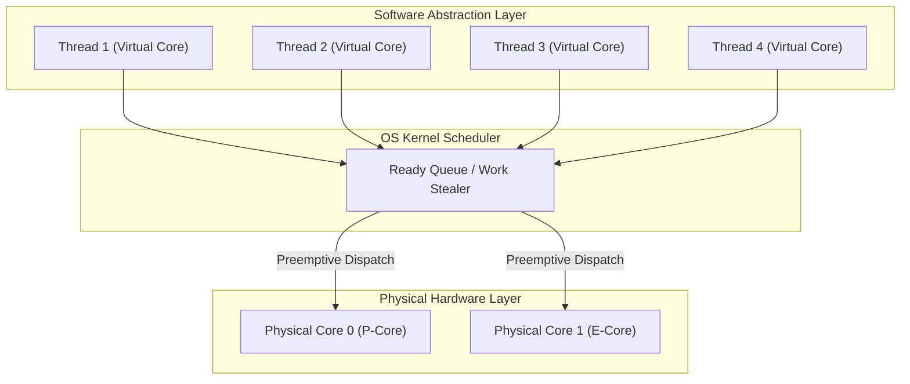
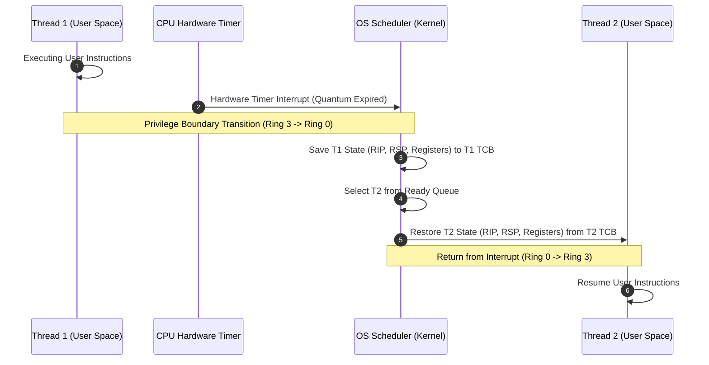
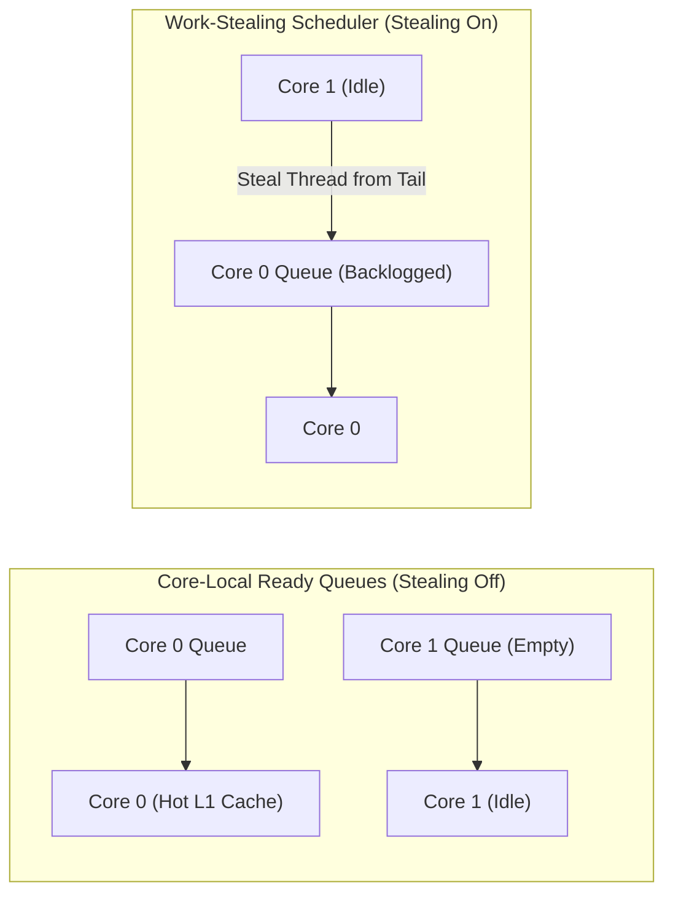

# Concurrency, Parallelism, and Rust: Threads and Cores

Hardware execution cores represent physical processing units capable of executing a single instruction stream, whereas threads provide a software-level execution abstraction—a "virtual core"—that decouples program logic from physical hardware boundaries, allowing concurrent workflows to be dynamically scheduled across available hardware resources.

---

## Threads and Cores Motivation & Overview

Modern computer architectures feature multi-core processors capable of true hardware parallelism. To maximize hardware utilization and build scalable software, systems must divide execution across multiple independent workflows.

### The Need for Abstraction: Cores vs. Threads
- **Hardware Cores (Physical Processors)**: A physical execution unit containing its own instruction fetch unit, execution pipelines (ALUs, FPUs), and local L1/L2 caches. A single core executes exactly one stream of instructions at any given instant.
- **Scalability & DRY Principle**: Writing core-specific code (e.g., hardcoding thread 0 to core 0, thread 1 to core 1) violates the Don't Repeat Yourself (DRY) principle and fails to scale across machines with different core counts. Creating a single unified entry function executed across multiple virtual cores allows programs to dynamically scale from a 2-core laptop to a 128-core server.
- **The Thread Abstraction**: A **thread** is an execution context scheduled by the operating system kernel or runtime. It acts as a **virtual core**, allowing software to program under the assumption of having access to an arbitrarily large number of processors.

### Non-Deterministic Execution Speeds
Physical hardware cores do not execute instructions at uniform or predictable rates. A thread's execution speed varies continuously due to multiple hardware and system factors:
- **Asymmetric Core Microarchitectures**: Modern CPUs combine high-performance cores (P-cores) and power-efficient cores (E-cores) operating at different clock speeds and IPC (instructions per cycle) capacities.
- **Memory Hierarchy Latency**: A thread executing an instruction that triggers an L1 cache hit completes in ~1 ns, whereas an L3 cache miss requiring main memory (DRAM) access delays execution by ~50–100 ns.
- **Dynamic Voltage and Frequency Scaling (DVFS)**: Cores automatically adjust clock frequencies or downclock (thermal throttling) to remain within power and temperature envelopes.
- **System Interrupts and Resource Contention**: Operating system device interrupts, background processes, and competing threads dynamically usurp core cycles.



### Threads vs. Coroutines
The fundamental distinction between threads and coroutines lies in **how** execution control is transferred:
- **[[Concurrency, Parallelism, and Rust/Coroutines|Coroutines]]**: Cooperative user-space execution contexts. A coroutine switches execution **only** when explicitly requested via a yield point (`yield()`, `await`). Control flow is deterministic and predictable.
- **Threads**: Preemptive execution contexts. A thread behaves like a coroutine that is forcibly interrupted by the OS kernel timer after arbitrary instructions without developer consent. This implicit preemption enables multiplexing over physical cores but introduces non-deterministic schedule interleavings that make concurrent reasoning challenging.

---

## Architecture & Core Mechanics

### Memory Layout: Shared vs. Private State
All threads belonging to the same process share a single virtual address space, enabling rapid data exchange but requiring strict synchronization.

| Memory Region | Access Scope | Ownership | Notes |
| :--- | :--- | :--- | :--- |
| **Global & Static Memory** | Shared | All Process Threads | Contains global variables, static constants, and compiled text segment. |
| **Heap Memory** | Shared | All Process Threads | Dynamic allocations (`malloc`, `Box::new`) accessible via pointers. |
| **Architectural Registers** | Private | Per Thread | Program Counter (PC/RIP), Stack Pointer (RSP), and general-purpose registers. |
| **Execution Stack** | Private | Per Thread | Local variables, function frame records, and return addresses allocated per thread. |

```
Virtual Address Space (Shared Process Memory)
+-------------------------------------------------------+
| Text Segment (Code) & Read-Only Data                  |
+-------------------------------------------------------+
| Global / Static Variables                             |
+-------------------------------------------------------+
| Dynamic Heap (Shared memory allocations)              |
|   |                                               ^   |
|   v                                               |   |
+-------------------------------------------------------+
| Thread 1 Stack (Private)  | Thread 2 Stack (Private)  |
| [Local Vars, Frame Ptrs]  | [Local Vars, Frame Ptrs]  |
+-------------------------------------------------------+
```

### The Thread Abstraction Model
Programmers structure concurrent code under the model of an unlimited pool of virtual cores.

![[Thread Abstraction.png]]

- **Abstraction Rules**:
  1. Software assumes an unlimited number of virtual cores (one per thread).
  2. Threads execute at variable, unpredictable speeds and may pause at any execution boundary.
  3. Correct concurrent software must produce valid results under **every possible scheduling interleaving**.

### Thread Lifecycle & Core Operations
Standard thread runtimes and OS kernel APIs provide four fundamental primitives for thread control:

```rust
// Spawns a new thread executing entry function `fn_ptr(arg)` with its own stack
fn thread_create(t: &mut ThreadID, fn_ptr: fn(*mut c_void), arg: *mut c_void);

// Voluntarily yields the remaining time quantum back to the OS scheduler
fn thread_yield();

// Blocks the calling thread until target thread `t` completes execution
fn thread_join(t: ThreadID);

// Terminates current thread execution and wakes any threads blocked in thread_join
fn thread_exit();
```

### Preemption, Hardware Timers, and Time Quanta
When multiple threads share fewer physical cores ($M > N$), the OS kernel enforces sharing via **preemptive multitasking**:
- **Hardware Timer Interrupt**: A physical timer on the CPU generates periodic hardware interrupts.
- **Time Quantum (Slice)**: The fixed duration of CPU execution granted to a thread between timer interrupts.
- **Preemption Step**: Upon timer interrupt, the CPU hardware traps into the kernel (Ring 3 to Ring 0). The OS saves the active thread's registers to its Thread Control Block (TCB), selects the next ready thread from the run queue, restores its saved registers, and switches execution contexts.



#### Preemption Frequency Trade-offs
- **High Preemption Frequency (Short Quanta)**:
  - *Advantage*: Low latency and high responsiveness; ready threads run almost immediately.
  - *Disadvantage*: High CPU overhead due to frequent context switches and cache thrashing.
- **Low Preemption Frequency (Long Quanta)**:
  - *Advantage*: High overall system throughput; minimal CPU time spent in kernel context switches.
  - *Disadvantage*: Higher scheduling latency; interactive threads experience perceptible delays.

---

## Concrete Walkthrough & Execution Trace

### Programmer View vs. Processor View
High-level code statements that appear single and atomic in source code decompile into multiple distinct assembly instructions (Read-Modify-Write sequence). Because the OS kernel can preempt a thread between *any* two assembly instructions, concurrent execution introduces schedule non-determinism.

Consider two threads concurrently executing increments on shared variables:

```c
// High-Level Source Statements
void thread_work() {
    x = x + 1;
    y = y + x;
    z = x + 5 * y;
}
```

At the assembly level, `x = x + 1` expands into three distinct instructions:
1. `MOV RAX, [x]` (Read `x` from shared memory into register)
2. `ADD RAX, 1`   (Modify register value)
3. `MOV [x], RAX` (Write updated value back to shared memory)

### Execution Interleaving Trace
Consider an initial state at $t = 0$ where shared memory holds $x = 0$, $y = 0$, $z = 0$.

```
Initial State (t = 0):
  Shared Memory: x = 0, y = 0, z = 0
  Thread 1: Ready
  Thread 2: Ready

Trace Scenario A: Sequential Execution (No Race)
  1. Thread 1 runs to completion:
     x = 1, y = 1, z = 6
  2. Thread 2 runs to completion:
     x = 2, y = 3, z = 17
  Final State: x = 2, y = 3, z = 17

Trace Scenario B: Interleaved Preemption (Data Race Hazard)
  1. Thread 1 executes: MOV RAX, [x]        (Reads x = 0 into Thread 1 RAX)
  2. Thread 1 executes: ADD RAX, 1          (Thread 1 RAX = 1)
     --- TIMER INTERRUPT: OS Preempts Thread 1 -> Switches to Thread 2 ---
  3. Thread 2 executes: MOV RBX, [x]        (Reads x = 0 into Thread 2 RBX)
  4. Thread 2 executes: ADD RBX, 1          (Thread 2 RBX = 1)
  5. Thread 2 executes: MOV [x], RBX        (Writes x = 1 to shared memory)
  6. Thread 2 executes: MOV RDI, [y]        (Reads y = 0)
  7. Thread 2 executes: ADD RDI, [x]        (RDI = 0 + 1 = 1)
  8. Thread 2 executes: MOV [y], RDI        (Writes y = 1 to shared memory)
     --- TIMER INTERRUPT: OS Preempts Thread 2 -> Resumes Thread 1 ---
  9. Thread 1 resumes: MOV [x], RAX         (Writes stale RAX = 1 to shared memory! Overwrites Thread 2's write!)
 10. Thread 1 executes: MOV RSI, [y]        (Reads y = 1)
 11. Thread 1 executes: ADD RSI, [x]        (RSI = 1 + 1 = 2)
 12. Thread 1 executes: MOV [y], RSI        (Writes y = 2 to shared memory)

Final State Scenario B: x = 1, y = 2 (Corrupted state due to lost update)
```

Because execution order depends on hardware timing, physical core count, and competing OS tasks, a correct concurrent program **must be synchronized to produce valid results across all possible schedule interleavings**.

---

## Hardware Complexities, Cache Dynamics & Microarchitecture

### CPU Cache Topology and Thread Migration
Modern multi-core processors use a hierarchical cache structure. Each core maintains private L1 and L2 caches, while sharing a unified L3 cache across cores.

![[realistic cache.png]]

When the OS scheduler moves a thread from **Core 0** to **Core 1**:
1. The thread's most recently modified data resides in **Core 0's private L1/L2 cache**.
2. Upon executing on **Core 1**, initial memory accesses trigger **L1/L2 cache misses**, forcing data retrieval from L3 cache or DRAM.
3. **Cache Coherence**: Hardware protocols (e.g., MESI) automatically ensure all cores observe consistent memory values across private caches. While cache coherence guarantees correctness without manual programmer intervention, invalidating and transferring cache lines across inter-core interconnects incurs significant latency penalties.

### Scheduler Queues: Core-Local vs. Work Stealing
To balance CPU utilization against cache locality, OS schedulers use distinct queuing strategies:



- **Core-Local Ready Queue (No Stealing)**:
  - Each physical core maintains its own isolated run queue. Threads return exclusively to the core that holds their warm L1/L2 cache lines.
  - *Trade-off*: Maximizes cache hit rates, but risks CPU core idling if one queue empties while another core remains backlogged.
- **Work Stealing Enabled**:
  - Idle cores actively steal ready threads from the back of backlogged cores' run queues.
  - *Trade-off*: Eliminates CPU core idling and maximizes parallel throughput, but sacrifices cache locality by migrating threads across cores.

### False Sharing
**False Sharing** occurs when two distinct threads executing on separate physical cores modify independent variables that reside within the **same hardware cache line** (typically 64 bytes).

```
Cache Line (64 Bytes)
+----------------------------------+----------------------------------+
| Variable A (Modified by Core 0)  | Variable B (Modified by Core 1)  |
+----------------------------------+----------------------------------+
```

#### Invalidation Mechanics
1. **Core 0** writes to `Variable A`. The MESI cache coherence protocol marks the entire 64-byte cache line in **Core 1's** L1 cache as **Invalid**.
2. **Core 1** attempts to write to `Variable B`. Because the line is Invalid, Core 1 suffers a cache miss, stalls execution, and broadcasts an invalidation request to Core 0.
3. The cache line continuously bounces back and forth between Core 0 and Core 1 ("cache line bouncing"), degrading performance by orders of magnitude even though no logical data race exists.

#### Mitigation: Cache Line Padding
Developers eliminate false sharing by padding data structures to ensure independent variables occupy separate cache lines:

```cpp
// C++17 Standard Cache Line Alignment
#include <new>

struct alignas(std::hardware_destructive_interference_size) ThreadWorker {
    uint64_t counter; // Isolated to its own 64-byte cache line
};
```

```rust
// Rust Cache Line Alignment Attribute
#[repr(align(64))]
struct ThreadWorker {
    counter: u64,
}
```

### Hyperthreading / Simultaneous Multithreading (SMT)
**Hyperthreading** (Intel term) or **Simultaneous Multithreading (SMT)** is a hardware microarchitectural technique where a single physical CPU core presents multiple **hardware threads** (logical cores) to the operating system.

![[hardware cores.png]]

- **Hardware Resource Sharing**: Hardware threads duplicate architectural register sets (PC, RSP, GPRs) but **share execution pipelines (ALUs, FPUs, vector units) and L1/L2 caches** within the physical core.
- **Performance Characteristics**:
  - An 8-core CPU with 2-way SMT presents 16 logical cores to the OS.
  - SMT improves throughput when one hardware thread stalls on a cache miss, allowing the secondary hardware thread to utilize idle ALU execution units.
  - If both hardware threads execute heavy compute workloads (e.g., floating-point matrix multiplication), they contend for the same physical execution units, yielding lower performance than two dedicated physical cores.
- **Cache Line Padding Ineffectiveness on SMT**: Because hardware threads on the same physical core share the exact same L1 cache, cache lines do not move between distinct physical caches. Thus, cache line padding resolves multi-core inter-cache invalidation but does not alleviate SMT execution unit contention.

### Out-of-Order Execution & Memory Barriers
Modern CPU cores and optimizing compilers dynamically reorder instructions to maximize Instruction-Level Parallelism (ILP):
- **Compiler Reordering**: The compiler rearranges assembly instructions to optimize register allocation and pipeline depth.
- **Hardware Reordering**: Out-of-order execution engines reorder memory reads and writes in store buffers to prevent pipeline stalls.
- **Memory Barriers (Fences)**: Special CPU instructions (e.g., `MFENCE`, `LFENCE`, `SFENCE` on x86) that force the compiler and physical CPU pipeline to flush store buffers and prevent instruction reordering across the barrier boundary.

---

## Edge Cases, Failure Modes & Mitigations

### 1. Data Races on Non-Atomic Shared Variables
- **Failure Mode**: Multiple threads concurrently read and write to shared memory without synchronization, producing corrupted state or lost updates.
- **Mitigation**: Enforce mutual exclusion using mutexes, locks, or atomic primitives (`std::sync::atomic`).

### 2. Severe Cache Line Bouncing (False Sharing)
- **Failure Mode**: High throughput algorithms experience drastic performance degradation despite perfect task independence due to false sharing on shared 64-byte cache lines.
- **Mitigation**: Apply structure padding (`repr(align(64))` or `hardware_destructive_interference_size`) to separate active worker fields.

### 3. SMT Execution Unit Contention
- **Failure Mode**: Compute-heavy parallel workloads scale poorly when scheduled across hyperthreaded logical cores on the same physical CPU.
- **Mitigation**: Bind latency-critical threads to dedicated physical cores using CPU affinity masks (`pthread_setaffinity_np`).

### 4. Memory Reordering Violations Across Cores
- **Failure Mode**: One core observes memory writes from another core in an unexpected order, causing lock-free data structures to read stale or uninitialized pointers.
- **Mitigation**: Insert memory barrier instructions or use atomic memory orderings (`Acquire`, `Release`, `SeqCst`).

---

## Formal Analysis / Protocol Specification

### Formal Definition: Non-Deterministic Interleaving Invariant

Let $T = \{t_1, t_2, \dots, t_n\}$ be a set of concurrent threads executing on a set of physical cores $C = \{c_1, c_2, \dots, c_m\}$.

Each thread $t_i$ consists of a sequence of atomic assembly operations $O_i = \langle o_{i,1}, o_{i,2}, \dots, o_{i,k} \rangle$.

A global execution schedule $S$ is a total ordering of all operations across all threads:
$$S = \text{Interleave}(O_1, O_2, \dots, O_n)$$

Subject to the intra-thread program order invariant:
$$\forall i, \quad a < b \implies \text{Index}_S(o_{i,a}) < \text{Index}_S(o_{i,b})$$

A program state transition function $\delta(State, o) \to State'$ is defined as **correct** if and only if for every valid schedule $S$:
$$State_{\text{final}} = \delta(\dots \delta(\delta(State_0, S[1]), S[2]) \dots, S[|S|]) \in State_{\text{valid}}$$

### Simplified Explanation
A program is only correct if it yields valid results regardless of the order in which the operating system interleaves its assembly instructions across available CPU cores.

---

## Industry Standard Terms

| Course Term | Industry / Standard Term | Real-World Context / Production Equivalent |
| :--- | :--- | :--- |
| **Thread** | Native Thread / Kernel Thread / OS Thread | POSIX Threads (`pthread_t`), Linux `task_struct`, Win32 Thread |
| **Virtual Core** | Logical Processor / Logical CPU | `sysconf(_SC_NPROCESSORS_ONLN)`, `/proc/cpuinfo` logical processors |
| **Time Quantum** | Scheduler Time Slice | Linux EEVDF / CFS scheduler time slice |
| **Thread Stealing** | Work-Stealing Scheduling | Tokio runtime thread pool, Rayon parallel iterator, Go runtime scheduler |
| **Hardware Threads** | Simultaneous Multithreading (SMT) / Hyper-Threading | Intel Hyper-Threading Technology, AMD SMT |
| **Cache Line Padding** | Cache Line Alignment / Structure Padding | C++17 `hardware_destructive_interference_size`, Rust `#[repr(align(64))]` |
| **Barrier** | Memory Fence / Memory Barrier | x86 `MFENCE` instruction, C++ `std::atomic_thread_fence` |

---

## Related

- [[Concurrency, Parallelism, and Rust/Coroutines|Coroutines]] — Contrast preemptive OS threads with cooperative user-space coroutines and execution stack switching
- [[Concurrency, Parallelism, and Rust/The Concurrent Mindset|The Concurrent Mindset]] — Foundational hardware drivers, multicore architectures, and dataflow execution DAGs
- [[Concurrency, Parallelism, and Rust/Decomposition|Decomposition]] — Functional pipelining and domain decomposition strategies for balancing workload across cores
- [[Operating Systems/Concurrency/Threads/User vs Kernel Threads|User vs Kernel Threads]] — OS-level architectural details of thread management and kernel privilege boundary transitions
- [[Operating Systems/Processes/Process and Thread Fundamentals|Process and Thread Fundamentals]] — Process address space structure and thread context execution invariants