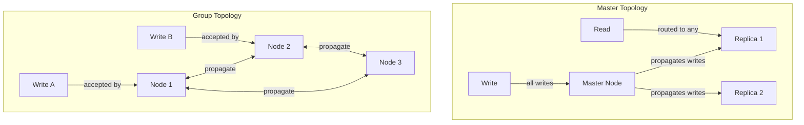

# Database Internals: Master and Group Replication

Replication architectures are defined by two independent axes: **timing** ([[Synchronous Replication]] vs [[Asynchronous Replication]]) and **topology** (Master vs Group). This file focuses on the **topology** axis, which determines *who* is allowed to originate a write transaction.

## Master Replication (Single-Master)

In a Master topology, all write transactions must go through a single designated node (the master). The master establishes a strict global ordering for all writes. Secondaries (replicas) only receive updates from the master.

### Benefits
- **No Conflict Detection Needed**: Because there is only one writer, transactions are serialized naturally. Replicas never organically diverge from conflicting concurrent writes.
- **Simpler Reasoning**: The master acts as the single authoritative source of truth.

### Challenges
- **Single Point of Failure**: If the master crashes, the system cannot accept writes until a new master is elected (typically via consensus protocols like **Paxos** or **Raft**).
- **Write Bottleneck**: Write throughput is entirely capped by the capacity of the single master node, regardless of how many read replicas are added.
- **Split-Brain Risk**: During a network partition, the system might accidentally elect two masters on opposite sides of the partition. This is typically prevented by requiring **majority consensus** to elect a leader, meaning the minority partition is forced to become completely unavailable to ensure safety.

---

## Group Replication (Multi-Master)

In a Group topology (often called leaderless or multi-master), all nodes are equal peers. *Any* replica can accept a write transaction directly and propagate it to the others.

### Benefits
- **Scalable Write Throughput**: Write load is distributed across all nodes. Adding more nodes horizontally increases total write capacity.
- **High Fault Tolerance**: There is no single point of failure for writes. If one node goes down, any other node can immediately handle its write traffic. No leader election window is required.

### Challenges
- **Concurrency and Conflicts**: Because there is no single authority ordering writes, two different nodes can simultaneously accept conflicting writes to the exact same object. The system *must* have a mechanism to either prevent or resolve these concurrent conflicts.

---

## How Timing Applies to Topology

The architectural differences between Master and Group dictate how the system handles synchronization along the timing axis:

### Applying Timing to Master Topologies
Since Master topologies naturally prevent write conflicts but suffer from a single point of failure, the choice of timing determines how safe the data is when the master crashes:
- **[[Synchronous Replication#Synchronous Master Replication|Synchronous Master]]**: The master runs [[Database Internals/Distributed Systems/Two-Phase Commit|2PC]] to force all replicas to apply the update before committing. This prevents data loss on a crash, but makes the master's write bottleneck even slower.
- **[[Asynchronous Replication#Asynchronous Master Replication (Single Master)|Asynchronous Master]]**: The master commits locally immediately and uses **log shipping** to update replicas in the background. It is much faster, but risks permanently losing recent transactions if the master crashes before shipping its logs.

### Applying Timing to Group Topologies
Since Group topologies naturally scale writes but guarantee concurrent conflicts, the choice of timing determines *when* and *how* those conflicts are handled:
- **[[Synchronous Replication#Synchronous Group Replication|Synchronous Group]]**: Uses **quorum locking** (e.g., locking $x > n/2$ nodes) to prevent conflicts *before* they happen. Conflicting writes cannot simultaneously acquire the necessary majority of locks, preventing divergence at the cost of high coordination overhead.
- **[[Asynchronous Replication#Asynchronous Group Replication (Multi-Master)|Asynchronous Group]]**: Allows conflicts to happen by committing locally immediately. Relies on **conflict reconciliation techniques** (like Last-Write-Wins or site priority) to fix the resulting divergence *after* the fact.

## Related

- [[Database Internals/Distributed Systems/Replication|Replication]] — parent hub with the 2x2 taxonomy
- [[Synchronous Replication]] — eager timing
- [[Asynchronous Replication]] — lazy timing

## Industry Standard Terms

- **Master** → Primary / Leader
- **Group** → Multi-Master / Leaderless / Dynamo-style
- **Split-Brain** → Network Partition / Divergence
