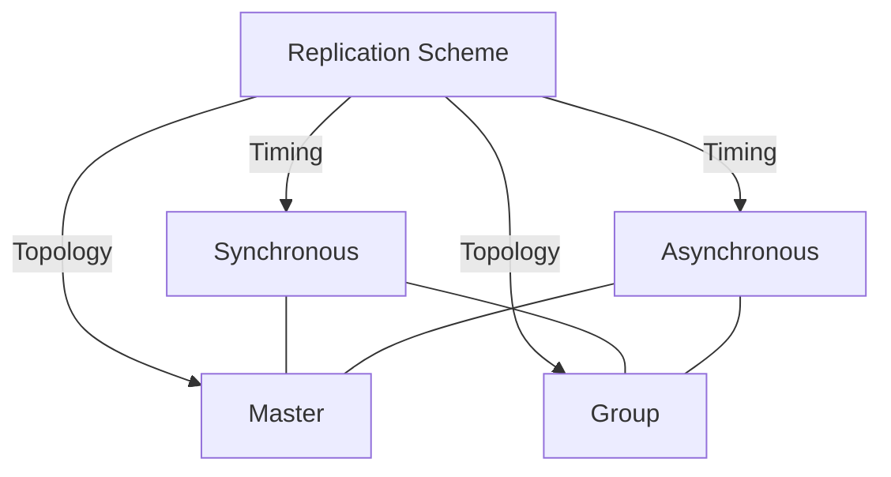
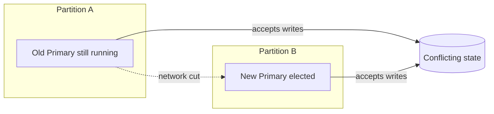

# CSE444: Replication

**Replication** means every node holds a full copy of the database. Where [[Database Internals/Replication and Distribution/Distributed Databases|sharding]] splits a dataset *across* machines to scale writes, replication *duplicates* the same data on many machines, primarily to improve **availability**: if one node dies, another already has the data and can keep serving requests.

## Goals and Design Tension

Replication tries to satisfy three goals that are fundamentally in tension:

1. **Consistency**: transactions see a transactionally-consistent view and always read the latest update.
2. **Availability**: every request gets a response, even if that response is stale.
3. **Performance**: fast reads and writes.

You cannot maximize all three at once. The traditional **relational model** assumes a single, strongly-consistent copy and cannot easily absorb very large traffic. **noSQL** systems are built as distributed databases (combining replication and partitioning) and deliberately **give up strong consistency** in favor of availability and performance. The default assumption remains **strong consistency** — it is the standard requirement unless we *absolutely* need the higher performance and availability that weaker models buy. The remaining sections are essentially different points on this trade-off curve.

## The Two Axes: A Taxonomy

Replication strategies vary along **two independent axes** that can be combined freely. One axis controls *when* updates reach the other replicas (timing); the other controls *who* is allowed to originate a write (topology).

**Timing axis:**
- **Synchronous**: all updates are applied to all replicas (or a majority) *before* the transaction is allowed to continue.
- **Asynchronous**: the transaction may continue *before* all updates have been applied elsewhere.

**Topology axis:**
- **Master**: all transactions for an object go through a single designated node (the master).
- **Group**: all nodes are equal peers — any node can accept a transaction and inform the others afterward.

Combining the two axes yields four schemes: **Synchronous Master**, **Synchronous Group**, **Asynchronous Master**, and **Asynchronous Group**. The rest of this note walks through each.

## Synchronous (Eager) Replication

Also called **eager replication**. All updates are applied to all replicas (or a majority) *as part of a single transaction*, which requires running **[[Database Internals/Distributed Systems/Two-Phase Commit|Two-Phase Commit (2PC)]]** at commit time so every replica agrees to commit together.

- Transactions must acquire **global locks**: nobody can read a replica while we are still synchronizing the copies, otherwise a reader could observe an inconsistent intermediate state.
- The main goal is to behave **as if there were only one copy** of the database: maintain consistency and **one-copy serializability** — the execution of transactions has the same effect as an execution on a single non-replicated database.

![[Screenshots/Synchronous Replication.png]]

### Synchronous Master Replication

One **master** holds the *primary copy* of each object (also called the **primary**, as in *primary-backup*).
- To update an object, a transaction must acquire a lock **at the master**. Because that single master serializes all writers, its lock acts as the **global lock** for the object.
- The master then propagates updates to the replicas **synchronously**, as part of the *same* distributed transaction, so it must run **2PC** at the end before the transaction can commit.

![[Screenshots/Synchronous Master Replication.png]]

#### Crash Failures

Because the master is a single point through which all writes flow, what happens on failure depends on *who* fails:

- **A secondary crashes**: nothing happens to the system as a whole. When the secondary recovers, it simply catches up.
- **The master fails**: we cannot just block waiting for it — blocking would hurt availability. The system must **choose a new primary** by running a leader **election** (e.g., **Paxos** or **Raft**).
- **Network failure (the dangerous case)**: the secondaries *think* the primary has failed and elect a new primary — but the original primary may still be running on the other side of the partition. Now there are **two primaries** accepting writes (a "split-brain"), which breaks one-copy serializability.

#### Majority Consensus

To avoid the two-primaries problem, only the **majority partition** is allowed to continue processing at any given time.

- Whenever a replica fails or recovers, the set of communicating replicas must determine whether they form a **majority** before they continue.
- A **majority** is required because any two majorities are guaranteed to **overlap in at least one node**. That shared node prevents two disjoint groups from both believing they are in charge.

### Synchronous Group Replication

A **master-less** scheme: any node can initiate a transaction, so each copy maintains **its own lock** rather than deferring to a single master.

To preserve correctness without a master, locks must be acquired on enough copies to form a **quorum**. With $n$ copies:
- An exclusive lock on $x$ copies counts as a **global exclusive lock**.
- A shared lock on $s$ copies counts as a **global shared lock**.
- The quorum rules are $x > n/2$ and $s + x > n$:
  - $x > n/2$ guarantees that two writers always **overlap** on at least one copy, so two conflicting writes can never both succeed.
  - $s + x > n$ guarantees a reader overlaps with every writer, so a read is always aware of any outstanding write lock.
- **Version numbers** are attached to each copy so a reader can identify which overlapping copy holds the *current* value.

There are two notable ways to set the quorum sizes:

- **Majority locking**: $s = x = \lceil (n + 1) / 2 \rceil$. Reads and writes are treated equally. This is usually *not* attractive because it slows reads down to majority cost.
- **Read-locks-one, write-locks-all**: $s = 1$ and $x = n$. This gives very high read performance (a read only needs one copy) at the cost of expensive writes; here a write is effectively the majority since it touches everything.

![[Screenshots/Synchronous Group Replication.png]]

#### Outcomes and Trade-offs

- **Favors consistency over availability**: only the majority partition can process requests, and to the outside world there appears to be a **single copy** of the database.
- **High runtime overhead**:
  - must lock and update at least a majority of replicas,
  - requires **two-phase commit**,
  - runs at the pace of the **slowest replica in the quorum**, so the overall system is now slower,
  - higher **deadlock rate**, because transactions hold their locks longer.

## Asynchronous (Lazy) Replication

Also called **lazy replication** or **optimistic replication**. Its main goal is **availability and performance** — the inverse priority of the synchronous schemes above.

- One replica is updated by the original transaction, which commits **immediately**.
- The updates then propagate **asynchronously** to the other replicas afterward.

Because the transaction does not wait, readers on other replicas may temporarily see stale data — the price paid for speed and availability.

![[Screenshots/Async Replication.png]]

### Asynchronous Master Replication (Single Master)

One **master** holds the primary copy. All transactions update the **master only** and commit there immediately. The master **asynchronously** propagates updates to the replicas, which apply them in the **same order** to preserve **single-copy serializability** on the replicas.

Because there is only one writer, **no conflict detection is needed** — replicas simply replay the master's history. This gives single-master async the best correctness story within the lazy family.

The propagation mechanism is **log shipping**: the master runs the transaction normally, then ships its log to the replicas so each replica can reconstruct exactly what the master's log looks like.

#### Log Shipping

Log shipping is the general technique for keeping replicas (often **hot stand-by** databases) current:

- A master operates on a database that must be replicated to one or several replicas.
- The master **ships the tail of its log** to the replicas — specifically when it flushes that log tail to disk.
- The replicas **REDO** the shipped log to apply the changes. This is correct but **very slow**, since replaying is serial.
- It requires **very little extra development**: the master already produces the log anyway, and a [[Database Internals/Transactions/RecoveryComponents/LoggingComponents/Redo Logging|REDO]] function already exists for crash recovery.
- The main complication is the need to **"remove" the updates of still-active transactions**, since those transactions may later abort.

#### On Master Failure

- The system can **lose the most recent transactions**, because those updates may not have reached any replica before the master died.
- After electing a new primary, the secondaries must first **agree on who is most up-to-date** to minimize how much is lost.

### Asynchronous Group Replication (Multi-Master)

Also called **multi-master replication**. Every node is a peer and any node can accept a write transaction directly — there is no single designated primary.

This is the **best scheme for availability**: no single node is a bottleneck, and the system can absorb writes even during a network partition. The cost is the weakest correctness guarantees of all four schemes:

- It **cannot guarantee one-copy serializability**.
- It provides only **eventual consistency**.
- Because any node can write to the same object concurrently, the system **will encounter conflicts** and must detect and reconcile divergent replica states after the fact.

**Reconciliation techniques:**
- **Most recent timestamp wins (Last-Write-Wins)** — the simplest rule, with the best performance and availability.
- **Site A wins over site B** — a fixed priority between sites.
- Also possible: **user-defined rules**, or even **manual** reconciliation.

![[Screenshots/Async Group Replication Detecting Conflicts Using Timestamps.png]]

### Benefits and Challenges of Asynchronous Replication

Now that both async schemes are defined, here is how they compare against synchronous replication as a class.

**Benefits:**
- **Higher availability**: a transaction does not need to wait for remote replicas — it commits as soon as the local copy is updated, so the system remains responsive even when replicas are slow or temporarily unreachable.
- **Better performance**: no 2PC round-trip, no global lock acquisition across replicas, and no waiting on the slowest node in a quorum. Latency is essentially local.
- **Lower deadlock rate**: locks are not held across the network waiting for remote acknowledgment, so the window for lock conflicts shrinks dramatically.
- **Tolerance for network partitions**: replicas are not in the critical path of the transaction, so a partition merely delays propagation rather than blocking commits entirely.

**Challenges:**
- **Stale reads**: a client reading from a non-primary replica may observe data that has not yet received the latest updates — **eventual consistency** rather than strong consistency.
- **Risk of data loss**: if the node that just committed crashes before propagating its log, those transactions are lost permanently.
- **Conflict detection and reconciliation** (multi-master only): when multiple nodes accept concurrent writes to the same object, the system must detect the conflict after the fact and apply a reconciliation policy. There is no general solution — the right answer depends on the application.
- **Ordering guarantees**: replicas must apply updates in the same order as the primary (single-master) or agree on a global order (multi-master), which adds bookkeeping complexity even without 2PC.

### Comparison: Single Master vs. Multi-Master (Async)

| Property | Async Single Master | Async Multi-Master |
|---|---|---|
| Who can write | Only the master | Any node |
| Conflict detection needed | No | Yes |
| Consistency guarantee | Single-copy serializable (on replicas) | Eventual consistency only |
| Availability on master failure | Must elect new primary | No election needed |
| Write throughput | Bottlenecked by single master | Horizontally scalable |
| Reconciliation complexity | None | High |

---

## Formal Analysis

### Formal Definition (Quorum Intersection)

For **Synchronous Group Replication** with $n$ copies, a read quorum of size $s$ and a write quorum of size $x$ are correct if and only if:

$$x > \frac{n}{2} \qquad \text{and} \qquad s + x > n$$

The first condition makes any two write quorums intersect ($2x > n$); the second makes every read quorum intersect every write quorum. **Majority locking** sets $s = x = \lceil (n+1)/2 \rceil$. **Read-locks-one, write-locks-all** sets $s = 1,\ x = n$.

### Simplified Explanation

If two write groups must always share at least one member, they can never both think they hold the lock — so you can't have two conflicting writes win at the same time. And if every read group shares a member with every write group, a reader will always bump into the latest write instead of missing it. Make reads cheap and writes expensive, or split the cost evenly — but the groups must always overlap.

---

## Industry Standard Terms

- **Synchronous / eager replication** → Strong consistency / synchronous commit
- **Asynchronous / lazy replication** → Eventual consistency / async commit
- **Master** → Primary / Leader
- **Group (master-less)** → Multi-master / Leaderless replication (e.g., Dynamo-style quorums)
- **Secondary** → Replica / Follower / Standby
- **Log shipping** → WAL streaming / Binlog replication
- **Most recent timestamp wins** → Last-Write-Wins (LWW)

## Related

- [[Database Internals/Distributed Systems/Two-Phase Commit|Two-Phase Commit (2PC)]] — the commit protocol that synchronous replication depends on
- [[Database Internals/Replication and Distribution/Distributed Databases|Distributed Databases]] — sharding and partitioning, the complementary scaling axis
- [[Database Internals/Transactions/RecoveryComponents/LoggingComponents/Redo Logging|Redo Logging]] — the REDO mechanism reused by log shipping
- [[Database Internals/Transactions/PessimisticComponents/Two-Phase Locking (2PL)|Two-Phase Locking (2PL)]] — the global locking discipline used across replaces

**Source**: CSE 444 Lecture Notes
