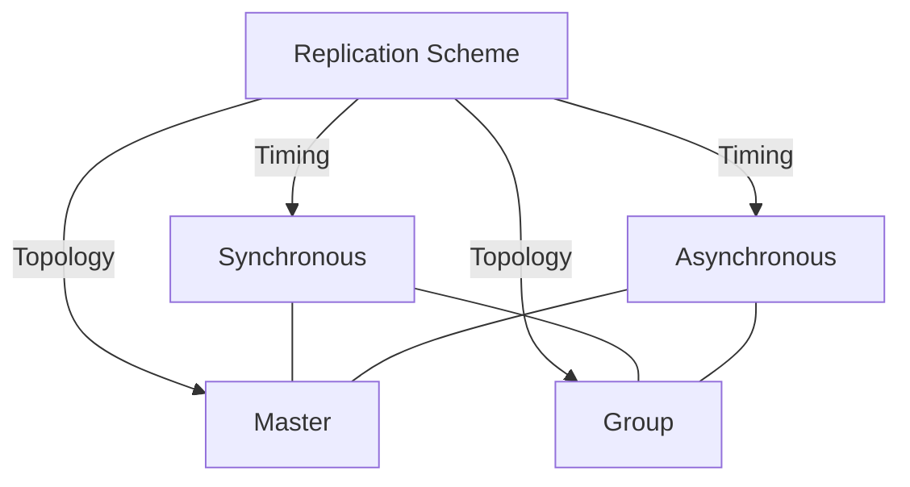

# Database Internals: Replication

**Replication** means every node holds a full copy of the database. Where [[Database Internals/Replication and Distribution/Distributed Databases|sharding]] splits a dataset *across* machines to scale writes, replication *duplicates* the same data on many machines, primarily to improve **availability**: if one node dies, another already has the data and can keep serving requests.

## Goals and Design Tension

Replication tries to satisfy three goals that are fundamentally in tension:

1. **Consistency**: **write transactions** (inserts, updates, deletes) are propagated to all replicas so that reads always return the latest committed data. Read-only queries are never replicated — they are simply routed to whichever replica is appropriate.
2. **Availability**: every request gets a response, even if that response is stale.
3. **Performance**: fast reads and writes.

You cannot maximize all three at once. The traditional **relational model** assumes a single, strongly-consistent copy and cannot easily absorb very large traffic. **noSQL** systems are built as distributed databases (combining replication and partitioning) and deliberately **give up strong consistency** in favor of availability and performance. The default assumption remains **strong consistency** — it is the standard requirement unless we *absolutely* need the higher performance and availability that weaker models buy.

## The Two Axes: A Taxonomy

Replication strategies vary along **two independent axes** that can be combined freely. 

1. **The Timing Axis**: Controls *when* updates reach the other replicas.
   - **[[Synchronous Replication|Synchronous (eager)]]**: all updates are applied to all replicas (or a majority) *before* the transaction is allowed to continue.
   - **[[Asynchronous Replication|Asynchronous (lazy)]]**: the transaction may continue *before* all updates have been applied elsewhere.
2. **The Topology Axis**: Controls *who* is allowed to originate a write.
   - **[[Master and Group Replication#Master Replication (Single-Master)\|Master]]**: all **write** transactions for an object go through a single designated node (the master). Reads may be routed to any replica.
   - **[[Master and Group Replication#Group Replication (Multi-Master)\|Group]]**: all nodes are equal peers — any node can accept a **write** transaction and propagate it to the others afterward.

Combining the two axes yields four concrete architectures:

| Scheme | Timing | Topology | Handling |
|---|---|---|---|
| **Synchronous Master** | Eager | Single master | 2PC + single global lock. Paxos on failure. |
| **Synchronous Group** | Eager | Any node | 2PC + quorum locking ($x > n/2$). |
| **Asynchronous Master** | Lazy | Single master | Immediate commit + background log shipping. |
| **Asynchronous Group** | Lazy | Any node | Immediate commit + background conflict reconciliation. |

## Subtopics

- [[Master and Group Replication]] — details the topology differences (write bottlenecks vs scaling, single point of failure vs conflicts)
- [[Synchronous Replication]] — eager replication mechanics (2PC, master locks, group quorums)
- [[Asynchronous Replication]] — lazy replication mechanics (log shipping, staleness, group conflict reconciliation)

## Related

- [[Database Internals/Distributed Systems/Two-Phase Commit|Two-Phase Commit (2PC)]] — the commit protocol that synchronous replication depends on
- [[Database Internals/Replication and Distribution/Distributed Databases|Distributed Databases]] — sharding and partitioning, the complementary scaling axis

## Industry Standard Terms

- **Replication** → Data Duplication / Mirroring
- **Synchronous** → Eager / Strong Consistency
- **Asynchronous** → Lazy / Eventual Consistency
- **Master** → Primary / Leader
- **Group** → Multi-Master / Leaderless

**Source**: CSE 444 Lecture Notes
