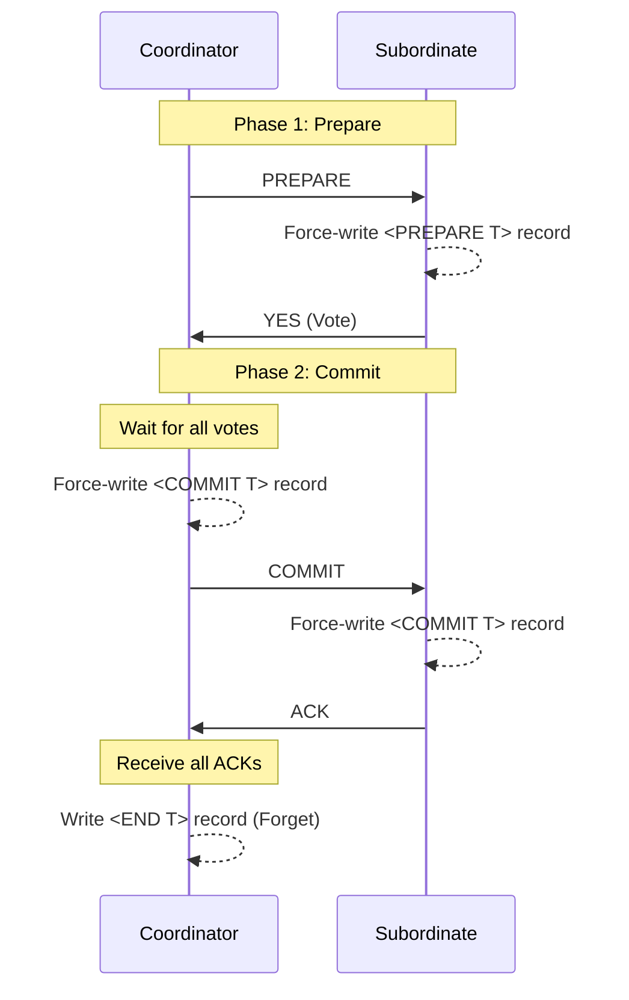
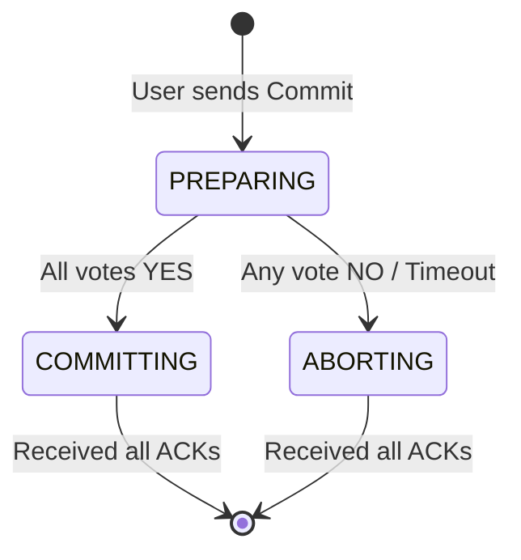
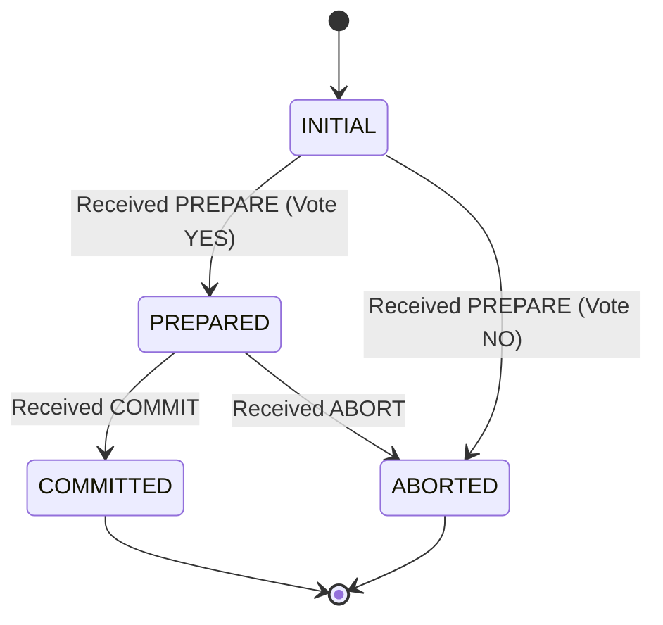

# CSE444: Two-Phase Commit

Scaling a Database Management System (DBMS) involves balancing the need for higher throughput and availability against the complexity of maintaining **ACID** properties across multiple nodes.

## Scaling Strategies

### Replication
**Replication** increases read throughput and provides high availability by creating multiple copies of each database partition.
- **Mechanism**: Queries are spread across replicas.
- **Trade-off**: While reads are easily scaled, writes become expensive as they must be propagated to all replicas to maintain consistency.

### Partitioning (Sharding)
To scale write throughput, the database must be **partitioned** across multiple servers.
- **Mechanism**: The dataset is split into shards. If a transaction touches only one machine, performance is high.
- **Challenge**: If a transaction involves multiple machines, coordination becomes significantly more expensive, requiring protocols like **Two-Phase Commit (2PC)**.

![[Screenshots/2PC how to scale.png]]

## Distributed Transactions

### Concurrency Control
In distributed systems, **[[Database Internals/Transactions/PessimisticComponents/Two-Phase Locking (2PL)|Two-Phase Locking (2PL)]]** is the standard approach in practice.
- **Mechanism**: Locks are held simultaneously at all involved sites.
- **Deadlock Detection**: 
	- **Global Wait-For Graphs**: Theoretically possible but practically difficult due to communication overhead.
	- **Timeouts**: The practical standard; abort the least costly transaction if a timeout occurs.

### Failure Control (Atomicity)
Transactions must be atomic across all sites: either all sites commit or none do, regardless of failures. **Two-Phase Commit (2PC)** is the standard protocol to guarantee this property.

---

## Two-Phase Commit (2PC)

**Two-Phase Commit (2PC)** is a consensus protocol used to ensure that all participants in a distributed transaction agree on whether to **Commit** or **Abort**.

### Roles
- **Coordinator**: The node managing the transaction. It communicates with the user and orchestrates the decision.
- **Subordinates** (or Participants): The nodes where the actual data resides and the transaction operations are performed.

![[Screenshots/2PC motivation.png]]

### Phase 1: Prepare
The **Coordinator** polls all **Subordinates** to determine if they are ready and willing to commit the transaction.
1. Coordinator sends `PREPARE` message to all subordinates.
2. Subordinate receives `PREPARE`, ensures it can commit (e.g., locks are held, no disk errors).
3. Subordinate **force-writes** a `<PREPARE T>` record to its log.
4. Subordinate responds with `YES` or `NO` (Abort).

### Phase 2: Commit / Abort
Based on the votes in Phase 1, the **Coordinator** decides the final outcome.
1. If **all** subordinates voted `YES`, the Coordinator **force-writes** a `<COMMIT T>` record.
2. If **any** subordinate voted `NO` or timed out, the Coordinator **force-writes** an `<ABORT T>` record.
3. Coordinator sends the decision (`COMMIT` or `ABORT`) to all subordinates.
4. Subordinates **force-write** the decision (`<COMMIT T>` or `<ABORT T>`) to their log and send an **Acknowledgment (ACK)**.
5. Once the Coordinator receives all **ACKs**, it writes an `<END T>` record and can "forget" the transaction.

### Protocol Flow

---

## Handling Failures

### Site Failures & Timeouts
It is often impossible to distinguish between a failed node and a slow network.
- **Subordinate Timeout**: If a subordinate times out waiting for a `PREPARE` message, it can unilaterally **Abort**. However, if it has already voted `YES` and is waiting for the decision, it is **blocked**.
- **Coordinator Timeout**: If the coordinator times out while collecting votes, it must **Abort** the transaction (to be safe).

### The Blocking Problem
2PC is a **Blocking Protocol**. If the coordinator fails after a subordinate has voted `YES` but before the decision is delivered, the subordinate cannot proceed. It must hold all locks and wait for the coordinator to recover, which can cripple system throughput.

### Recovery Logic
During recovery, a node scans its log to determine the state of active transactions:
- **Last Record is `<COMMIT T>`**: The transaction is committed. Perform **REDO**.
- **Last Record is `<ABORT T>`**: The transaction is aborted. Perform **UNDO**.
- **No `<PREPARE, COMMIT, ABORT>`**: Presume **ABORT**. If no prepare was seen, the node couldn't have voted yes.
- **Last Record is `<PREPARE T>`**: The node is in a "doubt" state. It must re-contact the coordinator (or other subordinates) to determine the final outcome.

---

## State Machines

### Coordinator State Machine
![[Screenshots/Coordinator State Machine.png]]

### Subordinate State Machine
![[Screenshots/Subordinate State Machine.png]]

---

## Optimizations

### Presumed Abort Protocol
To reduce message overhead and disk I/O:
- **Principle**: If no information is found in the log about a transaction, assume it was **Aborted**.
- **Outcome**: Aborting transactions do not require force-writing log records or receiving ACKs. This significantly improves performance for failed transactions.

### Read-Only Transactions
- **Mechanism**: If a subordinate only performed reads, it responds to the `PREPARE` message with a `READ` vote instead of `YES`.
- **Optimization**: The subordinate can immediately release locks and forget the transaction. It does not need to participate in Phase 2.

---

## Protocol Specification

### Formal Definition

**Phase 1 (Prepare Phase):**
1. **Coordinator** $\to$ **Subordinates**: `PREPARE`
2. **Subordinate** responds with $V_i \in \{\text{YES}, \text{NO}\}$. If $V_i = \text{YES}$, it must force-write `<PREPARE T>`.

**Phase 2 (Commit Phase):**
1. **Coordinator** decides $D = \text{COMMIT}$ iff $\forall i, V_i = \text{YES}$; else $D = \text{ABORT}$.
2. **Coordinator** force-writes $\langle D, T \rangle$ and sends $D$ to all subordinates.
3. **Subordinate** force-writes $\langle D, T \rangle$ and responds with `ACK`.
4. **Coordinator** writes `<END T>` after receiving all `ACK`s.

### Simplified Explanation

The **Coordinator** acts as a central leader. In Phase 1, it asks everyone for a vote. If everyone says "Yes," the leader records the decision and tells everyone to commit in Phase 2. If anyone says "No" or fails to respond, the leader tells everyone to abort. The use of persistent logs ensures that even if nodes crash, they can recover and fulfill their commitment to the final decision.

---

## Industry Standard Terms
- **Coordinator** → Transaction Manager / Control Plane
- **Subordinate** → Participant / Resource Manager / Data Plane
- **Force-write** → Fsync / Flush to stable storage
- **Presumed Abort** → Default-to-rollback behavior

## Related
- [[Distributed Systems/Sharding/Transactions|CSE452: Transactions (2PC)]] — Detailed 2PC components in Distributed Systems course
- [[Database Internals/Transactions/PessimisticComponents/Two-Phase Locking (2PL)|Two-Phase Locking (2PL)]]
- [[Database Internals/Transactions/Transaction Fundamentals|Transaction Fundamentals]]
- [[Distributed Systems/Paxos/Paxos|Paxos]] — A non-blocking alternative for consensus

**Source**: CSE 444 Lecture Notes / OSTEP Chapter 48: Distributed Systems
