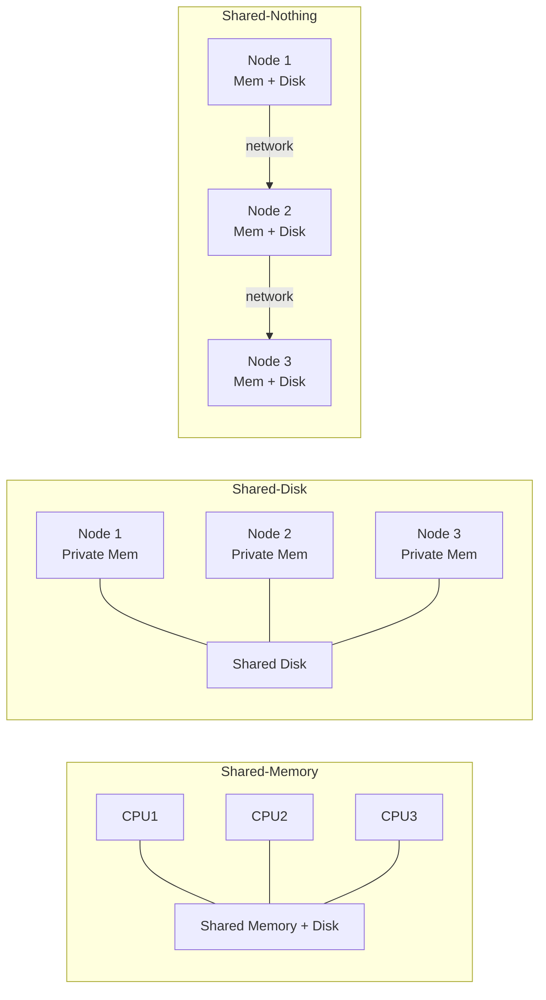

# Parallel: Intro to Parallel DBMS

Modern applications separate web servers, application servers, and the database tier. When load increases, we need to handle more connections without degrading performance — but the three tiers scale very differently.

- **Web servers** and **application servers** can be replicated easily: each client gets its own server instance, and a load balancer distributes traffic.
- **The database server cannot be replicated easily**, because the database represents a single, consistent source of truth. Simply adding copies introduces consistency problems.
  - Performance does not scale linearly as the database grows.
  - Query latency becomes the bottleneck.
- We need to design ways to scale the DBMS itself through parallelism.

---

## Building a Parallel DBMS

There are two distinct scaling goals that motivate parallel database design, corresponding to two different workload types.

### Scaling Transactions Per Second — OLTP

**Online Transaction Processing (OLTP)** workloads are characterized by high volumes of short, concurrent read/write transactions (e.g., bank transfers, e-commerce orders).

- The goal is to increase **transaction throughput** (transactions per second).
- Scaling requires distributing the transaction load across many nodes.

### Scaling Single-Query Response Time — OLAP

**Online Analytical Processing (OLAP)** workloads are characterized by complex queries that scan large portions of the dataset (e.g., business intelligence, reporting).

- The entire parallel system works together to answer one query.
- The goal is to improve **query latency** (response time) for a single large query.
- The primary use case is analysis of massive datasets.

### Big Data Considerations

Relational databases parallelize well through two primary mechanisms:
1. **[[Data Partitioning Schemes|Data Partitioning]]**: Distributing rows across nodes.
2. **[[Database Internals/Parallel/Parallel Query Execution|Parallel Query Processing]]**: Executing query operators concurrently.

The challenge breaks down into two regimes:

| Regime | Analytics Type | Status |
|---|---|---|
| Big volumes, small analytics | OLAP queries: joins, GROUP BY, aggregates | Handled well by today's RDBMSs |
| Big volumes, large analytics | Machine Learning, click prediction, topic modeling | Requires innovation beyond SQL |

---

## Architecture

Three hardware architectures define the design space for parallel database systems, making different trade-offs between cost, scalability, and complexity.

### Shared-Memory Architecture

All processors share a single main memory and disk subsystem.

- **Pros**: Easiest to implement — the DBMS uses standard concurrency primitives (locks, latches).
- **Cons**: Memory bus and interconnect become bottlenecks; expensive to scale beyond a certain size.

![[Shared Memory Architecture.png]]

### Shared-Disk Architecture

Each processor has its own private memory, but all processors share a common disk (or storage array).

- **Pros**: No memory contention across nodes; high availability because any node can access any data on disk.
- **Cons**: Still expensive; the shared disk (SAN/NAS) can become a bottleneck under heavy I/O.

![[Shared Disk Architecture.png]]

### Shared-Nothing Architecture

Each node has its own private memory and private disk. Nodes communicate exclusively over a network.

- **Pros**: Uses cheap commodity hardware; no contention for memory or disk; theoretically scales to an unlimited number of nodes.
- **Cons**: Hardest to implement — the DBMS must manage all data distribution, routing, and fault tolerance explicitly.

![[Shared-Nothing Architecture.png]]

---

## Shared-Nothing Execution Basics

In a shared-nothing cluster, multiple DBMS instances (processes) — also called **nodes** — run on separate machines. The system assigns one of two roles to each node:

- **Coordinator**: The node the user connects to. It parses, plans, and distributes work.
- **Worker**: Executes the portions of the query plan assigned by the coordinator.

Workers execute queries under the following rules:
- Typically, all workers execute the same query plan but on different data partitions.
- Workers can execute multiple queries simultaneously.

The central design question is: **where does each row of data live?** The answer is determined by the [[Data Partitioning Schemes|Data Partitioning Schemes]].

---

## Related

- [[Transaction Fundamentals|Transaction Fundamentals]] — background on concurrency and consistency
- [[Data Partitioning Schemes|Data Partitioning Schemes]] — how data is distributed in shared-nothing clusters
- [[Database Internals/Parallel/Parallel Query Execution|Parallel Query Execution]] — how operators are executed in parallel
- [[Distributed Databases|Distributed Databases]] — deeper treatment of distributed architectures

---

## Industry Standard Terms

| Course Term | Industry / Real-World Equivalent |
|---|---|
| Shared-Nothing Architecture | Massively Parallel Processing (MPP); Apache Spark, Amazon Redshift |
| Shared-Disk Architecture | Shared storage cluster; Oracle RAC, Azure Synapse |
| Shared-Memory Architecture | SMP (Symmetric Multiprocessing); Vertical scaling |
| Coordinator Node | Query coordinator / Driver node / Master node |
| Worker Node | Executor node / Compute node |
| OLTP | Online Transaction Processing — high-frequency read/write |
| OLAP | Online Analytical Processing — complex analytical queries |
