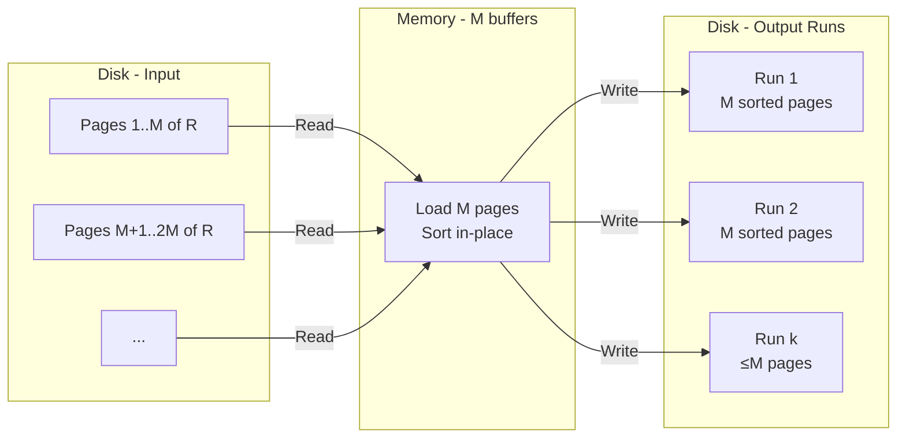

# Database Internals: External Merge-Sort — Phase 1: Run Generation

**Goal**: Break relation $R$ into sorted chunks that each fit in memory. Each chunk is called a **run** and is written to disk as a contiguous file.

## Memory Layout

All $M$ buffer pages are used as input — the entire buffer pool is loaded with data from $R$ and sorted in-place. There is no output buffer needed during this phase because the sorted result is the full set of $M$ pages already in memory, which is flushed directly to disk as a unit.

## Algorithm

Steps (repeated until all of $R$ is processed):

1. Read the next $M$ pages of $R$ from disk into the $M$ buffer frames.
2. Sort all tuples across those $M$ pages entirely in memory (e.g., quicksort).
3. Write the resulting sorted run (all $M$ pages) back to disk as a new file.

## After Phase 1

- Each run occupies exactly $M$ pages on disk (except possibly the last run, which may be shorter if $B(R)$ is not a multiple of $M$).
- Total runs produced: $\lceil B(R) / M \rceil$.
- **Cost**: read $B(R)$ + write $B(R)$ = $2B(R)$ I/Os.

![[External Merge-Sort step 1.png]]

---

## Industry Standard Terms

| Course Term | Industry / Standard Equivalent |
|---|---|
| Run | Sorted run / initial sorted sequence |
| Phase 1 | Sort phase / run formation phase |

## Related

- [[Database Internals/Query Evaluation/ExternalMergeSortComponents/Overview|Overview & Terminology]]
- [[Database Internals/Query Evaluation/ExternalMergeSortComponents/Phase 2 - Merging Runs|Phase 2: Merging Runs]]
