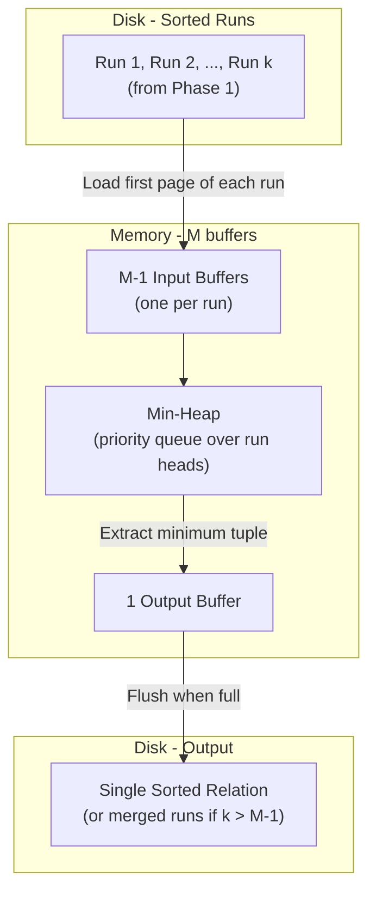

# Database Internals: External Merge-Sort — Phase 2: Merging Runs

**Goal**: Merge all the sorted runs produced in Phase 1 into one fully sorted output.

## Memory Layout

- **$M-1$ input buffer pages**: one slot per run, so at most $M-1$ runs can be merged at once.
- **1 output buffer page**: accumulates sorted tuples before flushing to disk.

This layout is a constraint: no matter how many runs exist on disk, only $M-1$ can be merged simultaneously. This drives the need for multiple passes when there are more than $M-1$ runs.

## Algorithm

1. Load the **first page** of each run into its dedicated input buffer.
2. Use a **min-heap (priority queue)** over the front tuple of each input buffer to find the globally smallest tuple.
3. Move the minimum tuple to the output buffer.
4. Advance the pointer in that run's input buffer.
5. If an input buffer page is exhausted, load the **next page of that run** from disk into the same buffer slot.
6. If the output buffer is full, flush it to disk.
7. Repeat until all input runs are fully consumed.

**Result**: merged runs of length $M(M-1) \approx M^2$ pages.

## How Many Runs Fit?

Phase 2 can hold at most $M-1$ input buffers at once. For a single merge pass to fully sort the relation:

$$\lceil B(R)/M \rceil \leq M-1 \implies B(R) \leq M(M-1) \approx M^2$$

**If $\lceil B(R)/M \rceil \leq M-1$** (i.e., $B(R) \leq M^2$): all runs fit into the $M-1$ input buffers simultaneously — the entire relation is sorted in a single merge pass.

## Reducing Run Count (Multiple Passes)

If $\lceil B(R)/M \rceil > M-1$, not all runs fit in memory at once, so Phase 2 can only **reduce the run count**, not fully sort the relation. The strategy is to process runs in **batches of $M-1$**:

- Batch 1: load runs 1 through $M-1$ → merge into one larger run → write to disk.
- Batch 2: load runs $M$ through $2(M-1)$ → merge into one larger run → write to disk.
- Continue until all runs are processed.

After one such intermediate pass:
- Run count shrinks from $\lceil B(R)/M \rceil$ down to $\lceil B(R) / M(M-1) \rceil$.
- Each run is now $M(M-1)$ pages long instead of $M$.
- The data has been fully read and rewritten, but is **still not a single sorted output** — more passes are needed.
- Each additional pass costs $2B(R)$ I/Os (read all data + write all data) and shrinks the run count by a factor of $M-1$.
- Repeat until $\leq M-1$ runs remain, at which point the final pass produces a single sorted output.

**Number of merge passes** needed to reduce to 1 run:

$$\text{merge passes} = \lceil \log_{M-1}(\lceil B(R)/M \rceil) \rceil$$

![[External Merge Sort phase 2.png]]

### Example

![[External Merge-Sort phase 2 example.png]]

---

## Industry Standard Terms

| Course Term | Industry / Standard Equivalent |
|---|---|
| Phase 2 | Merge phase |
| Min-heap | Priority queue / tournament tree |
| Intermediate merge pass | Intermediate sort pass |

## Related

- [[Database Internals/Query Evaluation/ExternalMergeSortComponents/Phase 1 - Run Generation|Phase 1: Run Generation]]
- [[Database Internals/Query Evaluation/ExternalMergeSortComponents/Sort-Merge Join Integration|Sort-Merge Join Integration]]
- [[Database Internals/Query Evaluation/ExternalMergeSortComponents/Worked Example|Worked Example]]
