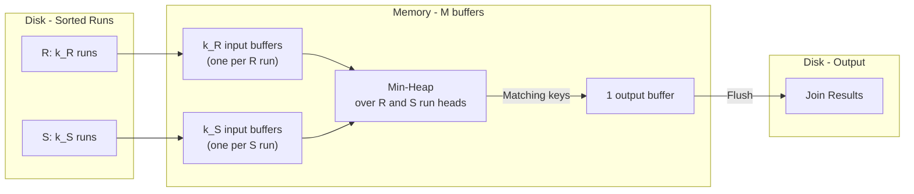

# Database Internals: External Merge-Sort — Sort-Merge Join Integration

When used for sort-merge join, external merge-sort runs on both $R$ and $S$. Rather than fully sorting each relation to disk and then joining, it is more efficient to merge the runs and join **simultaneously** in the final pass. This saves one full write of both sorted relations, reducing the total cost from $5(B(R) + B(S))$ to $3(B(R) + B(S))$.

## Feasibility Constraint

For two-pass sort-merge join to be possible in a single merge+join pass, all run buffers for both relations and one output buffer must fit within $M$ pages:

$$\lceil B(R)/M \rceil + \lceil B(S)/M \rceil \leq M - 1 \quad \approx \quad B(R) + B(S) \leq M^2$$

If this constraint is violated, intermediate merge passes must first reduce the run counts before the merge+join pass becomes feasible. See [[Database Internals/Query Evaluation/ExternalMergeSortComponents/Worked Example|the worked example]] for an illustration of this scenario.

## Step 1: Run Generation

Generate initial sorted runs independently for both $R$ and $S$.

- Load $M$ pages of $R$ → sort in memory → write run to disk; repeat for all of $R$.
- Do the same for $S$.
- **Cost**: $2(B(R) + B(S))$ — 1 full read + 1 full write per relation.

## Step 2: Merge and Join Simultaneously

Instead of writing fully sorted copies of $R$ and $S$ to disk, merge the sorted runs of both relations **while performing the join** in a single pass.

**Memory layout**:
- 1 input buffer page per run of $R$ ($k_R = \lceil B(R)/M \rceil$ buffers).
- 1 input buffer page per run of $S$ ($k_S = \lceil B(S)/M \rceil$ buffers).
- 1 output buffer page for joined results.
- Constraint: $k_R + k_S + 1 \leq M$, i.e., total run buffers $\leq M - 1$.

**Process**:
1. Load the first page of every run (for both $R$ and $S$) into its input buffer.
2. Use a min-heap to find the minimum join-key tuple across all $R$ runs, and separately across all $S$ runs.
3. If the minimum $R$ key equals the minimum $S$ key: emit all matching combinations to the output buffer.
4. Advance the pointer in the run(s) whose minimum key was consumed.
5. When a run buffer is exhausted, load the next page of that run from disk.
6. When the output buffer is full, flush it to disk.

**Cost**: $B(R) + B(S)$ — reads only; output is pipelined and never written as an intermediate file.

## Total Cost for Two-Pass Sort-Merge Join

| Step | I/Os |
|---|---|
| Step 1: run generation | $2(B(R) + B(S))$ |
| Step 2: merge + join pass | $B(R) + B(S)$ |
| **Total** | $\mathbf{3(B(R) + B(S))}$ |

---

## Industry Standard Terms

| Course Term | Industry / Standard Equivalent |
|---|---|
| Merge + Join simultaneously | Pipelined merge join |
| Run | Sorted run / sorted chunk |

## Related

- [[Database Internals/Query Evaluation/ExternalMergeSortComponents/Phase 1 - Run Generation|Phase 1: Run Generation]]
- [[Database Internals/Query Evaluation/ExternalMergeSortComponents/Phase 2 - Merging Runs|Phase 2: Merging Runs]]
- [[Database Internals/Query Evaluation/ExternalMergeSortComponents/Worked Example|Worked Example ($B(R)=1000, B(S)=800, M=11$)]]
- [[Database Internals/Query Evaluation/Sort-Merge Join|Sort-Merge Join]]
