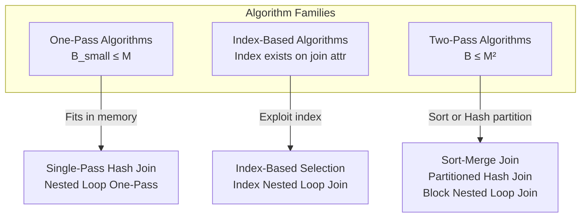

# Database Internals: Operator Algorithms

## Design Criteria

When evaluating the quality of an operator algorithm, three criteria are considered:

- **Cost**: measured in I/O, CPU, and network operations.
  - The cost of reading operands from disk is the primary concern.
  - The cost of writing the final result to disk is *not* included in operator cost estimates — it must be counted separately when applicable.
- **Memory utilization**: how much buffer pool memory the operator requires.
- **Load balance**: for parallel operators, how evenly work is distributed across workers.

## Cost Parameters

For simplicity, **cost** is defined as the total number of I/Os. Reading from memory is free; this is a simplification that ignores CPU and network costs.

The standard parameters used in cost formulas are:

- **$B(R)$**: number of disk blocks (pages) for relation $R$.
  - For a sequential scan, the cost is $B(R)$.
- **$T(R)$**: number of tuples in relation $R$.
- **$V(R, a)$**: number of distinct values of attribute $a$ in relation $R$.
  - When $a$ is a key, $V(R, a) = T(R)$.
  - Otherwise, $V(R, a)$ can be any value $\leq T(R)$.

**$M$** denotes the number of memory buffers (pages) available to the operator.

## Algorithm Families

Join algorithms are classified into three families depending on how many passes over the data they require:

### One-Pass Algorithms

Require one relation to fit entirely in memory (§15.2–15.3):
- [[Database Internals/Query Evaluation/Single-Pass Hash Join|Single-Pass Hash Join]] — build hash table on smaller relation, probe with larger; cost $B(R) + B(S)$ when $B(R) \leq M$.
- **One-Pass Join** (Nested Loop) — cost $B(R) + B(S)$ when $B(R) \leq M$ or $B(S) \leq M$.

### Index-Based Algorithms

Exploit an existing index on one relation to avoid full scans (§15.6):
- [[Database Internals/Query Evaluation/Index-Based Algorithms|Index-Based Selection]] — clustered index costs $B(R)/V(R,a)$; unclustered costs $T(R)/V(R,a)$.
- **Index Nested Loop Join** — cost $B(R) + T(R) \times (\text{cost of index lookup})$.

### Two-Pass Algorithms

Sort or hash-partition the data before joining; handle relations larger than memory (§15.4–15.5):
- [[Database Internals/Query Evaluation/Sort-Merge Join|Sort-Merge Join]] — sort both relations then merge; cost $3(B(R) + B(S))$ when $B(R), B(S) \leq M^2$.
- [[Database Internals/Query Evaluation/Partitioned Hash Algorithms|Partitioned Hash Join]] — partition both relations into buckets, join matching buckets; cost $3(B(R) + B(S))$ when $\min(B(R), B(S)) \leq M^2$.
- [[Database Internals/Query Evaluation/Nested Loop Join|Nested Loop Join]] — block-memory variant; cost $B(R) + B(S) \cdot \lceil B(R)/(M-1) \rceil$.

## Cost Summary Table

| Algorithm | Memory Required | Cost | Notes |
|---|---|---|---|
| One-Pass Hash Join | $B(R) \leq M$ | $B(R) + B(S)$ | Smaller relation fits in memory |
| Nested Loop (Block) | Any | $B(R) + B(S) \cdot \lceil B(R)/(M-1) \rceil$ | Worst case when $M$ is small |
| Index Nested Loop Join | Any | $B(R) + T(R) \times \text{probe cost}$ | Requires index on inner |
| Sort-Merge Join | $B(R), B(S) \leq M^2$ | $3(B(R) + B(S))$ | Good for sorted output |
| Partitioned Hash Join | $\min(B(R), B(S)) \leq M^2$ | $3(B(R) + B(S))$ | Good for equi-joins |

---

## Industry Standard Terms

| Course Term | Industry / Standard Equivalent |
|---|---|
| One-Pass Algorithm | In-memory join |
| Partitioned Hash Join | Grace hash join / hybrid hash join |
| Sort-Merge Join | Merge join |
| Index Nested Loop Join | Index join / lookup join |
| $B(R)$ | Page count / block count |
| $V(R, a)$ | NDV (number of distinct values) |

## Related

- [[Database Internals/Query Evaluation/Query Execution & Algorithms|Query Execution]] — iterator interface, BP-tuples vs. M-tuples
- [[Database Internals/Query Optimization/Query Optimization|Query Optimization]]
