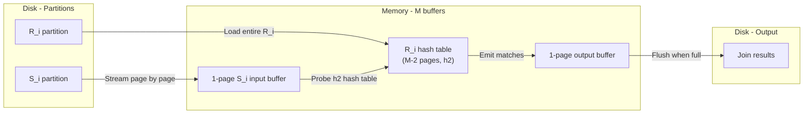

# Database Internals: Partitioned Hash Join — The Algorithm

The algorithm consists of three main steps: partition $S$, partition $R$ using the same hash function, then join each pair of matching buckets.

## Step 1: Hash S into M-1 Buckets and Write to Disk

**Goal**: Split relation $S$ into $k = M-1$ smaller partition files on disk.

**Memory layout**: 1 input buffer page + $M-1$ output buffer pages (one per bucket).

**Process (internal shuffle)**:
1. **Load**: Read one page of $S$ from disk into the 1-page input buffer.
2. **Scan and hash**: Iterate through every tuple in the input buffer and compute $h_1(\text{join\_key})$.
3. **Copy to bin**: Based on the hash result (e.g., result is `3`), copy the tuple from the input buffer into **output buffer \#3** in RAM.
4. **Flush**: When an output buffer reaches the disk page size (e.g., 8 KB), write its contents to the corresponding partition file on disk (e.g., $S_3$) and reset the buffer to empty.
5. **Repeat**: Once the input buffer is fully scanned, load the next page of $S$ until all of $S$ is processed.

The reason for using a single input buffer (rather than multiple) is to maximize the number of output bins: with $M$ total pages, using 1 for input leaves $M-1$ for output bins, which is the maximum possible fan-out.

## Step 2: Hash R into M-1 Buckets and Write to Disk

**Goal**: Split relation $R$ using the **exact same process and hash function ($h_1$)**.

**Result**: Because both $R$ and $S$ use $h_1$, any pair of tuples from $R$ and $S$ with the same join key will land in the same numbered bucket. Therefore, tuples in $R_i$ can only possibly join with tuples in $S_i$ — no cross-bucket comparisons are needed.

## Step 3: Join Each Bucket Pair (Build and Probe)

**Memory layout**: $M-2$ pages for the **build table**, 1 page for the **input (probe) buffer**, 1 page for the **output (result) buffer**.

**Process (the bucket loop)** — for each bucket pair $i$ from $1$ to $M-1$:

1. **Build**: Read the entire partition $R_i$ from disk and construct an in-memory hash table using a **different hash function $h_2$**. The partition $R_i$ is pinned in the $M-2$ build pages for the duration of the join with $S_i$.
2. **Probe (stream)**: Read the matching partition $S_i$ into the 1-page input buffer one page at a time.
3. **Match**: For each tuple from the current page of $S_i$, probe the pinned $R_i$ hash table using $h_2$ to find all matching tuples. Move matched pairs to the 1-page output buffer.
4. **Flush**: When the output buffer becomes full, write it to disk and reset it.
5. **Next page**: Overwrite the input buffer with the next page of $S_i$ and repeat until $S_i$ is fully consumed.
6. **Clear**: Discard the $R_i$ hash table from memory and proceed to the next bucket pair.

A second hash function $h_2$ is used during the build phase to distribute tuples within the in-memory hash table evenly across hash buckets, reducing collision chains. Using the same function $h_1$ would cause all tuples in the same partition (which by definition share the same $h_1$ value) to map to the same hash bucket — defeating the purpose of the hash table.

---

## Industry Standard Terms

| Course Term | Industry / Standard Equivalent |
|---|---|
| $h_1$ | Partition hash function |
| $h_2$ | Build hash function |
| Build phase | Hash build / inner side |
| Probe phase | Hash probe / outer side |
| Output buffer | Result buffer |

## Related

- [[Database Internals/Query Evaluation/PartitionedHashComponents/Overview|Overview & Key Idea]]
- [[Database Internals/Query Evaluation/PartitionedHashComponents/Feasibility|Feasibility & Recursive Partitioning]]
- [[Database Internals/Query Evaluation/PartitionedHashComponents/Worked Example|Worked Example]]
