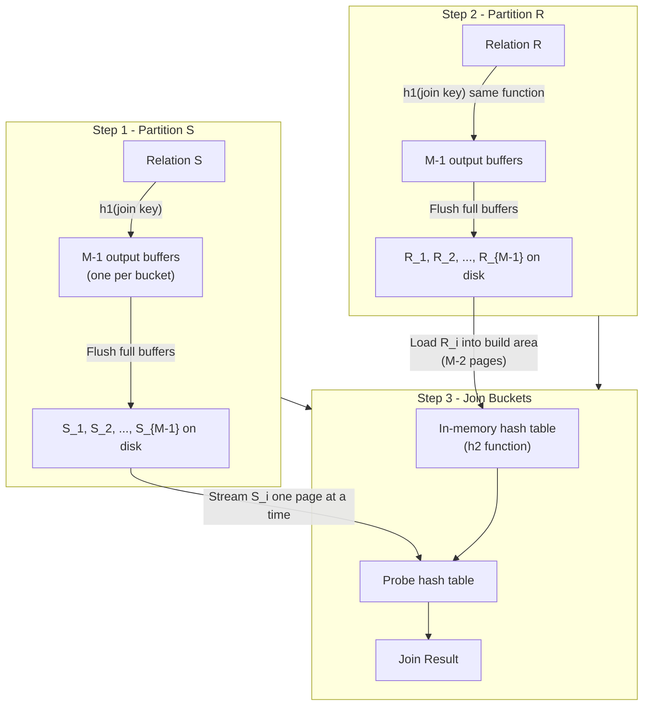

# Database Internals: Partitioned Hash Join — Overview

**Partitioned hash join** (also known as **Grace Join**) is the standard multi-pass algorithm used when relations are larger than main memory. It uses a divide-and-conquer strategy to split both relations into manageable partitions on disk before joining.

---

## Key Idea

When neither relation fits in memory ($B(R) > M$ and $B(S) > M$), we use a two-pass algorithm that partitions the data on disk before joining.

- **Partitioning Strategy**: Split $R$ and $S$ into $k = M-1$ buckets on disk using the same hash function $h_1$ on the join key. Because both relations use the same hash function, any tuple from $R$ that could match a tuple from $S$ will land in the same numbered bucket.
- **Partition Size**: Assuming **uniform distribution**, each bucket has size $B(R_i) = \frac{B(R)}{k}$ and $B(S_i) = \frac{S(R)}{k}$.
- **Goal**: Each build partition (e.g., $R_i$) must fit in the $M-2$ pages of the main-memory build area, so that Step 3 (the join phase) can build an in-memory hash table over $R_i$ and probe it with $S_i$.

![[Partitioned Hash Algorithm.png]]

**Total Ideal Cost**: $3(B(R) + B(S))$ I/Os (when a single partitioning pass is sufficient).

---

## Why This Specific Buffer Allocation?

Memory $M$ is a **zero-sum game** — every page used for one purpose is a page unavailable for another.

1. **Maximizing fan-out ($k$)**: In the partitioning phases (Steps 1 and 2), we use only **1 input page** so we can maintain $M-1$ output bins simultaneously. More output bins means smaller partitions, which are more likely to fit in memory during Step 3.
2. **Sequential I/O via output buffers**: Each of the $M-1$ output bins has a dedicated 1-page buffer. Tuples are copied into these buffers in memory, and a buffer is only flushed to disk when it is full. This ensures disk writes happen in full-page sequential chunks rather than as individual tuple writes, which would be extremely slow.
3. **The output buffer in Step 3**: During the join phase, one additional page is reserved as an **output buffer** so that matched result tuples can be accumulated before being written to disk in full-page chunks. Without it, every single match would require an immediate disk write.

---

## Industry Standard Terms

| Course Term | Industry / Standard Equivalent |
|---|---|
| Partitioned Hash Join | Grace hash join / classic hash join |
| Build partition | Inner partition / hash side |
| Probe partition | Outer partition / probe side |
| $h_1$ | Partition hash function |
| $h_2$ | Build hash function / collision hash function |

## Related

- [[Database Internals/Query Evaluation/PartitionedHashComponents/Algorithm|The Detailed 3-Step Algorithm]]
- [[Database Internals/Query Evaluation/PartitionedHashComponents/Feasibility|Feasibility & Recursive Partitioning]]
- [[Database Internals/Query Evaluation/PartitionedHashComponents/Worked Example|Worked Example]]
- [[Database Internals/Query Evaluation/Single-Pass Hash Join|Single-Pass Hash Join]] — the one-pass predecessor
