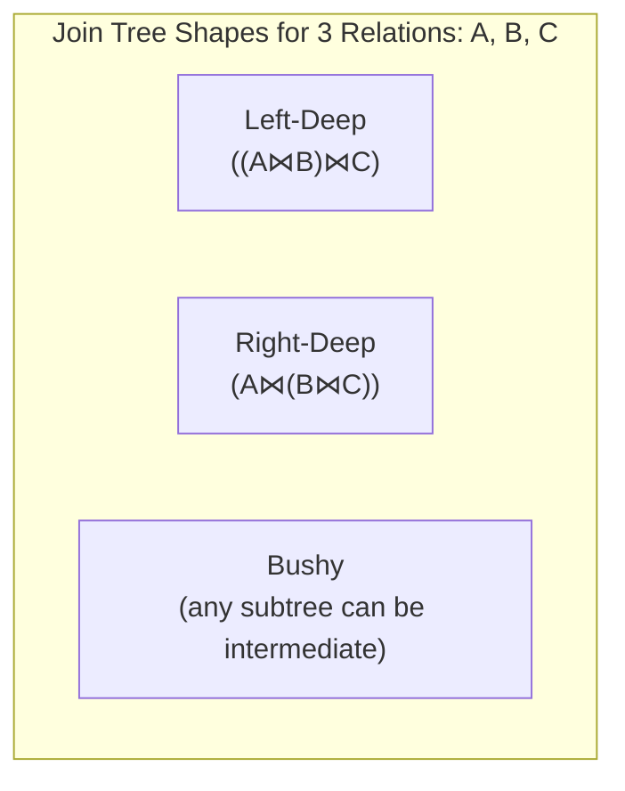

# Database Internals: Join Trees

A **join tree** is a representation of the order in which relations are joined in a query plan. The shape of the tree significantly impacts both the search space complexity and the execution efficiency — different shapes enable or prevent pipelining and change how many times intermediate results must be materialized to disk.

## Types of Join Trees

### Bushy Trees

In a **Bushy Tree**, both children of every join node can be intermediate join results. This is the most general form and represents the largest search space. Bushy trees can express any join ordering, but they require intermediate results to be materialized more frequently, which is costly.

![[Bushy Join Tree.png]]

### Linear Trees (Zig-Zag)

In a **Linear Tree**, at least one child of every join node must be a base relation. This restricts the search space compared to bushy trees but still allows varied orderings.

![[Linear Join Tree.png]]

#### Left-Deep Join Trees

A specific type of linear tree where the **right child** of every join node is always a base relation.

**Advantages**:
- Works well with common join algorithms like Nested-Loop and Hash Join, which treat the right (inner) side as a build or lookup target.
- Facilitates **pipelining**: the intermediate result of one join can be streamed directly into the outer (left) side of the next join without being materialized to disk. This is because the left (outer) side is always the previous join's output, not a base relation that needs to be fully loaded.

![[Left Deep Join Tree.png]]

#### Right-Deep Join Trees

A type of linear tree where the **left child** of every join node is always a base relation.

![[Right Deep Join Tree.png]]

Right-deep trees require the non-base (left) result to be fully materialized before each join, which generally makes them less attractive for pipelining. However, they can be beneficial for certain hash join implementations where the right side is the probe relation.

## Search Space Size

For $n$ relations:
- **Left-deep trees only**: $n!$ orderings.
- **All linear trees**: $n! \times 2^{n-1}$ (accounting for both left- and right-deep variants).
- **All bushy trees**: even larger — the Catalan number $\binom{2(n-1)}{n-1} / n$.

The exponential growth in search space size motivates restricting the optimizer to left-deep trees (as done by the [[Database Internals/Query Optimization/OptimizationComponents/Selinger Algorithm|Selinger Algorithm]]).

---

## Industry Standard Terms

| Course Term | Industry / Standard Equivalent |
|---|---|
| Left-Deep Join Tree | Left-deep tree / linear left-deep plan |
| Bushy Tree | Bushy join tree / general join tree |
| Linear Tree | Zig-zag tree / linear join plan |

## Related

- [[Database Internals/Query Optimization/OptimizationComponents/Search Space|Search Space Pruning]]
- [[Database Internals/Query Optimization/OptimizationComponents/Dynamic Programming|Dynamic Programming]]
- [[Database Internals/Query Evaluation/Operator Algorithms|Operator Algorithms]]
