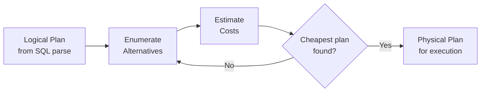

# Database Internals: Query Optimization

The **query optimizer** is the "brain" of a DBMS. Its goal is to transform a **logical query plan** into the most efficient **physical query plan** by evaluating the estimated costs of many equivalent alternatives. Because the space of possible plans is exponentially large, the optimizer uses statistical models, algebraic transformations, and search heuristics to find a good (not necessarily perfect) plan efficiently.

## Core Optimization Process

1. **[[Database Internals/Query Optimization/OptimizationComponents/Search Space|Enumerate Alternative Plans]]**: Generate many possible equivalent logical and physical plans using algebraic identities and different access paths.
2. **[[Database Internals/Query Optimization/OptimizationComponents/Cost Estimation|Estimate Costs]]**: For each candidate plan, calculate the total cost (primarily **I/O**) based on database statistics and cardinality estimation.
3. **[[Database Internals/Query Optimization/OptimizationComponents/Dynamic Programming|Search for Optimal Plan]]**: Use algorithms like Dynamic Programming to efficiently find the cheapest plan within the search space.

## Key Concepts

- **[[Database Internals/Query Optimization/OptimizationComponents/Cost Estimation#Database Statistics|Database Statistics]]**: Histograms and cardinalities ($T(R)$, $B(R)$, $V(R,a)$) used to predict result sizes.
- **[[Database Internals/Query Optimization/OptimizationComponents/Join Trees|Join Trees]]**: Different tree shapes (Bushy vs. Left-Deep) that define the search space.
- **Cost-Based Optimization**: Modern approach using cost models rather than simple greedy heuristic rules. The optimizer assigns a numeric cost to each candidate plan and selects the minimum.

---

## Industry Standard Terms

| Course Term | Industry / Standard Equivalent |
|---|---|
| Query Optimizer | Cost-based optimizer (CBO) |
| Logical Plan | Logical query plan / relational algebra tree |
| Physical Plan | Physical execution plan / query execution plan (QEP) |
| Database Statistics | Catalog statistics / column statistics |

## Related

- [[Database Internals/Query Evaluation/Operator Algorithms|Operator Algorithms]] — specific costs for join and sort implementations
- [[Database Internals/Review of Relational Model/Relational Algebra|Relational Algebra]] — the basis for plan transformations
- [[Database Internals/Query Evaluation/Query Execution & Algorithms|Query Execution]] — how the final plan is carried out
