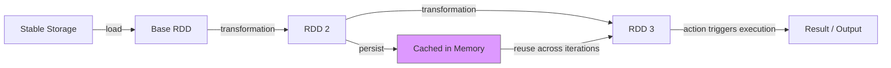
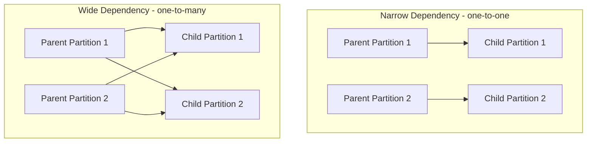

# CSE444: Spark

**Spark** is a shared-nothing, open-source big data processing system from UC Berkeley. Its central contribution is the **Resilient Distributed Dataset (RDD)** — a fault-tolerant in-memory abstraction that directly addresses the iterative-workload weakness of [[Database Internals/Replication and Distribution/MapReduce|MapReduce]].

The academic reference is the paper: *Resilient Distributed Datasets: A Fault-Tolerant Abstraction for In-Memory Cluster Computing*.

## Motivation

The observation that drove Spark's design is that **modern data analytics is iterative**:

- Machine learning algorithms (gradient descent, K-means) repeatedly scan the same dataset.
- Interactive data mining requires querying the same dataset many times.

In both cases, the programmer wants to **keep intermediate data in memory and reuse it across iterations**. [[Database Internals/Replication and Distribution/MapReduce|MapReduce]] handles this poorly: between every pair of jobs it **requires writing intermediate data to disk**, even when the next job will immediately read that same data back. Spark is designed to eliminate this disk round-trip.

## Resilient Distributed Datasets (RDDs)

A **Resilient Distributed Dataset (RDD)** is the fundamental abstraction in Spark. An RDD is:

- A **parallel data structure** — partitioned across nodes in the cluster.
- **Persistable in memory** — avoiding the disk writes that bottleneck [[Database Internals/Replication and Distribution/MapReduce|MapReduce]].
- **Fault-tolerant** — through *lineage* tracking rather than physical replication alone (see [[#Fault Tolerance Through Lineage]]).
- **Read-only** — no in-place updates to individual records, which distinguishes RDDs from in-memory key-value stores.

RDDs are typed: `RDD[Int]` is an RDD of integers.

### Creating RDDs

There are two ways to create an RDD:

1. Execute a deterministic **transformation** on an existing RDD.
2. Load from stable storage (e.g., HDFS).

### Materialization and Partitioning

Users control two aspects of how an RDD is managed:

- **Persistence** — `x.persist()` instructs Spark to materialize this RDD in memory so it can be reused across iterations without recomputation. The cost is paid once; subsequent accesses hit memory.
- **Partitioning** — users can specify a key to control how the RDD is partitioned across workers.

The core difference from MapReduce: Spark executes map/reduce-style steps without intermediate disk writes, keeping data in workers' memory across iterations. The trade-off is that if a worker fails mid-computation, Spark must recompute from the last materialized RDD rather than recovering from a disk checkpoint.

### Internal Representation

Internally, each RDD is described by five pieces of information:

1. A set of **partitions** — the data shards distributed across workers.
2. A set of **dependencies on parent partitions** — the lineage graph.
3. A **function** to compute the dataset from its parents.
4. **Metadata** about the partitioning scheme and data placement.

This gives the compact identity: **RDD = distributed relation + lineage**.

## Spark Programming Interface

Spark exposes RDDs through a language-integrated API in **Scala** (similar in design to DryadLINQ). Spark was later extended with a native SQL interface. Spark can also degrade to [[Database Internals/Replication and Distribution/MapReduce|MapReduce]]-style execution when necessary.

The programming model separates operations into two categories:

### Transformations

**Transformations** define a new RDD from an existing one. They are **lazily evaluated** — no work happens when a transformation is defined; evaluation is deferred until an action forces it. Examples:

- `map`
- `filter`
- `join`

### Actions

**Actions** trigger actual computation and either return a value to the application or write output to stable storage:

- `count` — returns the number of elements in the dataset.
- `collect` — returns the elements themselves to the driver.
- `save` — writes the RDD to stable storage.

### Example: Iterative Algorithm

```scala
val points = spark.textFile(...).map(parsePoint).persist()

var w = // random initial vector
for (i <- 1 to ITERATIONS) {
    val gradient = points.map { p => ... }.reduce((a, b) => a + b)
    w -= gradient
}
```

The `persist()` call keeps `points` in memory across every loop iteration. Without it, each iteration would reload and re-parse the input file from disk — exactly the MapReduce behavior Spark is designed to avoid.

## Query Execution Details



### Lazy Evaluation

RDDs are not evaluated when transformations are defined. Evaluation is deferred until an **action** is called. This allows Spark to inspect the entire computation graph (the lineage) before executing — analogous to query optimization in a DBMS, where the full query plan is known before any data is touched.

### In-Memory Caching

- **Spark workers are long-lived processes**, unlike MapReduce's stateless task containers, so they can hold cached data between tasks.
- RDDs marked with `persist()` are materialized in worker memory.
- Base input data is **not** cached by default.

![[Spark Runtime.png]]

![[More Details on Spark Execution.png]]

## Fault Tolerance Through Lineage

The key challenge of an in-memory distributed system: if intermediate results are never written to disk, how do you recover from a worker failure?

Spark's answer is **lineage**. Rather than replicating data across machines, Spark records the sequence of deterministic operations used to build each RDD. If a partition is lost, Spark uses the lineage to **recompute only the lost partition** — it does not need to restart the entire job.

### Narrow vs. Wide Dependencies

The lineage graph distinguishes two dependency types that affect how expensive recovery is:



- **Narrow dependencies** (one-to-one): each child partition depends on exactly one parent partition. Recovery is cheap — only the failed partition needs recomputation, and it can happen locally on a single node.
- **Wide dependencies** (one-to-many): each child partition depends on multiple parent partitions (like a shuffle or group-by). Recovery is more expensive — it may require pulling data from many nodes.

## Spark vs. MapReduce

| Property | MapReduce | Spark |
| :--- | :--- | :--- |
| Intermediate storage | Disk (always) | Memory (user-controlled via `persist()`) |
| Worker lifetime | Stateless, task-scoped | Long-lived, can cache data |
| Iterative workloads | Poor — disk I/O per iteration | Efficient — in-memory reuse |
| Fault tolerance | Task re-execution from disk | Lineage-based recomputation |
| Programming model | `map` + `reduce` only | Rich transformations + actions |
| SQL support | Via Hive (external layer) | Native (Spark SQL) |

---

## Industry Standard Terms

| CSE444 Term | Industry / Standard Term |
| :--- | :--- |
| **Resilient Distributed Dataset (RDD)** | RDD (widely adopted term) / distributed collection |
| **Transformation** | Lazy operator / DAG node |
| **Action** | Trigger / materialization point |
| **Lineage** | Computation DAG / provenance graph |
| **Narrow dependency** | Pipelinable dependency / map-side dependency |
| **Wide dependency** | Shuffle dependency / reduce-side dependency |
| **persist()** | Cache / checkpoint hint |
| **Worker** | Executor (official Spark terminology) |

---

## Related

- [[Database Internals/Replication and Distribution/MapReduce|MapReduce]] — the system Spark directly improves upon; contrasted throughout this file
- [[Intro to Parallel DBMS|Intro to Parallel DBMS]] — the shared-nothing architecture both MapReduce and Spark are built on
- [[The Shuffle Operator|The Shuffle Operator]] — the redistribution operation underlying Spark's wide dependencies
- [[Data Partitioning Schemes|Data Partitioning Schemes]] — how RDD partitions are distributed across workers

### Further Reading (from lecture)

- YARN — the latest Hadoop resource management developments
- GraphLab / Turi — graph-parallel computation
- Impala, Flink, Myria — other big data processing systems
- Cloud offerings from Google, Microsoft, and Amazon
