# Database Internals: Concurrency Anomalies

Interleaving transactions without proper control (i.e., not enforcing a [[Database Internals/Transactions/Serializability/SerializabilityComponents/Schedules|serializable schedule]]) leads to data corruption. The three main conflict types are:

1. **Write-Read Conflict ([[Database Internals/Definitions/Dirty Read|Dirty Read]])** — $T_1$ writes a value, $T_2$ reads it before $T_1$ commits. If $T_1$ aborts, $T_2$ has read a value that never logically existed.
2. **Read-Write Conflict ([[Database Internals/Definitions/Unrepeatable Read|Unrepeatable Read]])** — $T_1$ reads a value, $T_2$ writes it, then $T_1$ reads it again and sees a different value within the same transaction.
3. **Write-Write Conflict ([[Database Internals/Definitions/Lost Update|Lost Update]])** — $T_1$ and $T_2$ both update the same object. The second write overwrites the first, losing $T_1$'s update.

```mermaid
graph TD
    subgraph WR ["Write-Read (Dirty Read)"]
        A1["T1: Write(X)"] --> A2["T2: Read(X)"]
        A2 --> A3["T1: ABORT"]
        A3 --> A4["T2 read data that never existed"]
    end
    subgraph RW ["Read-Write (Unrepeatable Read)"]
        B1["T1: Read(X) = 10"] --> B2["T2: Write(X) = 20, COMMIT"]
        B2 --> B3["T1: Read(X) = 20 (different!)"]
    end
    subgraph WW ["Write-Write (Lost Update)"]
        C1["T1: Write(X) = 10"] --> C2["T2: Write(X) = 20, COMMIT"]
        C2 --> C3["T1: COMMIT — T1's write is lost"]
    end
```

## Related
- [[Database Internals/Transactions/Isolation Levels|Isolation Levels]]
- [[Database Internals/Transactions/Serializability/SerializabilityComponents/Schedules|Schedules]]
- [[Database Internals/Transactions/Transaction Fundamentals|Transaction Fundamentals]]
