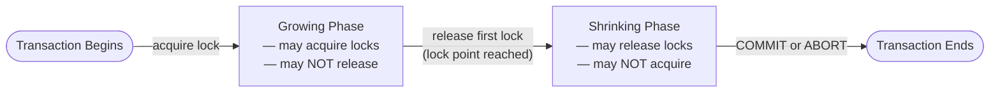

# CSE444: Two-Phase Locking (2PL)

Simply using locks is not enough to guarantee that a schedule is serializable. A transaction could lock $A$, update it, unlock $A$, and then later decide to lock $B$ based on what it saw in $A$, allowing another transaction to slip in and corrupt the logic.

To guarantee **[[CSE444/Transactions/Serializability/Conflict Serializability|Conflict Serializability]]**, the [[CSE444/Transactions/Pessimistic Components/Pessimistic Scheduler|scheduler]] enforces a rule called **Two-Phase Locking (2PL)**.

---

## The Basic 2PL Rule

In every transaction, **all lock requests must precede all unlock requests.** This partitions every transaction's lifetime into exactly two non-overlapping phases.

### Formal Definition

For every transaction $T_i$ in schedule $S$, there must be no sequence of actions $L_i(X),\ U_i(Y),\ L_i(Z)$ in that order — once $T_i$ releases any lock, it may never acquire another.

The **lock point** of $T_i$ is the moment in the schedule at which $T_i$ acquires its *last* lock. The central theorem of 2PL is:

$$\text{If all transactions obey 2PL, then } S \text{ is conflict-serializable,}$$
$$\text{and the equivalent serial order corresponds to the order of the transactions' lock points.}$$

### Simplified Explanation

Think of the lock point as the peak of a mountain. On the way up (growing phase) a transaction collects every lock it needs. At the peak it holds the maximum set. On the way down (shrinking phase) it releases them — but it can never start climbing again. Because every transaction has exactly one peak, and peaks have a strict order, no two transactions can interleave in a way that violates serializability.

### Growing and Shrinking Phases

A transaction executing under 2PL has two distinct phases:
1. **Growing phase**: The transaction acquires locks and cannot release any.
2. **Shrinking phase**: The transaction releases locks, but once it releases its first lock, it **cannot acquire any new locks**.

### Without 2PL
![[Without 2Pl.png]]
![[Without 2Pl 2.png]]

### With 2PL
![[With 2PL.png]]
![[With 2PL 2.png]]

---

## The Problem: Cascading Aborts

Basic 2PL guarantees serializability, but it does not guarantee that the schedule is **[[Recoverable Schedule|Recoverable]]**.

**The Danger**: During the shrinking phase, a transaction might release a lock on $X$ *before* it has actually committed. If another transaction swoops in, acquires the lock on $X$, reads the uncommitted value, and commits, we have a problem. If the first transaction then aborts, the second transaction has committed based on "dirty data" that logically never existed. This requires a **[[Cascading Abort|cascading abort]]** to fix, which is terrible for performance — and impossible to undo if the second transaction has already committed to disk.

![[Non-recoverable schedule.png]]
![[Non-recoverable schedule 2.png]]

---

## Strict 2PL (S2PL)

To eliminate cascading aborts, almost all modern databases use a stricter variant.

### Formal Definition

For every transaction $T_i$ and every data element $X$: the unlock action $U_i(X)$ may only occur at or after the $\text{COMMIT}(T_i)$ or $\text{ABORT}(T_i)$ action. Formally, there is no distinct shrinking phase during normal execution — the growing phase lasts until the transaction ends.

### Simplified Explanation

A transaction following Strict 2PL never lets go of any lock until it terminates — meaning either it **COMMITs** (all writes are durable and visible) or it **ABORTs** (all writes are rolled back). Both outcomes fully resolve the transaction's effect on the data before releasing any lock. Since no lock is released early, no other transaction can ever read dirty (uncommitted) data written by a still-running transaction. The "shrinking phase" is collapsed to a single instant at commit or abort.

**The Strict Rule**: All locks (or at least all Exclusive/Write locks) held by a transaction are released **only at the very end**, during **COMMIT** or **ROLLBACK**.

![[Strict 2PL example.png]]
![[Strict 2PL example 2.png]]

### Guarantees of Strict 2PL

By holding all locks until the transaction completes, Strict 2PL provides three guarantees:

| Guarantee | Reason |
| :--- | :--- |
| **Serializability** | S2PL is a special case of basic 2PL, so the lock-point theorem still holds. |
| **Recoverability** | No transaction can read your uncommitted data because you don't release the lock until you commit. |
| **No Cascading Aborts** | Because every read targets already-committed data, an abort by one transaction cannot invalidate work done by another. |

---

## 2PL and Deadlocks

Because transactions hold locks while waiting for others to release theirs, 2PL is inherently susceptible to **[[CSE444/Transactions/Pessimistic Components/Deadlocks|deadlocks]]** — circular waiting chains where no transaction in the cycle can ever proceed. The DBMS detects these using a **Wait-For Graph** and resolves them by aborting a victim transaction.

---

## Related
- [[CSE444/Transactions/Pessimistic Components/Pessimistic Scheduler|Pessimistic Scheduler]]
- [[CSE444/Transactions/Pessimistic Components/Lock Modes|Lock Modes]]
- [[CSE444/Transactions/Pessimistic Components/Deadlocks|Deadlocks]]
- [[Concurrency Anomalies|Schedules and Concurrency Problems]]

---

## Industry Standard Terms

| Course Term | Industry / Standard Equivalent |
| :--- | :--- |
| **Two-Phase Locking (2PL)** | Two-Phase Locking (2PL) — universal term across RDBMS literature and textbooks |
| **Strict 2PL (S2PL)** | Rigorous 2PL (in some literature); the locking strategy used by most production databases (PostgreSQL, MySQL InnoDB, Oracle, SQL Server) |
| **Growing Phase** | Lock acquisition phase |
| **Shrinking Phase** | Lock release phase |
| **Lock Point** | Serialization point — the moment that determines a transaction's position in the equivalent serial schedule |
| **Cascading Abort** | Cascading rollback — a chain of rollbacks triggered by reading dirty (uncommitted) data from an aborted transaction |
