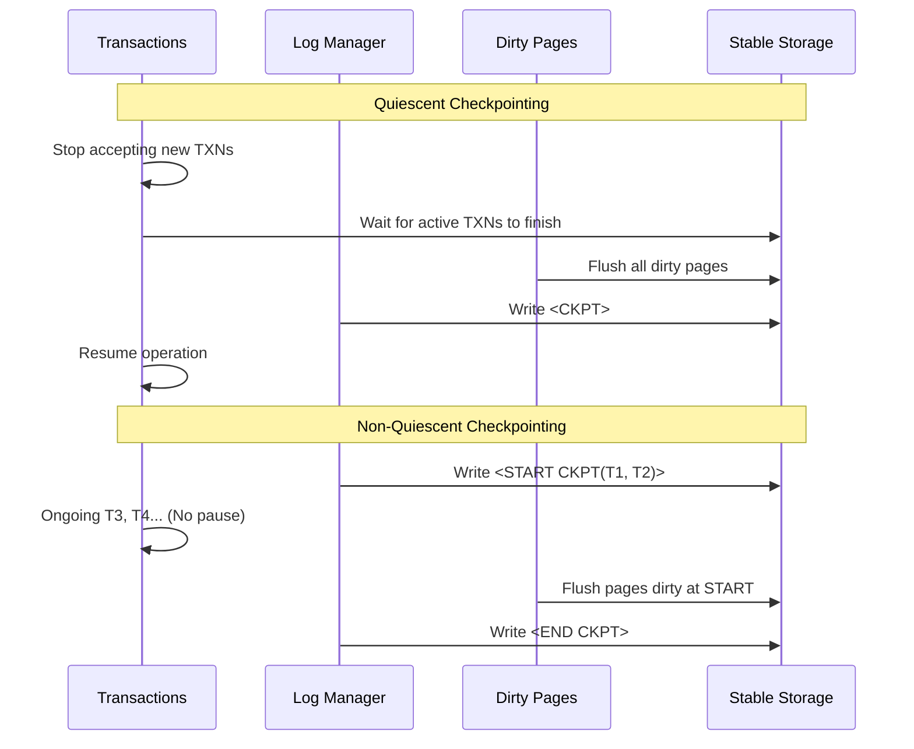

# Database Internals: Checkpointing

**Checkpointing** is a technique used to bound the recovery time after a system crash. Without checkpointing, the Recovery Manager would have to scan the entire log from the beginning of time to restore consistency.

## Comparison: Quiescent vs. Non-Quiescent

| Feature | Quiescent Checkpointing | Non-Quiescent Checkpointing |
| :--- | :--- | :--- |
| **System Availability** | Stops the world; no new transactions. | Transactions continue to run normally. |
| **Flushing Strategy** | All dirty pages are flushed before `<CKPT>`. | Dirty pages are flushed background/asynchronously. |
| **Log Records** | Single `<CKPT>` record. | Pair of `<START CKPT>` and `<END CKPT>`. |
| **Overhead** | High latency for users during checkpoint. | Minimal impact on transaction throughput. |
| **Complexity** | Simple recovery (start from last `<CKPT>`). | Complex recovery (must handle overlapping logs). |

### Timeline Comparison

## Quiescent Checkpointing

A **Quiescent Checkpoint** marks a point where the database is in a completely consistent state on disk.

### Procedure
1. Stop accepting new transactions.
2. Wait until all active transactions commit or abort.
3. Flush all dirty pages from the buffer pool to disk.
4. Write a `<CKPT>` record to the log and flush it.
5. Resume normal operation.

![[Undo Recovery with Checkpointing.png]]

### Limitation
The database must be **frozen** during the checkpoint. For high-throughput systems, this "stop-the-world" pause is unacceptable.

## Non-Quiescent Checkpointing

**Non-Quiescent Checkpointing** allows the system to continue processing transactions while the checkpoint is being taken.

### Procedure
1. **START CKPT**: Write `<START CKPT(T1, ..., Tk)>` to the log, where $T_1, \dots, T_k$ are all currently active transactions. Flush the log.
2. **Flush Dirty Pages**: Begin flushing dirty pages to disk. This includes pages from already-committed transactions that have not been written yet. **Transactions continue to run during this phase.**
3. **END CKPT**: Once all dirty pages that existed at the time of `<START CKPT>` are flushed, write `<END CKPT>` and flush the log.

### Concrete Example: Interleaved Log Sequence

| LSN | Log Record | Comment |
| :--- | :--- | :--- |
| 10 | `<START T1>` | |
| 20 | `<T1, A, 50, 60>` | |
| 30 | **`<START CKPT(T1)>`** | Active: T1 |
| 40 | `<START T2>` | T2 starts *during* checkpointing |
| 50 | `<T2, B, 10, 20>` | |
| 60 | `<COMMIT T1>` | |
| 70 | `<T1, END>` | |
| 80 | **`<END CKPT>`** | Flush of pages dirty at LSN 30 finished |

### Recovery Logic: Crash During Checkpoint

If a crash occurs after `<START CKPT>` but before `<END CKPT>`, the checkpoint is considered **invalid**.

- **Detection**: During the Analysis Phase, the Recovery Manager finds a `<START CKPT>` without a matching `<END CKPT>`.
- **Action**: The system must ignore the incomplete checkpoint and search backward for the **previous** successful `<END CKPT>`.
- **Why?**: The `<END CKPT>` is the only guarantee that the pages dirty at the time of `<START CKPT>` actually reached stable storage. Without it, we do not know which updates made it to disk, so we must assume none did and re-process from an older, known-good state.

![[Undo with Nonquiescent Checkpointing.png]]
![[Nonquiescent Checkpointing 2.png]]

## Fuzzy Checkpointing (ARIES)

Fuzzy checkpointing (used in [[Database Internals/Transactions/RecoveryComponents/ARIES|ARIES]]) is the most advanced optimization. It avoids the heavy cost of flushing all dirty pages at checkpoint time.

### Mechanism
Instead of flushing data, ARIES simply records the **state** of the system:
1. **Dirty Page Table (DPT)**: Lists all pages in RAM that differ from disk, along with their `recLSN` (the first LSN that dirtied them).
2. **Active Transaction Table (ATT)**: Lists all currently running transactions and their `lastLSN`.

### Procedure
1. Write `<START CKPT>` to the log.
2. Write a `<CHKPT>` record containing the DPT and ATT.
3. Update the **Master Record** (a fixed location on disk) to point to this new `<START CKPT>`.

### The "Fuzzy" Aspect
Because ARIES uses **Redo-Logging** with the `recLSN`, it does not need to force pages to disk during the checkpoint. The Redo Phase will simply start from `min(recLSN)` found in the DPT. This allows checkpoints to be extremely fast (near-instantaneous) as they only involve writing a small amount of metadata to the log.

## Industry Standard Terms
- **Quiescent Checkpoint** $\rightarrow$ Stop-the-world Checkpoint / Consistent Checkpoint
- **Non-Quiescent Checkpoint** $\rightarrow$ Online Checkpoint / Asynchronous Checkpoint
- **Fuzzy Checkpoint** $\rightarrow$ Metadata-only Checkpoint (in ARIES context)
- **Master Record** $\rightarrow$ Control File / Checkpoint LSN Pointer

## Related
- [[Database Internals/Transactions/RecoveryComponents/LoggingComponents/Undo-Redo Logging|Undo-Redo Logging]]
- [[Database Internals/Transactions/RecoveryComponents/ARIES|ARIES Recovery Algorithm]]
- [[Database Internals/Transactions/RecoveryComponents/Write-Ahead Logging (WAL)|Write-Ahead Logging (WAL)]]
