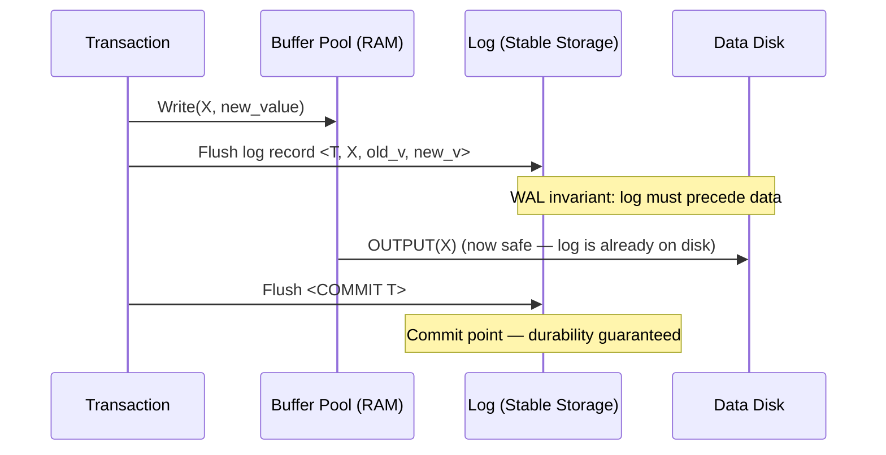

# Database Internals: Write-Ahead Logging (WAL)

**Write-Ahead Logging (WAL)** ensures that the log remains the authoritative source of truth by always preceding the actual data changes on disk: the log entry must be written before any `OUTPUT`, and the `<COMMIT>` record must be written before the transaction is considered complete.

## The WAL Rule

To ensure the DBMS can recover from any crash, two conditions must be met before any disk I/O is permitted:

1. **Log Before Data**: All log records pertaining to an update must be flushed to non-volatile storage *before* the corresponding data page is written to disk. This ensures that if the system crashes after the data is on disk but before the transaction commits, the DBMS has the Undo information needed to roll back — no committed change is ever lost.
2. **Commit Before Success**: A transaction is not considered committed until its `<COMMIT>` log record has been successfully flushed to stable storage. This guarantees Durability — once the user is told the transaction succeeded, the changes are guaranteed to be in the log, regardless of what happens to the buffer pool.

## The WAL Invariant

For every update, a log record is created. The key invariant is:

$$\text{pageLSN} \leq \text{FlushedLSN}$$

A page can only be flushed to disk if its most recent update's **Log Sequence Number (LSN)** is less than or equal to the LSN of the last log record already flushed to disk. The log must always be ahead of the data.

---

## Formal Analysis

### Formal Definition
For every data page $P$ with `pageLSN(P)` (the LSN of the last update applied to $P$) and `FlushedLSN` (the LSN of the most recently flushed log record):

$$\text{pageLSN}(P) \leq \text{FlushedLSN} \quad \text{before any } \text{OUTPUT}(P)$$

This invariant ensures that the "before image" needed to undo (or the "after image" needed to redo) the modification to $P$ is guaranteed to already exist on stable storage before $P$ itself is written.

### Simplified Explanation
Always write down what you are about to do before you do it. If you crash mid-operation, you can look at your notes (the log) to determine exactly what was in-flight and either undo or redo it.

---

## Industry Standard Terms
- **WAL** $\rightarrow$ Write-Ahead Log / Transaction Log (universal term)
- **pageLSN** $\rightarrow$ Page version / Page log pointer
- **FlushedLSN** $\rightarrow$ Log flush pointer / Current durable LSN
- **Commit Point** $\rightarrow$ The moment the `<COMMIT>` record is flushed — the only guarantee of durability

## Related
- [[Database Internals/Transactions/RecoveryComponents/Buffer Management Policies|Buffer Management Policies]]
- [[Database Internals/Transactions/RecoveryComponents/Logging Types|Logging Types]]
- [[Database Internals/Transactions/Recovery|Recovery Overview]]
- [[Database Internals/Transactions/RecoveryComponents/ARIES|ARIES Recovery Algorithm]]
