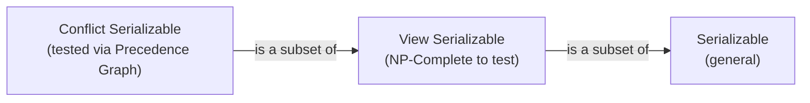

# Database Internals: Serializability

**Serializability** is the criterion for correctness in a concurrent database system. A schedule is considered correct if its effect on the database is the same as some serial execution of the same transactions.

## What it means to be Serializable
A schedule is **serializable** if it is equivalent to some **serial schedule** (a schedule where transactions execute one after another without interleaving).

- **Correctness**: Since serial schedules are assumed to be correct (transactions are independent units), any schedule equivalent to a serial one is also correct.
- **Goal**: Allow the DBMS to interleave actions for better performance (disk I/O, CPU utilization) while maintaining the illusion of serial execution.

## Types of Serializability
Serializability is usually defined by different levels of "equivalence":

1. **[[Database Internals/Transactions/Serializability/SerializabilityComponents/Conflict Serializability|Conflict Serializability]]**: Equivalent to a serial schedule by swapping non-conflicting adjacent actions. This is the most common type used in practice (e.g., [[Database Internals/Transactions/PessimisticComponents/Pessimistic Scheduler|2PL]]).
2. **[[Database Internals/Transactions/Serializability/SerializabilityComponents/View Serializability|View Serializability]]**: Equivalent to a serial schedule by maintaining the same "view" of data (who reads what and who writes last). A weaker condition that allows for **blind writes**.

## Hierarchy of Correctness
$$Conflict\ Serializable \subset View\ Serializable \subset Serializable$$

## Industry Standard Terms
- **Serializability** $\rightarrow$ The correctness criterion for transaction isolation; the standard meaning of SQL `SERIALIZABLE`
- **Serial Schedule** $\rightarrow$ Sequential execution; the theoretical "gold standard"
- **Conflict Serializability** $\rightarrow$ The practical form enforced by 2PL and most production DBMSs

## Related
- [[Database Internals/Transactions/Serializability/SerializabilityComponents/Schedules|Schedules and Concurrency Problems]]
- [[Database Internals/Transactions/Transaction Fundamentals|Transaction Fundamentals]]
- [[Database Internals/Transactions/PessimisticComponents/Pessimistic Scheduler|Locking]]
- [[Database Internals/Transactions/OptimisticComponents/Timestamps|Timestamps]]
