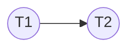

# CSE444: Conflict Serializability

**Conflict Serializability** is a correctness criterion for concurrent schedules. It defines a schedule as "correct" if it is **conflict-equivalent** to some serial execution of the same transactions.

### Formal Definition
A schedule $S$ is **conflict serializable** if there exists some serial schedule $S'$ such that $S$ and $S'$ consist of the same set of actions and all pairs of **conflicting actions** are ordered the same way in both $S$ and $S'$.

### Simplified Explanation
If you can take a concurrent schedule and turn it into a serial one (one transaction at a time) just by swapping the order of actions that don't interfere with each other, then the schedule is conflict serializable.

## The Three Rules of Conflict
Two actions in a schedule are said to **conflict** if they meet **all** of the following three criteria:
1. They belong to **different transactions**.
2. They access the **same data item** ($X$).
3. **At least one** of the actions is a **write** ($w(X)$).

### Conflict Types
- **Read-Write (RW) Conflict**: $r_i(X)$ occurs before $w_j(X)$. If swapped, $T_i$ might read a value that $T_j$ was about to change.
- **Write-Read (WR) Conflict**: $w_i(X)$ occurs before $r_j(X)$. If swapped, $T_j$ might read an old value instead of the one $T_i$ wrote.
- **Write-Write (WW) Conflict**: $w_i(X)$ occurs before $w_j(X)$. If swapped, the final value of $X$ in the database would be different.

> **Note**: Two reads ($r_i(X)$ and $r_j(X)$) **never conflict** because reading is a side-effect-free operation.

## Conflict Equivalence
Two schedules $S_1$ and $S_2$ are **conflict equivalent** if:
1. They involve the same transactions and the same actions.
2. Every pair of conflicting actions is ordered the same way in both schedules.

If a schedule is conflict equivalent to a serial schedule, it is guaranteed to leave the database in a consistent state (assuming the transactions themselves are correct).

## Testing for Serializability: Precedence Graphs
A **Precedence Graph** (also called a **Serialization Graph**) is a directed graph used to test for conflict serializability.

### Construction Steps
1. **Nodes**: Create one node for each transaction $T_i$ in the schedule.
2. **Edges**: Draw a directed edge $T_i \to T_j$ if:
	- There is a conflict between an action in $T_i$ and an action in $T_j$.
	- The action in $T_i$ occurs **earlier** in the schedule than the action in $T_j$.
3. **Cycle Detection**:
	- **Acyclic (No Cycles)**: The schedule is **conflict serializable**.
	- **Cyclic (Has Cycles)**: The schedule is **not** conflict serializable.

### Example Walkthrough
Consider the following schedule $S$:
$r_1(A); w_2(A); r_1(B); w_2(B)$

1. **Conflicts**:
	- $r_1(A)$ and $w_2(A)$ conflict. $T_1$ is first $\to$ Edge $T_1 \to T_2$.
	- $r_1(B)$ and $w_2(B)$ conflict. $T_1$ is first $\to$ Edge $T_1 \to T_2$.
2. **Graph**:

3. **Conclusion**: No cycles exist. The schedule is conflict serializable and equivalent to the serial schedule $(T_1, T_2)$.

## Relationship to Other Models

| Property | Conflict Serializability | [[CSE444/Transactions/Serializability/View Serializability|View Serializability]] |
| :--- | :--- | :--- |
| **Strictness** | Stricter (Fewer schedules allowed) | Weaker (More schedules allowed) |
| **Computation** | Fast ($O(n^2)$ via graph) | Hard (NP-Complete) |
| **Implementation** | Used by [[CSE444/Transactions/Pessimistic Components/Two-Phase Locking (2PL)|2PL]] | Mostly theoretical |
| **Handles Blind Writes?** | No | Yes |

## Industry Standard Terms

| CSE444 Term | Industry / Standard Term |
| :--- | :--- |
| **Conflict Serializability** | Serializability (Standard SQL 'SERIALIZABLE' often implies this) |
| **Precedence Graph** | Serialization Graph |
| **Conflict Equivalent** | Equivalent Schedule |
| **Blind Write** | Overwrite without prior read |

---

## Related
- [[Serializability|Serializability Overview]]
- [[CSE444/Transactions/Serializability/View Serializability|View Serializability]]
- [[CSE444/Transactions/Pessimistic Components/Two-Phase Locking (2PL)|Two-Phase Locking (2PL)]] — the protocol that ensures conflict serializability
- [[CSE444/Transactions/Pessimistic Components/Pessimistic Scheduler|Pessimistic Schedulers]]
- [[CSE344/Transactions/Transactions|Transactions (CSE344)]] — introductory transaction concepts
