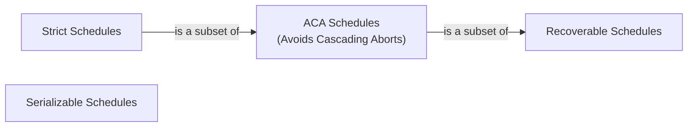

# Database Internals: Schedules

A **schedule** is a sequence of interleaved actions (reads, writes, commits, aborts) from multiple concurrent transactions.

The primary goal of a DBMS scheduler is to take a set of transactions and interleave their actions to maximize performance (throughput and latency) without sacrificing data consistency.

### Types of Schedules

1. **Serial Schedule**: A schedule where transactions execute entirely one after another, with absolutely no interleaving of their actions.
    - *Why it matters*: Serial schedules are the "gold standard" of correctness. Since each transaction is assumed to be correct on its own, executing them one at a time guarantees the database remains in a consistent state.
    - *The Problem*: Serial execution has terrible performance because if one transaction is waiting for a disk read, the CPU is completely idle.

2. **Serializable Schedule**: A schedule with interleaved actions that produces the *exact same* end result and database state as *some* serial schedule.
    - *Why it matters*: This allows the DBMS to interleave actions (e.g., $T_2$ does some CPU work while $T_1$ waits for disk I/O) while still mathematically guaranteeing the correctness of a serial schedule. See [[Database Internals/Transactions/Serializability/Serializability|Serializability]].

### Schedule Properties

Beyond just serializability, we often care about how a schedule handles failures.

- **[[Database Internals/Definitions/Recoverable Schedule|Recoverable Schedules]]**: A schedule is recoverable if each transaction commits *only after* all transactions from which it has read have committed.
	- *Why?* If $T_1$ writes $X$, $T_2$ reads $X$, and $T_1$ aborts, $T_2$ must also abort. If $T_2$ had already committed, the system cannot "un-commit" it, violating atomicity.
- **Avoids [[Database Internals/Definitions/Cascading Abort|Cascading Aborts]] (ACA)**: A schedule is ACA if each transaction reads *only* data written by already-committed transactions.
	- *Why?* This prevents the "domino effect" where one abort forces many others to abort. All ACA schedules are also recoverable.
- **Strict Schedules**: A value written by $T$ is not read or overwritten by other transactions until $T$ commits or aborts.
	- This is the strongest property and is ensured by **[[Database Internals/Transactions/PessimisticComponents/Two-Phase Locking (2PL)|Strict 2PL]]**.

## Industry Standard Terms
- **Serial Schedule** $\rightarrow$ Sequential execution
- **Recoverable Schedule** $\rightarrow$ Safe schedule (commit ordering constraint)
- **ACA** $\rightarrow$ Cascade-free schedule
- **Strict Schedule** $\rightarrow$ Rigorous schedule

## Related
- [[Database Internals/Transactions/Serializability/Serializability|Serializability]]
- [[Database Internals/Transactions/Concurrency Anomalies|Concurrency Anomalies]]
