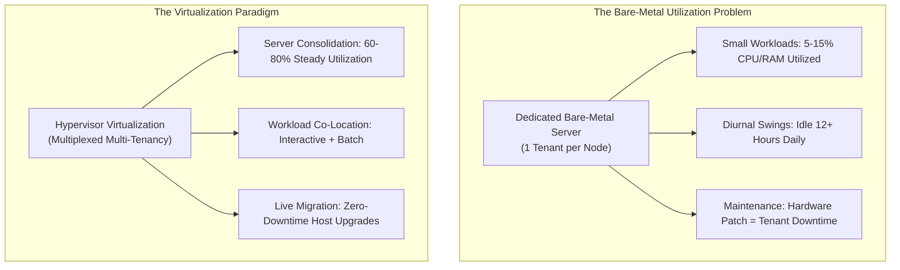
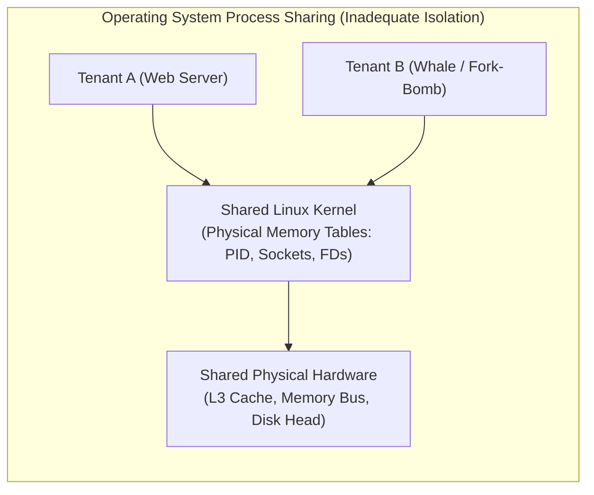
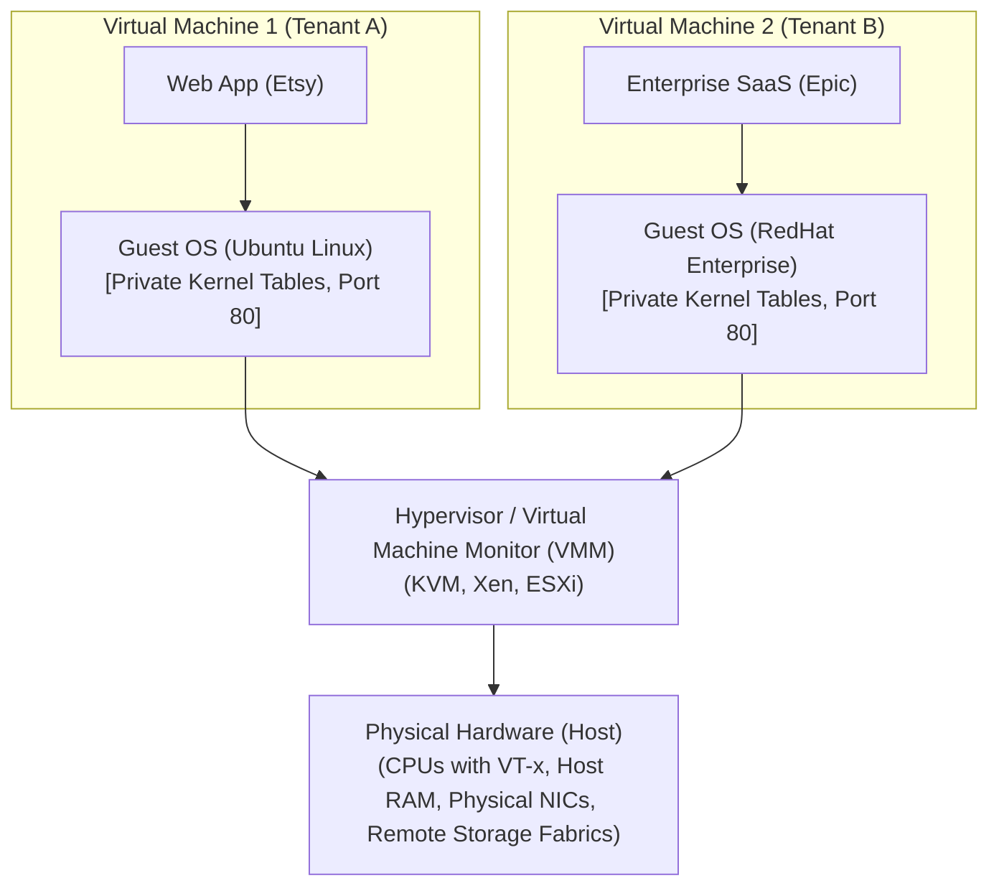

# Datacenter Systems: Execution Environments and Virtualization

Virtualization provides isolated, efficient software duplicates of physical computing hardware, enabling cloud datacenters to multiplex diverse multi-tenant workloads onto shared physical servers to maximize resource utilization while preserving strict availability, security, and performance boundaries.

---

## Execution Environments and Virtualization Motivation & Overview

The central design question in modern datacenter engineering is: **In what execution environment should datacenter applications execute?**

Datacenter operators build facilities costing hundreds of millions of dollars, housing tens of thousands of physical servers, high-speed network fabrics, and multi-megawatt power distribution units. To achieve financial return on investment (ROI) and minimize operational waste, operators must maximize hardware **resource utilization**.



### Taxonomy of Datacenter Applications
Datacenters execute virtually every class of modern software, each exhibiting drastically different resource profiles, arrival patterns, and latency tolerances:

| Workload Category | Production Examples | Resource Profile | Operational Characteristics & Latency Sensitivity |
| :--- | :--- | :--- | :--- |
| **Websites & E-Commerce** | Etsy, eBay, DoorDash, small retail sites | Low CPU, low memory footprint | **Interactive, sporadic, diurnal**: Dedicated physical servers are massively wasteful; workloads require only a tiny fraction of a single machine. |
| **Traditional Enterprise SaaS** | Gmail, Salesforce, Epic Healthcare | High CPU, heavy network I/O | **Interactive, diurnal**: Heavy daytime concurrency, predictable diurnal troughs at night. |
| **Scientific & Engineering Computing** | Climate simulations, genomics, CAD | Heavy CPU, massive memory | **Non-interactive batch**: Compute-intensive, long-running (hours to days), tolerant to queuing delays. |
| **Machine Learning (ML)** | LLM pre-training, real-time inference | Heavy GPU/TPU, high memory bandwidth, NVLink | **Hybrid**: Model training runs as long-running batch jobs; inference requires strict sub-50ms tail-latency response times. |
| **Content Distribution & Streaming** | Netflix, Spotify, Zoom | Extreme network bandwidth, high storage I/O | **Bandwidth-bound, diurnal**: Highly sensitive to packet jitter and bufferbloat. |
| **Data Analytics & Web Indexing** | Google Search indexing, MapReduce, Spark | Heavy CPU, heavy disk/network I/O | **Background batch**: High-throughput distributed processing across thousands of nodes. |
| **Network Functions (NFV)** | Cloud firewalls, NAT gateways, VPN endpoints | Heavy CPU, line-rate packet I/O | **Interactive, strictly latency-critical**: Microsecond packet processing budgets. |
| **File Sharing & Cloud Storage** | Dropbox, Google Drive, OneDrive | Heavy storage capacity, moderate network | **Non-interactive, diurnal**: High disk write volume, background sync. |

### The Limits of Dedicated Bare-Metal Servers
Deploying each application into its own isolated, bare-metal physical server leads to catastrophic hardware underutilization:
- **Resource Fragmentation**: Small web services or retail frontends require only a tiny fraction of a modern multi-core server (e.g., 2 cores out of 64, 4 GB of RAM out of 256 GB). Allocating an entire physical node to one small app wastes the remaining capacity.
- **Diurnal Usage Inefficiency**: Human-facing applications follow strict **diurnal cycles** (traffic peaks during daylight business hours and collapses by 80% to 90% during nighttime hours). Dedicated servers sit completely idle for over half of their operational lifespan.
- **Inelastic Provisioning**: If an application suddenly becomes popular or experiences seasonal surges (e.g., Black Friday), physical hardware cannot scale up instantly without manual racking and cabling.

### The Economics of Consolidation & Workload Co-Location
To solve underutilization, operators use **server consolidation** (multiplexing multiple independent applications onto shared physical machines).

A key architectural insight of datacenter computing is **complementary workload pairing**:
- **Interactive Foreground Tasks** (e.g., web search, checkout services) have strict latency targets and cannot be delayed.
- **Background Batch Tasks** (e.g., web indexing, video encoding, model training) have relaxed deadlines and can be throttled or paused.
- By co-locating interactive applications with background tasks on the same physical host, the datacenter can pause background tasks during peak daytime interactive traffic, and resume background processing at maximum throughput during nighttime diurnal troughs, driving average server utilization from 10–15% up to 70–80%.

### The Core Tension: Consolidation vs. Isolation
While consolidation raises utilization, it directly threatens the top priority of the Cloud Operator Pyramid: **Availability**.
- Consolidating workloads requires near-perfect **isolation** between tenants. A buggy, crashed, or malicious application must never degrade the performance or stability of co-located applications.
- Furthermore, human users abandon services if latency spikes: empirical datacenter studies show that if website response times degrade by more than **0.5 seconds (500 ms)**, user traffic and revenue drop precipitously. Therefore, resource sharing must preserve strict **tail-latency bounds**.

---

## Architecture & Core Mechanics

### Why Traditional OS Process Isolation Fails in Multi-Tenant Clouds
The standard abstraction provided by operating systems to isolate applications is the **Linux Process**. While processes provide separate virtual address spaces and user-space privilege separation, they fail to provide the rigorous isolation required for multi-tenant datacenter infrastructure:



#### 1. Performance Interference & Noisy Neighbors
- **Shared Hardware Access Patterns**: Operating system kernels do not virtualize low-level hardware structures. If Tenant A performs sequential disk reads while Tenant B performs random disk seeks on the same physical drive, the drive head thrashing degrades Tenant A’s sequential throughput by orders of magnitude.
- **Memory Bus & Cache Contention**: A memory-intensive application continuously evicts cache lines from the shared L3 CPU cache and saturates the memory controller bus, causing drastic tail-latency spikes in latency-sensitive sibling processes.
- **Best-Effort Scheduling**: Default OS CPU schedulers (e.g., Linux Completely Fair Scheduler - CFS) operate on a best-effort basis. While suitable for single-user workstations, in a multi-tenant cloud a CPU-intensive "whale tenant" can hoard scheduling slices, starving sibling processes.

#### 2. Namespace & Port Collisions
- Standard processes share the host networking stack and port space.
- If multiple independent tenants on the same physical machine each want to run an HTTP web server bound to default port 80 or 443, they collide: only one process can bind to port 80 on a given physical IP address. Multiplexing requires complex reverse proxies or virtualization.

#### 3. Shared Kernel State & Resource Exhaustion
- Applications execute in **virtual memory** (nearly unlimited 64-bit address space).
- However, the **Linux kernel operates in physical memory**, maintaining fixed-size internal data structures:
  - Process table (`PID_MAX`, typically 32,768 or 4,194,304 entries)
  - Open file descriptor table (`NR_FILE`)
  - Socket buffers and connection tracking tables (`conntrack`)
  - Kernel memory buffers for Write-Ahead Logs and page caches
- If a rogue, buggy, or malicious tenant executes a fork-bomb (`:(){ :|:& };:`) or opens millions of unclosed sockets, it completely exhausts the shared kernel table space. Once exhausted, **no other tenant on that machine can spawn a new process, allocate a thread, or open a network connection**, causing total node failure.

#### 4. Security Vulnerabilities
- All processes share the exact same monolithic kernel code. A privilege escalation vulnerability or kernel memory corruption bug in any system call (`sys_ioctl`, `sys_bpf`) grants the attacker full root access to inspect, modify, or terminate every sibling process on the host.

#### 5. Operational Maintenance & Upgrade Friction
- In a bare-metal process model, upgrading the host operating system kernel requires **rebooting the physical machine**.
- This introduces severe operational failure modes:
  - How long will the machine remain offline?
  - What if the physical machine fails to POST or kernel-panics during reboot?
  - What happens to active tenant workloads that have not finished their stateful computation?
- Furthermore, upgrading the host OS can introduce library incompatibilities (`glibc` version mismatches) that silently break legacy tenant applications.

---

### The Virtualization Abstraction

To overcome the catastrophic limitations of bare-metal process sharing, datacenters adopt **Virtualization**.

```
Formal Principle (Popek & Goldberg, 1974):
"A virtual X is an efficient, isolated duplicate of the real X."
```

Where the virtualized entity is:
$$X \in \{\text{Processor, Memory, Storage/Disk, Network Interface, Machine, Datacenter}\}$$

Virtualization satisfies three foundational architectural criteria:
1. **Duplicate**: A virtual $X$ behaves identically to physical $X$. Guest software executing inside a virtual machine cannot detect that it is executing on virtualized rather than physical hardware (with the sole exception of minor timing differences).
2. **Isolated**: Multiple virtual instances execute concurrently on the same underlying physical host with complete mutual non-interference. Faults, crashes, and malicious exploits in one virtual machine are strictly bounded within its private sandboxed boundary.
3. **Efficient**: Virtual machines achieve execution speeds approaching bare-metal physical hardware. This requires that the vast majority of CPU instructions execute **directly on the physical hardware processor**, bypassing software interpretation or emulation traps.

---

### Virtual Machine Architecture & The Hypervisor

A **Virtual Machine (VM)** represents a full software execution container running its own independent **Guest Operating System**, multiplexed across physical machine resources by the **Hypervisor** (also known as the **Virtual Machine Monitor - VMM**).



#### Core Architectural Roles
- **Guest Operating System**: The operating system kernel running inside the virtual machine. It believes it owns the physical machine, manages its own private process tables, configures its own network ports (multiple VMs can each have their own independent port 80), and handles its own virtual memory.
- **Guest Application**: User-space programs running on top of the Guest OS.
- **Host Operating System / Hypervisor (VMM)**: The privileged software layer that abstracts, virtualizes, and multiplexes physical hardware among multiple guest virtual machines.

---

### Multi-Tier Virtual Memory Hierarchy
In a non-virtualized system, the operating system manages a two-level memory mapping: Virtual Address to Physical Address. 

In a virtualized datacenter system, memory management expands into a **three-tier memory hierarchy**:

```mermaid
flowchart LR
    GVA["1. Guest Virtual Address (GVA)<br/>(App pointers inside VM)"] 
    -->|Guest Page Table| GPA["2. Guest Physical Address (GPA)<br/>(Contiguous memory illusion)"]
    GPA -->|Extended Page Table (EPT)| HPA["3. Host Physical Address (HPA)<br/>(Actual physical DRAM chips)"]
```

1. **Guest Virtual Address (GVA)**:
   - The virtual address space used by individual guest user applications executing inside the VM.
2. **Guest Physical Address (GPA)**:
   - The physical address space presented to the Guest OS. The Guest OS believes GPA maps directly to physical RAM chips starting at address `0x00000000`.
3. **Host Physical Address (HPA)**:
   - The actual physical memory addresses in the host server's physical DRAM modules, managed strictly by the hypervisor.

#### Hardware-Assisted Two-Dimensional Page Walks (EPT / NPT)
Modern CPUs provide hardware-assisted paging (Intel **Extended Page Tables - EPT**, AMD **Nested Page Tables - NPT**). The hardware Memory Management Unit (MMU) automatically walks both page tables:
- Guest Page Table: Translates $\text{GVA} \longrightarrow \text{GPA}$.
- Hypervisor Extended Page Table: Translates $\text{GPA} \longrightarrow \text{HPA}$.
- This eliminates the need for slow software shadow page tables, allowing guest memory access to run at near-native physical hardware speed.

---

### Operational Capabilities & Advantages of Virtual Machines

#### 1. Server Consolidation & High Utilization
Small applications requiring only 5% of a server are packaged into compact VMs. The hypervisor bin-packs dozens of distinct VMs onto a single physical server, driving aggregate hardware utilization up to 70–80%.

#### 2. Resource Disaggregation & I/O Indirection
Virtual machines do not bind directly to local physical hard drives. Instead, the hypervisor presents a **Virtual Block Device** to the guest OS:
- The guest OS reads and writes disk sectors to its virtual disk.
- The hypervisor intercepts these I/O operations and routes them over high-speed datacenter storage fabrics (e.g., NVMe-over-Fabrics, iSCSI) to remote, replicated storage clusters.
- **Decoupled Storage**: Storage is disaggregated from compute. If a physical compute server crashes, the VM's stateful disk image remains completely intact and accessible across the datacenter network.

#### 3. Transparent Checkpointing, Restart & Live Migration
Because a virtual machine's complete state—its CPU registers, memory pages, virtual device states, and network sockets—is fully encapsulated in software by the hypervisor:
- **Transparent Checkpointing**: The hypervisor can freeze the VM, snapshot its entire RAM and register state to storage, and restart it later or clone it for debugging.
- **Live Migration**: The hypervisor can transfer an actively running VM from one physical server to another **without interrupting the running application or dropping active network connections**.

#### 4. Alignment with the Cloud Operator Pyramid
Virtualization introduces architectural overhead (the "virtualization tax"):
- Single-server performance is slightly lower due to hypervisor indirection, VM-exit traps, and two-dimensional page walks.
- However, under the **Cloud Operator Pyramid of Concerns**, **Availability** and **Manageability** strictly supersede raw single-server performance. The ability to live-migrate workloads to apply kernel patches, replace failing hardware, and isolate multi-tenant crashes justifies the minor performance penalty.

---

## Concrete Walkthrough & Execution Trace

### Walkthrough 1: Live VM Migration During a Host Kernel Upgrade

Consider a physical server (`Host A`) running a critical enterprise database VM (`VM 1`). The datacenter operator must apply an urgent Linux kernel security patch to `Host A`, which requires a full system reboot.

```
Scenario: Performing Zero-Downtime Host Maintenance via Pre-Copy Live Migration

Initial State (t = 0):
  Host A: Running VM 1 (active memory: 32 GB, dirtying pages at 50 MB/s).
  Host B: Destination physical server with idle capacity.
  Storage: Virtual disk resides on remote NVMe-oF network storage.

Trace:
  1. t = 1: Migration Initialization
     - Hypervisor on Host A establishes a high-speed TCP/RDMA migration connection to Host B.
     - Host B allocates a 32 GB memory container and configures virtual hardware devices.

  2. t = 2: Pre-Copy Iteration 1
     - Host A marks all physical memory pages of VM 1 as read-only or tracks writes via EPT dirty bits.
     - Host A transmits all 32 GB of memory across the 100 Gbps datacenter network to Host B.
     - VM 1 continues executing uninterrupted on Host A, processing user queries and dirtying memory pages.

  3. t = 3: Iterative Dirty Page Sync
     - Iteration 2: Host A sends only the pages dirtied during Iteration 1 (e.g., 2 GB).
     - Iteration 3: Host A sends pages dirtied during Iteration 2 (e.g., 200 MB).
     - Loop continues until dirty page rate converges below transfer threshold.

  4. t = 4: Stop-and-Copy Phase (The Sub-Second Switchover)
     - Host A briefly pauses VM 1 execution (downtime window: ~15 to 30 milliseconds).
     - Host A transfers final CPU register state (%rax, %rsp, %rip, control registers) and remaining dirty pages.
     - Host A ceases executing VM 1.

  5. t = 5: Activation on Host B
     - Host B loads CPU registers and resumes VM 1 execution instantly from the exact instruction where it paused.
     - Host B sends a Gratuitous ARP (GARP) broadcast to the Top-of-Rack (ToR) network switch:
       "VM 1's MAC address is now located on Switch Port B."
     - Network switch redirects incoming TCP packets to Host B. Clients experience a momentary ~20ms latency hiccup, with zero dropped TCP connections.

  6. t = 6: Host A Maintenance
     - Host A is now completely vacant.
     - Operator reboots Host A, applies kernel security patch, verifies firmware, and returns node to production pool.

Total Application Downtime: 22 milliseconds (completely transparent to end users).
```

---

### Walkthrough 2: Multi-Tenant Failure Scenario: Process Sharing vs. Virtual Machine Sandboxing

A buggy tenant script executes an unbounded fork-bomb on a shared physical server:

```
Scenario: Tenant executes infinite recursive process fork: `:(){ :|:& };:`

Outcome A: Under Linux Process Sharing (No Hypervisor)
  1. Script rapidly spawns processes exponentially: 1 -> 2 -> 4 -> 8 -> 1024 -> 32,768.
  2. Within 200ms, the system exhausts the global Linux kernel process table (PID_MAX).
  3. Neighboring Tenant B (an e-commerce checkout service) attempts to fork a worker thread or spawn a shell:
     - OS returns error: EAGAIN (Resource temporarily unavailable / Cannot allocate memory).
  4. System administrator attempts to SSH into the machine to kill the rogue process:
     - SSH daemon fails: cannot fork a login shell.
  5. Result: COMPLETE CLUSTER OUTAGE on that host. Physical machine must be hard-power-cycled.

Outcome B: Under Virtual Machine Isolation (Hypervisor)
  1. Script executes inside VM 1.
  2. VM 1's Guest OS process table exhausts its private PID_MAX limit.
  3. VM 1's internal Guest OS hangs or panics.
  4. The hypervisor limits VM 1 to its provisioned quota (e.g., 4 vCPUs and 8 GB RAM).
  5. Neighboring Tenant B in VM 2 is completely unaffected:
     - VM 2 uses its own private Guest OS process table.
     - Host hypervisor continues scheduling VM 2 smoothly.
  6. Operator issues a hypervisor API call to terminate or reboot VM 1.
  7. Result: Failure blast radius is strictly contained to the offending tenant.
```

---

## Edge Cases, Failure Modes & Mitigations

### 1. Noisy Neighbor Memory Bus & L3 Cache Contention
- **Failure Mode**: Although hypervisors isolate CPU instruction execution and memory address spaces, physical hardware structures—such as the Last-Level L3 CPU Cache (LLC) and the shared DDR5 memory bus—are shared across physical cores. A memory-streaming VM can saturate memory bus bandwidth, causing cache-line evictions and severe 99.9th-percentile tail-latency spikes in co-located latency-sensitive VMs.
- **Mitigation**:
  - Deploy **Hardware Cache Partitioning** (e.g., Intel Resource Director Technology - RDT / Cache Allocation Technology - CAT) to partition portions of the L3 cache exclusively to latency-sensitive VMs.
  - Implement NUMA-aware scheduling: bind VMs strictly to specific Non-Uniform Memory Access (NUMA) sockets and dedicated local memory channels.

### 2. Live Migration Dirty-Rate Divergence (Stalling)
- **Failure Mode**: During the pre-copy phase of live migration, if a write-heavy database VM dirties memory pages faster than the datacenter network fabric can transmit them ($\text{Dirty Rate} > \text{Network Bandwidth}$), the migration never converges. The pre-copy phase loops indefinitely, wasting network bandwidth.
- **Mitigation**:
  - **CPU Throttling**: The hypervisor deliberately injects micro-sleep delays into the guest VM's CPU execution, artificially throttling its write rate until network transfer catches up.
  - **Post-Copy Migration**: Instantly pause the VM, copy the CPU registers to the destination host, immediately resume execution on Host B, and fault-in missing memory pages over the network on demand (demand paging).

### 3. Kernel Resource Table Exhaustion in Process-Based Containers
- **Failure Mode**: When using lightweight containerization (Docker/Kubernetes without MicroVMs), all containers share the host Linux kernel. If one container creates an uncontrolled volume of network sockets, file descriptors, or zombie processes, the host kernel crashes or refuses new connections cluster-wide.
- **Mitigation**:
  - Enforce strict kernel limits using Linux Control Groups (`cgroups` `pids.max`, `memory.max`).
  - Deploy lightweight hardware-isolated MicroVMs (e.g., AWS Firecracker, Kata Containers) to provide full independent guest kernels for untrusted multi-tenant workloads.

### 4. Two-Dimensional Page Table Walking Latency (Virtualization Tax)
- **Failure Mode**: With hardware-nested page tables (EPT/NPT), a Translation Lookaside Buffer (TLB) miss in the guest application requires a 2D page walk. For a 4-level guest page table and a 4-level host page table, resolving a single memory address can require up to:
  $$(4 + 1) \times (4 + 1) - 1 = 24 \text{ physical memory accesses}$$
  This amplifies memory latency by up to 400% on pointer-chasing data structures.
- **Mitigation**: Configure **Huge Pages** (2 MB or 1 GB memory pages instead of 4 KB pages) in both the guest OS and the hypervisor, reducing the page table depth from 4 levels down to 2 or 3 and drastically cutting TLB miss penalties.

---

## Formal Analysis / Protocol Specification

### 1. The Popek-Goldberg Virtualization Theorem

#### Formal Definition
Let the instruction set architecture (ISA) of a physical processor be $\mathcal{I}$. The instruction set is partitioned into three disjoint classes:
1. **Privileged Instructions** ($\mathcal{I}_{\text{privileged}}$): Instructions that trap to the supervisor/kernel mode when executed in user mode (e.g., modifying control registers, halting CPU).
2. **Sensitive Instructions** ($\mathcal{I}_{\text{sensitive}}$): Instructions that inspect or manipulate hardware configuration or behavior depending on the CPU execution mode:
   - *Control-sensitive*: Instructions that alter hardware resource allocation without trapping (e.g., disabling interrupts, modifying page table roots).
   - *Behavior-sensitive*: Instructions whose behavior or result differs depending on whether executed in kernel or user mode (e.g., `POPF`, reading current privilege level).
3. **Innocuous Instructions** ($\mathcal{I}_{\text{innocuous}}$): All remaining instructions (e.g., `ADD`, `MOV`, `JMP`).

```
Theorem (Popek & Goldberg, 1974):
A processor architecture is strictly virtualizable under direct execution if and only if:
```

$$\mathcal{I}_{\text{sensitive}} \subseteq \mathcal{I}_{\text{privileged}}$$

```mermaid
flowchart LR
    subgraph NonVirtualizable ["Classic x86 (Non-Virtualizable)"]
        S1["Sensitive Instructions"]
        P1["Privileged Instructions"]
        S1 -.->|17 Sensitive Unprivileged Instructions<br/>(e.g., POPF, PUSHF, SMSW)| S1_leak["Fail to trap! Silently fail or leak host state."]
    end

    subgraph Virtualizable ["Hardware-Assisted Virtualization (Intel VT-x / AMD-V)"]
        P2["Privileged Mode (Root)"]
        S2["Guest Mode (Non-Root)"]
        S2 -->|All sensitive ops trigger VMEXIT| P2
    end
```

#### Why Classic x86 Broke Popek-Goldberg
The original x86 architecture contained **17 sensitive instructions that were not privileged**. For example:
- The `POPF` (Pop to Flags) instruction modifies the Interrupt Flag (`IF`) in kernel mode, but when executed in user mode, it simply **silently failed without trapping**.
- A guest OS running in user mode attempting to disable interrupts would believe interrupts were disabled, but the hardware ignored the write, causing subtle kernel race conditions.
- **Hardware-Assisted Resolution**: Intel VT-x and AMD-V introduced two orthogonal operational modes: **VMX Root Operation** (hypervisor) and **VMX Non-Root Operation** (guest OS). In non-root mode, all sensitive instructions explicitly trigger a hardware **VM-Exit** trap to the hypervisor, satisfying the Popek-Goldberg condition.

#### Simplified Explanation
For virtualization to work efficiently, whenever a guest operating system tries to do something that affects the real physical hardware (like turning off interrupts or remapping physical memory), the CPU must automatically freeze the guest and alert the hypervisor. If the CPU lets the guest do it silently without an alert, virtualization breaks.

---

### 2. Diurnal Workload Co-Location & Utilization Formulation

#### Formal Definition
Let server capacity be $C_{\text{server}}$ normalized to $1.0$. Let daytime peak traffic follow a diurnal cycle modeled as a periodic sinusoidal function:

$$I(t) = I_{\text{mean}} + I_{\text{amp}} \sin\left(\frac{2\pi t}{24}\right), \quad 0 \le I(t) \le C_{\text{server}}$$

Where $I(t)$ represents the interactive foreground workload demand at hour $t$. 

If a dedicated server hosts only $I(t)$, the single-tenant utilization over period $T = 24 \text{ hours}$ is:

$$U_{\text{dedicated}} = \frac{1}{T \cdot C_{\text{server}}} \int_0^T I(t) \, dt \approx 0.15 \text{ to } 0.30 \quad (15\text{--}30\%)$$

By virtualizing and multiplexing a deferrable batch workload $B(t)$ with maximum processing capacity $B_{\text{max}}$, the hypervisor dynamically allocates remaining headroom:

$$B(t) = \max\left(0, \; C_{\text{target}} - I(t)\right)$$

Where $C_{\text{target}} \le C_{\text{server}}$ (typically set to $0.80$ to preserve a $20\%$ burst safety margin).

The consolidated multi-tenant server utilization becomes:

$$U_{\text{consolidated}} = \frac{1}{T \cdot C_{\text{server}}} \int_0^T \left[ I(t) + B(t) \right] \, dt = \frac{C_{\text{target}}}{C_{\text{server}}} \approx 0.80 \quad (80\%)$$

#### Simplified Explanation
Interactive web apps only use a lot of compute during daytime hours, leaving physical servers mostly idle at night. By putting batch jobs (like video processing or AI training) on the same virtualized server and programming the hypervisor to fill whatever compute headroom the web app isn't using, average server utilization jumps from 20% to 80%, cutting total server hardware costs by up to a factor of 4.

---

## Deep Dive

### Type 1 (Bare-Metal) vs. Type 2 (Hosted) Hypervisors

| Architectural Dimension | Type 1 Hypervisor (Bare-Metal) | Type 2 Hypervisor (Hosted) |
| :--- | :--- | :--- |
| **Execution Layer** | Runs directly on bare physical server hardware (Ring 0 / VMX Root). | Runs as an application process inside a standard host OS (e.g., macOS, Windows). |
| **I/O Path** | Implements lean, direct hardware drivers; minimal kernel overhead. | Traverses guest OS $\to$ hypervisor $\to$ host OS kernel $\to$ physical device. |
| **Context Switch Overhead** | Low: Hardware VMCS state swap directly on physical CPU. | High: Double scheduling (host OS schedules hypervisor thread, which schedules vCPU). |
| **Target Environment** | Enterprise cloud datacenters (AWS Nitro, GCP KVM, VMware ESXi). | Developer desktop testing (VirtualBox, VMware Workstation, QEMU). |

### Hardware-Assisted Virtualization Mechanics (Intel VT-x)
Modern datacenter virtualization relies on the **Virtual Machine Control Structure (VMCS)**, a 4 KB memory region maintained by the CPU for every virtual processor:
- **`VMPTRLD`**: Loads the physical memory pointer of the active VMCS into the processor core.
- **`VMENTRY`**: The hypervisor executes `VMENTRY`, causing the hardware CPU to transition from VMX Root to VMX Non-Root mode, loading guest registers (%rip, %rsp, CR3 page table pointer) and executing guest instructions.
- **`VMEXIT`**: When the guest OS attempts a sensitive operation (e.g., executing `CPUID`, writing to control registers, or handling a physical hardware interrupt), the hardware CPU immediately halts the guest, writes guest state into the VMCS, transitions back to VMX Root mode, and jumps to the hypervisor's exit handler.

---

## Industry Standard Terms

| Course Term | Industry / Production Term |
| :--- | :--- |
| **Virtual X** | Popek-Goldberg Virtual Resource / Virtualized Abstraction |
| **Hypervisor / VMM** | Virtual Machine Monitor / Bare-Metal Hypervisor (Type 1) |
| **Guest OS** | Virtual Machine Operating System / Guest Kernel |
| **Host OS** | Hypervisor Kernel / Dom0 (Xen) / Parent Partition (Hyper-V) |
| **GVA / GPA / HPA** | Guest Virtual / Guest Physical / Host Physical Address (Three-Tier Memory) |
| **EPT / NPT** | Extended Page Tables (Intel) / Nested Page Tables (AMD) / Second Level Address Translation (SLAT) |
| **Live Migration** | VM Pre-Copy Live Migration / vMotion |
| **Server Consolidation** | Multi-Tenant Bin-Packing / Workload Colocation |
| **Resource Disaggregation** | Composable Infrastructure / NVMe-over-Fabrics (NVMe-oF) Storage |
| **Whale Tenant** | Noisy Neighbor / Resource Hog / Unbounded Consumer |

---

## Related

- [[Datacenter Systems/Course Introduction and Overview|Course Introduction and Overview]] — Warehouse-scale computing foundations and the Cloud Operator Pyramid of Concerns
- [[Datacenter Systems/Quiz Section 1 — Microservices, RPC, and Cloud Infrastructure|Quiz Section 1 — Microservices, RPC, and Cloud Infrastructure]] — Microservice architectures, Docker containerization, and gRPC
- [[Operating Systems/Virtualization/Containers and Virt|Containers and Virtualization]] — Operating system namespaces and cgroups vs. hypervisor hardware virtualization
- [[Operating Systems/Virtualization/Virtual Machine/Virtual Machine|Virtual Machines]] — In-depth operating system virtualization mechanisms and shadow page tables
- [[Operating Systems/Memory/Virtual Memory|Virtual Memory]] — Paging, Translation Lookaside Buffers (TLBs), and address translation
