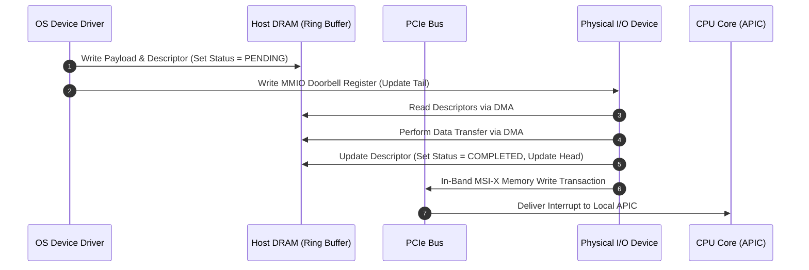

# Datacenter Systems: IO Virtualization

Input/Output (I/O) virtualization abstracts physical network interfaces, disk controllers, and hardware accelerators across multiple isolated execution environments, resolving the performance, latency, and security bottlenecks imposed by software hypervisors in high-throughput datacenter workloads.

---

## Server Hardware & Interconnect Architecture Motivation & Overview

Datacenter server architectures must balance high-performance CPU/memory access against high-bandwidth, high-density I/O peripheral connectivity. Physical layout, bus topology, and pin allocation directly dictate latency and throughput trade-offs across the memory hierarchy.

### The Microarchitectural Distance Rule
Physical distance from the CPU die dictates access latency and available bandwidth:
$$\text{Proximity to CPU} \propto \frac{1}{\text{Access Latency}}$$

- **On-Chip & Coherent Interconnects (Low Latency)**: CPU cores, L1/L2/L3 caches, and local DDR4/DDR5 memory channels operate on tight clock cycles. Inter-socket communication uses high-speed coherent interconnects like **QuickPath Interconnect (QPI)** or **Ultra Path Interconnect (UPI)**, giving software the illusion of a single multi-core NUMA system.
- **Peripheral & Storage Interconnects (High Bandwidth)**: I/O devices (Network Interface Cards / NICs, NVMe SSDs, GPUs) operate at higher latency and communicate over **PCI Express (PCIe)** or **Direct Media Interface (DMI)** buses optimized for bulk data throughput rather than sub-nanosecond access.
- **Compute Express Link (CXL)**: A modern cache-coherent protocol running over physical PCIe Gen5/Gen6 wires. CXL enables low-latency memory sharing and poolable memory expansion across CPUs and hardware accelerators (GPUs, FPGAs) without passing through traditional high-latency I/O drivers.
- **Legacy I/O Hubs**: Legacy chipsets (e.g., Southbridge connected via DMI) multiplex low-speed peripherals (USB, SATA, serial ports) off the main system bus, preventing legacy device interrupts from cluttering high-speed PCIe lanes.

![[Screenshots/Server Hardware.png]]

### Hardware Connector Trade-offs

| Interconnect | Primary Target | Latency | Bandwidth / Characteristics |
| :--- | :--- | :--- | :--- |
| **QPI / UPI** | Inter-Socket CPU & NUMA Memory | Very Low (~50–80 ns) | Cache-coherent, high bandwidth across CPU sockets. |
| **DDR4 / DDR5** | System Main Memory (DRAM) | Ultra Low (~14–60 ns) | Direct memory channel access. |
| **PCIe (Gen 4/5/6)** | High-Speed Peripherals (NICs, NVMe, GPUs) | Moderate (~100–500 ns) | High serial throughput per lane (x4, x8, x16 configurations). |
| **CXL** | Accelerator Memory Pooling & Disaggregation | Low (~100 ns) | Built on PCIe physical layer with cache-coherency protocols. |
| **DMI / I/O Hub** | Legacy Peripheral Controllers | High (> 1 $\mu$s) | Low-speed hub interface for USB, SATA, and system firmware. |

---

## High-Throughput I/O Architecture & DMA Ring Buffers

### Direct Memory Access (DMA)
Traditional I/O where the CPU directly executes `IN`/`OUT` instructions or programmed MMIO reads/writes for every byte scales poorly. Datacenter systems rely on **Direct Memory Access (DMA)**: the hardware I/O device directly reads from or writes to physical host memory (DRAM) without CPU intervention.

### DMA Ring Buffer Mechanics
To coordinate asynchronous data transfers between the OS device driver (producer/consumer) and physical hardware controllers, systems implement circular **DMA Ring Buffers** in shared physical host memory.

```
                  DMA Ring Buffer (Host DRAM)
         +-------------------------------------------+
         | Descriptor 0 | Descriptor 1 | Descriptor 2| ...
         +-------------------------------------------+
               ^                            ^
               |                            |
          Head Pointer                 Tail Pointer
       (Hardware Consumer)          (Driver Producer)
```

#### Ring Buffer Descriptors
Each entry in a DMA ring buffer contains a fixed-size control descriptor:
1. **Status Flag**: Indicates descriptor state (e.g., `PENDING`, `PROCESSING`, `COMPLETED`).
2. **Transfer Direction**: Specifies operation type (`READ` from host DRAM to device, or `WRITE` from device to host DRAM).
3. **Target Buffer Physical Address**: Pointer to the contiguous host DRAM buffer where payload data resides.
4. **Buffer Length**: Size of payload buffer (e.g., discrete multiples of 4KB disk blocks or variable packet payload lengths).
5. **Control Flags / Doorbell Bits**: Hardware-specific flags, completion pings, or interrupt suppression directives.

#### Complete I/O Execution Cycle
1. **Driver Post**: The OS driver writes payload buffers to host memory, populates ring buffer descriptors, and updates the **Tail Pointer** by writing to a physical **Doorbell Register** on the PCIe device.
2. **Device Fetch**: The I/O controller detects the tail pointer update, fetches pending descriptors via DMA from host DRAM, and processes them.
3. **Data Transfer**: The device executes DMA payload transfers directly into or out of target DRAM buffers.
4. **Completion Update**: The device marks descriptor status as `COMPLETED`, updates the **Head Pointer**, and triggers an interrupt (or notifies the driver via doorbells/polling).

![[Screenshots/High Throughput IO.png]]

---

## Interrupt Handling & Message-Signaled Interrupts (MSI/MSI-X)

### The Interrupt Storm Problem
If a high-throughput 100 Gbps NIC triggers a CPU interrupt for every incoming 1500-byte network packet, the system receives over 8 million interrupts per second. Context-switching CPU cores to handle interrupts at this rate causes severe performance degradation due to CPU pipeline flushes, kernel context switch overhead, and cache invalidation.



### Interrupt Coalescing
Hardware I/O controllers mitigate interrupt storms via **Interrupt Coalescing**:
- The device delays issuing an interrupt until either a configurable timer expires (e.g., 50 $\mu$s) or a batch threshold of $N$ descriptors complete.
- This allows the OS driver to process multiple completed descriptors within a single interrupt execution cycle.
- *Trade-off*: Higher batching throughput versus slightly increased latency per individual packet.

### Message-Signaled Interrupts (MSI / MSI-X)
Legacy system architectures relied on dedicated physical interrupt lines (pin-based IRQs like INTx) connected to the system interrupt controller. Pin-based interrupts suffered from limited lines, shared IRQ conflicts, and explicit bus synchronization bottlenecks.

Modern PCIe devices use **Message-Signaled Interrupts (MSI / MSI-X)**:
- **In-Band Memory Writes**: An interrupt is delivered as an in-band DWORD memory write transaction over the standard PCIe bus targeted at a special CPU Local APIC memory window (`0xFEE00000`).
- **Pipelining & Strict Synchronization Guarantee**: Because MSI/MSI-X interrupt messages flow through the exact same PCIe transaction queues as DMA data writes, PCIe hardware guarantees ordering. Receiving an MSI interrupt write at the CPU APIC guarantees that all preceding DMA memory writes have landed in host DRAM.

---

## Virtual Machine I/O & Paravirtualization (VirtIO)

Virtualizing I/O operations for virtual machines requires handling guest device drivers while maintaining multi-tenant isolation and hypervisor control.

### Trap-and-Emulate I/O (Full Hardware Emulation)
In full hardware emulation (e.g., QEMU emulating an Intel e1000 NIC or IDE disk):
- The Guest OS runs standard unmodified device drivers.
- Every time the guest driver reads or writes MMIO/IO registers (e.g., updating ring buffer pointers), the CPU hardware generates a **`vmexit` trap** into the Virtual Machine Monitor (VMM).
- **Double Trap Overhead**: Handling a single virtual I/O request requires two full `vmexit` transitions:
  1. `vmexit` trap when Guest OS issues MMIO read/write to virtual device registers.
  2. `vmexit` trap when VMM injects a virtual interrupt back into the Guest OS upon completion.

```
Guest OS (Ring 1 / VMX Non-Root)
  | Write Virtual MMIO Register
  v
=================== VMEXIT TRAP ===================
  | (Context Switch Overhead ~1000+ CPU Cycles)
  v
VMM / Hypervisor (Ring 0 / VMX Root)
  | Emulate Hardware Register State
  | Dispatch Host I/O Operation
=================== VMENTRY =======================
```

### VirtIO: Paravirtualized I/O
**VirtIO** avoids trap-and-emulate overhead by introducing a standardized paravirtualized device architecture where the Guest OS is aware it runs inside a virtualized environment.

- **Unified Interface**: Standardized drivers (`virtio-net`, `virtio-blk`, `virtio-scsi`) interface with virtual devices exported by the hypervisor.
- **Virtqueues (Shared Memory Rings)**: Communication uses lockless shared memory ring structures (`virtqueues`) accessible by both Guest OS and VMM.
- **Interrupt Suppression (`no_interrupt`)**:
  - The Guest OS can set a `no_interrupt` flag in a shared memory location during heavy packet processing.
  - While set, the hypervisor suppresses virtual interrupts, allowing the guest driver to poll `virtqueues` in user space without triggering `vmexit` transitions.
  - When clearing `no_interrupt`, the guest re-checks `virtqueues` for pending entries to eliminate race conditions.

---

## Hypervisor I/O Bypass, SR-IOV & IOMMU

For high-performance datacenter workloads (e.g., financial trading, high-frequency networking, database storage engines), paravirtualized VirtIO still introduces software latency overhead due to hypervisor context switches. Datacenter systems implement **Hypervisor I/O Bypass** to deliver bare-metal I/O performance directly to Guest VMs.

![[Screenshots/Hypervisor IO Bypass.png]]

### Single-Root I/O Virtualization (SR-IOV)
**SR-IOV** is a PCIe hardware specification that enables a single physical PCIe device (such as a 100G NIC) to present itself to the PCIe bus as multiple independent virtual devices.

```
                     Physical PCIe Network Card (SR-IOV Enabled)
                    +-------------------------------------------+
                    | Physical Function (PF) - Hypervisor Mgmt  |
                    +-------------------------------------------+
                    | Virtual Function 0 | Virtual Function 1   | (Hardware Slices)
                    +--------------------+----------------------+
                              |                    |
                              v                    v
                        Assigned to VM 1     Assigned to VM 2
                     (Direct Pass-Through) (Direct Pass-Through)
```

- **Physical Function (PF)**: The primary PCIe function containing full configuration capabilities, used by the host hypervisor to manage the physical device, assign resources, enforce rate limits, and configure packet routing filters.
- **Virtual Function (VF)**: Lightweight hardware slices of the physical device assigned directly to individual Guest VMs via PCIe passthrough.
  - Each VF exposes its own independent MMIO register set and DMA ring buffer pointers (`head`, `tail`, status).
  - The Guest VM loads native hardware drivers that interact directly with its assigned VF, achieving near-zero `vmexit` overhead and bare-metal throughput.

### Device IOMMU (Input-Output Memory Management Unit)
Directly granting Guest VMs raw PCIe DMA access introduces a critical security hazard: physical PCIe DMA engines bypass the CPU MMU and operate directly on host physical addresses (HPA). A buggy or malicious guest could program its assigned PCIe device to execute DMA operations across arbitrary host physical memory, violating hypervisor isolation.

The **Input-Output Memory Management Unit (IOMMU)** (e.g., **Intel VT-d**, **AMD-Vi**) resolves this security threat by providing hardware address translation and protection for PCIe DMA requests.

![[Screenshots/Device IOMMU.png]]

#### IOMMU Two-Dimensional Translation Mechanics
1. **DMA Interception**: When a device VF issues a DMA read or write request, the request passes through the hardware IOMMU before reaching the system memory controller.
2. **Address Translation Hierarchy**:
   - The IOMMU inspects the device's Requester ID (PCIe Bus/Device/Function tuple) and looks up its assigned base-register page table.
   - Translates Device Virtual Addresses (IOVA) or Guest Physical Addresses (GPA) directly to **Host Physical Addresses (HPA)** using I/O page tables managed exclusively by the host hypervisor.
3. **Isolation & Fault Protection**: If a Guest VM attempts a DMA transfer outside its granted physical memory pages, the IOMMU blocks the transaction, raises a hardware fault interrupt, and isolates the offending guest.

---

## Edge Cases, Failure Modes & Mitigations

### 1. Interrupt Storm System Saturation
- **Failure Mode**: High packet arrival rates flood host CPU cores with hardware interrupts, starving user-space application threads.
- **Mitigation**: Enable adaptive interrupt coalescing on physical NICs and switch drivers to hybrid polling/interrupt modes (e.g., Linux NAPI framework).

### 2. DMA Buffer Cache Incoherency
- **Failure Mode**: CPU reads cached stale data from DRAM while a PCIe device writes updated payload data via DMA.
- **Mitigation**: Ensure PCIe bus snooping is supported by host CPU architecture or explicitly invalidate CPU cache lines around DMA buffer regions prior to driver reads.

### 3. Hypervisor Overcommit & IOMMU Page Faults
- **Failure Mode**: SR-IOV device attempts DMA transfer into a Guest Physical Address page that has been swapped out or unmapped by the hypervisor, triggering an IOMMU hardware fault.
- **Mitigation**: Pin Guest VM physical RAM allocated for DMA buffers (`mlock` / hugepages) to prevent hypervisor page swapping during active SR-IOV passthrough.

---

## Formal Analysis / Protocol Specification

### Formal Definition: Two-Dimensional IOMMU Address Translation Invariant

Let $GPA$ be a Guest Physical Address generated by a Guest OS executing inside a virtual machine, and let $HPA$ be the actual Host Physical Address in physical DRAM.

Let $T_{\text{IOMMU}}$ represent the hardware IOMMU page table mapping function for a given PCIe Device Function $VF_k$:
$$T_{\text{IOMMU}}(VF_k, GPA) \to HPA$$

For any DMA memory read or write transaction $Op(VF_k, GPA, \text{Length})$ issued by virtual device $VF_k$:

1. **Safety Boundary Constraint**:
$$\forall GPA \in \text{Domain}(Op), \quad T_{\text{IOMMU}}(VF_k, GPA) \in \text{MemoryRegion}(\text{VM}_k)$$

2. **Translation Invariant**:
$$\text{MemoryController}(GPA) = \begin{cases} 
HPA = T_{\text{IOMMU}}(VF_k, GPA) & \text{if } GPA \in \text{ValidPages}(\text{VM}_k) \\
\text{FAULT} & \text{otherwise}
\end{cases}$$

### Simplified Explanation
The IOMMU acts as a hardware firewall and address translator for PCIe devices: it ensures a virtual machine's network card or NVMe drive can only access the exact host DRAM pages assigned to that specific virtual machine, blocking unauthorized hardware memory reads or writes.

---

## Industry Standard Terms

| Course Term | Industry / Standard Term | Real-World Production Equivalent |
| :--- | :--- | :--- |
| **QPI / UPI** | Ultra Path Interconnect | Intel UPI, AMD Infinity Fabric (IF) |
| **CXL** | Compute Express Link | CXL 2.0 / 3.0 memory expansion & pooling modules |
| **DMA Ring Buffer** | Circular DMA Queue / Descriptors | Linux `io_uring`, DPDK ring buffers, NVMe submission/completion queues |
| **MSI / MSI-X** | Message Signaled Interrupts | PCIe MSI-X vectors assigned to CPU APIC cores |
| **VirtIO** | Paravirtualized I/O | KVM/QEMU `virtio-net`, `virtio-blk`, AWS Nitro Hypervisor virtual devices |
| **SR-IOV** | Single-Root I/O Virtualization | Mellanox ConnectX SR-IOV VFs, Intel E810 NIC virtualization |
| **Device IOMMU** | I/O Memory Management Unit | Intel VT-d, AMD-Vi, ARM SMMU (System MMU) |

---

## Related

- [[Datacenter Systems/Execution Environments and Virtualization|Execution Environments and Virtualization]] — Foundational taxonomy of datacenter execution environments and hypervisor memory hierarchies
- [[Datacenter Systems/The Popek-Goldberg Virtualization Theorem|The Popek-Goldberg Virtualization Theorem]] — Formal CPU hardware trap-and-emulate requirements and virtual I/O emulation mechanics
- [[Datacenter Systems/Virtual Machines|Virtual Machines]] — CPU virtualization, Shadow Page Tables vs. Intel EPT nested paging, and virtio dynamic ballooning
- [[Datacenter Systems/Warehouse-Scale Computer Architecture|Warehouse-Scale Computer Architecture]] — Physical server building blocks, rack topologies, and bisection bandwidth constraints
- [[Operating Systems/Persistence/Storage/Organization of the IO Function|Organization of the IO Function]] — Low-level OS kernel interrupt vectors, block device queues, and storage subsystem architectures