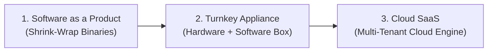
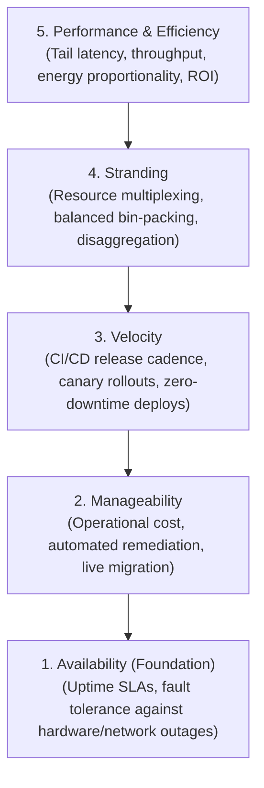
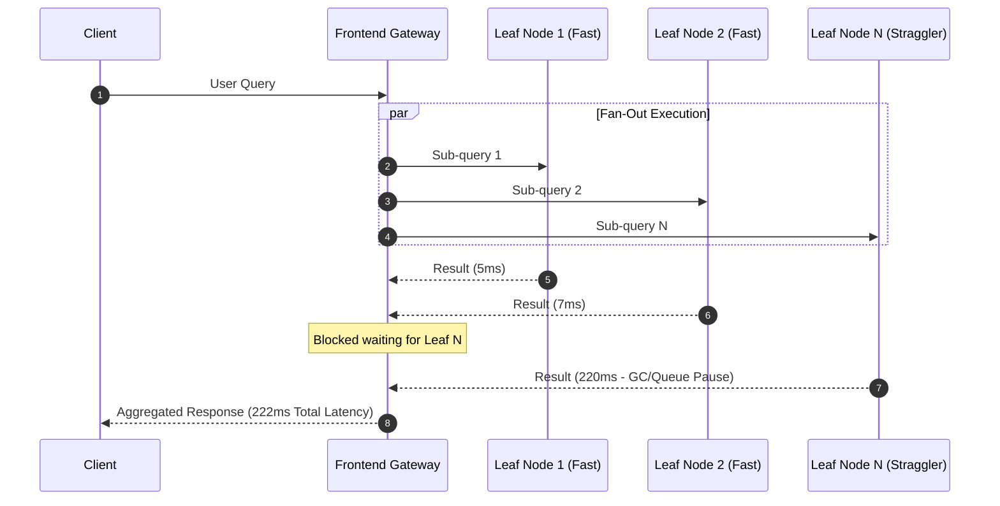

# Datacenter Systems: Introduction

Modern datacenter systems treat warehouse-scale clusters as single massive computing engines, abstracting heterogeneous compute, memory, storage, and networking hardware to deliver resilient, multi-tenant cloud services.

---

## Datacenter Systems Motivation & Overview

Traditional computing models relied on standalone servers or desktop workstations executing shrink-wrapped applications. Modern warehouse-scale computing (WSC) emerged because modern internet services require continuous availability, extreme scale, and sub-millisecond latencies that no single physical machine can satisfy.

### Common Engineering Challenges in Datacenter Systems

Building and operating warehouse-scale infrastructure introduces five fundamental engineering challenges:

1. **Performance Analysis at Scale**: Tracing distributed execution paths, pinpointing tail-latency bottlenecks across thousands of microservices, and identifying inter-service contention without introducing massive tracing overhead.
2. **Low Latency and High Throughput**: Balancing massive request concurrency (millions of queries per second) with strict single-digit millisecond latency Service Level Objectives (SLOs).
3. **Extreme Scale & Elastic Provisioning**: Handling diurnal and seasonal traffic spikes dynamically through horizontal auto-scaling without over-provisioning idle resources.
4. **Hardware Specialization & Co-design**: Tailoring distributed software runtimes to specialized hardware (such as GPUs, TPUs, SmartNICs, FPGAs, Non-Volatile Memory, and NVMe-oF fabrics).
5. **Full-System Experimentation**: Safely evaluating runtime optimizations, kernel scheduler changes, and network protocols in live production clusters without disrupting multi-tenant availability.

### Evolution of Software Delivery Models

The industry transitioned through three distinct deployment paradigms to reach modern cloud architecture:



#### 1. Software as a Product
- **Mechanism**: The vendor compiles and packages standalone application binaries shipped directly to customers for on-premises installation across heterogeneous desktop and server hardware.
- **Trade-offs**:
  - *Advantages*: Complete customer data sovereignty; zero vendor hosting infrastructure cost.
  - *Disadvantages*: Massive porting matrix; difficult bug reproduction across diverse OS/hardware combinations; fragmented upgrade cycles; rampant software piracy.

#### 2. Turnkey Appliance
- **Mechanism**: The vendor packages software with pre-qualified, proprietary server hardware as an integrated appliance (e.g., enterprise healthcare record systems like Epic, hardware firewalls, or dedicated storage appliances). Telemetry, billing, and global updates backhaul to a vendor-operated datacenter.
- **Trade-offs**:
  - *Advantages*: Eliminates the hardware compatibility and porting problem by standardizing the execution environment.
  - *Disadvantages*: High capital expenditure (CapEx) for customers; physically rigid (users cannot access systems remotely unless additional hardware is purchased); vendor must build and maintain high-availability distributed backends for updates and telemetry.

#### 3. Cloud-Based Software as a Service (SaaS)
- **Mechanism**: The backend runs entirely inside hyperscale cloud datacenters across shared pools of compute and storage. Users interact via thin clients (web browsers, mobile applications, or commodity workstations) while the cloud backend performs all heavy processing, state storage, replication, and backup.
- **Trade-offs**:
  - *Advantages*: Seamless 24/7 global accessibility; continuous zero-downtime feature delivery; elastic auto-scaling; multi-datacenter geographic fault tolerance.
  - *Disadvantages*: Total reliance on network connectivity; multi-tenant security risks; operational complexity of managing large-scale distributed consensus and data consistency.

### Cloud Service Abstraction Hierarchy

Cloud providers structure compute and storage into layered abstractions:

| Abstraction Layer | Core Capability | Provider Responsibility | Customer Responsibility | Production Examples |
| :--- | :--- | :--- | :--- | :--- |
| **IaaS** (Infrastructure as a Service) | Raw compute instances, virtual private clouds (VPCs), and block/object storage. | Physical hardware, virtualization hypervisor, datacenter facilities. | Guest OS, runtime, application code, data, networking rules. | AWS EC2 / S3, GCP Compute Engine, Azure VMs |
| **PaaS** (Platform as a Service) | Managed application runtime, managed databases, pub/sub event buses. | OS management, automatic scaling, patching, runtime maintenance. | Application logic, schemas, configurations. | Google App Engine, AWS Elastic Beanstalk, Firebase |
| **FaaS** (Function as a Service / Serverless) | Ephemeral, event-triggered function execution. Decomposes apps into fine-grained tasks. | Complete container lifecycle, cold starts, elastic micro-billing per millisecond. | Pure stateless function logic. | AWS Lambda, Google Cloud Functions, Cloudflare Workers |
| **SaaS** (Software as a Service) | End-user applications accessible via web and mobile APIs. | Entire software stack, high availability, disaster recovery, security. | User configuration, access management. | Google Workspace, Microsoft 365, Salesforce |

---

## Architecture & Core Mechanics

### Cloud Operator Pyramid of Concerns (Google)

Operational priorities in hyperscale cloud environments follow a strict hierarchical dependency model:

![[Cloud Operator Pryamid of Google.png]]

The fundamental architectural principle governing this pyramid is **structural precedence**:
> **Precedence Invariant**: Lower tiers carry strictly higher operational weight than higher tiers. If an architectural change improves performance or feature velocity but compromises availability or operational manageability, it is rejected.



1. **Availability (The Foundation)**:
   - Measures the percentage of time that cloud services correctly process requests.
   - Must survive power grid failures, optical fiber cuts, top-of-rack (ToR) switch crashes, kernel panics, and human configuration mistakes.
   - High availability targets typically require "four nines" (99.99%) or "five nines" (99.999%) uptime.
2. **Manageability**:
   - Focuses on total cost of ownership (TCO) and operational overhead.
   - Systems must support non-disruptive rolling kernel updates, firmware flashes, hardware decommissioning, and automated error mitigation without human intervention.
3. **Velocity**:
   - The speed with which engineering teams can safely deploy new code and infrastructure improvements to production.
   - Enabled by automated canary analysis, hermetic container builds, and blue-green deployments.
4. **Stranding (Resource Utilization & Multiplexing)**:
   - **Resource Stranding** occurs when a physical server has exhausted one critical resource (e.g., 100% of its DRAM is allocated) while other resources (e.g., 70% of CPU cores and disk I/O) remain unallocated and unusable.
   - Mitigated via bin-packing schedulers, dynamic oversubscription, and hardware disaggregation.
5. **Performance and Efficiency (The Peak)**:
   - Optimizing request latency, query throughput, FLOPS per watt, and infrastructure return on investment (ROI).

---

### Primary Datacenter Engineering Concerns

Beyond the hierarchical pyramid, datacenter operators manage several intersecting technical constraints:

#### 1. Tail Latency and Parallel Request Fan-out
In modern cloud backends, a single user request fans out across hundreds or thousands of leaf nodes (e.g., parallel search indexing, recommendation retrieval, database sharding). Because the root node must aggregate responses from all leaf nodes, the end-to-end request latency is governed by the **tail latency** (99th or 99.9th percentile) of the slowest leaf node ("straggler"):



#### 2. Multi-Tenant Isolation: Security vs. Performance
Datacenters multiplex multiple competing tenants on the same physical hardware:
- **Security Isolation**: Hypervisors and container namespaces prevent tenants from accessing sibling memory or executing side-channel attacks (e.g., Spectre, Meltdown).
- **Performance Isolation**: Prevents a "noisy neighbor" or "whale tenant" from monopolizing shared physical resources (L3 CPU cache, memory bus bandwidth, PCIe lanes, or Top-of-Rack network switch buffers).

#### 3. Energy Consumption, Cooling, and Carbon Footprint
- Datacenters consume approximately 1% to 2% of total worldwide electricity generation, with compute demand compounding at ~40% annually due to distributed AI/ML workloads.
- Infrastructure efficiency is measured via **Power Usage Effectiveness (PUE)**, driving innovations in liquid immersion cooling, free-air economizers, and energy-proportional computing.

### Class Topics Roadmap

- [ ] **Virtualization & Software-Defined Networking (SDN)**:
  - Providing cloud customers with the abstraction of having their own small-scale dedicated datacenter that can scale elastically as needed.
- [ ] **Server, Storage, and Networking Hardware Technologies**:
  - Analyzing fundamental trade-offs between hardware cost, energy efficiencies, and low-latency performance.
- [ ] **Disaggregation**:
  - Eliminating resource stranding by pooling compute, memory, and storage across customers (vs. traditional per-server resource isolation).
- [ ] **Oversubscription, Congestion, and Queuing Theory**:
  - Predicting and modeling in advance how many shared resources are required to meet strict service expectations and latency targets.
- [ ] **Redundancy for High Availability**:
  - Mitigating hardware and network faults to maintain continuous cluster uptime.
- [ ] **Caching for Low Latency**:
  - Multi-tier caching hierarchies to bypass expensive storage and network hops.
- [ ] **Power, Cooling, and Carbon Footprint**:
  - Infrastructure thermal management, power distribution limits, and environmental impact.

---

### Assumptions About the Class (What It Expects You to Know)

- **Distributed System-Level Programming**:
	  - Hands-on systems programming dealing directly with **gRPC**, **Kubernetes**, and microservice orchestration.
	  - Core distributed concepts: [[Distributed Systems/RPC/Remote Procedure Call (RPC)|Remote Procedure Call (RPC)]], distributed consensus, replicated state machines, and RPC semantics.
- **Operating Systems**:
	  - **POSIX system call API** ([[Systems Programming/File IO and POSIX/System Calls|System Calls]]).
	  - **Networking interfaces, [[Operating Systems/Networking/Routing Tables|routing tables]]**, and kernel socket APIs.
	  - **File systems** and storage I/O subsystems.
	  - Virtual memory management ([[Operating Systems/Memory/Virtual Memory|Virtual Memory]]), page tables, and thread/process scheduling.
- **Computer Networking**:
	  - **Packet-oriented protocols**.
	  - **TCP/IP** (including [[Networking/Transport/Transport Layer - Transmission Control Protocol (TCP)|TCP]] flow and congestion control) and **Ethernet**.
	  - Packet-switched network architectures, switches, and routing protocols.
- **Computer Architecture**:
	  - Physical **hardware**, CPU **registers**, and register conventions.
	  - **PCIe** buses and DMA interconnects.
	  - Memory hierarchies (L1/L2/L3 CPU caches, DRAM) and memory buses.

---

## Concrete Walkthrough & Execution Trace

### End-to-End Execution Trace: Monolithic Appliance vs. Cloud SaaS

Consider an enterprise record update (e.g., updating a patient medical chart):

```
Scenario: Updating record ID #84920 under peak user load

Approach A: Turnkey Appliance (On-Premises Box)
  1. Client sends update over local LAN to appliance box.
  2. Local appliance CPU processes business logic directly on single node.
  3. Writes to internal RAID-10 disk array; synchronous fsync blocks processing.
  4. Appliance enqueues asynchronous billing/telemetry RPC to vendor datacenter.
  Failure Mode: If the appliance power supply fails or motherboard fries, 
                the entire hospital unit halts until a technician replaces physical hardware.

Approach B: Cloud SaaS (Hyperscale Datacenter)
  1. Client sends TLS HTTP/2 request to Cloud Anycast IP.
  2. Cloud Border Router routes packet to nearest edge datacenter via BGP.
  3. Load balancer terminates TLS and forwards request over internal SDN to an API Gateway Pod.
  4. API Gateway parses Protobuf payload and fans out gRPC requests:
       - Auth Service: Validates token against distributed cache (0.8ms).
       - Billing Service: Enqueues transaction to distributed log (1.2ms).
       - Storage Service: Replicates update across 3 availability zones via Paxos/Raft (4.5ms).
  5. API Gateway aggregates responses and returns HTTP 200 OK to client (total elapsed: 7.1ms).
  Resilience: If a physical server crashes mid-flight, container orchestrator (Kubernetes) 
              reschedules pods instantly, and storage replicas complete write transparently.
```

---

## Edge Cases, Failure Modes & Mitigations

### 1. The Straggler Effect (Tail Latency Amplification)
- **Failure Mode**: When an operation fans out to $N = 100$ parallel tasks, if even one leaf server experiences an OS background task pause, garbage collection cycle, or TCP packet retransmission, the entire parent request waits for that slowest node.
- **Mitigation**:
  - **Hedged Requests**: Send duplicate sub-requests to a secondary replica if no response is received within the 95th percentile window; cancel the slower request once the first returns.
  - **Tied Requests**: Replicate request tokens across multiple server queues simultaneously; when one server dequeues the request, it cancels the peer tickets.

### 2. Resource Stranding in Multi-Tenant Nodes
- **Failure Mode**: A physical node with 64 CPU cores and 256 GB RAM hosts multiple memory-intensive database containers allocating 256 GB RAM but utilizing only 8 CPU cores. The remaining 56 CPU cores cannot be rented to compute jobs requiring memory, resulting in stranded capital.
- **Mitigation**:
  - **Hardware Disaggregation**: Decoupling compute blades from shared pools of memory (via CXL interconnects) and storage (via NVMe-over-Fabrics), allowing independent scaling and allocation.
  - **Overcommit / Dynamic Resizing**: Provisioning burstable low-priority batch workloads (e.g., video transcoding, ML training) on stranded compute cycles.

### 3. Network Incast Congestion
- **Failure Mode**: A frontend node issues a parallel scatter-gather query to 50 leaf nodes. All 50 leaf nodes respond simultaneously, flooding the Top-of-Rack (ToR) switch port connected to the frontend node, causing packet buffer exhaustion and massive tail-drop packet loss.
- **Mitigation**:
  - Small switch buffer sizing paired with Explicit Congestion Notification (ECN) and Data Center TCP (DCTCP).
  - Paced response scheduling and receiver-driven flow control.

---

## Formal Analysis / Protocol Specification

### 1. Availability and Down Time Formulation

#### Formal Definition
Availability $A$ is defined as the ratio of uptime to total operational time:

$$A = \frac{\text{MTBF}}{\text{MTBF} + \text{MTTR}} = \frac{T_{\text{uptime}}}{T_{\text{total}}}$$

Where:
- $\text{MTBF}$ = Mean Time Between Failures.
- $\text{MTTR}$ = Mean Time To Repair.

Allowable downtime $\Delta t_{\text{down}}$ over period $T$ for a given target SLA availability fraction $A$:

$$\Delta t_{\text{down}} = T \times (1 - A)$$

For a weekly period ($T = 7 \text{ days} = 10,080 \text{ minutes}$):
- $A = 0.9999$ (Four Nines):
  $$\Delta t_{\text{down}} = 10,080 \times 10^{-4} \approx 1.008 \text{ minutes/week}$$
- $A = 0.99999$ (Five Nines):
  $$\Delta t_{\text{down}} = 10,080 \times 10^{-5} \approx 6.048 \text{ seconds/week}$$

#### Simplified Explanation
Every added "nine" of availability divides permissible failure time by a factor of 10. At four nines, your service can only be down for about one minute in an entire week. At five nines, you only get six seconds of downtime per week before breaching your contract.

---

### 2. Fan-Out Tail Latency Probability

#### Formal Definition
Let a root query fan out to $N$ independent parallel leaf nodes. Let $X_i$ be the latency of leaf node $i$, with cumulative distribution function $F(t) = P(X_i \le t)$.

Assuming identical and independent distributions (i.i.d.), the overall query latency $L = \max(X_1, X_2, \dots, X_N)$ has distribution:

$$P(L \le t) = [F(t)]^N$$

The probability that the overall query exceeds latency threshold $t$ is:

$$P(L > t) = 1 - [P(X_i \le t)]^N = 1 - [1 - P(X_i > t)]^N$$

If a single sub-task has a 1% chance ($p = 0.01$) of exceeding 100ms ($P(X_i > 100\text{ms}) = 0.01$), then for a fan-out of $N = 100$ leaf nodes:

$$P(L > 100\text{ms}) = 1 - (1 - 0.01)^{100} = 1 - (0.99)^{100} \approx 1 - 0.366 = 0.634 \quad (63.4\%)$$

#### Simplified Explanation
Even if 99% of your servers respond quickly on their own, when a single request must wait for 100 servers to finish, nearly two-thirds of all user requests will suffer the slow 99th-percentile delay.

---

### 3. Power Usage Effectiveness (PUE)

#### Formal Definition
$$\text{PUE} = \frac{\text{Total Facility Energy Consumption}}{\text{IT Equipment Energy Consumption}} = 1 + \frac{\text{Cooling} + \text{Power Losses} + \text{Lighting}}{\text{IT Power}}$$

$$\text{Efficiency Invariant}: \quad \text{PUE} \ge 1.0, \quad \lim_{\text{losses} \to 0} \text{PUE} = 1.0$$

#### Simplified Explanation
PUE measures how much extra power the datacenter burns on non-computing overhead (chiefly air conditioning, chillers, and electrical transformers) for every watt used to run actual servers. A PUE of 2.0 means you spend as much power cooling the building as you do computing; world-class modern hyperscale facilities achieve PUEs around 1.1.

---

## Industry Standard Terms

| Course Term | Industry / Production Term |
| :--- | :--- |
| **Cloud Operator Pyramid** | SRE Hierarchy of Needs / Cloud Operational Maturity Model |
| **Stranding** | Stranded Capacity / Fragmented Resource Allocation |
| **Whale Tenant** | Noisy Neighbor / Resource Hog / Unbounded Consumer |
| **Turnkey Appliance** | On-Premises Hardware Appliance / Integrated System |
| **Fan-Out Bottleneck** | Tail-at-Scale / Straggler Problem / Scatter-Gather Amplification |
| **Disaggregation** | Composable Infrastructure / Disaggregated Memory (CXL) / NVMe-oF |

---

## Related

- [[Datacenter Systems/Quiz Section 1|Quiz Section 1 — Microservices, RPC, and Cloud Infrastructure]] — Concrete lab tools, containerization, Go concurrency, and gRPC
- [[Distributed Systems/RPC/Remote Procedure Call (RPC)|Remote Procedure Call (RPC)]] — Underlying network semantics, sequence IDs, and failure models
- [[Operating Systems/Virtualization/Containers and Virt|Containers and Virtualization]] — Hypervisor virtualization vs. OS-level namespaces and cgroups
- [[Networking/Transport/Transport Layer - Transmission Control Protocol (TCP)|Transmission Control Protocol (TCP)]] — Transport protocol mechanics, socket buffers, and congestion control
- [[Vault Index|Vault Index]] — Master repository navigation index