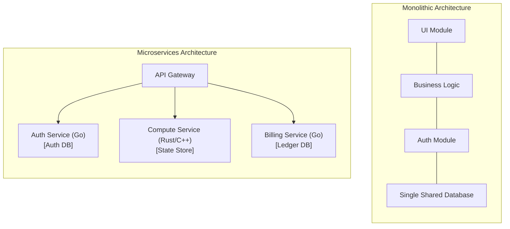
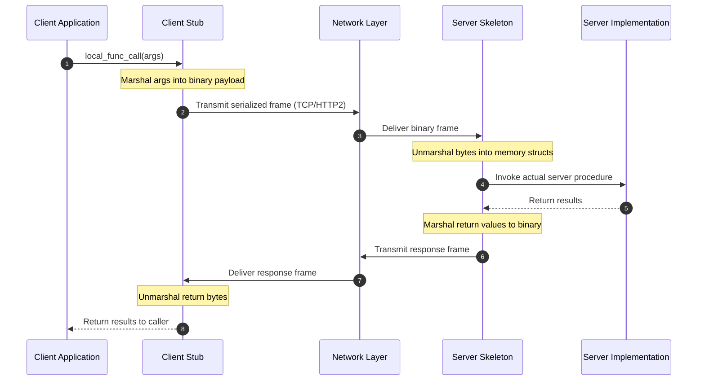
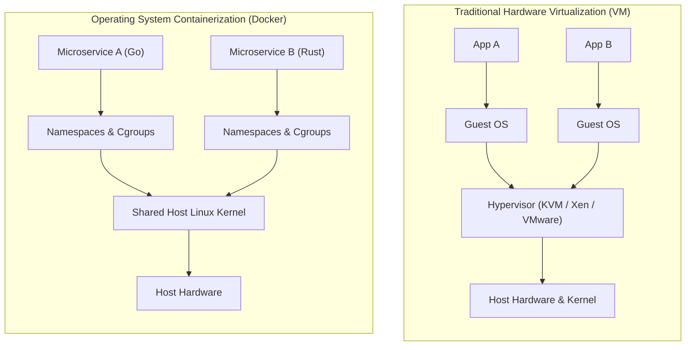

# Datacenter Systems: Quiz Section 1 — Microservices, RPC, and Cloud Infrastructure

Quiz Section 1 establishes the operational and engineering foundations for datacenter labs, covering microservice decomposition, gRPC serialization with Protocol Buffers, Linux containerization with Docker and Kubernetes, and concurrent systems programming in Go on Google Cloud Platform.

---

## Quiz Section 1 Motivation & Overview

Modern warehouse-scale applications cannot be effectively deployed as single monolithic binaries across thousands of servers. Systems engineers decompose complex applications into network-accessible services while balancing the trade-offs between monolithic efficiency and distributed decoupling.

### Architectural Comparison: Monolith vs. Microservices



| Architectural Dimension | Monolithic Architecture | Microservices Architecture |
| :--- | :--- | :--- |
| **Communication Mechanism** | In-memory function calls; pointer dereferencing ($\approx 1\text{--}5\text{ ns}$). | Network [[Distributed Systems/RPC/Remote Procedure Call (RPC)\|Remote Procedure Calls (RPC)]] ($\approx 0.5\text{--}10\text{ ms}$). |
| **Resource Efficiency** | Requires up to **80% fewer computing resources** for equivalent throughput (zero serialization or network stack overhead). | Higher compute/memory overhead due to protocol marshaling, socket buffers, and redundant per-service runtimes. |
| **Fault Isolation & Blast Radius** | Poor: A memory leak, null-pointer panic, or CPU spinlock in one module crashes the entire application process. | High: Service failures remain bounded to individual processes; upstream callers can degrade gracefully or retry. |
| **Data Architecture** | Single shared relational database schema with direct table joins and ACID guarantees. | **Database-per-service pattern**: Each microservice strictly encapsulates its private data store; cross-service joins are forbidden. |
| **Technology Heterogeneity** | Constrained to a single programming language runtime and shared dependency tree. | **Polyglot ecosystem**: Each service adopts the optimal language (e.g., C++/Rust for low-latency kernels, Go for networking, TypeScript for UI). |
| **Observability & Debugging** | Straightforward: Single stack traces and local profiling tools. | Complex: Requires distributed tracing (e.g., OpenTelemetry, Jaeger) to trace requests hopping across dozens of RPC boundaries. |

---

## Architecture & Core Mechanics

### Remote Procedure Call (RPC) & Pass-by-Value Semantics

An RPC mechanism abstracts network communication by enabling a program on a local machine to invoke a procedure or subroutine in a remote address space as if it were a local function call.



#### Pass-by-Value Invariant
In local procedural languages (like C or Go), functions can pass arguments either **by value** (copying data) or **by reference** (passing memory addresses/pointers). 
> **RPC Address Space Invariant**: Across a network boundary, memory pointers are completely meaningless because the client and server occupy distinct physical virtual address spaces. Therefore, **all RPC communication is strictly pass-by-value**. Every data object must be serialized into contiguous bytes, transmitted across the network, and reconstructed in the remote address space.

---

### gRPC and Protocol Buffers (Protobuf)

Google's **gRPC** framework uses **Protocol Buffers** as its Interface Definition Language (IDL) and binary serialization wire format. 

1. **Schema Definition (`.proto`)**: Defines strict contracts for service RPC methods and message types:
   ```proto
   syntax = "proto3";

   package datacenter.greeter;

   // The greeting service definition.
   service Greeter {
     // Sends a greeting RPC request and receives a greeting reply.
     rpc SayHello (HelloRequest) returns (HelloReply) {}
   }

   // The request message containing the user's name.
   message HelloRequest {
     string name = 1;
   }

   // The response message containing the greetings.
   message HelloReply {
     string message = 1;
   }
   ```
2. **Field Tags (`= 1`, `= 2`)**: Numbers assigned to fields are **tags** used to identify fields in the compact binary wire format. Field names are not transmitted over the wire, drastically minimizing payload size.
3. **Transport via HTTP/2**: gRPC runs on top of HTTP/2, providing:
   - **Stream Multiplexing**: Concurrent bidirectionally streaming requests and responses over a single underlying TCP connection without head-of-line blocking at the application layer.
   - **Binary Framing & Header Compression**: Uses HPACK compression on metadata headers to save bandwidth.

---

### Containers: Docker & Kubernetes

Datacenter services are deployed inside lightweight containers rather than full virtual machines:



#### Docker
- Provides OS-level virtualization by leveraging Linux kernel primitives:
  - **Namespaces** (`pid`, `net`, `mnt`, `ipc`, `uts`, `user`): Provide isolated views of processes, network interfaces, routing tables, and filesystem mounts.
  - **Control Groups (`cgroups`)**: Enforce hard limits and accounting on physical resource consumption (CPU quotas, memory limits, block I/O, network bandwidth).
- Packages binaries, dependencies, and filesystem layers into immutable **OCI Container Images**.

#### Kubernetes (K8s)
- Datacenter container orchestration engine that automates multi-node deployment, scaling, and lifecycle management.
- **Pod**: The atomic deployable unit in Kubernetes, representing a tightly coupled group of one or more containers sharing:
  - The same Linux network namespace (same IP address and port space, able to communicate over `localhost`).
  - Shared storage volumes.

---

### Systems Programming in Go (Golang)

Labs in this course are implemented in Go, engineered specifically for scalable network services:

- **Goroutines (Lightweight Concurrency)**:
  - Go runtimes employ an $M:N$ user-space scheduler multiplexing $M$ goroutines across $N$ OS kernel threads.
  - Goroutines begin with a compact dynamic stack of just **2 KB** (compared to 2 MB–8 MB fixed stacks for standard POSIX `pthreads`), allowing a single machine to host hundreds of thousands of concurrent connections.
- **Integrated Netpoller**:
  - The Go runtime integrates network I/O with Linux `epoll`. When a goroutine blocks on a network read or write, the runtime parks the goroutine without blocking the underlying OS thread, executing other runnable goroutines until the network socket triggers an `epoll` wakeup.
- **CSP Channels**:
  - Provides thread-safe message passing (`chan T`) to communicate between concurrent routines without low-level mutex contention.

---

### Google Cloud Platform (GCP) Lab Infrastructure

Course assignments execute on Google Cloud Platform:
- Each student group is provisioned dedicated **GCP Compute Engine Virtual Machines**.
- Microservices are compiled into Docker containers, networked over virtual subnets, and deployed within these VM instances.
- **Operational Constraint**: Cloud resources operate under strict educational budget credits. **Virtual machines must be stopped when not actively executing experiments** to avoid exhausting credits prematurely on idle compute time.

---

## Concrete Walkthrough & Execution Trace

### Tracing a Complete gRPC Call from Client to Server

```
Scenario: Client invokes Greeter.SayHello(name="Alice")

1. Client Call Initialization:
   - Application calls client_stub.SayHello(ctx, &HelloRequest{Name: "Alice"}).

2. Protobuf Serialization:
   - Stub invokes generated marshaler.
   - Field tag 1, Wire Type 2 (Length-delimited):
       Header byte: (field_number << 3) | wire_type = (1 << 3) | 2 = 0x0A
       Length byte: 0x05 (length of "Alice")
       Payload:     0x41 0x6C 0x69 0x63 0x65 ("Alice")
   - Output binary buffer: [0x0A, 0x05, 0x41, 0x6C, 0x69, 0x63, 0x65] (7 bytes total).

3. HTTP/2 Framing & Transmission:
   - Client gRPC runtime prepends 5-byte gRPC frame header:
       [0x00] (Compression flag: uncompressed)
       [0x00, 0x00, 0x00, 0x07] (Length: 7 bytes)
   - Wraps into an HTTP/2 DATA frame on active HTTP/2 stream #3.
   - Pushes TCP segments through Linux kernel socket out physical NIC.

4. Server Ingestion & Deserialization:
   - Server Linux kernel receives TCP packet; epoll notifies Go netpoller.
   - Server gRPC runtime parses HTTP/2 stream #3 and extracts the 7-byte Protobuf payload.
   - Generated unmarshaler parses tag 0x0A, allocates a Go struct:
       req := &HelloRequest{Name: "Alice"}

5. Application Execution:
   - Server dispatches a new Goroutine to invoke the user-implemented method:
       func (s *Server) SayHello(ctx, req) (*HelloReply, error) {
           return &HelloReply{Message: "Hello " + req.Name}, nil
       }

6. Return Path:
   - Response serialized to Protobuf bytes: [0x0A, 0x0B, "Hello Alice"].
   - Framed into HTTP/2 DATA frame and transmitted back across TCP socket.
   - Client stub unmarshals bytes and returns &HelloReply{Message: "Hello Alice"} to caller.
```

---

## Edge Cases, Failure Modes & Mitigations

### 1. Protobuf Field Tag Collisions & Schema Drift
- **Failure Mode**: A developer changes the data type of an existing field tag or reuses an obsolete tag number. Older clients parsing messages with updated schemas will suffer silent data corruption or deserialization panics.
- **Mitigation**:
  - Never reuse or renumber numeric field tags.
  - Mark deprecated fields as `reserved`:
    ```proto
    message UserProfile {
      reserved 2, 5 to 8;
      reserved "obsolete_field";
      string name = 1;
    }
    ```

### 2. Microservice Cascading Timeouts & Thread Starvation
- **Failure Mode**: Service A calls Service B, which calls Service C. If Service C hangs due to a database lock, Service B blocks, exhausting its connection pool and goroutines. Service A subsequently exhausts its workers, cascading failure across the entire cluster.
- **Mitigation**:
  - Always enforce explicit deadline timeouts using Go contexts (`context.WithTimeout`).
  - Implement circuit breakers to fail fast when downstream dependencies stop responding.

### 3. Container OOMKilled by Linux Cgroups
- **Failure Mode**: A memory-intensive Go microservice allocates memory beyond the `resources.limits.memory` defined in its container spec. The Linux kernel OOM (Out-of-Memory) killer immediately terminates the process with exit code 137 (`SIGKILL`).
- **Mitigation**:
  - Configure the Go runtime memory target (`GOMEMLIMIT`) to trigger garbage collection before reaching the hard cgroup threshold.
  - Set container memory requests and limits with adequate safety margins.

### 4. Cloud Credit Exhaustion via Idle VM Instances
- **Failure Mode**: Leaving multi-core cloud VM instances and attached persistent SSD storage disks running 24/7 drains lab project credits rapidly.
- **Mitigation**:
  - Stop VM instances via the GCP Console or CLI immediately upon concluding testing:
    ```bash
    gcloud compute instances stop <instance-name> --zone=<zone>
    ```

---

## Formal Analysis / Protocol Specification

### Protocol Buffer Wire Encoding (Key-Value Framing)

#### Formal Definition
A serialized Protocol Buffer message is a stream of key-value pairs. Each field's key on the wire is encoded as a variable-length integer (varint) representing:

$$\text{Key} = (\text{field\_number} \ll 3) \mid \text{wire\_type}$$

Where $\text{wire\_type}$ is defined by the 3 lowest bits:

| Wire Type | ID | Meaning | Used For |
| :--- | :--- | :--- | :--- |
| `0` | `VARINT` | Variable-length integer (1–10 bytes). | `int32`, `int64`, `uint32`, `bool`, `enum` |
| `1` | `I64` | Fixed 8 bytes. | `fixed64`, `sfixed64`, `double` |
| `2` | `LEN` | Length-delimited: varint length followed by data bytes. | `string`, `bytes`, embedded messages, packed arrays |
| `5` | `I32` | Fixed 4 bytes. | `fixed32`, `sfixed32`, `float` |

For a length-delimited field (`wire_type = 2`), the byte stream layout is:

$$\text{Stream} = [\text{Key}] \parallel [\text{Length}] \parallel [\text{Bytes}_{1 \dots \text{Length}}]$$

#### Simplified Explanation
Protobuf saves network space by avoiding sending field names like `"username"`. Instead, it shifts the field number left by 3 bits and packs the data-type code into the last 3 bits. This creates a tiny 1-byte header for fields numbered 1 through 15, followed immediately by the payload.

---

## Industry Standard Terms

| Course Term | Industry / Production Term |
| :--- | :--- |
| **Microservice** | Service-Oriented Architecture (SOA) / Distributed Service |
| **Stub / Skeleton** | Client Proxy / Server Dispatcher |
| **Serialization** | Marshaling / Pickling / Wire Encoding |
| **Pod** | Colocated Container Group / Atomic Scheduling Unit |
| **Netpoller** | I/O Multiplexer / Event Demultiplexer (`epoll` wrapper) |
| **GCP VM** | Compute Engine Virtual Machine / Cloud Instance |

---

## Related

- [[Datacenter Systems/Introduction|Course Introduction and Overview]] — Warehouse-scale computing fundamentals and the Cloud Operator Pyramid
- [[Distributed Systems/RPC/Remote Procedure Call (RPC)|Remote Procedure Call (RPC)]] — Deep dive into RPC fault models, at-most-once semantics, and deduplication
- [[Networking/Definitions/gRPC|gRPC]] — Protocol framing, HTTP/2 transport streams, and service interfaces
- [[Operating Systems/Virtualization/Containers and Virt|Containers and Virtualization]] — Linux namespaces, control groups, and container runtimes
- [[Concurrency, Parallelism, and Rust/Coroutines|Coroutines]] — Cooperative user-space multitasking, stack allocation, and M:N runtimes