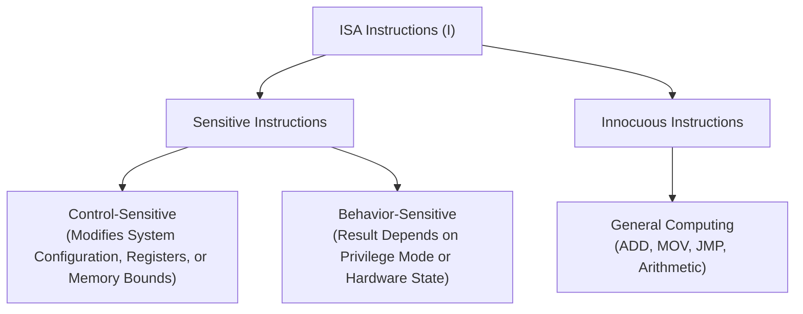
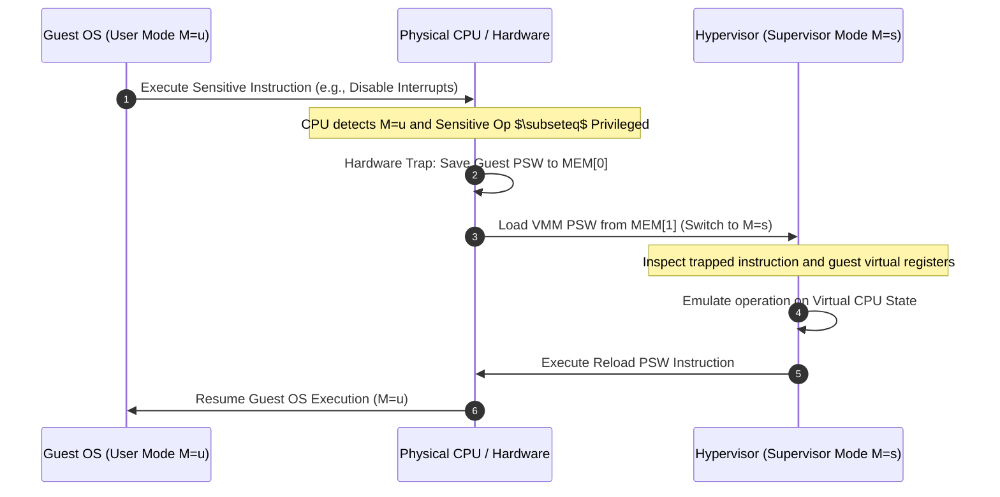
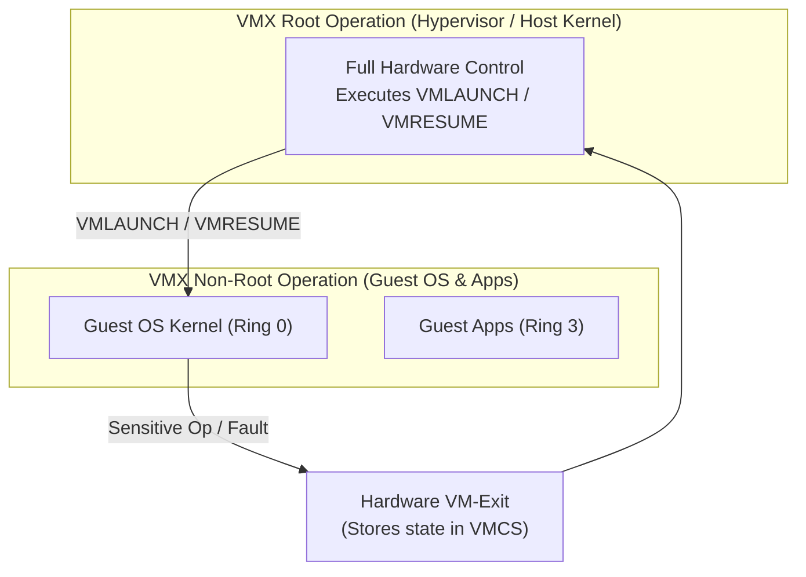

# Datacenter Systems: The Popek-Goldberg Virtualization Theorem

The Popek-Goldberg Virtualization Theorem defines the precise mathematical and architectural requirements an Instruction Set Architecture (ISA) must satisfy to support a Virtual Machine Monitor (VMM) using direct execution.

---

## The Popek-Goldberg Virtualization Theorem Motivation & Overview

In datacenter and cloud environments, virtualization enables multi-tenant resource multiplexing by presenting guest operating systems with an isolated, efficient software duplicate of the underlying physical hardware. A fundamental question in computer architecture is: **Under what conditions can an Instruction Set Architecture (ISA) support a hypervisor without requiring software modification of the guest operating system or prohibitive execution overhead?**

In 1974, Gerald J. Popek and Charles P. Goldberg formalized the necessary and sufficient requirements for a computer architecture to be **strictly virtualizable** via direct hardware execution.

### Core Virtualization Requirements

To construct a valid Virtual Machine Monitor (VMM), the software layer must satisfy three fundamental properties:

1. **Equivalence (Fidelity)**: Any program executing inside a Virtual Machine (VM) must display behavior identical to its execution on the bare-metal physical machine, excluding minor timing variations caused by hypervisor traps or resource sharing.
2. **Safety (Resource Control & Isolation)**: The VMM must retain absolute control over physical hardware resources at all times. No guest software—regardless of privilege level or bugs—can access hardware resources without hypervisor intervention, nor can it breach isolation boundaries to access or corrupt another VM's state.
3. **Performance (Efficiency)**: The vast majority of guest instructions must execute directly on the physical hardware processor at native speed, without software emulation or dynamic instruction translation.

---

## Architecture & Core Mechanics

### System Model & Architectural Assumptions

The Popek-Goldberg model evaluates a conventional **third-generation computer architecture** defined by the following hardware mechanisms:

- **Dual-Mode Execution**: The processor supports at least two distinct execution modes:
  - **Supervisor Mode** ($M = s$): Unrestricted privilege level reserved for the operating system or hypervisor, permitting execution of all hardware instructions and full access to system configuration state.
  - **User Mode** ($M = u$): Restricted privilege level designed for application software, where attempts to execute sensitive or privileged hardware instructions trigger hardware traps.
- **Memory Addressing & Protection**: Physical memory is linear and contiguous (starting at address 0). Address translation and bounds checking are enforced via segment registers $(B, L)$, defining a base physical address $B$ and limit $L$. The valid virtual memory range $(0, L)$ maps linearly to physical memory $[B, B + L]$.
- **Processor Status Word (PSW)**: Hardware status state represented by the tuple $(M, B, L, PC)$, where $M$ is the execution mode, $(B, L)$ are the active segment registers, and $PC$ is the program counter.
- **Hardware Trap Mechanism**: Upon encountering an exception, system call, or privilege violation, the hardware automatically saves the active PSW to a fixed memory location (`MEM[0]`) and loads a new PSW configuration from a predefined vector (`MEM[1]`), transferring control to Supervisor Mode.
- **PSW Reload Capability**: The ISA includes instructions capable of loading $(M, B, L, PC)$ from virtual memory back into the physical PSW, enabling seamless return to User Mode following trap handling.

### Instruction Classification

Popek and Goldberg partitioned all instructions in a physical ISA ($\mathcal{I}$) into three mutually exclusive categories:

1. **Control-Sensitive Instructions**: Instructions that attempt to alter physical resource allocations, change execution privilege levels, disable interrupts, or modify memory mapping parameters (e.g., updating segment base $B$ or limit $L$).
2. **Behavior-Sensitive Instructions**: Instructions whose behavior or execution result depends strictly on the physical execution mode ($M$) or hardware status. An instruction is behavior-sensitive if it behaves differently in Supervisor Mode than in User Mode, or if it exposes hardware state reserved for the operating system (e.g., reading the current execution mode flag or hardware status registers).
3. **Innocuous Instructions**: Instructions that are neither control-sensitive nor behavior-sensitive. These instructions execute identically regardless of privilege level and cannot alter global system configuration (e.g., standard arithmetic, logic, and local control flow instructions).
4. **Privileged Instructions**: Instructions that execute normally when the processor is in Supervisor Mode ($M = s$), but automatically trigger a hardware trap to the supervisor when executed in User Mode ($M = u$).

---

## Concrete Walkthrough & Execution Trace

### The Trap-and-Emulate Mechanism

When an ISA satisfies the Popek-Goldberg condition, the VMM runs in physical Supervisor Mode ($M = s$), while the guest operating system and guest applications both execute in physical User Mode ($M = u$).

### Chronological Trace: Virtual Interrupt Handling

1. **Initial State ($t = 0$)**:
   - Physical CPU Execution Mode: User Mode ($M = u$).
   - VMM controls physical hardware state in background ($M = s$).
   - Guest OS is executing kernel code in User Mode ($M = u$), expecting to manipulate hardware state.
2. **Execution ($t = 1$)**:
   - Guest OS issues an instruction to disable interrupts (a control-sensitive operation).
3. **Hardware Trap ($t = 2$)**:
   - Because the instruction is privileged, the physical hardware halts execution of the Guest OS, writes the current PSW $(u, B_{\text{guest}}, L_{\text{guest}}, PC)$ to `MEM[0]`, loads the VMM PSW $(s, B_{\text{vmm}}, L_{\text{vmm}}, PC_{\text{vmm}})$ from `MEM[1]`, and transitions CPU privilege to Supervisor Mode ($M = s$).
4. **Hypervisor Emulation ($t = 3$)**:
   - The VMM inspects the trapped instruction at `MEM[0].PC`, identifies the attempt to disable interrupts, updates the **virtual interrupt flag** in the guest's virtual CPU data structure, and advances the guest's virtual program counter ($PC_{\text{virtual}} \gets PC_{\text{virtual}} + 4$).
5. **Resume Execution ($t = 4$)**:
   - The VMM executes the hardware PSW reload instruction, restoring the Guest PSW $(u, B_{\text{guest}}, L_{\text{guest}}, PC_{\text{virtual}})$ and returning control to the Guest OS in User Mode ($M = u$).

---

## Edge Cases, Failure Modes & Mitigations

### Architectural Violations in Classic ISAs

Many classic processor architectures failed the Popek-Goldberg criteria because they contained **sensitive instructions that were not privileged** (i.e., sensitive instructions that did not trap in User Mode).

#### 1. The Classic x86-32 Virtualization Hole
The 32-bit x86 architecture contained 17 sensitive, unprivileged instructions:
- **Silent Failures (`POPF`)**: The `POPF` (Pop to Flags) instruction modifies system flags, including the Interrupt Flag (`IF`). In Ring 0 (Supervisor Mode), `POPF` updates `IF`. In Ring 1–3 (User Mode), `POPF` simply **silently ignored the flag change without trapping**. A guest OS running in user mode attempting to disable interrupts would continue assuming interrupts were disabled, leading to catastrophic race conditions.
- **Visibility of Hardware State (`PUSHF`, `SGDT`, `SIDT`, `SLDT`, `SMSW`)**: Instructions such as `PUSHF` pushed real physical CPU flags (including current privilege level bits) onto the stack. `SGDT` and `SIDT` allowed unprivileged user code to read the physical Global/Interrupt Descriptor Table registers, leaking real physical execution context to the guest.

#### 2. MIPS 32-Bit Memory Region Architecture
The MIPS architecture divides its virtual address space into fixed segments with hardcoded access semantics (`kseg0`, `kseg1`, `kuseg`).

- Accessing `kseg0` (unmapped, cached) or `kseg1` (unmapped, uncached) requires Kernel Mode.
- If a hypervisor runs the guest OS in User Mode or Supervisor Mode, any load/store memory access directed to `kseg0` or `kseg1` triggers an unhandled memory protection trap. Emulating every load and store instruction via traps degrades execution efficiency to unacceptable levels.

#### 3. ARM Architecture Unpredictable Instructions
Early ARM architectures contained unprivileged instructions whose behavior in User Mode was undefined or revealed physical register state (e.g., `LDM`/`STM` instructions accessing banked supervisor registers).

### Hardware & Software Mitigations

To bypass Popek-Goldberg violations on unvirtualizable hardware, systems architects developed alternative virtualization techniques:

| Technique | Operational Mechanism | Trade-offs & Performance Impact |
| :--- | :--- | :--- |
| **Binary Translation (BT)** | Software hypervisor (e.g., VMware ESXi 1.0) scans guest kernel code at runtime, dynamically rewriting sensitive unprivileged instructions into explicit traps or hypercalls before execution. | Eliminates hardware restriction; introduces binary scanning and compilation CPU overhead. |
| **Paravirtualization** | Guest operating system source code is modified (e.g., Xen project) to replace sensitive unprivileged instructions with explicit hypervisor calls (**hypercalls**). | Achieves high execution speed; requires vendor-modified guest OS kernel (cannot run unmodified commercial OS). |
| **Hardware-Assisted Virtualization** | Hardware vendors introduced dedicated execution modes (Intel **VT-x** `VMX Root`/`Non-Root`, AMD-V **SVM**). | Restores strict Popek-Goldberg compliance by forcing all non-root sensitive operations to trigger explicit hardware **VM-Exits**. |
| **Hybrid Virtual Machines (HVM)** | User-space applications execute natively via direct execution, while guest OS kernel code is executed via software interpretation or emulation. | Practical when guest OS kernel execution time is small relative to user-space workload runtime. |

---

## Virtual I/O Infrastructure & Emulation Architecture

Virtualizing physical computing systems requires handling I/O devices (disk controllers, network interface cards, timers). Because physical I/O devices were historically designed without multi-tenant sharing in mind, hypervisors must virtualize device access.

### 1. Full I/O Emulation (Trap-and-Emulate)

In full I/O emulation, the hypervisor presents a completely software-simulated legacy physical device (e.g., Intel e1000 NIC or IDE disk controller) to the guest OS.

%20Hypervisor.png)

#### KVM/QEMU Execution Architecture:
1. **Memory-Mapped I/O (MMIO) Trapping**: The hypervisor maps guest physical address ranges corresponding to device registers as non-present or read-only.
2. **Execution Trap**: When the guest OS driver issues a load or store to MMIO registers, a page fault occurs, triggering a hardware VM-Exit to the host kernel (KVM).
3. **User-Space Relay**: KVM relays the event to the QEMU host process context representing the VM.
4. **Emulation Thread Processing**: QEMU's device emulation layer processes the read/write request, performs corresponding host system calls, emulates Direct Memory Access (DMA) by reading/writing directly to guest shared memory, and signals completion by injecting a virtual interrupt via KVM back into the guest VCPU.

### 2. Paravirtualized I/O (`virtio`)

Because trapping every MMIO/PIO operation causes severe context-switching overhead (thousands of VM-Exits per second), production datacenters utilize paravirtualized I/O frameworks (e.g., **`virtio`**):
- **Shared Ring Buffers (`virtqueues`)**: The guest driver and host hypervisor communicate via lockless shared-memory ring buffers.
- **Batching & Doorbell Signals**: Multiple I/O requests are batched into ring buffers before signaling the hypervisor via a single doorbell write, drastically reducing VM-Exit frequency and delivering near-native I/O throughput.

---

## Formal Analysis / Protocol Specification

### Formal Definition

Let $\mathcal{I}$ represent the set of all instructions in a physical processor architecture. The set is partitioned into disjoint sets of sensitive instructions ($\mathcal{I}_{\text{sensitive}}$) and innocuous instructions ($\mathcal{I}_{\text{innocuous}}$):

$$\mathcal{I} = \mathcal{I}_{\text{sensitive}} \cup \mathcal{I}_{\text{innocuous}}, \quad \text{where } \mathcal{I}_{\text{sensitive}} = \mathcal{I}_{\text{control}} \cup \mathcal{I}_{\text{behavior}}$$

Let $\mathcal{I}_{\text{privileged}}$ represent the set of instructions that hardware-trap when executed in User Mode ($M = u$).

#### Theorem 1 (Popek-Goldberg Virtualization Theorem)
For any conventional third-generation computer architecture, a Virtual Machine Monitor (VMM) may be constructed via direct execution if and only if the set of sensitive instructions is a strict subset of the set of privileged instructions:

$$\mathcal{I}_{\text{sensitive}} \subseteq \mathcal{I}_{\text{privileged}}$$

#### Theorem 2 (Popek-Goldberg Hybrid Virtual Machine Theorem)
A Hybrid Virtual Machine (HVM) may be constructed for any conventional third-generation computer in which the set of user-sensitive instructions (instructions sensitive in Supervisor Mode but innocuous in User Mode) is a subset of the set of privileged instructions:

$$\mathcal{I}_{\text{user-sensitive}} \subseteq \mathcal{I}_{\text{privileged}}$$

### Simplified Explanation

For a computer processor to support pure, high-performance virtualization, **every single instruction that can alter hardware resource controls or expose physical CPU status must automatically trigger a hardware alert (trap) when run in user mode**. If the CPU allows even one sensitive instruction to execute in user mode without trapping (or if it silently ignores the command), a hypervisor cannot maintain absolute control over the physical hardware, breaking virtualization.

---

## Deep Dive

### Hardware-Assisted Extensions: Intel VT-x & Extended Page Tables (EPT)

To permanently resolve the Popek-Goldberg limitation on x86 architectures without requiring software binary translation, Intel introduced **VT-x** technology in 2005.

1. **Orthogonal Privilege Ring Model**: VT-x introduced two parallel hardware operating modes: **VMX Root Operation** and **VMX Non-Root Operation**. Both modes support all traditional privilege rings (Ring 0 through Ring 3).
   - Hypervisors run in **VMX Root Ring 0**.
   - Guest OS kernels run in **VMX Non-Root Ring 0**.
   - Guest applications run in **VMX Non-Root Ring 3**.
2. **Virtual Machine Control Structure (VMCS)**: A 4 KB physical memory structure containing guest-state area, host-state area, VM-Execution control fields, and VM-Exit cause indicators.
3. **Second Level Address Translation (SLAT / EPT)**: Hardware-assisted memory virtualization mapping Guest Virtual Addresses (GVA) $\to$ Guest Physical Addresses (GPA) $\to$ Host Physical Addresses (HPA) directly in CPU Memory Management Unit (MMU) hardware, eliminating hypervisor shadow page table overhead.

---

## Industry Standard Terms

| Course Term | Industry / Standard Term |
| :--- | :--- |
| **VMM / Virtual Machine Monitor** | Hypervisor (Type-1 / Bare-Metal or Type-2 / Hosted) |
| **Direct Execution** | Hardware-Assisted Virtualization (Intel VT-x / AMD-V) |
| **Sensitive Instruction** | VM-Exit Triggering Instruction |
| **Privileged Instruction** | Kernel-Mode / Supervisor-Only Instruction |
| **Trap-and-Emulate** | Classic Hypervisor Trap Interception |
| **I/O Emulation** | Full Software Device Emulation (QEMU Emulated Hardware) |
| **I/O Paravirtualization** | `virtio` / Shared Ring Buffer I/O Drivers |

---

## Related

- [[Datacenter Systems/Execution Environments and Virtualization|Execution Environments and Virtualization]] — Master course document detailing datacenter virtualization, workload taxonomy, hypervisor memory management, and live migration.
- [[Operating Systems/CSE451 Index|CSE451 — Operating Systems]] — Kernel dual-mode privilege boundaries, hardware exception traps, interrupt vectors, and virtual memory paging.
- [[Hardware & Software Interface/CSE351 Index|CSE351 — Hardware & Software Interface]] — Machine-level ISA specification, register files, processor control flags, and address translation hardware.