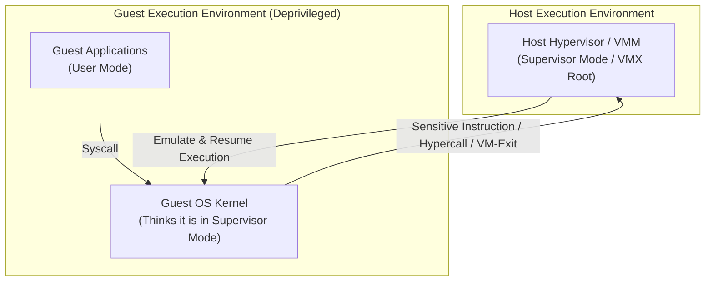
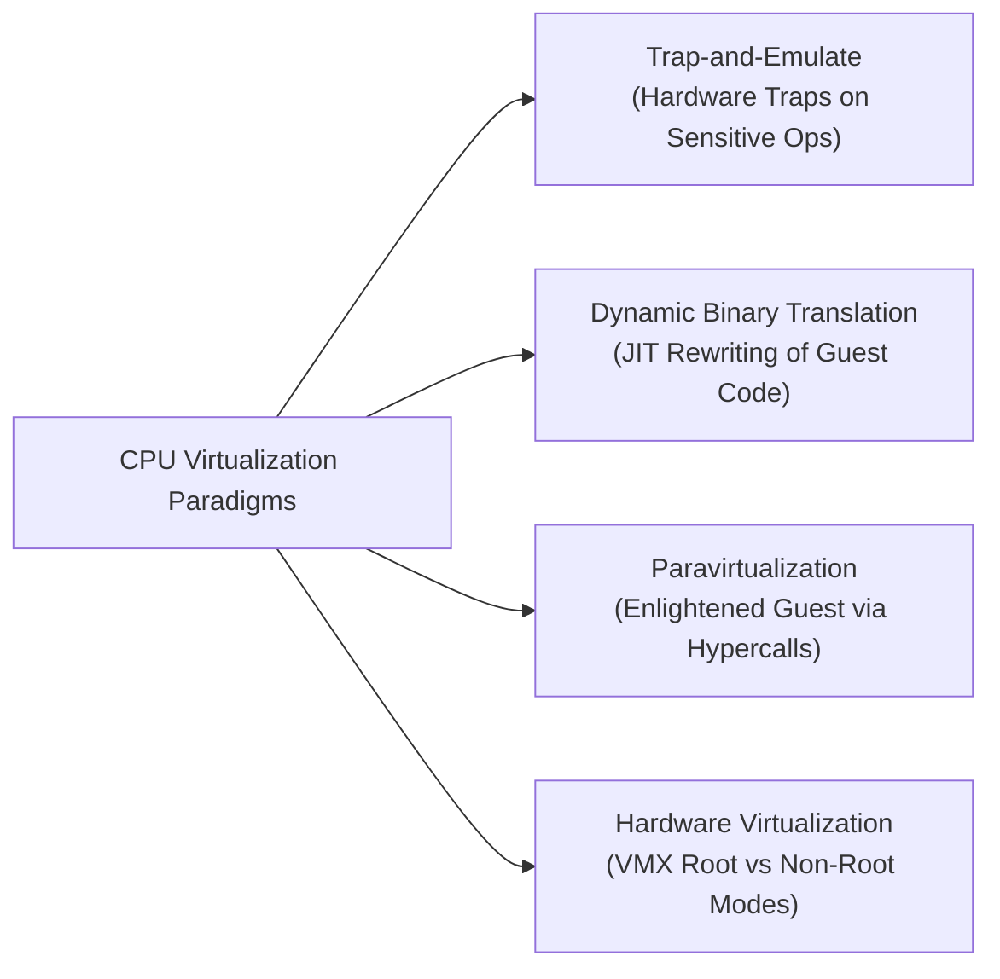
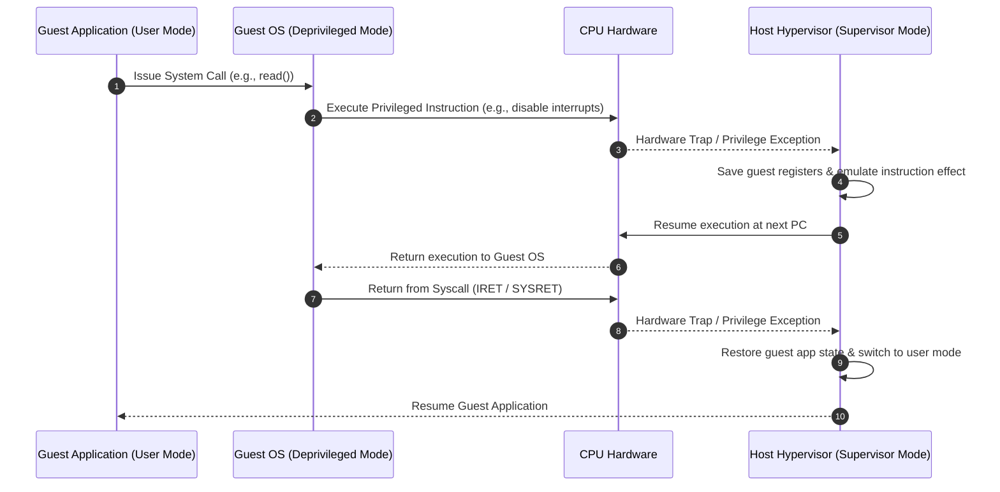
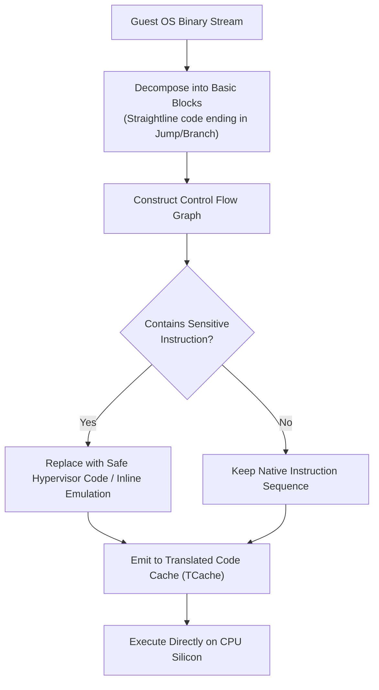
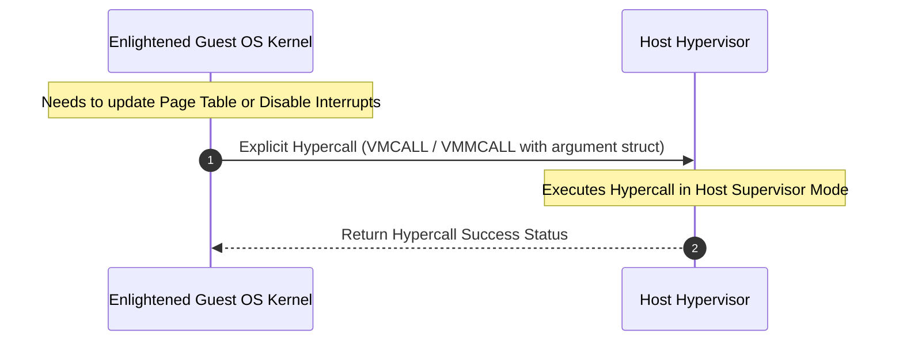
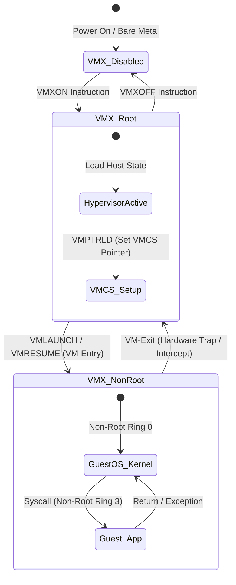

# Datacenter Systems: Virtual Machines

Virtual machine implementations virtualize physical CPU execution by presenting untrusted guest operating systems with the illusion of running directly on bare-metal hardware, utilizing privilege deprivileging, trap-and-emulate, dynamic binary translation, paravirtualization, and hardware-assisted virtualization to preserve multi-tenant isolation, security, and near-native performance.

---

## Virtual Machines Motivation & Overview

The central problem of CPU virtualization in multi-tenant datacenter environments is **guest kernel deprivileging**:

- An operating system kernel assumes exclusive, unconstrained control over physical CPU state, page tables, memory management units (MMUs), and hardware I/O devices.
- In a cloud datacenter, running an untrusted guest operating system (Guest OS) in host kernel mode (Ring 0 / Supervisor mode) would compromise host security: a single guest could inspect or corrupt physical memory, alter hardware status flags, or bring down co-located tenant VMs.
- Consequently, the hypervisor (Virtual Machine Monitor, or VMM) must execute the Guest OS in a deprivileged execution state (e.g., User mode / Ring 3 or Non-Root mode).



### The Core Challenge of CPU Virtualization
When a Guest OS executes inside a deprivileged ring, it continues to issue privileged and sensitive CPU instructions (e.g., modifying page table bases, disabling hardware interrupts, or writing to status registers). The hardware/software system must intercept these operations and virtualize them seamlessly so that:
1. The Guest OS observes identical state changes as if running on real physical hardware (Fidelity).
2. The host hypervisor maintains absolute authority over physical hardware allocation (Safety and Isolation).
3. General non-sensitive compute instructions execute directly on physical CPU silicon without virtualization overhead (Efficiency).

---

## Architecture & Core Mechanics

Computer systems use four fundamental software and hardware architectures to achieve CPU virtualization: **Trap-and-Emulate**, **Dynamic Binary Translation**, **Paravirtualization**, and **Hardware-Assisted Virtualization**.



---

### 1. Trap-and-Emulate

Trap-and-Emulate is a classic operating system technique for extending hardware functionality beyond physical CPU capabilities (analogous to emulating a missing floating-point unit, implementing paged virtual memory, copy-on-write page faults, or memory-mapped files).

#### Execution Logic
- **Direct Execution**: Unprivileged, innocuous instructions issued by the Guest OS or guest applications run directly on physical CPU cores at native bare-metal speed.
- **Hardware Trapping**: When the Guest OS attempts to execute a privileged or sensitive instruction (such as altering processor status registers or remapping page table entries), the underlying CPU hardware blocks execution and raises a hardware trap to the host hypervisor.
- **Hypervisor Emulation**: The hypervisor intercepts the trap, saves the guest processor register state, updates the virtual processor status word (PSW) or virtual device state to reflect the instruction's intended effect, advances the virtual program counter ($PC$), and resumes guest execution at the immediately following instruction.



#### System Call Execution Trace under Trap-and-Emulate
1. **Application Syscall**: The guest application in user mode issues a system call instruction.
2. **First Trap to Host**: Hardware traps to the host hypervisor because the system call vector points to supervisor memory controlled by the host.
3. **Hypervisor Redirection**: The hypervisor saves hardware registers and adjusts the guest virtual execution context to appear as if hardware trapped directly into the Guest OS kernel.
4. **Guest Kernel Execution**: Hypervisor transfers execution to the Guest OS handler.
5. **Guest Kernel Completion**: The Guest OS finishes servicing the system call and issues a return-from-syscall instruction (`SYSRET` / `IRET`).
6. **Second Trap to Host**: Because `IRET` or status register updates are privileged, execution traps a second time into the host hypervisor.
7. **Return to Guest Application**: The hypervisor restores user-mode guest register states and returns execution to the guest application.

#### Fundamental Failure Mode
Trap-and-Emulate relies strictly on the hardware trapping *every* sensitive instruction. If an instruction is sensitive but fails to trap in user mode (e.g., returning false register status silently), pure Trap-and-Emulate fails.

---

### 2. Dynamic Binary Translation (DBT)

When hardware ISAs fail to satisfy trap-and-emulate requirements and lack hardware virtualization extensions, hypervisors employ **Dynamic Binary Translation** to simulate guest execution without physical CPU support.

#### Mechanics & Basic Block Compilation
- **Dual Execution Model**:
  - **Guest User Mode**: Executed via direct hardware execution. The CPU traps on all sensitive user-space operations as intended.
  - **Guest OS Kernel Mode**: Executed via dynamic software translation. Interpreting guest kernel code line-by-line is correct but prohibitively slow. Dynamic Binary Translation accelerates this by dynamic Just-In-Time (JIT) compilation.
- **Basic Block Decomposition**: The translation engine subdivides guest kernel binary code into **basic blocks**—sequential instruction sequences containing no internal branches, terminating with an explicit jump, call, or return instruction.
- **Control Flow Graph (CFG) Rewriting**: The VMM parses basic blocks, constructs a Control Flow Graph, and replaces sensitive non-trapping instructions with inline safe hypervisor calls or equivalent native code blocks before caching the translated basic block in host memory.



#### Performance Advantages & Architectural Features
- **Untaken Branch Optimization**: Code paths and conditional branches that are never executed by the Guest OS are never translated, reducing translation overhead.
- **Instruction Cache (I-Cache) Locality**: Translated basic blocks are stored contiguously in a dedicated Translation Cache (`TCache`), improving instruction cache efficiency.
- **Stack & Control Flow Management**: Returning from calls (`CALL` / `RET`) requires managing stack frames, as the physical hardware stack contains host-native addresses within the `TCache` rather than guest virtual addresses.
- **Register Allocation Mapping**: Hypervisors leverage host 64-bit CPU registers to hold and emulate 32-bit guest architectural registers efficiently.

---

### 3. Paravirtualization

Paravirtualization achieves near-native bare-metal speed by eliminating trap-and-emulate overhead and binary translation complexity through explicit **guest OS enlightenment**.

#### Mechanics
- **Cooperative Hypercalls**: Rather than attempting to trick an unmodified Guest OS into believing it runs on bare metal, the Guest OS kernel source code is modified to be explicitly aware of its virtualized status inside a VM user-mode environment.
- **ISA Augmentation**: Sensitive hardware instructions in the Guest OS kernel are removed and replaced with explicit **Hypercalls** (software traps or hypervisor-specific call instructions, similar to system calls from user processes to OS kernels).
- **Batching & Notification**: The Guest OS informs the hypervisor of batch updates (e.g., updating multiple page table entries simultaneously in a single hypercall), drastically reducing host context switch frequency.



#### Architectural Trade-offs
- **Advantages**: Outperforms pure Trap-and-Emulate and Dynamic Binary Translation; eliminates guest state guessing; reduces trap frequencies via explicit batching.
- **Disadvantages**: Requires access to guest kernel source code and extensive kernel engineering for every guest OS distribution (e.g., Linux, Windows); cannot run legacy or closed-source un-modified operating systems without hardware support.

---

### 4. Hardware-Assisted Virtualization

Modern production datacenters rely primarily on **Hardware-Assisted Virtualization** extensions integrated directly into CPU hardware (e.g., Intel VT-x, AMD-V, ARM VE).

#### Dual Privilege Mode Architecture
Hardware virtualization introduces two hardware-enforced operational modes orthogonal to traditional CPU privilege rings (Rings 0–3):

1. **VMX Root Mode**: Full hardware privilege mode reserved for the host hypervisor. The hypervisor operates in Root Kernel Mode (Ring 0) with unrestricted physical access.
2. **VMX Non-Root Mode**: Deprivileged mode dedicated to guest VM execution. Both the Guest OS kernel (Non-Root Ring 0) and Guest Applications (Non-Root Ring 3) execute inside Non-Root Mode.

```
+------------------------------------------------------------------------+
|                           PHYSICAL HARDWARE                            |
+------------------------------------+-----------------------------------+
|             VMX ROOT               |            VMX NON-ROOT           |
|         (Host Hypervisor)          |             (Guest VM)            |
+------------------------------------+-----------------------------------+
| Ring 0: Host Kernel / VMM          | Ring 0: Guest OS Kernel           |
| Ring 3: Host User Tools            | Ring 3: Guest Applications        |
+------------------------------------+-----------------------------------+
```

#### Virtual Machine Control Structure (VMCS / VMCB)
Hardware virtualization maintains guest execution state in a physical memory structure managed by the CPU (Intel VMCS / AMD VMCB):
- **Guest-State Area**: Hardware registers, Processor Status Word ($PSW$), control registers ($CR0, CR3, CR4$), and segment registers loaded automatically when entering guest execution.
- **Host-State Area**: Hypervisor host registers, page table root ($CR3$), and stack pointer loaded upon exiting guest execution.
- **VM-Execution Control Fields**: Bitmaps specifying precisely which guest operations trigger hardware exits (e.g., specific I/O accesses, page faults, or control register updates).
- **VM-Exit / VM-Entry Controls**: Transition parameters governing hardware state saving and restoration.

#### Hardware Execution Lifecycle
- **Guest System Calls**: A system call issued by a guest application in Non-Root Ring 3 traps directly into the Guest OS kernel in Non-Root Ring 0 **without triggering a hypervisor context switch**, achieving native OS syscall speed.
- **Direct Kernel Execution**: Guest OS kernel instructions modify guest-specific hardware register replicas directly without host intervention.
- **VM-Exit**: Operations defined in the VMCS execution control bitmap cause the hardware to halt non-root execution, save guest state to the VMCS, load host state, and transfer control to the hypervisor in Root Mode (`VM-Exit`).
- **VM-Entry**: Following host handling, the hypervisor executes `VMLAUNCH` or `VMRESUME` to transition back to Non-Root Mode (`VM-Entry`).

---

## Concrete Walkthrough & Execution Trace

To evaluate CPU virtualization mechanics, consider a concrete trace of a Guest Application executing a read system call (`read()`) under **Trap-and-Emulate** versus **Hardware-Assisted Virtualization**.

### Initial System State ($t = 0$)
- Physical CPU: 64-bit x86 architecture.
- Active VM: Guest Linux instance assigned Guest Virtual Machine ID 1.
- Initial PC: `0x00007ffff7a12000` (Guest User Application code).

---

### Execution Trace A: Trap-and-Emulate (Pure Software Deprivileging)

```
Initial State:
  Host Hypervisor: Supervisor Mode (Ring 0), Active
  Guest OS: User Mode (Ring 3), Deprivileged Context
  Guest App: User Mode (Ring 3), Executing

Trace Steps:
  1. Guest App executes `INT 0x80` or `SYSCALL` to request I/O read.
  2. Physical CPU detects execution in Ring 3 and hardware traps to Host Hypervisor Vector at `0xffffffff81000000`.
  3. Host Hypervisor saves Guest App physical registers into Host VCPU struct.
  4. Host Hypervisor modifies Guest Virtual PSW to reflect Kernel Mode, sets Guest PC to Guest OS Syscall Handler `0xc0105000`.
  5. Host Hypervisor returns execution to CPU in Ring 3 (Guest OS executing in user mode).
  6. Guest OS handler executes `CLI` (Clear Interrupt Flag) to protect kernel critical section.
  7. Physical CPU raises General Protection Fault (#GP) because `CLI` is privileged in Ring 3.
  8. Host Hypervisor intercepts #GP fault, emulates `CLI` by setting `VCPU.virtual_interrupts = 0`, advances Guest PC by instruction length (+2 bytes).
  9. Host Hypervisor returns execution to Guest OS in Ring 3.
  10. Guest OS finishes processing read buffer and executes `IRET`.
  11. Physical CPU raises #GP fault on `IRET` execution in Ring 3.
  12. Host Hypervisor intercepts #GP fault, updates Guest Virtual PSW to User Mode, restores Guest App registers, and resumes Guest App execution.
```

---

### Execution Trace B: Hardware-Assisted Virtualization (Intel VT-x)

```
Initial State:
  Host Hypervisor: VMX Root Mode, Ring 0
  Guest OS: VMX Non-Root Mode, Ring 0
  Guest App: VMX Non-Root Mode, Ring 3

Trace Steps:
  1. Host Hypervisor initializes VMCS guest state pointer and executes `VMLAUNCH`.
  2. CPU transitions to VMX Non-Root Mode, loading Guest App state (Non-Root Ring 3).
  3. Guest App executes `SYSCALL`.
  4. CPU routes exception internally to Guest OS Syscall Handler in Non-Root Ring 0 (NO VM-Exit; 0 host overhead).
  5. Guest OS Kernel services I/O request and accesses virtual device register (mapped to trigger VM-Exit in VMCS bitmap).
  6. CPU halts Non-Root execution, writes Guest hardware state to VMCS Guest-State Area, loads Host State from VMCS Host-State Area, and enters VMX Root Mode (VM-Exit).
  7. Host Hypervisor inspects VM-Exit Exit Reason (`EXIT_REASON_EPT_VIOLATION` or `EXIT_REASON_IO_INSTRUCTION`), services virtual device I/O.
  8. Host Hypervisor updates VMCS Guest PC (+3 bytes) and executes `VMRESUME`.
  9. CPU transitions back to VMX Non-Root Mode (Non-Root Ring 0) to resume Guest OS execution.
```

---

## Edge Cases, Failure Modes & Mitigations

| Failure Mode / Edge Case | Architectural Root Cause | Hypervisor Mitigation Strategy |
| :--- | :--- | :--- |
| **Non-Trapping Sensitive Instructions** | Certain ISA instructions (e.g., x86 `POPF`, `PUSHF`, `SGDT`, `SLDT`, `SMSW`) read or modify CPU status flags without trapping when executed in Ring 3, leaking physical CPU state or failing silently. | **Dynamic Binary Translation**: JIT rewrite basic blocks containing sensitive instructions.<br/>**Hardware Virtualization**: Enable VMX execution control bitmaps to force hardware VM-Exits. |
| **Translation Cache Invalidation & Thrashing** | In Dynamic Binary Translation, self-modifying guest kernel code or frequent process context switches invalidate compiled basic blocks in the `TCache`. | Implement adaptive basic block garbage collection, invalidate only affected `TCache` translation pages, and utilize direct jump chaining between translated blocks. |
| **Stack Address Corruption during DBT Execution** | Function calls (`CALL` / `RET`) executed within translated code push native host addresses inside the `TCache` onto the guest stack rather than guest virtual addresses. | Hypervisors maintain a shadow call stack mapping physical `TCache` return addresses back to guest virtual addresses, intercepting return instructions to patch stack frames. |
| **Hypercall Interface Mismatch** | Paravirtualized Guest OS compiled against an outdated hypercall API version issues malformed hypervisor call arguments. | Implement strict ABI versioning in the hypervisor, returning explicit error codes (`EINVAL`) and falling back to software emulation modes if compatibility breaks. |
| **VM-Exit Latency Storms** | High-frequency guest operations (e.g., polling virtual hardware registers or frequent interrupt toggling) cause continuous hardware VM-Exit transitions, degrading performance. | **Hypercall Batching**: Group multiple virtual ops into one hypercall.<br/>**APIC Virtualization (vAPIC)**: Allow guests to read/write virtual interrupt registers directly in hardware without VM-Exit. |

---

## Formal Analysis / Protocol Specification

### Formal Privilege Ring Matrix

In a hardware-assisted virtualized environment, the execution state space is governed by the tuple $\mathcal{S} = (M_{\text{root}}, R_{\text{ring}})$, where $M_{\text{root}} \in \{\text{Root}, \text{Non-Root}\}$ and $R_{\text{ring}} \in \{0, 1, 2, 3\}$.

$$\text{Execution State Space } \mathcal{S} = \begin{pmatrix} (\text{Root}, 0) & \text{Host Hypervisor Kernel (VMM)} \\ (\text{Root}, 3) & \text{Host User Utilities} \\ (\text{Non-Root}, 0) & \text{Guest OS Kernel} \\ (\text{Non-Root}, 3) & \text{Guest User Applications} \end{pmatrix}$$

### Mathematical Trap-and-Emulate Condition
According to the Popek-Goldberg virtualization criteria, an ISA $\mathcal{I}$ supports pure Trap-and-Emulate virtualization if and only if the set of all sensitive instructions $\mathcal{I}_{\text{sensitive}}$ is a strict subset of the set of all hardware-privileged trapping instructions $\mathcal{I}_{\text{privileged}}$:

$$\mathcal{I}_{\text{sensitive}} \subseteq \mathcal{I}_{\text{privileged}}$$

Where:
- $\mathcal{I}_{\text{sensitive}} = \mathcal{I}_{\text{control-sensitive}} \cup \mathcal{I}_{\text{behavior-sensitive}}$
- $\forall i \in \mathcal{I}_{\text{privileged}}, \quad \text{Exec}(i, \text{User Mode}) \longrightarrow \text{Hardware Trap}$

If $\exists i \in \mathcal{I}_{\text{sensitive}}$ such that $i \notin \mathcal{I}_{\text{privileged}}$, then:

$$\text{Pure Trap-and-Emulate Violation} \implies \text{Requires Dynamic Binary Translation or Hardware Extensions (VT-x)}$$

### Dual-Layer Explanation

#### Formal Definition
A hardware VM-Exit occurs whenever a guest instruction $i$ executed at non-root state $s \in (\text{Non-Root}, R)$ satisfies the VMCS control condition:

$$\text{VM-Exit}(i) \iff \text{Bitmap}_{\text{VMCS}}(i) = 1 \quad \lor \quad i \in \mathcal{I}_{\text{unconditional-exit}}$$

Upon VM-Exit, hardware atomically performs state swap:

$$\text{VMCS}_{\text{guest}} \leftarrow \text{CPU}_{\text{registers}}, \quad \text{CPU}_{\text{registers}} \leftarrow \text{VMCS}_{\text{host}}, \quad M_{\text{root}} \leftarrow \text{Root}$$

#### Simplified Explanation
When the guest VM tries to do something major—like changing physical hardware memory mappings or accessing virtual hardware—the CPU hardware freezes the guest, saves its state to a hardware control block, switches back to the host hypervisor, and lets the host handle it securely.

---

## Deep Dive

### Intel VT-x VMX Hardware Operations
Hardware-assisted virtualization relies on specific VMX processor operations to manage hypervisor execution:
- `VMXON`: Initializes VT-x virtualization support on a physical CPU core and allocates physical host memory for VMX operations.
- `VMLAUNCH`: Takes an initialized VMCS block, performs complete hardware context loading, and initiates initial execution into VMX Non-Root Mode (first VM-Entry).
- `VMRESUME`: Executes subsequent transitions back to VMX Non-Root Mode following a VM-Exit handler completion.
- `VMPTRLD`: Sets the active VMCS pointer to point to a specific VM instance in host physical memory.
- `VMXOFF`: Disables VT-x virtualization on the physical core, returning the processor to standard bare-metal operational modes.



### Hybrid Hardware + Paravirtualized I/O Architecture (Virtio)
In modern production datacenters (e.g., AWS EC2, Google Cloud Engine, KVM/QEMU), hypervisors combine **Hardware Virtualization for CPU/Memory** with **Paravirtualization for I/O**:
- CPU compute instructions run natively in VMX Non-Root Mode via hardware VT-x.
- Disk storage and network I/O avoid heavy hardware device emulation (which requires hundreds of VM-Exits per packet/block read) by using **virtio** paravirtualized device drivers.
- Guest kernels write network packets and disk blocks directly into shared ring buffers (`virtqueues`), notifying the hypervisor with a single hypercall (`VMCALL`), achieving line-rate I/O throughput with minimal virtualization overhead.

---

## Industry Standard Terms

| Course Term | Industry / Standard Term | Production Implementation Examples |
| :--- | :--- | :--- |
| **Guest OS Deprivileging** | **Ring Deprivileging / Ring Ringing** | Running Guest Kernel in Ring 1 or Ring 3 (Software) or Non-Root Ring 0 (VT-x) |
| **Host Kernel / VMM** | **Hypervisor / Type-1 or Type-2 VMM** | KVM (Kernel-based Virtual Machine), VMware ESXi, Xen, Hyper-V |
| **Enlightened Guest OS** | **Paravirtualized Guest (PV)** | Linux `pv_ops`, Xen PV kernel drivers, Windows Hyper-V enlightment |
| **Root Mode / Non-Root Mode** | **VMX Root / VMX Non-Root** | Intel VT-x VMX modes, AMD-V SVM Host/Guest modes |
| **Hardware Trap to VMM** | **VM-Exit** | Intel VT-x `VM-Exit`, AMD-V `#VMEXIT` |
| **Cooperative Call into Hypervisor** | **Hypercall** | `VMCALL` (Intel), `VMMCALL` (AMD), `hvc` (ARM) |
| **Special Device Drivers** | **Paravirtualized Drivers / Virtio** | `virtio-net`, `virtio-blk`, AWS ENA (Elastic Network Adapter), VMware Tools |

---

## Related

- [[Datacenter Systems/Execution Environments and Virtualization|Execution Environments and Virtualization]] — Broad datacenter workload taxonomy, limits of process isolation, three-tier memory hierarchies, and live VM migration
- [[Datacenter Systems/The Popek-Goldberg Virtualization Theorem|The Popek-Goldberg Virtualization Theorem]] — Formal ISA conditions for direct execution virtualization, x86/ARM hardware violations, and Popek-Goldberg proofs
- [[CSE451 Index|CSE451 — Operating Systems]] — Kernel privilege levels, system call interfaces, virtual address space management, and context switching
- [[CSE351 Index|CSE351 — The Hardware/Software Interface]] — x86-64 assembly, processor privilege rings, page table structures, and hardware exception handling
- [[Datacenter Systems/Index|Datacenter Systems Index]] — Master navigation index for datacenter architecture and system software notes