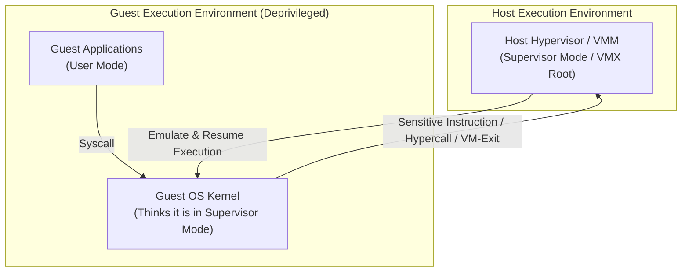
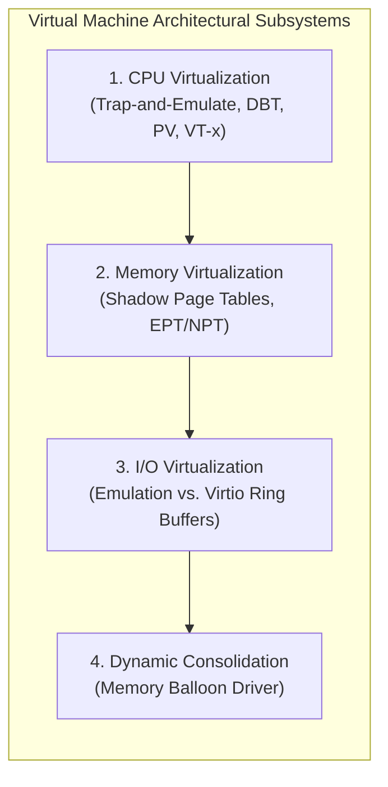
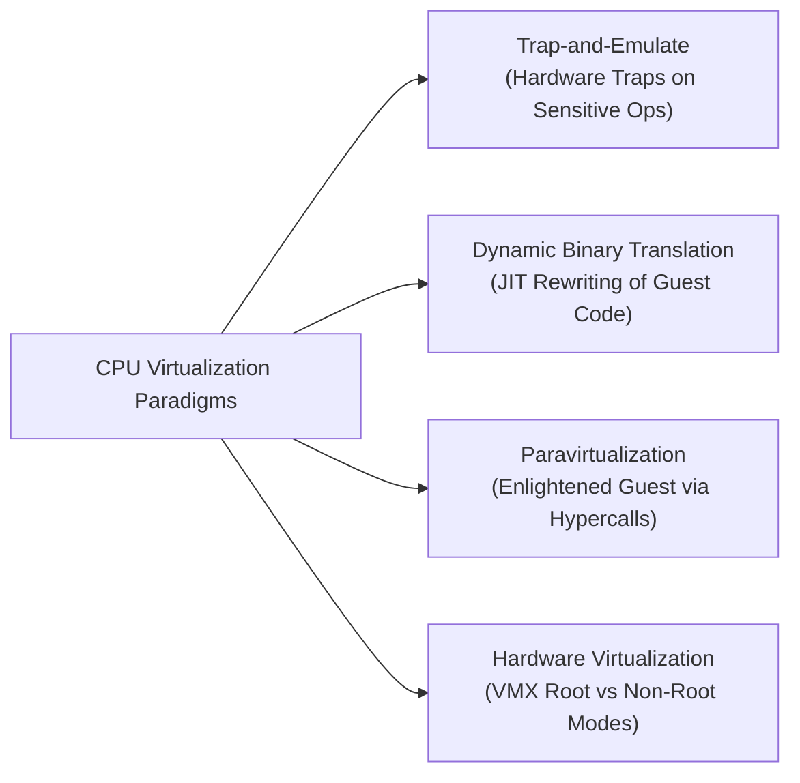
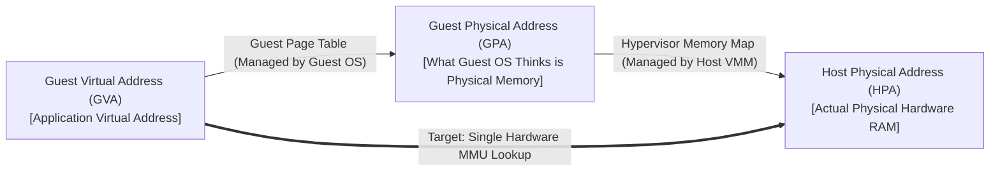
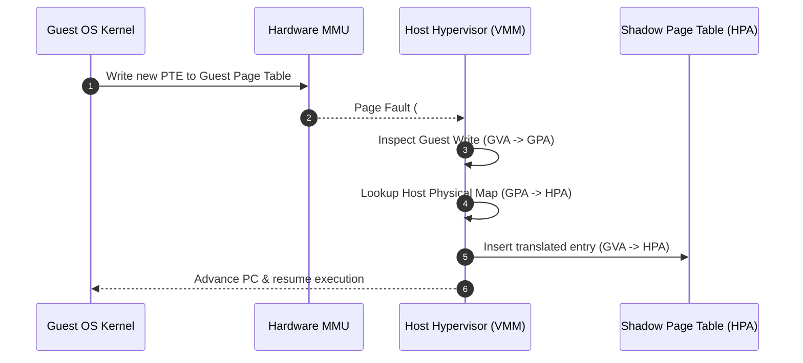
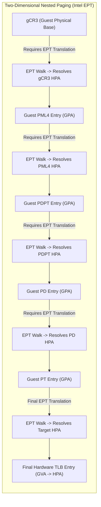
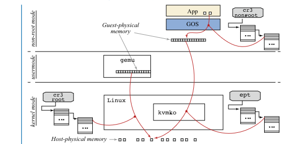

# Datacenter Systems: Virtual Machines

Virtual machine implementations virtualize physical CPU execution, system memory hierarchies, and hardware I/O by presenting untrusted guest operating systems with the illusion of running directly on bare-metal hardware, utilizing privilege deprivileging, trap-and-emulate, dynamic binary translation, paravirtualization, shadow page tables, nested hardware paging, and memory ballooning to preserve multi-tenant isolation, security, and near-native performance.

---

## Virtual Machines Motivation & Overview

In cloud datacenters, virtualization multiplexes heterogeneous workloads from multiple competing tenants onto shared physical hardware. Operating system kernels are inherently designed with the assumption that they have exclusive, unconstrained authority over physical execution rings, hardware control registers, page tables, memory management units (MMUs), and I/O devices. 

Running an untrusted guest operating system (Guest OS) in host kernel mode (Ring 0 / Supervisor mode) would destroy host isolation: a single compromised or misconfigured tenant could inspect private physical memory belonging to co-located tenants, modify hardware page tables, or crash the physical server.



### The Three Virtues of Virtualization

A correct Virtual Machine Monitor (VMM / Hypervisor) must satisfy three foundational system invariants:
1. **Fidelity (Equivalence)**: The Guest OS and guest applications must observe identical behavior, state transitions, and register side-effects as if executing directly on native physical hardware.
2. **Safety & Isolation (Resource Control)**: The hypervisor retains complete, irrevocable authority over physical hardware resources (CPU cores, physical DRAM, network cards, and storage devices). No guest execution can escape its sandbox or corrupt host state.
3. **Performance (Efficiency)**: The vast majority of innocuous, non-sensitive instructions must execute directly on physical processor silicon at native speed without hypervisor mediation.

### Core Virtualization Challenges

Achieving these properties across modern computer systems requires addressing three primary subsystems:
- **CPU Virtualization**: Safely executing a deprivileged guest kernel while handling privileged and sensitive processor instructions.
- **Memory Virtualization**: Mapping guest-managed virtual memory to host physical memory through a single hardware MMU translation while maintaining full page isolation across VMs.
- **I/O and Resource Virtualization**: Handling device access and dynamically balancing physical resources across variable tenant demands.

---

## Architecture & Core Mechanics

Virtual machine architectures combine low-level CPU instruction trapping, dynamic binary rewriting, paravirtualized cooperation, and hardware virtualization extensions across compute, memory, and storage.



---

### Part 1: CPU Virtualization Mechanisms

Computer systems employ four foundational software and hardware architectures to virtualize CPU instruction execution:



#### 1. Trap-and-Emulate
- **Direct Execution**: Unprivileged, non-sensitive instructions issued by the Guest OS or guest applications run directly on physical CPU cores at native bare-metal speed.
- **Hardware Trapping**: When the Guest OS attempts to execute a privileged or sensitive instruction (such as altering processor status registers or updating page table bases), the underlying CPU hardware raises a hardware trap to the host hypervisor.
- **Hypervisor Emulation**: The hypervisor intercepts the trap, saves guest register state, emulates the intended side-effect of the instruction on virtual hardware state, advances the virtual program counter ($PC$), and resumes guest execution.
- **Fundamental Limitation**: Trap-and-emulate relies strictly on hardware trapping *every* sensitive instruction. If an instruction is sensitive but fails to trap in user mode (e.g., silently returning incorrect status without trapping, as in early x86 architectures), pure trap-and-emulate fails (as formalized in [[Datacenter Systems/The Popek-Goldberg Virtualization Theorem|The Popek-Goldberg Virtualization Theorem]]).

#### 2. Dynamic Binary Translation (DBT)
When hardware ISAs contain non-virtualizable instructions and lack hardware extensions, hypervisors employ **Dynamic Binary Translation**:
- **Dual Execution Model**: Guest user code executes directly on CPU hardware. Guest kernel binary code is parsed and dynamically translated by the hypervisor at runtime via Just-In-Time (JIT) compilation.
- **Basic Block Decomposition**: The translation engine subdivides guest kernel binary streams into **basic blocks** (straight-line instruction sequences ending in a branch, jump, or return).
- **Control Flow Graph (CFG) Rewriting**: The VMM parses basic blocks, identifies non-trapping sensitive instructions, and replaces them with inline hypervisor routines or safe instructions before caching the compiled basic block in a host-memory Translation Cache (`TCache`).
- **Optimization**: Exploits untaken branches, contiguous basic block cache locality, and register allocation mapping (e.g., utilizing host 64-bit registers to emulate 32-bit guest registers).

#### 3. Paravirtualization (PV)
- **Guest Enlightenment**: Rather than attempting to fool an unmodified Guest OS into believing it runs on bare metal, the Guest OS kernel source code is modified to be explicitly aware that it is running inside a virtualized environment.
- **Hypercall Interface**: Sensitive instructions are replaced with explicit **Hypercalls** (software traps or dedicated instructions such as `VMCALL` / `VMMCALL`, analogous to system calls from user processes to OS kernels).
- **Batching & Coordination**: The guest kernel batches multiple operations (e.g., updating multiple page table entries) into a single hypercall, drastically reducing hypervisor context switch frequency.
- **Trade-off**: High performance, but requires access to guest kernel source code and extensive kernel engineering for every supported guest operating system.

#### 4. Hardware-Assisted Virtualization (Intel VT-x & AMD-V)
Modern production datacenters rely primarily on hardware virtualization extensions built into physical processor silicon:
- **Dual Privilege Mode Architecture**: Introduces two hardware operational modes orthogonal to traditional Rings 0–3:
  - **VMX Root Mode**: Full hardware privilege mode reserved for the host hypervisor (Host Ring 0).
  - **VMX Non-Root Mode**: Deprivileged mode dedicated to guest VM execution. The Guest OS kernel executes in Non-Root Ring 0, while Guest Applications execute in Non-Root Ring 3.
- **Virtual Machine Control Structure (VMCS / VMCB)**: A 4KB physical memory structure configured by the hypervisor and managed by CPU hardware. It contains:
  - *Guest-State Area*: Registers, control registers ($CR0, CR3, CR4$), and execution state loaded automatically during VM-Entry.
  - *Host-State Area*: Hypervisor registers and page table roots loaded automatically during VM-Exit.
  - *VM-Execution Controls*: Bitmaps specifying precisely which guest operations trigger hardware exits.
- **Hardware Lifecycle**:
  - Guest system calls from Non-Root Ring 3 trap directly into the Guest OS in Non-Root Ring 0 with **zero hypervisor overhead**.
  - Sensitive operations trigger a hardware **VM-Exit**, atomically saving guest state into the VMCS, loading host state, and returning control to the hypervisor in Root Mode.
  - The hypervisor handles the event and executes `VMRESUME` (or `VMLAUNCH`) to perform a **VM-Entry** back into the guest.

#### 5. I/O Virtualization & Paravirtualization
Virtualizing I/O devices via software interposition allows hypervisors to encapsulate VM state, migrate VMs across heterogeneous hardware, and aggregate physical devices.
- Pure hardware device emulation requires hundreds of VM-Exits per I/O request due to PIO/MMIO accesses.
- To avoid this, modern hypervisors utilize **paravirtualized I/O** (e.g., virtio), where guests place requests directly into shared-memory ring buffers and signal the host via a single hypercall/doorbell.
- *See the dedicated topic note:* [[Datacenter Systems/IO Virtualization|I/O Virtualization]]

---

### Part 2: Memory Virtualization Mechanisms

Memory virtualization presents untrusted guest operating systems with the illusion of contiguous, physical system memory while mapping all guest allocations into host physical RAM.

#### Virtual Memory Foundations & Paging Recap
In a standard native operating system, the kernel manages a virtual memory subsystem:
- Operating system page tables map virtual page numbers (VPNs) to physical frame numbers (PFNs), providing each process with an isolated virtual address space.
- Page table entries (PTEs) store permissions (Read, Write, Execute, Present, User/Supervisor).
- On x86-64 architectures, canonical 48-bit virtual addresses are translated via a **4-level hierarchical page table walk** (`PML4` $\longrightarrow$ `PDPT` $\longrightarrow$ `PD` $\longrightarrow$ `PT`).
- The hardware **Translation Lookaside Buffer (TLB)** serves as an associative cache for virtual-to-physical translations:

![[Screenshots/x86-64 paging.png]]

- **Page Walk Cost**: Walking 4 levels of page tables on every TLB miss requires 4 sequential memory reads. CPU architectures cache intermediate page directory entries in hardware page-walk caches to accelerate resolution.

---

#### The Three-Tier Address Hierarchy

In a virtualized environment, an additional tier of address abstraction is introduced, creating three distinct address spaces:



![[Screenshots/Virtual to Physical Address Translation Hierarchy.png]]

- **Guest Virtual Address (GVA)**: The virtual memory address generated by an application executing inside the guest VM.
- **Guest Physical Address (GPA)**: The contiguous physical address space presented to the Guest OS. The Guest OS allocates physical frames and constructs its page tables using GPAs.
- **Host Physical Address (HPA)**: The actual physical silicon DRAM addresses on the host motherboard.
- **The Core Constraint**: The physical CPU Memory Management Unit (MMU) only understands one physical translation path. When the processor executes an instruction (e.g., `mov rax, [addr]`), the hardware MMU must resolve a **Guest Virtual Address (GVA) directly into a Host Physical Address (HPA)** in a single translation pipeline!

Four distinct mechanisms have evolved to bridge this three-tier translation challenge:

---

#### Mechanism 1: Real Guest Page Tables (Pure Trap-and-Emulate)

The simplest conceptual approach is for the hypervisor to manage the real page table directly:

![[Screenshots/Real Guest PT.png]]

- **Execution Mechanics**:
  - The hypervisor directly controls the hardware page table used by the CPU MMU.
  - The Guest OS kernel attempts to manage its own page tables in software.
  - Whenever the Guest OS attempts to access, read, or update its page tables, the operation traps into the hypervisor.
  - On a store (write): The hypervisor intercepts the write, translates the guest GPA into a host HPA, and writes the real PTE.
  - On a load (read): The hypervisor intercepts the read, translates the real HPA back into a virtual GPA, and presents the synthetic PTE to the guest.
- **Performance Failure Mode**: Because **every single guest page table access traps**—including read accesses—the virtualization overhead is catastrophic. This approach is completely unusable in production systems.

---

#### Mechanism 2: Shadow Page Tables (SPT)

To eliminate traps on page table reads, early production hypervisors (such as VMware ESXi and early Xen) introduced **Shadow Page Tables (SPT)**:

![[Screenshots/Shadow Page Table.png]]

- **Architectural Separation**:
  - The Guest OS allocates and manages its own page table in guest memory (**Guest Page Table, GPT**), mapping $\text{GVA} \longrightarrow \text{GPA}$.
  - The hypervisor maintains an internal physical address map mapping $\text{GPA} \longrightarrow \text{HPA}$.
  - The hypervisor constructs a secondary, synthetic page table (**Shadow Page Table, SPT**) that maps $\text{GVA} \longrightarrow \text{HPA}$ directly.
- **Hardware MMU Pointer**:
  - The physical CPU's control register ($CR3$) points **exclusively to the Shadow Page Table in host memory**, never to the Guest Page Table!
  - When guest code executes, the hardware MMU and TLB read directly from the Shadow Page Table.
  - **Reads do NOT trap**: The Guest OS reads its own page tables natively without hypervisor intervention.
- **Write Interception via Write Protection & Heuristics**:
  - Guest page tables can be allocated anywhere in physical memory and reallocated dynamically at the discretion of the Guest OS.
  - To keep the Shadow Page Table synchronized, the hypervisor relies on **memory tracing**: it uses heuristics to identify guest pages that contain page tables, and marks those pages as **Read-Only (Write-Protected)** in the Shadow Page Table.
  - When the Guest OS attempts to write to a PTE (e.g., allocating a page or updating permissions), the hardware MMU raises a Page Fault (`#PF`), which traps into the hypervisor.
  - The hypervisor inspects the faulting write, updates the guest PTE, computes the corresponding $\text{GVA} \longrightarrow \text{HPA}$ translation, and updates the Shadow Page Table entry.



#### Shadow Page Table Lifecycle & TLB Semantics
The Shadow Page Table is not an eager 1:1 mirror of the entire guest page table; instead, it behaves like a **virtual software TLB**:
1. **Lazy Synchronization**:
   - The hypervisor populates the Shadow Page Table on demand. When an entry is missing, the guest application triggers a page fault (`#PF`).
   - The hypervisor intercepts the fault. If the mapping exists in the Guest Page Table, the hypervisor translates it, populates the Shadow PTE, and resumes the guest without forwarding the fault to the Guest OS.
2. **Weak Consistency & Synchronization Points**:
   - Updates are synchronized at explicit sync points: on page faults and guest TLB flushes (`INVLPG` or $CR3$ reloads).
3. **Invalidating Mappings (TLB Flush)**:
   - When the Guest OS invalidates a virtual mapping (e.g., freeing a page), it executes a TLB invalidate instruction or reloads $CR3$.
   - The hypervisor intercepts the flush, unprotects the GPT, updates the dirty shadow entries, re-enforces write protection, and flushes the physical CPU TLB:

![[Screenshots/Invalidate Mapping in GPT.png]]

4. **Adding Mappings Lazily**:
   - The guest modifies its table, the hypervisor marks the shadow table dirty, and syncs updates lazily upon subsequent access:

![[Screenshots/Lazy Shadow Update.png]]

---

#### Mechanism 3: Paravirtualized Memory Management

To eliminate the heavy write-protection page fault traps inherent in Shadow Page Tables, paravirtualization enlightens the guest kernel's memory management subsystem:

![[Screenshots/Paravirtual Guest PT.png]]

- **Linux `pv_ops` Wrappers**: The guest kernel replaces native page table manipulation instructions with inline function pointers provided by the hypervisor.
- **Direct Read Translations**: When reading page tables, the guest translates PTEs itself via software wrappers.
- **Hypercall Batching**: Instead of triggering a hardware page fault on every single PTE write, the guest kernel batches dozens of PTE updates into a single explicit hypercall (`multicall`), reducing trap overhead by up to $90\%$.

---

#### Mechanism 4: Hardware-Assisted Nested Paging (Intel EPT & AMD NPT)

Modern virtualization hardware integrates two-dimensional address translation directly into the physical CPU MMU, eliminating the need for software shadow page tables entirely.

Intel designates this technology **Extended Page Tables (EPT)**; AMD designates it **Nested Page Tables (NPT)**.



#### The Two-Dimensional Page Table Walk
Under EPT, the hardware MMU maintains two distinct base registers:
1. **`gCR3`**: Guest $CR3$ register containing the Guest Physical Address (GPA) of the guest root page directory (`PML4`).
2. **`EPTP`**: Extended Page Table Pointer (stored in the VMCS) containing the Host Physical Address (HPA) of the host EPT root.

When a guest instruction encounters a TLB miss, the physical hardware MMU autonomously executes a **Two-Dimensional Page Walk**:

![[Screenshots/Hardware Support for Virtual Machine Memory.png]]

- To access the Guest PML4 root, the MMU must read `gCR3`. But because `gCR3` is a **Guest Physical Address**, the hardware must first walk all 4 levels of the EPT to find the HPA of the PML4 table! (Host reads 1, 2, 3, 4 $\to$ Guest read 5).
- To access the Guest PDPT entry, the pointer inside the PML4 is a GPA, requiring another 4-level EPT walk! (Host reads 6, 7, 8, 9 $\to$ Guest read 10).
- To access the Guest PD entry, another 4-level EPT walk occurs! (Host reads 11, 12, 13, 14 $\to$ Guest read 15).
- To access the Guest PT entry, another 4-level EPT walk occurs! (Host reads 16, 17, 18, 19 $\to$ Guest read 20).
- Finally, the GPA of the actual data page requires a final 4-level EPT walk! (Host reads 21, 22, 23, 24 $\to$ Target HPA).
- **Total Memory Reads**: **24 sequential memory lookups (+1 data load)** to resolve a single TLB miss!

#### Why Hardware Nested Paging Outperforms Shadow Page Tables
Despite requiring up to 24 memory reads on a cold TLB miss, EPT vastly outperforms Shadow Page Tables in production:
1. **Zero Hypervisor Traps**: Page table updates, allocations, and context switches execute inside Non-Root Mode without triggering a single VM-Exit.
2. **Hardware Cache Locality**: Because page table structures exhibit high temporal and spatial locality, nearly all intermediate EPT entries hit in the processor's ultra-fast L1, L2, and L3 CPU caches.
3. **Hardware Page-Walk Caches**: Modern CPUs cache intermediate EPT directory entries, collapsing the effective memory access latency to near-native levels.

#### The Crucial Role of 2MB Superpages
The performance of hardware-assisted paging depends heavily on page size:

![[Screenshots/Performance of Virtual Machine Memory.png]]

- **4KB Paging Overhead**: Under standard 4KB paging, an EPT TLB miss requires walking all 4 levels of both tables, incurring over **800 CPU clock cycles** per miss.
- **2MB Superpage Optimization**: By configuring the hypervisor to allocate memory in **2MB large pages (superpages)**, the lowest translation level is eliminated. The translation walk terminates at the Page Directory level, slashing TLB miss latency from ~800 cycles to **~340 cycles**—a dramatic $58\%$ performance improvement!
- **1GB vs 2MB Superpages Trade-off**: By utilizing **1GB huge pages** ($L_{\text{host}} = 2$), the EPT walk stops even earlier, providing the absolute fastest performance closest to bare-metal execution. However, 1GB pages introduce massive physical memory fragmentation and stranded capacity, making **2MB superpages the universal standard** in production multi-tenant datacenters.

---

#### Mechanism 5: KVM Memory Virtualization & Instruction Emulation

The Kernel-based Virtual Machine (KVM) operates as a Type-2 hypervisor where the VM is represented as a standard Linux userspace process (`qemu-kvm`). While KVM relies on EPT today, its memory architecture introduces unique complexities when the hypervisor must emulate guest instructions (e.g., during an MMIO VM-Exit).

- **Accessing Guest-Physical Memory (GPA $\to$ HVA)**: In KVM, mapping guest-physical addresses is trivial. The userspace process maps the VM's physical RAM as a contiguous virtual memory region. The hypervisor accesses any guest-physical address simply by adding a constant offset: $\text{HVA} = \text{GPA} + \text{Offset}_{\text{VM}}$.
- **The Difficulty of Guest Virtual Addresses**: Accessing the guest's *virtual* address space from the hypervisor is incredibly difficult. The GVA $\to$ GPA mapping only exists inside the processor's MMU while the VM executes in Non-Root mode.
- **Software Instruction Decoding**: When a VM-Exit occurs, the KVM instruction decoder must read the faulting instruction from memory using the guest instruction pointer ($RIP$), and its memory operands all refer to guest virtual addresses. To resolve these, the KVM emulator must perform repeated **software page walks** of the guest page tables in memory to determine the correct guest-physical locations of the instruction and its operands.



---

### Part 3: VM Memory Consolidation (The Balloon Driver)

When a virtual machine boots in a datacenter, it is provisioned with a fixed static memory allocation (e.g., 32GB of RAM). However, physical datacenter memory is expensive and prone to stranding:
- Tenant workload memory utilization fluctuates continuously.
- Provisioning each VM for its absolute worst-case peak leads to severe underutilization (overprovisioning).
- To maximize density and revenue, cloud providers **overcommit** physical memory (e.g., allocating 512GB of virtual RAM across VMs on a server with only 256GB of physical DRAM).

#### The Memory Overcommitment Dilemma
If the hypervisor attempts to page guest memory to host swap disks blindly, it risks triggering the **double-paging hazard**: swapping out guest pages that are actively critical to guest application performance, or swapping out pages that the guest OS has already marked as free.

#### The Balloon Driver Solution
To dynamically reclaim and balance memory across running VMs without OS panics, hypervisors employ a **Balloon Driver** (e.g., `virtio-balloon`, VMware Balloon):

```mermaid
sequenceDiagram
    autonumber
    participant VMM as Host Hypervisor
    participant BD as Balloon Driver (Guest Kernel)
    participant Alloc as Guest OS Memory Allocator
    participant Pool as Host Free Physical RAM

    Note over VMM: Host memory pressure detected
    VMM->>BD: Hypercall / Virtqueue: Inflate Balloon by 4GB
    BD->>Alloc: Allocate & PIN 1,000,000 pages (alloc_pages)
    Note over Alloc: Pages marked in-use; applications cannot touch
    BD->>VMM: Hypercall: Return list of Pinned GPAs
    VMM->>Pool: Unmap GPAs & Reclaim backing HPAs to host pool
    Note over VMM,Pool: 4GB Physical RAM reclaimed for other VMs!

    Note over VMM: Later: Host pressure eases
    VMM->>VMM: Re-allocate backing HPAs for GPAs
    VMM->>BD: Hypercall / Virtqueue: Deflate Balloon by 4GB
    BD->>Alloc: Unpin & Free pages back to guest allocator
    Note over Alloc: 4GB RAM available again for guest apps!
```

#### Ballooning Mechanics
1. **Architecture**: A specialized paravirtualized pseudo-device driver installed inside the Guest OS kernel.
2. **Inflation (Reclaiming Host Memory)**:
   - When the host experiences memory pressure, the hypervisor instructs the balloon driver to **inflate** by $N$ megabytes.
   - The balloon driver calls the standard native guest kernel page allocator (`alloc_pages()`), allocating pages from the guest's free pool.
   - The balloon driver **pins** these pages, ensuring the guest kernel will never swap or touch them.
   - To the rest of the guest OS, the memory appears legitimately allocated by an active process.
   - The balloon driver transmits the array of Guest Physical Frame Numbers (GFNs) to the hypervisor via a hypercall.
   - The hypervisor unmaps the backing Host Physical Addresses (HPAs) and reclaims the physical DRAM for other tenant VMs.
3. **Deflation (Returning Memory to Guest)**:
   - When memory pressure eases or the VM requires more memory, the hypervisor reassigns backing HPAs to the VM.
   - The hypervisor commands the balloon driver to **deflate**.
   - The balloon driver unpins and frees the pages back to the guest kernel allocator, restoring available memory to guest applications.

---

## Concrete Walkthrough & Execution Traces

To observe CPU and Memory virtualization in action, consider the following concrete execution traces.

### Trace 1: Page Fault Resolution under Shadow Page Tables (SPT)

```
Initial State:
  Guest App: Running in Non-Root User Mode
  Shadow Page Table: Valid mappings for Code and Data; Heap unmapped
  CPU CR3: Points to Host Shadow Page Table

Execution Trace:
  1. Guest App executes `mov byte ptr [0x00007ffff7c00000], 0x1` (Writes to newly allocated heap address).
  2. Hardware MMU attempts translation using Shadow Page Table; entry is marked NOT PRESENT.
  3. Hardware raises Page Fault (#PF); intercepts into Host Hypervisor.
  4. Hypervisor examines faulting GVA `0x00007ffff7c00000` and reads Guest Page Table root.
  5. Case A (Valid Guest Mapping):
     - Hypervisor inspects Guest PT and discovers Guest OS already allocated GPA `0x10a00000`.
     - Hypervisor consults host memory map, translating GPA `0x10a00000` -> HPA `0x3f500000`.
     - Hypervisor writes new entry into Shadow Page Table: `0x00007ffff7c00000 -> 0x3f500000 (R/W)`.
     - Hypervisor executes VMRESUME.
     - Guest App re-executes instruction successfully. Guest OS never knew a fault occurred!
  6. Case B (True Page Fault):
     - Hypervisor inspects Guest PT and discovers entry is NOT PRESENT in Guest OS tables.
     - Hypervisor injects synthetic virtual #PF exception into Guest OS kernel.
     - Guest OS kernel handles fault, allocates a frame, and writes new mapping to Guest PT.
     - Because Guest PT is write-protected, this write traps back to Hypervisor!
     - Hypervisor updates Shadow PT and resumes guest.
```

---

### Trace 2: Two-Dimensional EPT Page Walk on Cold TLB Miss

```
Initial System State:
  Guest Application accesses GVA = 0x0000_7FFF_8000_1000
  Hardware TLB: Cold Miss
  Guest Base Register: gCR3 = GPA 0x0000_0001_2000_0000
  Host Base Register: EPTP = HPA 0x0000_0004_1000_0000

Step-by-Step Two-Dimensional Memory Access Sequence:
  [Phase 1: Locate Guest PML4 Root in Host Physical Memory]
    1. Read Host EPT PML4[idx_EPTP]           -> Resolves EPT PDPT HPA
    2. Read Host EPT PDPT[idx]                -> Resolves EPT PD HPA
    3. Read Host EPT PD[idx]                  -> Resolves EPT PT HPA
    4. Read Host EPT PT[idx]                  -> Resolves HPA of Guest PML4 Root
    5. Read Guest PML4[GVA.idx4]              -> Resolves GPA of Guest PDPT

  [Phase 2: Locate Guest PDPT in Host Physical Memory]
    6. Read Host EPT PML4                     -> Resolves EPT PDPT HPA
    7. Read Host EPT PDPT                     -> Resolves EPT PD HPA
    8. Read Host EPT PD                       -> Resolves EPT PT HPA
    9. Read Host EPT PT                       -> Resolves HPA of Guest PDPT
    10. Read Guest PDPT[GVA.idx3]             -> Resolves GPA of Guest PD

  [Phase 3: Locate Guest PD in Host Physical Memory]
    11. Read Host EPT PML4                    -> Resolves EPT PDPT HPA
    12. Read Host EPT PDPT                    -> Resolves EPT PD HPA
    13. Read Host EPT PD                      -> Resolves EPT PT HPA
    14. Read Host EPT PT                      -> Resolves HPA of Guest PD
    15. Read Guest PD[GVA.idx2]               -> Resolves GPA of Guest PT

  [Phase 4: Locate Guest PT in Host Physical Memory]
    16. Read Host EPT PML4                    -> Resolves EPT PDPT HPA
    17. Read Host EPT PDPT                    -> Resolves EPT PD HPA
    18. Read Host EPT PD                      -> Resolves EPT PT HPA
    19. Read Host EPT PT                      -> Resolves HPA of Guest PT
    20. Read Guest PT[GVA.idx1]               -> Resolves GPA of Target Data Page

  [Phase 5: Locate Target Data Page in Host Physical Memory]
    21. Read Host EPT PML4                    -> Resolves EPT PDPT HPA
    22. Read Host EPT PDPT                    -> Resolves EPT PD HPA
    23. Read Host EPT PD                      -> Resolves EPT PT HPA
    24. Read Host EPT PT                      -> Resolves HPA of Target Data Page

Final State:
  Hardware TLB populated with direct translation: GVA 0x7FFF_8000_1000 -> HPA 0x9A20_1000.
  Total Lookups: Exactly 24 memory reads.
  Subsequent memory accesses to this page hit directly in TLB (0 memory reads).
```

---

## Edge Cases, Failure Modes & Mitigations

| Failure Mode / Edge Case | Architectural Root Cause | Hypervisor Mitigation Strategy |
| :--- | :--- | :--- |
| **Shadow Page Table Write Amplification** | Workloads performing heavy fork/exec sequences (e.g., compilation, shell scripts) continuously write to page tables, generating thousands of `#PF` write-protection traps per second. | **Hardware Nested Paging (EPT/NPT)**: Completely eliminates write-protection traps by moving 2D translation to hardware MMU silicon. |
| **2D Nested Page Walk Latency Storms** | Workloads with massive random memory footprints (e.g., in-memory databases like Redis) experience high TLB miss rates, suffering 24 memory lookups per miss. | **2MB Superpages (Huge Pages)**: Collapse the lowest page table level, reducing TLB miss latency by up to $58\%$. |
| **Double Paging Hazard** | The hypervisor swaps out host physical pages belonging to a VM while the guest OS simultaneously swaps out pages, causing severe I/O thrashing. | **Balloon Driver**: Cooperates with the guest OS kernel allocator, ensuring pages are evicted using native guest replacement policies before physical RAM is surrendered. |
| **Balloon Driver Memory Starvation** | The hypervisor over-inflates the balloon beyond available guest free memory, forcing the guest OS kernel into an Out-of-Memory (OOM) panic. | Hypervisors monitor guest kernel memory telemetry via virtio channels, setting safety thresholds that halt inflation before guest swap/OOM limits are reached. |
| **TLB Invalidation Thrashing on Context Switch** | Switching between hypervisor and guest historically required complete TLB flushes, destroying instruction and data cache warmness. | **Virtual Processor IDs (VPID)**: Hardware tags TLB entries with a unique VM context ID, allowing entries to persist across VM-Exits and VM-Entries. |

---

## Formal Analysis / Architectural Specification

### 1. Three-Tier Address Translation Mapping

Let $\text{GVA}$ represent Guest Virtual Address space, $\text{GPA}$ represent Guest Physical Address space, and $\text{HPA}$ represent Host Physical Address space:

$$\tau_{\text{guest}}: \text{GVA} \longrightarrow \text{GPA}, \quad \text{managed by Guest OS via } gCR3$$
$$\tau_{\text{host}}: \text{GPA} \longrightarrow \text{HPA}, \quad \text{managed by Hypervisor via } \text{EPTP}$$

The composite hardware translation function executed by the MMU is:

$$\tau_{\text{composite}} = \tau_{\text{host}} \circ \tau_{\text{guest}}: \text{GVA} \longrightarrow \text{HPA}$$

- Under **Shadow Page Tables**: The hypervisor pre-computes $\tau_{\text{composite}}$ in software and loads it into the physical CPU $CR3$.
- Under **Hardware Nested Paging (EPT)**: The hardware MMU dynamically computes $\tau_{\text{host}}(\tau_{\text{guest}}(\text{GVA}))$ in hardware silicon on every TLB miss.

---

### 2. Nested Page Walk Memory Access Complexity (Quadratic Lookup Algorithm)

Let $n$ be the depth of the guest hierarchical page table ($L_{\text{guest}}$), and let $m$ be the depth of the host EPT table ($L_{\text{host}}$). The total number of memory reads $N_{\text{reads}}$ required to resolve a TLB miss follows a quadratic lookup algorithm $O(n \cdot m)$ since every guest page table read requires a full host page walk:

$$N_{\text{reads}} = n \times m + n + m = (n + 1) \cdot m + n$$

For standard 64-bit 4-level paging ($n = 4, m = 4$):

$$N_{\text{reads}} = 4 \times 4 + 4 + 4 = 16 + 4 + 4 = 24 \text{ memory lookups}$$

When the hypervisor backs guest memory with **2MB Superpages** ($L_{\text{host}} = 3$):

$$N_{\text{reads, 2MB}} = (4 + 1) \cdot 3 + 4 = 15 + 4 = 19 \text{ memory lookups}$$

If the guest OS *also* uses 2MB superpages ($L_{\text{guest}} = 3, L_{\text{host}} = 3$):

$$N_{\text{reads, dual 2MB}} = (3 + 1) \cdot 3 + 3 = 12 + 3 = 15 \text{ memory lookups}$$

---

### 3. Dual-Layer Explanation: The Popek-Goldberg Virtualization Theorem

#### Formal Definition
An ISA $\mathcal{I}$ is strictly virtualizable under pure trap-and-emulate if and only if all sensitive instructions $\mathcal{I}_{\text{sensitive}}$ are a subset of privileged instructions $\mathcal{I}_{\text{privileged}}$:

$$\mathcal{I}_{\text{sensitive}} \subseteq \mathcal{I}_{\text{privileged}}$$

Where:
$$\mathcal{I}_{\text{sensitive}} = \{ i \in \mathcal{I} \mid i \text{ modifies hardware config or behavior varies by privilege ring} \}$$
$$\mathcal{I}_{\text{privileged}} = \{ i \in \mathcal{I} \mid i \text{ triggers a hardware trap when executed in user mode} \}$$

#### Simplified Explanation
If an operating system instruction does something important—like checking the CPU privilege ring or changing page table mappings—the hardware *must* throw an exception if a non-root program tries to run it. If it fails silently or returns fake information without trapping, pure trap-and-emulate is impossible.

---

## Deep Dive

### 1. Virtual Processor IDs (VPID)
Prior to modern VT-x enhancements, every VM-Exit and VM-Entry forced a complete flush of the processor TLB. This meant that after every I/O event or hypervisor interrupt, the guest CPU suffered thousands of cold cache misses.
- **Intel VPID** adds a 16-bit architectural tag to all hardware TLB entries.
- The hardware checks the current VM's VPID on memory access.
- When a VM-Exit occurs, the hypervisor operates under VPID `0x0000`, while the guest operates under its assigned VPID (e.g., `0x0001`).
- TLB entries persist across transitions, completely eliminating TLB flushing overhead during context switches.

### 2. EPT Accessed and Dirty (A/D) Bits & Page Modification Logging (PML)
For live virtual machine migration and memory checkpointing, the hypervisor must track which memory pages the guest writes to:
- Historically, the hypervisor marked all EPT entries read-only, trapping on every write (`EPT Violation`) to track dirty pages.
- Modern Intel processors implement **Hardware EPT A/D bits**: hardware sets the Dirty bit in the EPT entry automatically without generating a VM-Exit.
- **Page Modification Logging (PML)**: The processor automatically appends the Guest Physical Frame Number (GFN) of any modified page to a 512-entry host memory buffer. When the buffer fills, a single VM-Exit occurs, allowing zero-overhead live VM migration in high-throughput datacenter clouds.

---

## Industry Standard Terms

| Course Term | Industry / Standard Term | Production Implementation Examples |
| :--- | :--- | :--- |
| **Guest OS Deprivileging** | **Ring Deprivileging / Ring Compression** | Running Guest Kernel in Ring 1/3 (Software) or Non-Root Ring 0 (VT-x) |
| **Host Kernel / VMM** | **Hypervisor / Type-1 or Type-2 VMM** | KVM, VMware ESXi, Xen, Microsoft Hyper-V |
| **Root Mode / Non-Root Mode** | **VMX Root / VMX Non-Root** | Intel VT-x VMX modes, AMD-V SVM Host/Guest modes |
| **Hardware Trap to VMM** | **VM-Exit** | Intel VT-x `VM-Exit`, AMD-V `#VMEXIT` |
| **Cooperative Call into Hypervisor** | **Hypercall** | `VMCALL` (Intel), `VMMCALL` (AMD), `hvc` (ARM) |
| **Special Device Drivers** | **Paravirtualized Drivers / Virtio** | `virtio-net`, `virtio-blk`, AWS ENA, VMware Tools |
| **Shadow Page Table (SPT)** | **Software MMU Emulation / Shadow Paging** | Early VMware ESX, Xen HVM software MMU |
| **Hardware-Assisted Paging** | **Nested Paging / Two-Dimensional Paging** | Intel EPT (Extended Page Tables), AMD NPT / RVI (Nested Page Tables) |
| **2D Page Walk** | **Two-Dimensional MMU Translation** | Hardware MMU walking guest PT interleaved with host EPT |
| **Memory Consolidation Driver** | **Memory Ballooning / Balloon Driver** | `virtio-balloon`, VMware vSphere Balloon Driver |
| **Superpage Optimization** | **Huge Pages / Transparent Huge Pages (THP)** | 2MB Huge Pages (`hugetlbfs`), 1GB Gigapages |

---

## Related

- [[Datacenter Systems/IO Virtualization|I/O Virtualization]] — Virtual-to-physical I/O interposition, VM encapsulation, live migration, and paravirtualized Virtio queues
- [[Datacenter Systems/Course Introduction and Overview|Course Introduction and Overview]] — Foundations of warehouse-scale computing, the Cloud Operator Pyramid of Concerns, and infrastructure trade-offs
- [[Datacenter Systems/Execution Environments and Virtualization|Execution Environments and Virtualization]] — Broad datacenter workload taxonomy, limits of process isolation, three-tier memory hierarchies, and live VM migration
- [[Datacenter Systems/The Popek-Goldberg Virtualization Theorem|The Popek-Goldberg Virtualization Theorem]] — Formal ISA conditions for direct execution virtualization, x86/ARM hardware violations, and Popek-Goldberg proofs
- [[Operating Systems/Memory/Virtual Memory|Virtual Memory]] — Paging, Translation Lookaside Buffers (TLBs), multi-level page tables, and address translation
- [[Operating Systems/Virtualization/Containers and Virt|Containers and Virtualization]] — Hypervisor hardware isolation vs. operating system kernel namespaces and cgroups
- [[Operating Systems/Virtualization/Virtual Machine/Virtual Machine|Virtual Machines]] — Kernel-level virtualization abstractions and classic shadow paging implementations
- [[CSE451 Index|CSE451 — Operating Systems]] — Kernel privilege levels, system call interfaces, virtual address space management, and context switching
- [[CSE351 Index|CSE351 — The Hardware/Software Interface]] — x86-64 assembly, processor privilege rings, page table structures, and hardware exception handling
- [[Datacenter Systems/Index|Datacenter Systems Index]] — Master navigation index for datacenter architecture and system software notes