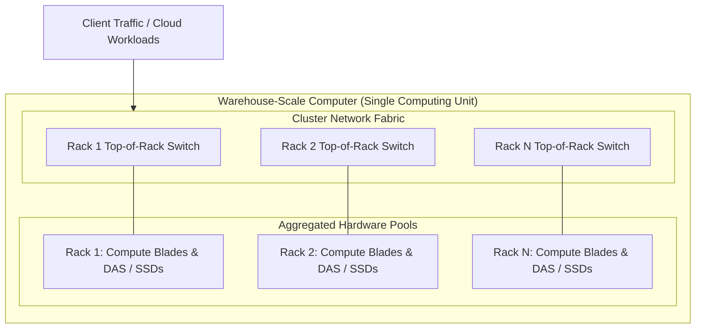

# Datacenter Systems: Warehouse-Scale Computer Architecture

Warehouse-scale computers (WSCs) treat thousands of individual commodity servers, network switches, and storage arrays as a single unified computing system to execute hyperscale internet services and multi-tenant cloud workloads.

---

## Warehouse-Scale Computer Architecture Motivation & Overview

Modern internet services—such as web search, video streaming, social networks, and large-scale cloud analytics—require computing and storage capacities that far exceed the physical limits of any single enterprise server or desktop machine. This demand led to the emergence of **Warehouse-Scale Computing (WSC)**.

### WSCs vs. Traditional Datacenters

A traditional datacenter and a Warehouse-Scale Computer differ fundamentally in workload composition, hardware homogeneity, and software management:

| Dimension | Traditional Datacenter | Warehouse-Scale Computer (WSC) |
| :--- | :--- | :--- |
| **Workload Model** | Hosts a large collection of small-to-medium independent applications from disparate users or departments. | Runs a smaller number of massive, distributed internet services or multi-tenant cloud runtimes. |
| **Hardware Setup** | Highly heterogeneous, dedicated, or isolated servers running distinct OS environments. | Highly homogenous hardware platforms sharing standard rack enclosures, server boards, and switches. |
| **Management Layer** | Decentralized or per-application administration; isolated silos. | Unified cluster-level management layer (a "datacenter operating system"). |
| **Availability Target** | Variable; often relies on expensive fault-tolerant hardware (e.g., redundant power supplies, SANs). | High availability (minimum $99.99\%$ uptime) achieved via software-level fault tolerance on commodity hardware. |

Initially developed for internal hyperscale workloads at companies like Google, Microsoft, and Apple, WSCs have evolved into standardized platforms. They now support both internal services and public cloud Infrastructure-as-a-Service (IaaS) offerings with uniform developer experiences.

### Cost Efficiency at Scale

Building and operating a WSC requires hundreds of millions of dollars in capital and operational investment. Because system quality of service (QoS) depends directly on aggregate processing and storage capacity, **cost efficiency** is the primary architectural metric.

Total Cost of Ownership (TCO) in a WSC accounts for:
- **Capital Expenditures (CapEx)**: Component acquisition (servers, SSDs, RAM), networking hardware, and facility construction (substations, chillers, building footprint).
- **Operational Expenditures (OpEx)**: Power and energy consumption, facility maintenance, hardware replacement, thermal management, and operations personnel.

The continuous growth in WSC computing demand stems from two main drivers:
1. **User Scale**: Rising service popularity and global request volume requiring horizontal scaling.
2. **Competitive Feature Velocity**: Algorithmic improvements and feature enhancements that demand increasingly large compute resources (e.g., real-time AI ranking, video transcoding, and deep learning).

---

## Architecture & Core Mechanics

### The Datacenter as a Computer

A WSC is not merely a co-located collection of loose servers. It operates as a single aggregated computing unit executing across tens of thousands of individual server nodes.



This massive aggregation introduces distinct system engineering challenges:
- **Simulation and Testing Constraints**: The immense scale makes full-system hardware simulation or testing impossible prior to deployment; system architects must rely on microbenchmarks and empirical measurement.
- **Fault Dynamics**: Hardware component failures transition from rare anomalies to continuous, expected background events.
- **Microsecond Tail Latency**: Deep storage and network hierarchies introduce performance variability, requiring strict tail-latency tolerance.

### Single Datacenter vs. Multi-Datacenter Topology

Although global services deploy across multiple geographical regions, the fundamental architectural building block remains the **single datacenter WSC**:

- **Single Datacenter Unit**: Optimized for low-latency intra-cluster networking, tight synchronization, and shared cluster storage.
- **Multi-Datacenter Networks**: Used primarily for:
  - *Disaster Tolerance*: Synchronous or asynchronous cross-region replication of non-volatile user data to survive power grid failures or natural disasters.
  - *Edge Content Delivery*: Deploying Content Delivery Networks (CDNs) near end-users for high-bandwidth streaming (e.g., video delivery).

### Hardware Building Blocks

WSCs construct computing capacity using modular, standardized hardware units stacked hierarchically.

![[Screenshots/Hardware Building Blocks for WSCs.png]]

![[Screenshots/Hardware Building Blocks Assembled.png]]

#### 1. Servers
- **Form Factor**: Standardized 1U or blade enclosure servers mounted in 19-inch or 21-inch custom racks.
- **Rack Integration**: Each rack houses dozens of server nodes connected to a local Top-of-Rack (ToR) Ethernet switch via 40 Gbps or 100 Gbps links.
- **Internal Bus**: Blade enclosures utilize PCIe links for high-speed internal communication between processing blades and networking modules.

#### 2. Storage Architecture
WSC storage balances cost, bandwidth, latency, and durability using hard disk drives (HDDs) and Flash Solid-State Drives (SSDs):

- **Direct-Attached Storage (DAS)**: Disks and SSDs physically attached directly to compute nodes. Reduces hardware cost and improves network utilization by eliminating specialized storage fabrics.
- **Network-Attached Storage (NAS)**: Dedicated storage nodes accessible over the cluster network. Simplifies storage management and provides strict Quality of Service (QoS) performance isolation, but incurs higher network traffic.
- **Commodity Storage Components**: WSCs frequently utilize desktop-class drive technology to lower CapEx. Storage software handles global aggregation, data replication, and tail latency mitigation.

#### 3. Networking Fabric
Networking infrastructure must provide high inter-node bandwidth without inflating facility costs:

- **Bisection Bandwidth Constraint**: High-port-count cluster switches are disproportionately expensive; scaling bisection bandwidth by $10\times$ can increase interconnect costs by nearly $100\times$.
- **Oversubscribed Topologies**: Standard rack deployment connects commodity ToR switches (e.g., 48 ports) with a limited number of uplinks (e.g., 8 uplinks to cluster-level switches), creating an oversubscribed bisection ratio.
- **Locality Awareness**: Cluster software must remain aware of rack-level network locality to avoid saturating scarce cluster-level uplink bandwidth.

#### 4. Building & Facilities Infrastructure
Physical facilities supply electrical power and thermal dissipation required to run tens of megawatts of computing equipment:

- **Power Delivery Hierarchy**: High-voltage utility grid feeds $\longrightarrow$ Datacenter Substation $\longrightarrow$ Power Distribution Units (PDUs) $\longrightarrow$ Bus Ducts $\longrightarrow$ Server Board Voltage Regulators. Uninterruptible Power Supplies (UPS), generators, and battery backups protect against power interruption at every tier.
- **Cooling Infrastructure**: Multi-tier heat exchange loops circulate cold air through rack chassis, extract heat via chilled water exchangers, and dissipate thermal energy outdoors via cooling towers.

---

## Concrete Walkthrough & Execution Trace

### Execution Trace: Processing a Scaled Scatter-Gather Query in a WSC

The following trace illustrates how a request traverses WSC hardware building blocks and handles an intra-rack switch oversubscription bottleneck:

```
Initial Context:
  Root Gateway Node (Rack 1, Slot 2) receives client query requiring data aggregation across 100 leaf shards.
  Network Oversubscription: 4:1 ratio between rack internal links and cluster uplinks.

Trace Steps:
  1. [Gateway Node] Serialization & Fan-out:
     - Root Gateway serializes sub-queries into Protobuf messages.
     - Transmits 100 parallel RPCs across Rack 1 ToR Switch.

  2. [Network Fabric] Bisection Traversal:
     - 15 sub-queries target leaf nodes located inside Rack 1 (Local Intra-Rack traversal: 10 Gbps / 40 Gbps zero oversubscription).
     - 85 sub-queries traverse ToR Uplinks to Cluster Core Switch (Oversubscribed fabric).
     - Core switch routes packets to ToR switches in Racks 2 through 12.

  3. [Leaf Nodes] Parallel Processing & Storage Access:
     - Leaf nodes receive RPCs via local PCIe NICs.
     - Read target index partitions from local Flash SSD (DAS) with ~100 microsecond read latency.

  4. [Network Fabric] Network Incast & Response Aggregation:
     - All 100 leaf nodes transmit response payloads back to Gateway Node simultaneously.
     - Burst traffic causes temporary buffer accumulation at Rack 1 ToR Switch (Incast congestion).
     - ToR Switch applies Explicit Congestion Notification (ECN) to pace TCP window delivery.

  5. [Gateway Node] Completion & Response:
     - Gateway Node aggregates 100 partial responses into final payload.
     - Sends response back to client; total execution time: 12.4 milliseconds.
```

---

## Edge Cases, Failure Modes & Mitigations

### 1. High Component Fault Rates
- **Failure Dynamics**: In a cluster of 50,000 servers with an Annualized Failure Rate (AFR) of $4\%$, the cluster experiences over 5 server failures per day, alongside frequent disk crashes, memory ECC errors, and network link drops.
- **Mitigation**: Systems must eliminate single points of failure. Applications store replicated state across independent fault domains (different racks/power buses) and rely on automated cluster schedulers to restart failed tasks on healthy nodes.

### 2. Network Bisection Bandwidth Bottlenecks
- **Failure Dynamics**: Uncontrolled cross-rack traffic can saturate oversubscribed cluster switch uplinks, leading to buffer drops, TCP retransmission timeouts, and microsecond-to-millisecond latency spikes.
- **Mitigation**: Application software groups communicating tasks within the same rack or network switch domain. Schedulers implement topology-aware task placement.

### 3. Thermal Throttling & Power Envelopes
- **Failure Dynamics**: Modern high-density CPUs operate near their maximum thermal design power (TDP). A localized cooling fan failure or airflow obstruction triggers hardware thermal throttling, causing severe straggler latency.
- **Mitigation**: Environmental monitoring systems continuously track inlet/outlet temperatures. Load balancers redirect request traffic away from thermally degraded racks.

---

## Formal Analysis / Protocol Specification

### Power Usage & Energy Dynamics

CPUs consume the largest share of system power in a server node due to high dynamic energy consumption under load and high idle power draw.

![[Screenshots/Energy Consumption Percentages.png]]

Historically, memory subsystems (e.g., Fully Buffered DIMMs / FBDIMMs) consumed power comparable to the CPU. The transition to DDR3/DDR4/DDR5 architectures significantly improved DRAM power efficiency, restoring CPUs as the dominant energy consumer.

### Power Usage Effectiveness (PUE)

Facilities efficiency is evaluated using **Power Usage Effectiveness (PUE)**:

$$\text{PUE} = \frac{P_{\text{Total Facility}}}{P_{\text{IT Equipment}}} = \frac{P_{\text{IT}} + P_{\text{Cooling}} + P_{\text{Power Losses}} + P_{\text{Lighting}}}{P_{\text{IT}}}$$

Where:
- $P_{\text{IT}}$ = Power consumed by compute servers, storage drives, and network switches.
- $P_{\text{Total Facility}}$ = Total power drawn from the utility grid.

$$\text{Efficiency Invariant}: \quad \text{PUE} \ge 1.0, \quad \lim_{P_{\text{overhead}} \to 0} \text{PUE} = 1.0$$

#### Simplified Explanation
PUE measures how much extra energy the facility spends on cooling and electrical infrastructure for every watt delivered to computing hardware. A PUE of $2.0$ indicates that half of the building's electricity is wasted on overhead. Hyperscale WSCs achieve PUEs near $1.1$ through optimized airflow, chilled water loops, and warm-water cooling.

### Annualized Failure Rate (AFR) Calculation

Expected server failure rate within a WSC cluster of $N$ nodes over operational duration $T$ (years):

$$\mathbb{E}[\text{Failures}] = N \times \text{AFR} \times T$$

For a WSC with $N = 100,000$ servers and an $\text{AFR} = 0.05$ ($5\%$ annual failure rate):

$$\mathbb{E}[\text{Failures per day}] = \frac{100,000 \times 0.05}{365} \approx 13.7 \text{ server failures/day}$$

---

## Industry Standard Terms

| Course Term | Industry / Standard Term |
| :--- | :--- |
| **Warehouse-Scale Computer (WSC)** | Hyperscale Datacenter / Cloud Infrastructure Facility |
| **Direct-Attached Storage (DAS)** | Local NVMe / Server-Attached Storage |
| **Top-of-Rack (ToR) Switch** | Leaf Switch / Access Layer Switch |
| **Cluster Switch** | Spine Switch / Core Switch / Fabric Interconnect |
| **Bisection Bandwidth** | Cross-Fabric Bandwidth / Spine Capacity |
| **Power Usage Effectiveness (PUE)** | Datacenter Infrastructure Efficiency Metric |

---

## Related

- [[Datacenter Systems/Workloads and Software Infrastructure|Workloads and Software Infrastructure]] — Cluster operating systems, resource allocation, MapReduce, and cloud software stacks
- [[Datacenter Systems/Course Introduction and Overview|Course Introduction and Overview]] — Cloud operator priorities, availability SLAs, and service abstraction models
- [[Datacenter Systems/Execution Environments and Virtualization|Execution Environments and Virtualization]] — Multi-tenant virtualization, hypervisor overheads, and container runtimes
- [[Operating Systems/Memory/Virtual Memory|Virtual Memory]] — Hardware virtual memory, page tables, and memory hierarchy
- [[Vault Index|Vault Index]] — Master repository navigation index
