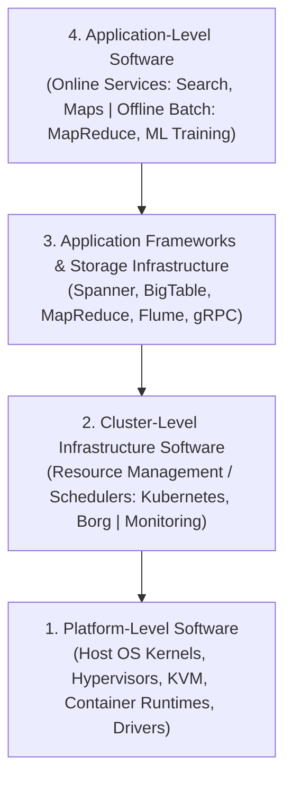
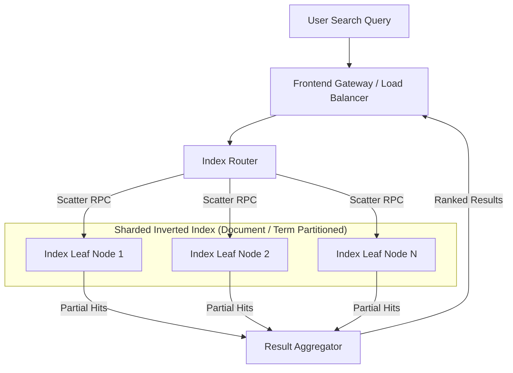

# Datacenter Systems: Workloads and Software Infrastructure

Software infrastructure in warehouse-scale computers abstracts raw hardware clusters into a cohesive operating system, managing resource allocation, application frameworks, tail latency, multi-tenancy, and security across diverse workloads.

---

## Workloads and Software Infrastructure Motivation & Overview

Warehouse-scale computing hardware requires a software stack capable of choreographing tens of thousands of server nodes while masking hardware failures, optimizing resource multiplexing, and enforcing microsecond latency targets.

### WSC Software Taxonomy

Software operating in a WSC is partitioned into four distinct functional tiers:



1. **Platform-Level Software**: Firmware, OS kernels, device drivers, and virtualization hypervisors present on individual server nodes to abstract single-machine hardware.
2. **Cluster-Level Infrastructure Software**: Distributed systems software that manages global hardware resources, task scheduling, distributed storage, RPC messaging, and synchronization. Functions as the **datacenter operating system**.
3. **Application Frameworks & Storage**: High-level abstractions (e.g., MapReduce, Spanner, BigTable) that automate data partitioning, state replication, and distributed execution.
4. **Application-Level Software**: End-user services classified into:
   - *Online Services*: Latency-critical, user-facing services (e.g., web search, ad serving).
   - *Offline Computations*: Throughput-oriented batch analytics (e.g., index building, log processing, model training).

### Datacenter vs. Desktop Software Trade-offs

Developing software for warehouse-scale environments introduces operational characteristics distinct from desktop software engineering:

- **Ample Parallelism**:
  - *Data-Level Parallelism*: Large datasets partitioned across thousands of independent records, allowing sub-tasks to run concurrently while hiding network synchronization latencies.
  - *Request-Level Parallelism*: High query throughput (hundreds of thousands of requests per second) where individual user requests execute independently without shared-memory locks.
- **Workload Churn and Rapid Deployment**: Users interact with cloud backends via stable web APIs, enabling continuous software deployment (CD) without customer software updates.
- **Platform Homogeneity**: WSCs standardize on a narrow set of server hardware configurations, simplifying kernel driver validation, cluster scheduling, load balancing, and automated hardware replacement.
- **Fault-Prone Execution Environment**: Hardware component failure is a continuous operational state rather than an exceptional edge case. Software must operate seamlessly across failing nodes.

---

## Architecture & Core Mechanics

### Platform-Level Software & Virtualization

Platform software standardizes single-machine operations across cluster nodes:
- **Kernel Tuning**: Homogeneous hardware permits aggressive transport parameter tuning (e.g., TCP socket window sizes, retransmission timeouts, and congestion control parameters like DCTCP).
- **Virtualization & Containerization**:
  - *Hypervisors (e.g., KVM)*: Provide strong security isolation and hardware portability for Infrastructure-as-a-Service (IaaS) cloud workloads at the cost of slight I/O virtualization overhead.
  - *Containers (e.g., Docker/cgroups/namespaces)*: Share the host OS kernel, offering lightweight encapsulation, sub-second startup times, and minimal overhead for internal microservices.
  - *Live VM Migration*: Hypervisors migrate running Virtual Machine instances across physical hosts without dropping network socket state, enabling zero-downtime host maintenance and kernel patching.

### Cluster-Level Infrastructure Software

Cluster-level infrastructure coordinates resources across thousands of nodes:

#### 1. Resource Management & Scheduling
The cluster scheduler (e.g., Google Borg, Kubernetes) acts as the central control plane:
- Maps incoming tasks to physical compute blades based on CPU, RAM, storage, and accelerator constraints.
- Enforces priority tiers and resource quotas, allowing high-priority online services to preempt low-priority offline batch jobs.
- Incorporates power budgets and correlated failure domains (racks, power buses, ToR switches) into placement decisions to maximize fault tolerance.

#### 2. Reusable Cluster Infrastructure
Core building blocks deployed across the cluster:
- **Reliable Distributed Storage**: Filesystems providing high throughput and multi-way replication (e.g., GFS, Colossus).
- **Remote Procedure Call (RPC) Frameworks**: Low-latency, strongly typed inter-service communication protocols (e.g., gRPC, Protocol Buffers).
- **Distributed Synchronization**: Consensus services for leader election, locking, and metadata management (e.g., Chubby, ZooKeeper, Etcd).

### Workload Diversity & Production Application Mechanics

#### Web Search Application Architecture
Web search demands sub-second total latency across massive index datasets:



- **Index Partitioning**: Indices are sharded by document ID or term across thousands of leaf nodes.
- **Latency & Throughput Balance**: Must respond within milliseconds while handling diurnal load swings (where trough query rates are less than half of peak volume). Auto-scaling dynamically adjusts leaf replica pools.

#### Video Serving Pipelines
Video processing balances compute, storage, and networking costs based on content popularity profiles:

![[Screenshots/YouTube Video Processing Pipeline.png]]

- **Transcoding Pipeline**: Raw video uploads are ingested and converted into diverse codec combinations, resolutions, and frame rates for heterogeneous mobile/desktop client devices.
- **Cost Balancing**: Popular videos are pre-transcoded and cached at edge CDNs to reduce compute and egress latency; long-tail unpopular videos are transcoded on-demand to save storage capacity.

### Cloud Computing Stack & Multi-Tenancy

Public cloud platforms leverage WSC cluster infrastructure to deliver elastic compute services:

![[Screenshots/Overview of VM-based Software Stack for GCP Workloads.png]]

- **I/O Virtualization**: Guest OS I/O operations pass through hypervisor abstraction layers to execute on physical host hardware.
- **High Availability ($N+1$ Redundancy)**: Multi-region redundancy ensures continuous service availability during planned system updates or physical hardware failures.
- **Resource Isolation**: Enforces CPU, memory bandwidth, and network QoS to prevent malicious or heavy "noisy neighbor" workloads from degrading peer tenant performance.
- **Zero-Trust Information Security**: WSCs implement multi-layer physical perimeter controls (biometric scanners, laser intrusion detection, vehicle barriers) combined with mandatory internal network TLS encryption and hardware Root of Trust chips (e.g., Google Titan).

### Performance and Availability Toolbox

WSC engineering employs a standardized set of operational patterns to guarantee performance and resilience:

![[Screenshots/WSC Performance and Availability Toolbox - Part 1.png]]

![[Screenshots/WSC Performance and Availability Toolbox - Part 2.png]]

![[Screenshots/WSC Performance and Availability Toolbox - Part 3.png]]

![[Screenshots/WSC Performance and Availability Toolbox - Part 4.png]]

---

## Concrete Walkthrough & Execution Trace

### Execution Trace: Live VM Migration During Physical Host Maintenance

The following trace demonstrates how cluster software migrates a running guest virtual machine to a secondary physical server without interrupting live client TCP connections:

```
Scenario: Physical Host Alpha requires emergency kernel security patching.
Target: Migrate Guest VM #402 to Host Beta with zero client-perceived downtime.

Trace Steps:
  1. [Cluster Scheduler] Target Allocation:
     - Scheduler selects Host Beta with matching CPU/RAM capacity in the same rack domain.

  2. [Hypervisor Alpha] Pre-Copy Phase (Iterative Memory Transfer):
     - Hypervisor Alpha snapshots dirty memory pages of Guest VM #402.
     - Copies base memory pages over cluster network to Host Beta while VM remains active.
     - Tracks newly dirtied pages during transfer using write-protection page table flags.

  3. [Hypervisor Alpha] Final Stop-and-Copy Phase (<50ms):
     - Pause Guest VM #402 execution briefly.
     - Transmits final delta of dirty memory pages and CPU register state to Host Beta.

  4. [SDN Controller] Network State Handoff:
     - Software-Defined Networking (SDN) controller updates virtual switch routing rules.
     - Re-routes incoming Virtual IP (VIP) packets from Host Alpha ToR switch port to Host Beta ToR switch port.

  5. [Hypervisor Beta] Execution Resume:
     - Host Beta restores CPU register state and resumes VM execution.
     - Client connections remain open; TCP sequence numbers continue without drop.
```

---

## Edge Cases, Failure Modes & Mitigations

### 1. Tail Latency Amplification in Scatter-Gather Tasks
- **Failure Mode**: In a fan-out query spanning $1,000$ leaf nodes, if a single node suffers a garbage collection pause or TCP retransmission, the overall query latency degrades to the $99.9\text{th}$ percentile straggler response time.
- **Mitigation**:
  - **Hedged Requests**: Send duplicate RPCs to a backup replica if no response is received within the $95\text{th}$ percentile latency threshold; use the first returning result and cancel the slower RPC.
  - **Tied Requests**: Enqueue cross-server tickets that cancel peer tasks automatically upon dequeue.

### 2. Noisy Neighbor Memory & Cache Contention
- **Failure Mode**: Co-located containers on the same physical host contend for shared L3 CPU cache lines and memory bus bandwidth, causing performance degradation for latency-sensitive online workloads.
- **Mitigation**: Resource management mechanisms like Intel RDT (Resource Director Technology) allocate dedicated L3 cache ways and enforce memory bandwidth quotas per container class.

### 3. Monitoring Alert Fatigue
- **Failure Mode**: Overly sensitive alert thresholds on high-frequency operational metrics generate constant false alarms, causing operators to ignore critical alerts during major outages.
- **Mitigation**: Base alerting strictly on Service Level Indicators (SLIs) linked directly to user impact (e.g., error rate and $99\text{th}$ percentile latency) rather than internal hardware utilization metrics.

---

## Formal Analysis / Protocol Specification

### Scatter-Gather Fan-Out Latency Formulation

#### Formal Definition
Let a parent request issue $N$ parallel sub-requests to independent leaf nodes. Let $X_i$ represent the response time of leaf node $i$, governed by cumulative distribution function $F(t) = P(X_i \le t)$.

Assuming independent and identically distributed (i.i.d.) node response times, the aggregate query completion latency $L = \max(X_1, X_2, \dots, X_N)$ has distribution:

$$P(L \le t) = [F(t)]^N$$

The probability that the overall query latency exceeds duration $t$ is:

$$P(L > t) = 1 - [P(X_i \le t)]^N = 1 - [1 - P(X_i > t)]^N$$

For a fan-out of $N = 500$ leaf nodes, if each leaf has a $0.5\%$ probability ($p = 0.005$) of a straggler delay exceeding $50\text{ms}$:

$$P(L > 50\text{ms}) = 1 - (1 - 0.005)^{500} = 1 - (0.995)^{500} \approx 1 - 0.0815 = 0.9185 \quad (91.85\%)$$

#### Simplified Explanation
Individual server performance cannot guarantee fast service at scale. Even if $99.5\%$ of individual servers respond within target limits, a query fanning out to 500 servers has a $91.85\%$ chance of being delayed by a straggler. Software must actively manage tail latency rather than relying on component consistency.

### Hedged Requests Protocol Invariant

Let $t_{95}$ be the $95\text{th}$ percentile latency of a sub-task.

```
Hedged Request Protocol Execution:
  t = 0: Issue Primary RPC to Replica A.
  t = t_95: If Replica A has not responded:
              Issue Secondary Hedged RPC to Replica B.
  t = t_response: Whichever replica (A or B) completes first returns result to client.
                  Cancel outstanding RPC on peer replica.
```

$$\text{Overhead Invariant}: \quad \text{Additional Load} \le 5\%, \quad \text{Tail Latency Reduction} \approx 10\times$$

---

## Industry Standard Terms

| Course Term | Industry / Standard Term |
| :--- | :--- |
| **Platform-Level Software** | Host System Software / Node OS Runtime / KVM Layer |
| **Cluster-Level Infrastructure** | Datacenter OS / Container Orchestrator (Kubernetes / Borg) |
| **Application Framework** | Distributed Processing Framework (MapReduce / Spark / Ray) |
| **Tail-Tolerance** | Straggler Mitigation / Hedged Requests / Speculative Execution |
| **Noisy Neighbor** | Resource Contention / Cross-Tenant Interference |
| **Live Migration** | Zero-Downtime VM Evacuation / Memory Pre-Copy |

---

## Related

- [[Datacenter Systems/Warehouse-Scale Computer Architecture|Warehouse-Scale Computer Architecture]] — Hardware building blocks, rack topologies, power delivery, and bisection bandwidth
- [[Datacenter Systems/Introduction|Datacenter Systems Overview]] — Cloud operator pyramid, availability SLAs, and IaaS/PaaS models
- [[Datacenter Systems/Execution Environments and Virtualization|Execution Environments and Virtualization]] — Multi-tenant virtualization, hypervisor overheads, and container runtimes
- [[Database Internals/Replication and Distribution/MapReduce|MapReduce]] — Distributed batch execution model and map/reduce phases
- [[Distributed Systems/RPC/Remote Procedure Call (RPC)|Remote Procedure Call (RPC)]] — Underlying network RPC protocols and serialization mechanics
- [[Operating Systems/Virtualization/Containers and Virt|Containers and Virtualization]] — Kernel cgroups, namespaces, and hypervisor architecture
- [[Vault Index|Vault Index]] — Master repository navigation index