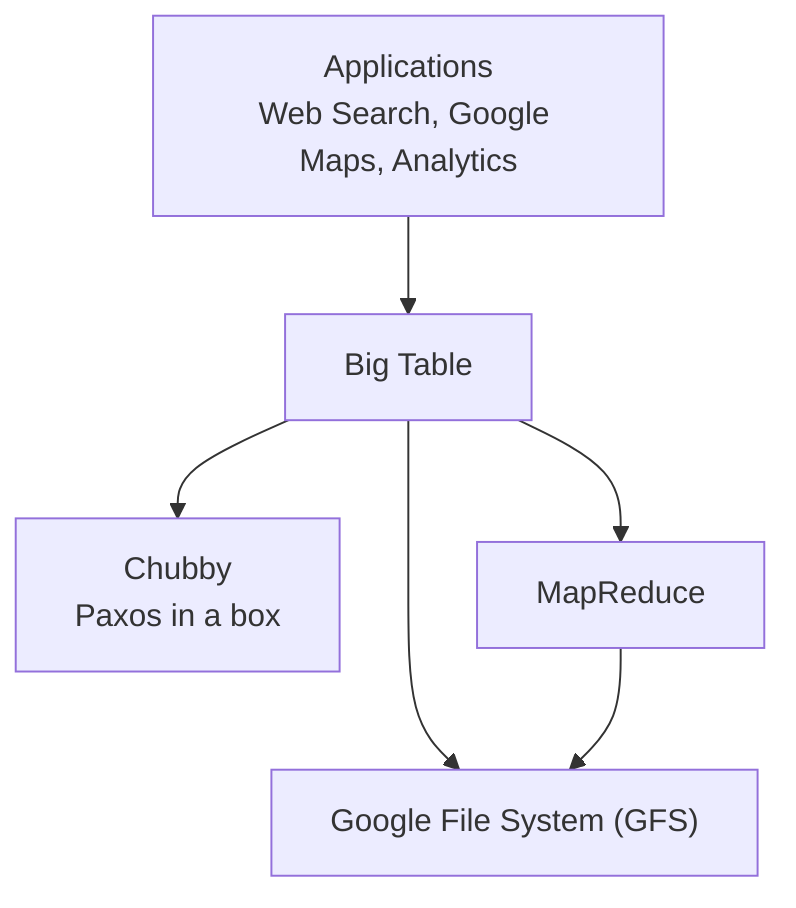
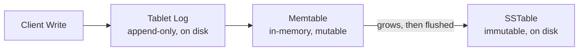

# CSE452: Big Table

**Big Table** is Google's storage system for structured data, and it is the closest real-world system to what we will have built once we finish the distributed systems lab. The paper assumes you already work with Google's services or have read their previous work, because Big Table is layered on top of several of them.

A key takeaway: **not every system needs to implement [[Paxos|Paxos]] itself** — a system can instead rely on a separate service that already implements it (in Big Table's case, **Chubby**).

Wide-Table database (cassandra is more updated version of this)

## Google Stack

Big Table does not stand alone; it sits in the middle of a stack of Google infrastructure services.



- **Applications**: all of these apps use Big Table.
	- Web search — crawling the internet, storing, and indexing it.
	- Google Maps.
	- Analytics.
- **Big Table**: built on top of GFS, Chubby, and MapReduce.
- **Google File System (GFS)**: the underlying distributed file system (now outdated).
- **Chubby**: "Paxos in a box" — a coordination service that packages Paxos as a reusable service. Big Table stores data here so it is able to recover.
- **MapReduce**: a batch-processing system that itself uses GFS.

## Goals of Big Table

Big Table is a storage system for **structured data**. It resembles a database but does **not** support a relational database model. Google built it with these goals in mind:

- **Control over data layout** — Google wanted direct control over how data is physically laid out.
- **Control over locality** — control over which data is stored near which other data.
- **Non-relational** — it deliberately avoids the relational model.
- **Performance at scale**.

## Data Model

Big Table's data model is a **3-dimensional table**. Conceptually, a lookup has the signature:

```cpp
string data_model(string row, string col, int64_t time) {...}
```

The three dimensions are:

- **Row** — at most 64KB; row names are short.
- **Column** — unbounded size, so names are potentially longer. Colons separate **column families**; a family changes infrequently (e.g. `anchor:consi.com`, where `anchor` is the family).
- **Timestamp** — provides version control within the same cell.

Because each cell is versioned by timestamp, this model allows you to do more mutations and changes than a traditional DBMS.

## API

- Read and write rows.
- Reads are **[[Linearizability|linearizable]]** — but only for a single row.
- The **unit of atomicity is the row**. Multi-row calls exist, but atomicity is only guaranteed per-row.
- **Scans** of ranges of rows are supported.
- **Not in the API**: cross-row transactions.

## Design

### SSTables

- **SSTable** (sorted-string table) — data is stored sorted, so lookups can use **binary search**.
- An SSTable is **immutable** once written to disk. The system layers an **illusion of mutability** on top of these immutable files.

### Tablets

- All data is stored in **tablets**.
- A **tablet is the unit of [[Sharding|sharding]]**.
- A **tablet server** is in charge of operations to that tablet.
	- There is only **one tablet server per tablet**, and the record of which server is in charge is stored in Chubby.
	- A **master** oversees this assignment, and it too is stored in Chubby.
	- We do **not** want all operations to go through Paxos, because Paxos is slow. Instead, Paxos is used only as a **fallback** to provide fault tolerance, while normal operations stay in memory.
- When no operations are in-flight, all data is on disk.

### Tablet Log

- The **tablet log** keeps track of operations.
- It is a file on disk, and it is **append-only**.
- Because it is an on-disk log, all parties **agree on the order of operations**.
- This matters for handing off between the **current tablet server and future tablet servers**: if the current tablet server crashes, a future one can pick up where the last one ended.

### Memtable

- The **memtable** is in-memory. It is a **mutable** version of some parts of the SSTable.
- When we write to the tablet log, we also update the memtable version. The memtable reads the operation and ensures the SSTable files are also updated.
- The memtable **grows** as we write to the system.
- It is written to disk by converting it into an SSTable and then writing it to the tablet log.



## Deep Dive

> [!info] Beyond lecture
> Everything above is from the CSE452 lecture and the Big Table paper. This section names the storage-engine pattern Big Table is an instance of and traces where it went next — context that was *not* part of the class.

### A Wide-Column Store, and Why It Is Fast

Despite "Table" in the name, Big Table is a **wide-column store**, not a relational table. Two properties define the model:

- **Sparse, dynamic columns.** Rows do *not* share a fixed schema. The column space is enormous — conceptually millions of possible columns — but each row physically stores **only the cells it actually has**. There is no NULL stored for a column a row does not use. New columns are added just by writing a new column qualifier, with no schema migration. This is what "wide" means: a very wide, very sparse column space.
- **Column families as the locality unit.** Columns are grouped into **column families** (the `family:qualifier` naming from the [[#Data Model|data model]]). A family is the unit of physical co-location and access control — this is the concrete payoff of Big Table's stated goals of *control over data layout* and *control over locality*.

The **throughput advantage** falls out of combining this model with the [[#Big Table's Storage Engine Is an LSM-Tree|LSM-tree storage engine]] below:

- **Writes are sequential, never in-place.** Every write appends to the tablet log and updates the in-memory memtable; nothing seeks out and overwrites a record on disk. Memtable flushes and compaction write whole **immutable SSTables sequentially**. This is the same hardware-alignment principle as [[Key Takeaways#Workload-Specific Optimization|GFS's sequential-I/O design]], and it is faster for concrete physical reasons:
  - **On an HDD**, a random in-place update forces the disk head to physically **seek** to the right track and then wait for the platter to rotate under it (rotational latency) — milliseconds of mechanical delay *per write*. Appending writes contiguous sectors, so the head stays put and the data streams out in one motion; you pay the seek once, not per record.
  - **On an SSD**, flash **cannot overwrite a page in place** — the controller must erase a whole block first, which causes *write amplification* (one logical write triggers extra physical reads, erases, and rewrites). Append-only, log-structured writes sidestep this by only ever writing fresh pages.
  - **Either way, append-only avoids the read-modify-write cycle.** An in-place update must first read the old record, modify it, and write it back; appending just writes the new version and lets compaction reconcile later — turning random writes into a sequential stream.
- **You pay only for cells that exist.** Sparse storage means empty cells cost nothing to store *or* scan, and a query that touches one column family never reads the others off disk. Wide, mostly-empty rows are therefore cheap — something a relational row store, which reserves space per column, handles far less efficiently.
- **Sorted rows make scans sequential.** Because SSTables keep rows sorted by key, a range scan is a sequential read rather than scattered lookups, and related rows land near each other on disk.
- **Writes are buffered and batched.** The memtable absorbs many writes in memory and flushes them in bulk, while compaction does the merging work in the background, off the critical write path.

### Big Table's Storage Engine Is an LSM-Tree

The combination the lecture describes — an in-memory **memtable**, **immutable SSTables** on disk, and an append-only **tablet log** — is the textbook **Log-Structured Merge-tree (LSM-tree)**. The write path is: append to the log (durability), update the memtable (in-memory), and later **flush** the memtable into a new immutable SSTable. Because data ends up spread across many SSTables, a background **compaction** process periodically merges them back together — that is the machinery behind the lecture's "illusion of mutability over immutable files." This exact engine powers **Cassandra, RocksDB, LevelDB, and HBase**.

### The Tablet Log Is a Write-Ahead Log

The append-only tablet log is a **write-ahead log (WAL)**, the same recovery primitive a single-node DBMS uses — see [[Database Internals/Transactions/Recovery|Recovery (CSE444)]]. The principle is identical: record the operation in a durable, ordered log *before* the in-memory state (the memtable) is considered committed, so that after a crash the new tablet server can **replay the log** to rebuild the memtable exactly. The agreed-upon order in the log is what makes the handoff between a crashed tablet server and its successor deterministic.

### Where It Went Next

- **HBase** is the open-source Big Table clone, built directly on top of HDFS (the GFS twin from [[Google File System (GFS)#Deep Dive|the GFS deep dive]]).
- Google later built **Spanner**, which adds the one thing Big Table's API deliberately omits — **cross-row, distributed transactions** — by layering [[Paxos|Paxos]] and synchronized clocks (TrueTime) over a Big-Table-like store. So Big Table and Spanner bracket the trade-off: Big Table drops cross-row transactions to stay fast; Spanner pays for them with consensus and clock infrastructure.
- **Chubby's lesson generalizes**: factor consensus into *one* coordination service ([[Paxos|Paxos]]-in-a-box) instead of reimplementing it in every system. The open-source equivalents are ZooKeeper and etcd.

### Cassandra = Big Table's Model + Dynamo's Distribution

The body notes that **Cassandra** is "a more updated version of this," and that is precise in a specific way: Cassandra is a **hybrid of the two Google/Amazon case studies**. It took different halves from each:

- **From Big Table — the storage engine and data model.** Cassandra is a **wide-column store** with the same sparse columns and column families, and it stores data with the same **LSM-tree** machinery: commit log (WAL) → memtable → immutable SSTables → background compaction. Everything in the [[#A Wide-Column Store, and Why It Is Fast|throughput discussion above]] applies to Cassandra directly.
- **From [[Dynamo|Dynamo]] — the distribution layer.** Where Big Table relies on a **single master** plus Chubby to assign tablets, Cassandra is **fully decentralized**: it places nodes on a [[Dynamo#Consistent Hashing|consistent-hashing ring]] with **no master**, replicates to successor nodes, and exposes [[Dynamo#Quorum Parameters (N, R, W)|tunable $N, R, W$ quorums]]. This removes Big Table's single-master bottleneck and single point of failure at the cost of Big Table's per-row linearizability.

So the lineage splits cleanly: **HBase** copied Big Table *whole* (including the master + HDFS substrate), while **Cassandra** kept Big Table's fast local storage but swapped the centralized control plane for Dynamo's masterless ring. The Dynamo deep dive covers the same system from the other direction — see [[Dynamo#The Lineage: Cassandra and CRDTs|Dynamo → Cassandra]].

## Industry Standard Terms

| CSE452 / Big Table Term | Industry / Standard Term |
| :--- | :--- |
| **Tablet** | Shard / partition |
| **Tablet server** | Shard / partition owner |
| **SSTable** | Sorted String Table (used in LSM-tree stores like Cassandra, RocksDB) |
| **Memtable** | In-memory write buffer of an LSM-tree |
| **Tablet log** | Write-ahead log (WAL) / commit log |
| **Chubby** | Distributed lock / coordination service (e.g. ZooKeeper, etcd) |
| **Column family** | Column family (HBase, Cassandra) |

---

## Related

- [[Google File System (GFS)|Google File System (GFS)]] — the underlying storage layer for Big Table
- [[Key Takeaways|Key Takeaways in Performance and Durability]] — core principles applied in Big Table
- [[Reading Papers|Reading Papers]] — how to approach research papers like the Big Table paper
- [[Paxos|Paxos]] — the consensus protocol that Chubby packages as a service
- [[Sharding|Sharding]] — tablets as the unit of sharding
- [[Linearizability|Linearizability]] — the guarantee Big Table provides for single-row reads
- [[Deterministic State Machine|Deterministic State Machine]] — the append-only ordered-log idea behind the tablet log
