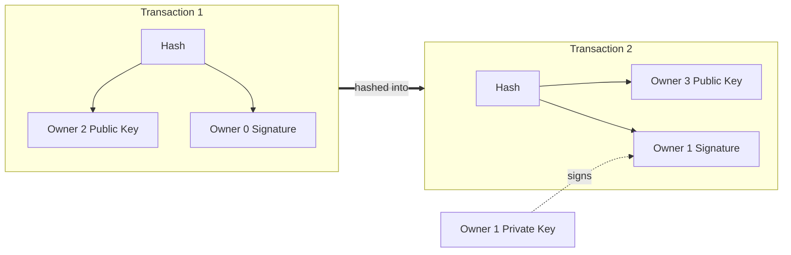

n# CSE452: Bitcoin

**[[Bitcoin|Bitcoin]]** is a peer-to-peer electronic cash system that lets parties transact directly without a trusted financial institution. Its central contribution is solving the **double-spend** problem in a decentralized setting.

> Me: A **double-spend (DS)** means the same currency is spent more than once (unauthorized / fraudulent).

---

## Motivation: Why Decentralize?

- **Trust is a liability**: Institutions create an inherent need to trust them.
- **Single point of failure**: Centralizing trust concentrates both failure and overhead in one place.
- **Fraud is unavoidable**: With purely digital transactions backed by a mediator, reversible payments make fraud practically unavoidable.

### Solution

- Replace trust in good actors with **tangible cryptographic proof**.
- If transactions are **computationally impractical to reverse**, sellers are protected from fraud, and the same protection can be extended to buyers.

### Main Idea

- Use a **peer-to-peer distributed timestamp server** to generate computational proof of the **chronological order** of transactions (who owns which coin at what time).
- The system is secure as long as **more than 50% of the CPU power** is collectively controlled by honest nodes.

## Transactions

A coin is defined as a **chain of digital signatures**. An owner transfers the coin to the next owner by **signing a hash of the previous transaction together with the public key of the next owner**, and appending this to the end of the coin's chain.

- The payee can verify the signatures to confirm the **chain of ownership**.
- However, signatures alone **cannot prove** that one of the previous owners did not double-spend the coin.
  - The common solution is a **central authority (mint)** that checks every transaction for double-spends — but this reintroduces a single point of failure.
- The real question: how can a payee know that previous owners did not sign an **earlier** transaction for the same coin?
  - Without a trusted party, transactions must be **publicly announced**, and participants must agree on a **single history** of the order in which they were received.
  - We need proof that, at the time of each transaction, the **majority of nodes agreed** it was the first one received.

### What Gets Signed and Hashed

> Me: This is the part that wasn't obvious to me — what actually goes *into* the hash.

Each transaction commits to its predecessor by hashing two things together:

$$H(\text{prev transaction} \; || \; \text{public key of next owner})$$

The current owner then **signs that hash** with their private key. Because the previous transaction is included in the hash, every link cryptographically points back to the one before it, forming a tamper-evident chain.

## Timestamp Server

The foundation is a **timestamp server** that takes a block of items, hashes them, and widely publishes the hash. Each timestamp **includes the previous timestamp in its hash**, forming a chain where each new hash reinforces every one before it.

### Proof-of-Work

To make the timestamp server work peer-to-peer (without a trusted publisher), Bitcoin adds **proof-of-work**: a hash whose expected work grows **exponentially** with the difficulty, making it expensive to produce but cheap to verify.

- The hash function used is **SHA-256**.
- A node scans for a **nonce** such that the block's hash begins with a required number of leading zero bits.
- Once a block is added, it **cannot be changed without redoing its proof-of-work** — and, because each later block builds on it, **redoing all subsequent blocks as well**. Changing any block that is not the tail is computationally infeasible.
- Proof-of-work is **CPU-based**, so it is effectively **one-CPU-one-vote** rather than one-IP-one-vote, making it resistant to a single attacker spinning up many IPs.
- As long as honest nodes control the majority of CPU power, the **honest chain grows fastest**.
  - The network accepts the **longest valid chain** as the true one.
  - An attacker who wants to rewrite history must redo a block's work *and* outpace all honest nodes adding new blocks — with less CPU power, their chance of catching up **shrinks exponentially** as more blocks are added.

## Network

The protocol runs as follows:

1. New transactions are **broadcast to all nodes**.
2. Each node **collects new transactions into a block**.
3. Each node works on finding a difficult **proof-of-work** for its block.
   - As part of building the block, a node **verifies each transaction is valid and not already spent**.
4. When a node finds a proof-of-work, it **broadcasts the block** to all nodes.
5. Each receiving node **validates the block** — confirming the proof-of-work is correct (the hash has the required leading zero bits) and that **every transaction inside is valid and not already spent**. Validation is cheap even though producing the proof-of-work was expensive.
6. If valid, the node **appends the block to its chain** and then **immediately starts mining the next block**, placing the just-accepted block's hash in the new block's **`previous hash`** field.

### Acceptance Is Implicit

There is no explicit "I accept" message. A node signals acceptance **by building on top of a block** — chaining its next block off the accepted one is a vote that this block is now the tail of the longest valid chain. Conversely, a node that **rejects** a block (bad proof-of-work or a double-spend inside) simply keeps mining on the **old tail** and ignores the broadcast block.

So the steady-state loop for every honest node is:

$$\text{receive} \rightarrow \text{validate} \rightarrow \text{append} \rightarrow \text{point next block's } \texttt{previous hash} \text{ at it} \rightarrow \text{mine}$$

Every honest node doing this in parallel is what makes the chain grow, and it is why rewriting an old block requires **out-mining the entire honest network**.

The **longest chain** is considered correct, and nodes keep extending it.

> Me: Wouldn't storing every block forever cause unbounded memory growth? → see [Reclaiming Disk Space](#reclaiming-disk-space) (compaction).

### Ties (Forks)

- If two nodes broadcast different versions of the next block simultaneously, some nodes receive one first and some the other.
- Nodes **work on the first version they received** but **save the other branch** in case it becomes longer.
- The tie breaks when the **next proof-of-work is found**: one branch becomes longer, and nodes on the shorter branch **switch** to the longer one.

> Me: Does switching require full state transfer, or just sending the missing blocks?

### Dropped Messages

- Block broadcasts are **best-effort**; it is fine if not all nodes receive every block.
- If a node misses a block, it **requests the missing block** once it receives the next block and realizes there is a gap.

## Reclaiming Disk Space

Once a block has enough confirmations on top of it, its spent transactions can be **garbage collected** to save disk space.

- Transactions in a block are hashed into a **Merkle tree**.
- Only the **Merkle root** is included in the block's hash, alongside the **previous hash** and the **nonce**.
- Old blocks can then be **compacted by pruning interior branches** of the tree — the transactions that fed the root can be discarded while the root (and thus the block hash) stays intact.

## Simplified Payment Verification (SPV)

A user can verify payments **without running a full network node**.

- The user only keeps a copy of the **block headers** of the longest proof-of-work chain.
  - Query network nodes until you are confident you have the longest chain.
- To check a specific transaction, obtain the **Merkle branch** linking that transaction to the block it is timestamped in.
- By linking the transaction to a place in the chain, you can see that the network **accepted** it; each block added **after** it provides further confirmation of acceptance.

## Combining and Splitting Values

Rather than making an individual block (or hash) per coin, transactions contain **multiple inputs and outputs**, so values can be combined and split.

- A small (e.g. cents) payment does not require its own dedicated coin.
- **Inputs**: either a single input from a previous larger transaction, or multiple smaller inputs combined.
- **Outputs**: at most two — the **payment** itself, and the **change** returned to the sender (if any).

## Privacy

- Institutions get privacy by **limiting access** to information; Bitcoin instead keeps **public keys anonymous**.
- The public can see that *someone* sent an amount to *someone else*, but without linking the keys to real identities, transactions cannot be tied to a person.
- **Extra protection**: use a **new key pair for each transaction** so they cannot be linked to a common owner.
- **Limits**: some linking is unavoidable with **multi-input transactions**, which necessarily reveal that their inputs were owned by the same owner. If the owner of one key is ever revealed, that linking can expose other transactions belonging to the same owner.

---

## Industry Standard Terms

| CSE452 Term | Industry / Standard Term |
| :--- | :--- |
| **Timestamp Server / Block Chain** | Distributed Ledger / Blockchain |
| **Proof-of-Work** | Nakamoto Consensus / Mining |
| **Longest Valid Chain** | Heaviest Chain / Canonical Chain |
| **Double-Spend** | Replay / Conflicting Transaction |
| **Simplified Payment Verification** | Light Client / SPV Wallet |

---

## Related
- [[Key Takeaways|Key Takeaways]] — recurring strategies across distributed systems case studies
- [[Theoretical Foundations#CAP Theorem|CAP Theorem]] — Bitcoin favors availability and partition tolerance, accepting eventual agreement on the longest chain
- [[Dynamo|Dynamo]] — another system that resolves conflicting histories without a central authority
