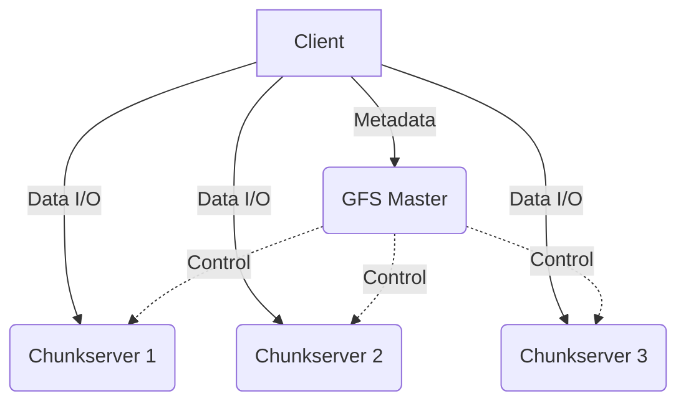

# CSE452: Google File System (GFS)

**Google File System (GFS)** is a scalable distributed file system for large distributed data-intensive applications. It provides fault tolerance while running on inexpensive commodity hardware, and it delivers high aggregate performance to a large number of clients.

## Workloads and Design Goals

GFS was designed specifically for Google's internal workloads in 2003, which differ significantly from traditional file system workloads.

### Expected Workloads
- **Large Files**: The system must handle files that are commonly hundreds of megabytes or gigabytes in size. 
- **Sequential Access**: Most files are mutated by **appending new data** rather than overwriting existing data. Once written, files are typically read sequentially.
- **High Throughput over Latency**: Google prioritized high aggregate throughput for batch processing (like MapReduce) over low latency for individual reads/writes.

### Design Decisions
- **Component Failures are Norm**: With thousands of nodes, hardware failure is a constant. The system must be self-healing.
- **Optimize for Large Files**: GFS optimizes for large files and "eats the cost" of inefficiency for small files (which may still be supported but are slow).
- **Physical Alignment**: Leverages **sequential I/O** on Hard Disk Drives (HDDs) to maximize performance, as random I/O is significantly slower on mechanical disks.

## Architecture

GFS consists of a single **Master** and multiple **Chunkservers**, accessed by multiple **Clients**.

### Chunks
- Files are divided into fixed-size **chunks**.
- **Chunk Size**: 64MB. This is much larger than a typical file system block (usually 4KB).
- **Pros**: Reduces client-master interaction; reduces metadata size on the master; allows for persistent TCP connections.
- **Cons**: Internal fragmentation for small files. GFS mitigates this by only allocating the space actually used (e.g., a 1-byte file only takes a few KB on disk, even though its logical chunk size is 64MB).

### GFS Master
The master maintains all file system **metadata**.
- **Namespaces**: The mapping of file names to chunk IDs. This is stored persistently.
- **Chunk Locations**: Which chunkservers hold which replicas. This is **volatile** and stored in memory. Upon reboot, the master polls chunkservers to discover what chunks they have.
- **Fault Tolerance**: The master uses **Shadow Masters** that stay slightly behind. In 2003, promotion of a shadow to primary required human intervention.

### Chunkservers
- Store chunks as local files on Linux file systems.
- **Replication**: Chunks are typically replicated 3 times across different **dataracks** to ensure durability.

## Operations and Control Flow

### Read Flow
1. **Metadata Lookup**: The client sends the file name and byte offset to the master.
2. **Chunk Indexing**: The master calculates the chunk index based on the 64MB chunk size and returns the **Chunk ID** and locations of the replicas.
3. **Data Request**: The client caches this metadata and contacts the nearest chunkserver directly.
4. **Data Transfer**: The chunkserver returns the requested data.

### Write Flow
1. **Primary Grant**: The master grants a **lease** to one of the replicas, designating it as the **Primary**.
2. **Data Pushing**: The client pushes the data to all replicas. Replicas buffer this data in a LRU cache.
3. **Write Request**: Once all replicas acknowledge receiving the data, the client sends a write request to the primary.
4. **Ordering**: The primary assigns a serial number to the operation and tells all secondaries to apply the write in that specific order.
5. **Acknowledgment**: Once all secondaries confirm, the primary acknowledges the client.

### Append Flow (Record Append)
Standard appends can suffer from "lost writes" if multiple clients write to the same offset. GFS provides **Record Append**, where the primary decides the offset.
- The client just says "append this data."
- GFS guarantees the data is appended **at least once** atomically.
- If a write fails at some replicas, the primary may retry, leading to **duplicate records** or **padding** (gaps) in the file.
- **Application Responsibility**: The application must be designed to handle duplicates and gaps (e.g., using checksums and unique IDs within records).

## Consistency Model

GFS provides a relaxed consistency model to maintain high performance.

- **Metadata**: Operations (like file creation) are **[[Linearizability|linearizable]]** because they are handled by a single master.
- **Data**: Data is **not linearizable**. Different replicas may be slightly out of sync or contain duplicates due to failed appends.
- **Defined vs. Consistent**:
    - **Consistent**: All clients see the same data, regardless of which replica they read from.
    - **Defined**: The data is consistent, and clients see the results of a write in its entirety (no interleaved fragments).

## Deep Dive

> [!info] Beyond lecture
> Everything above is from the CSE452 lecture and the GFS paper. This section adds cross-course connections and the real-world evolution of GFS that were *not* part of the class. Future me: this is "where this idea went next," not exam material.

### The Open-Source Twin: HDFS

The **Hadoop Distributed File System (HDFS)** is a near-direct reimplementation of GFS, and it is the file system the open-source [[MapReduce|MapReduce]]/Hadoop stack actually runs on (the CSE444 notes refer to it as HDFS). The pieces map one-to-one: GFS **Master** → HDFS **NameNode**, GFS **Chunkserver** → HDFS **DataNode**, GFS **chunk** → HDFS **block**. So when [[MapReduce|MapReduce]]'s locality optimization schedules a map task next to its data, it is exploiting exactly this GFS/HDFS chunk-placement design.

### Why the Single Master Eventually Lost: Colossus

The single master is GFS's defining simplification *and* its scaling ceiling: because the master holds **all metadata in RAM**, the amount of file system it can manage is bounded by one machine's memory. The 64 MB chunk size is partly a consequence of this — large chunks mean fewer chunks, which means less metadata per byte stored. Google eventually replaced GFS with **Colossus**, which **shards the metadata layer itself** across many servers, removing the single-master bottleneck. The lesson generalizes: a single coordinator is the easiest thing to reason about and the first thing to become a bottleneck.

### Cross-Course Connections

- **Chunk = shard + replica.** A chunk replicated across chunkservers is [[Sharding|sharding]] plus replication — the same partition-then-replicate pattern used by [[Big Table|Big Table]] tablets and [[Dynamo|Dynamo]]'s preference list.
- **Volatile chunk locations = soft state.** The master rebuilds its chunk-location table by **polling chunkservers on reboot** rather than reading it from disk. The chunkservers — not the master's disk — are the authoritative source of "who has what," so the master can lose that table and reconstruct it. This is the classic *soft-state* pattern.
- **Relaxed consistency is pushed up into the application.** Because Record Append is only *at-least-once*, every consumer — [[MapReduce|MapReduce]], [[Big Table|Big Table]] — must carry its own checksums and deduplication to tolerate the duplicate/padded records GFS may leave. That is a concrete instance of the [[Key Takeaways#Pushing Complexity to the Application|push-complexity-to-the-application]] strategy: the storage layer stays fast and simple, and correctness is finished off above it.

## Industry Standard Terms

| CSE452 / GFS Term | Industry / Standard Term |
| :--- | :--- |
| **Master** | Control Plane / Metadata Service |
| **Chunkserver** | Data Plane / Storage Node |
| **Chunk** | Block / Shard |
| **Lease** | Primary Election / Token |
| **Record Append** | Atomic Append |
| **Shadow Master** | Read Replica / Warm Standby |

---

## Related

- [[Big Table|Big Table]] — uses GFS as its underlying storage layer
- [[Key Takeaways|Key Takeaways in Performance and Durability]] — summary of the principles GFS uses
- [[Linearizability|Linearizability]] — why GFS only provides this for metadata
- [[CSE451/Persistence/File Systems|File Systems (CSE451)]] — traditional file system concepts contrasted with GFS
- [[CSE351/Number Representation/Number Representation|Number Representation (CSE351)]] — underlying data storage concepts