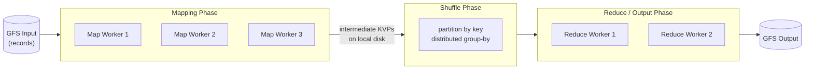
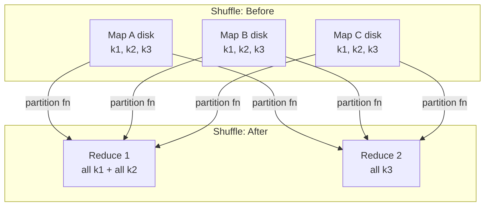

# Distributed Systems: MapReduce

**MapReduce** is a programming model and runtime for building distributed programs that achieve good performance on very large datasets. The programmer writes two simple functions — a **map** and a **reduce** — and the framework handles distribution, scheduling, and fault tolerance across the cluster.

This file covers MapReduce from the **distributed-systems** angle (the OSDI paper, the GFS substrate, the phase mechanics). For the **database** angle — jobs vs. tasks and slots, straggler/backup-task scheduling, the map→reduce skew barrier, and running relational query plans over MapReduce (with no transactions) — see the companion note in CSE444.

## History

- Published in **OSDI 2004** (a systems conference).
- It builds directly on the [[Google File System (GFS)|Google File System (GFS)]], which was published one year earlier in **SOSP 2003**. MapReduce uses GFS as both its input source and its output sink.

## Goals

The motivating workloads are not algorithmically hard — they are hard only because of the sheer **volume of data** involved.

- **Google Search** needs an **inverted index**: a map from each word to the list of pages that contain it.
- A closely related, simpler example is **word count**.

The real goal is to **make it easy to build distributed programs** that still get good performance on large datasets, without forcing every programmer to reimplement distribution and fault tolerance.

## Data Parallelism

MapReduce exploits **data parallelism**: doing the *same* operation independently to *many* pieces of data. Because each piece is processed independently, the work can be spread across hundreds of machines at once.

## Programming Model

The model is built from two higher-order functions. The core abstraction is a **set of key-value pairs** (`soKVP`); both functions consume and produce these sets, and the keys and values are entirely up to the programmer.

### map(f)

`map` applies a user function `f` to each input pair independently:

$$f(k, v) \rightarrow \text{soKVP}$$

It looks at each input one at a time and produces an **intermediate** set of key-value pairs. The framework then collects all of these per-input intermediate sets together into one giant intermediate set. This mirrors a functional `map` over a collection:

```cpp
// Conceptually, like transforming each element of a collection:
//   {1, 2, 3}.map(x -> x + 1) == {2, 3, 4}
// except f may emit zero, one, or many output pairs per input pair.
```

### reduce(g)

`reduce` takes the intermediate `soKVP` and collapses it back down to a `soKVP`. It runs in three phases:

- **Input** — the intermediate `soKVP` produced by the map phase.
- **Group** — the framework groups the input **by key**, producing a `map<string, list<string>>`: every value emitted under the same key is gathered into one list.
- **Reduce** — the user function `g` runs **separately on each key**, collapsing that key's list of values into a result:

$$k \rightarrow g(\text{grouped.get}(k))$$

This reduces a `map<string, list<string>>` down to a `map<string, string>` — one aggregated value per key. The lisp-style intuition is:

```cpp
// {1, 2, 3}.reduce((x, y) -> x + y) == 6
```

The key idea: **`g` runs on all values associated with the same intermediate key**, no matter which machine produced them.

## Example Program: Word Count

The canonical program is word count. The map emits a `"1"` for every word it sees; the reduce sums those counts per word. Below is the C++ form, matching the signatures used in the paper.

```cpp
// MAP: called once per input record.
//   key   = document name (unused here)
//   value = document contents
void map(const string& key, const string& value) {
    for (const string& word : tokenize(value)) {
        emit(word, "1");   // intermediate pair: (word, "1")
    }
}

// REDUCE: called once per intermediate key.
//   key    = a word
//   values = an iterator over every "1" emitted for that word
void reduce(const string& key, Iterator values) {
    int result = 0;
    for (const string& v : values) {
        result += stoi(v);          // parse each "1" and accumulate
    }
    emit(key, to_string(result));   // (word, total count)
}
```

Notice that the programmer never writes networking, partitioning, or retry code — only `map` and `reduce`. Everything else is the framework's job.

## Execution: Master and Data Layout

Every MapReduce job has a single **MapReduce master node** that coordinates the workers. The framework views input files as a **collection of records**; each record carries a **checksum** so a worker can verify that an append (e.g. via GFS [[Google File System (GFS)#Append Flow (Record Append)|Record Append]]) was successful.

The job runs as a pipeline of phases: **Mapping → Shuffle → Reduce/Output**.



### How MapReduce Uses GFS

MapReduce does not implement its own storage — it leans on the [[Google File System (GFS)|Google File System (GFS)]] for everything *durable*, and uses plain **local disk** for everything *transient*. The split is deliberate and shows up at all three boundaries of the pipeline:

- **Input comes from GFS.** Input files are already stored as GFS [[Google File System (GFS)#Chunks|chunks]] of 64 MB, replicated across the cluster. MapReduce splits the input into **16–64 MB pieces aligned to those chunks** so that one map task maps cleanly onto one (or a few) chunks.
  - **Locality optimization**: because GFS already replicates each chunk on three nodes, the master can schedule a map task **on a node that already holds that chunk's replica locally** ([[Google File System (GFS)#Chunkservers|GFS replication]]). The map then reads from local disk instead of pulling 64 MB across the network — directly exploiting GFS's data placement.
- **Intermediate data goes to local disk, *not* GFS.** Map output is written to the worker's own local disk. This is the one place MapReduce intentionally bypasses GFS: GFS would replicate the data three times ([[Google File System (GFS)#Chunkservers|3× replication]]), which is wasted effort for transient data. If the worker dies, the framework simply **re-runs that map task** and regenerates the intermediate output — cheaper than paying for replication up front.
- **Output goes back to GFS.** Each reduce task writes its final result into GFS, where it is replicated and durable. Because the framework views files as a **collection of records** with per-record **checksums**, a worker can append output via GFS [[Google File System (GFS)#Append Flow (Record Append)|Record Append]] and verify the append landed — and because Record Append is only *at-least-once*, the checksums let consumers detect the duplicate or padded records GFS may leave behind.

In short: **GFS provides durability and locality at the edges (input/output); local disk provides cheap, regenerable scratch space in the middle (shuffle).**

### Mapping Phase

- The input is split into **N record pieces** of **16–64 MB** each, sized to align with the [[Google File System (GFS)#Chunks|GFS chunking system]]. The master hands these splits out to workers.
  - **Locality optimization**: because GFS already partitions and replicates chunks across the same nodes that run map tasks, the master can assign a split to a worker that **already holds that chunk locally**, avoiding a network read.
- Each map worker outputs its intermediate key-value pairs to its **local disk** (not GFS), then **informs the master** where that output lives.
  - The intermediate output is **partitioned by owner** — i.e. by which future reduce worker will need it.
  - Each worker writes a file to disk for the other workers; those other workers later read that partition.
- There is **no guarantee** about how an intermediate key relates to the input key — `map` may emit any keys it likes, in any arrangement.

![[Screenshots/MapReduce Mapping Phase.png]]

### Reduce Phase

The reduce phase is what **makes or breaks performance**, because the same intermediate key can be spread across **multiple nodes** — every map worker may have emitted that key. Before reducing, the framework must gather all values for each key onto the one worker responsible for it. That gathering step is the **shuffle**.

- shuffle is the bottleneck as we must wait for all nodes to finish to proceed

#### Shuffle Phase

The shuffle is a **distributed group-by**:

- A **partition function** decides, for each intermediate key, **which worker** it belongs on.
- Each map worker's data is written **locally, partitioned by owner**.
- Each reduce worker then **reads the local disks of the other nodes** and grabs exactly the key-value pairs meant for it — essentially a distributed **sort**, collecting every KVP destined for that worker.



##### Shuffle Phase Before

![[Screenshots/Shuffle Phase Before.png]]

##### Shuffle Phase After

![[Screenshots/Shuffle Phase After.png]]

### Output Phase

Once a reduce worker has grabbed its files, it **writes them to disk, groups them by key, and then outputs** the final reduced result (back to GFS).

![[Screenshots/MapReduce Output Phase.png]]

## Formal Analysis

### Formal Definition

The two functions have the types:

$$\text{map}: (k_1, v_1) \rightarrow \text{list}(k_2, v_2)$$
$$\text{reduce}: (k_2, \text{list}(v_2)) \rightarrow \text{list}(v_2)$$

The framework guarantees that for every intermediate key $k_2$, the call $\text{reduce}(k_2, \text{list}(v_2))$ receives **all** values emitted for $k_2$ across **all** map tasks, regardless of which worker produced them.

### Simplified Explanation

You write "what to do to one piece" (`map`) and "how to combine everything with the same name" (`reduce`). The framework promises that no matter how many machines emitted a given key, all of its values arrive together at one reducer.

## Deep Dive

> [!info] Beyond lecture
> Everything above is from the CSE452 lecture and the MapReduce paper. This section is added context — cross-course connections to the CSE444 parallel-database material — that was *not* part of the class. Future me: treat it as "how this idea shows up elsewhere," not as exam material.

### MapReduce's Shuffle as a Parallel-DBMS Exchange Operator

The shuffle is the *same* operation the database course calls the [[Database Internals/Parallel/ParallelExecutionComponents/The Shuffle Operator|Shuffle (Exchange) operator]] — the building block that redistributes tuples between nodes so that everything sharing a key is co-located before the next operator runs. The pieces line up one-to-one:

| MapReduce | Parallel DBMS ([[Database Internals/Parallel/Parallel Query Execution|Parallel Query Execution]]) |
| :--- | :--- |
| Map worker writing partitioned output | **Producer** — routes rows to $N$ consumers |
| Reduce worker pulling its partition | **Consumer** — buffers input from $N$ producers |
| Partition function | [[Database Internals/Parallel/Data Partitioning Schemes#Hash Partitioning\|Hash partitioning]] $h(K) \bmod N$ |
| Distributed group-by + reduce | [[Database Internals/Parallel/ParallelExecutionComponents/Partitioned Aggregation\|Partitioned aggregation]] (group-by then aggregate) |

The partition function is almost always a **hash** of the intermediate key, exactly like [[Database Internals/Parallel/Data Partitioning Schemes#Hash Partitioning|hash partitioning]] in a shared-nothing DBMS: hashing the key guarantees that *every* pair with that key lands on the same reduce worker, which is precisely the co-location the reduce step requires.

### Data Skew and the Shuffle Bottleneck

The lecture's claim that the shuffle "makes or breaks performance" is, in database terms, a **[[Database Internals/Parallel/Data Partitioning Schemes#Skew: The Justin Bieber Effect|data skew]]** problem. If one intermediate key is far more popular than the rest (the "Justin Bieber" key), the reduce worker that owns it gets a disproportionate share of the data, and the whole job runs only as fast as that one overloaded node. MapReduce's standard mitigation is the **more-partitions-than-nodes** trick from the [[Database Internals/Parallel/Data Partitioning Schemes#Skew-Join|skew-join]] discussion: create many more partitions than there are reduce workers so the master can spread hot partitions around, which works as long as the skew is confined to at most one partition.

## Industry Standard Terms

| CSE452 / MapReduce Term | Industry / Standard Term |
| :--- | :--- |
| **MapReduce master** | Job scheduler / coordinator (e.g. YARN ResourceManager) |
| **Map task** | Mapper |
| **Reduce task** | Reducer |
| **Intermediate key-value pairs** | Intermediate / spill data |
| **Shuffle (distributed group-by)** | Shuffle and sort |
| **Partition function** | Partitioner (e.g. hash partitioner) |
| **Locality optimization** | Data locality / rack awareness |

---

## Related

- [[Google File System (GFS)|Google File System (GFS)]] — the distributed file system MapReduce reads input from and writes output to; see [[#How MapReduce Uses GFS]]
- [[Big Table|Big Table]] — part of the same Google stack; itself built atop GFS and MapReduce
- [[Key Takeaways|Key Takeaways in Performance and Durability]] — the recurring performance and durability strategies MapReduce applies
- [[Reading Papers|Reading Papers]] — how to approach the MapReduce paper (OSDI 2004)
- [[Database Internals/Replication and Distribution/MapReduce|MapReduce (CSE444)]] — the companion note covering the database implications: jobs/tasks/slots, stragglers and backup tasks, the skew barrier, and relational query plans over MapReduce
- [[Database Internals/Replication and Distribution/Spark|Spark (CSE444)]] — a later data-parallel engine that generalizes the map/reduce model
- [[Database Internals/Parallel/ParallelExecutionComponents/The Shuffle Operator|Shuffle Operator (CSE444)]] — the parallel-DBMS view of the same shuffle/exchange mechanism
- [[Database Internals/Parallel/Data Partitioning Schemes|Data Partitioning Schemes (CSE444)]] — hash partitioning and the data-skew (Justin Bieber) problem behind shuffle performance
