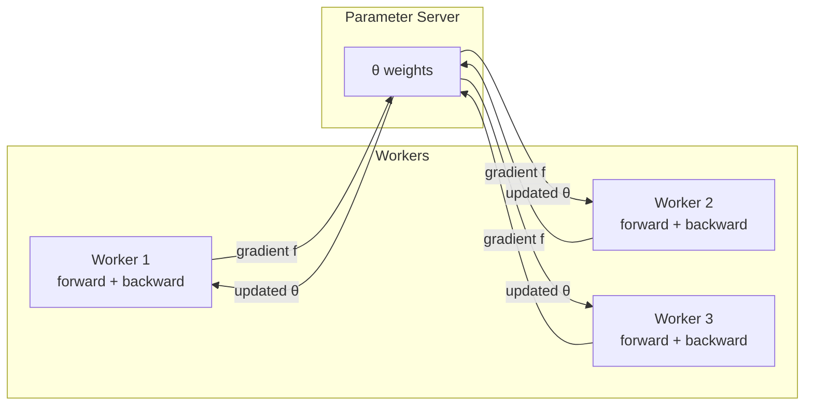

# CSE452: TensorFlow

**TensorFlow** is Google's second-generation distributed machine learning framework, succeeding **DistFlow**. It is now largely superseded by **JAX**, but it set the stage for how modern ML systems think about distributed computation. The key insight TensorFlow introduced was representing an entire ML training job as a **dataflow graph** — a global, inspectable description of the computation that the runtime can schedule and optimize across a cluster.

## Context: Compute-Bound vs. IO-Bound

Most distributed systems studied in [[CSE452]] (e.g., [[Case Studies/MapReduce|MapReduce]], [[Google File System (GFS)|GFS]]) are **IO-bound**: their bottleneck is disk throughput or network bandwidth, so adding more machines with more storage or faster interconnects directly accelerates them.

ML training is fundamentally different — it is **compute-bound**:

- The bottleneck is raw arithmetic throughput, not data movement. Different programs maximize different hardware resources; for ML the limiting resource is the **CPU/GPU compute unit**.
- Because of this, adding more machines directly speeds up training — the compute scales out.
- **Inference** (running a trained model on new inputs) is also compute-bound.

## Dataflow Graph

TensorFlow represents a training job as a **dataflow graph**, giving a **global view of the computation**:

- **Nodes** are operations (matrix multiplications, activation functions, gradient computations).
- **Edges** are tensors (multi-dimensional arrays) flowing between operations.
- The user can annotate the graph to control placement across devices (CPUs, GPUs, machines), and checkpointing is a **first-class node in the graph** — the user defines exactly when weights are written to disk.

## Training a Model

Supervised ML training finds **parameters** $\theta$ that make a model's predictions match ground-truth labels.

- **Training examples**: input $x_i$ paired with ground-truth output $y_i$
- **Model**: $f(x;\, \theta)$ — predicts label $y$ given input $x$ and current parameters $\theta$
- **Objective**: find $\theta$ such that $f(x_i;\, \theta) \approx y_i$ across all examples

The update rule is **gradient descent**:

$$\theta_{t+1} = \theta_t - \alpha f$$

where $\alpha$ is the **learning rate** and $f$ is the gradient of the loss — the direction in parameter space that most increases error. Subtracting it nudges $\theta$ toward lower loss each step.

## GPU and Data Parallelism

GPUs are **data parallelism hardware** — they apply the same operation to many data elements simultaneously:

- A GPU has a **wide data path but a single control path**: one instruction stream drives thousands of arithmetic units in lockstep.
- In the dataflow graph this looks like a control graph that converges to a single point: many parallel operations feeding into one loss value.
- The conceptual model is **SIMD** (**Single Instruction, Multiple Data**) — one instruction, many simultaneous operands.

## Fault Tolerance

TensorFlow's fault-tolerance strategy is deliberately weaker than systems like [[Raft]] or [[2PC|two-phase commit]] because ML training can tolerate (and even benefit from) imprecision.

### Checkpointing

At user-defined points in the dataflow graph, TensorFlow writes the current weights $\theta$ to disk. If a worker dies, the job restarts from the most recent checkpoint rather than from scratch. The user controls checkpoint frequency, trading recovery cost against the overhead of extra disk writes during training.

### Ignoring Faults

If a server dies, TensorFlow can simply **ignore it** — the job continues with gradients from surviving workers and performance stays roughly the same. More strikingly, faults can **help**: if training is stuck in a **local maximum**, a worker failure perturbs the gradient estimate enough to escape it. This is an ML-specific phenomenon.

The takeaway: **strong consistency is not always required**. The application semantics determine the required guarantee, and ML training is unusually tolerant of inconsistency.

## TensorFlow vs. MapReduce

The key difference is **weights**: after each step every worker has computed its gradient $f$ on its own slice of data. These gradients must be **combined** to produce $\theta_{t+1}$, which means every worker must wait for all others to finish before the update can be applied. This synchronization barrier is the primary bottleneck in distributed training.

## Related

- [[Case Studies/MapReduce|MapReduce]] — compare IO-bound vs. compute-bound design
- [[Google File System (GFS)|GFS]] — storage substrate underlying the Google systems stack
- [[Raft]] — contrast strong-consistency replication with TensorFlow's weak-consistency approach
- [[2PC|Two-Phase Commit]] — contrast atomic commit with TensorFlow's ignore-and-checkpoint fault model

## Deep Dive

### Full TensorFlow vs. MapReduce Comparison

Both systems distribute computation across a cluster but differ structurally in how they handle shared mutable state:

| Dimension | MapReduce | TensorFlow |
|---|---|---|
| State | Stateless map/reduce functions | Shared parameter tensor $\theta$ updated each step |
| Communication pattern | One-shot shuffle phase | All-reduce across workers every step |
| Bottleneck | IO (shuffle, GFS reads/writes) | Compute (matrix multiplies on GPU) |
| Fault tolerance | Re-execute failed tasks | Checkpoint + optional stale-gradient skip |
| Consistency requirement | Strong (deterministic output) | Weak (approximate convergence acceptable) |

The synchronization barrier in TensorFlow (waiting for all workers' gradients) is structurally analogous to the shuffle barrier in MapReduce — but in TensorFlow it happens on every single gradient step rather than once per job.

## Industry Standard Terms

| Course Term | Industry / Real-World Equivalent |
|---|---|
| DistFlow | DistBelief (Google's actual internal name for the predecessor) |
| Dataflow graph | Computation graph (PyTorch), XLA HLO graph (JAX) |
| Checkpointing | Model checkpoint / snapshot |
| Parameter $\theta$ | Model weights |
| Gradient $f$ | Gradient of the loss; $\nabla_\theta \mathcal{L}$ in standard notation |
| Combine weights / wait for all nodes | All-reduce (ring all-reduce via NCCL, or parameter server aggregation) |
| Ignore faults | Asynchronous SGD / Hogwild training |
| Compute-bound | GPU-bound / FLOP-bound |
