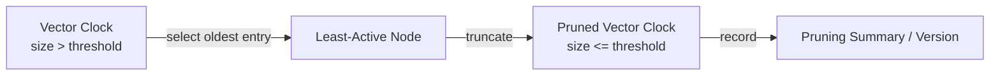

# CSE452: Vector Clock Pruning

**Vector Clock Pruning** is a technique used in distributed systems to manage the scalability of [[Vector Clock Algorithm|Vector Clocks]] by limiting their size.

## The Scalability Problem

The standard **Vector Clock** ($VC$) has a size of $O(N)$, where $N$ is the number of nodes (or actors) that have ever modified the data.

- In systems like Amazon's Dynamo or distributed databases with many transient clients, $N$ can grow into the thousands or millions.
- Carrying a multi-kilobyte vector clock with every small data update or message significantly increases metadata overhead and network latency.

## The Pruning Mechanism

To keep vector clocks manageable, systems implement **Pruning** (also known as **Resizing** or **Truncation**):

1. **Selection**: The system identifies the "oldest" or "least active" entries in the vector clock based on a timestamp of when they were last updated.
2. **Removal**: When the vector clock exceeds a predefined threshold (e.g., 10 entries), the system removes the entry for the oldest node.
3. **Metadata**: The system often keeps a "summary" or a version number of the pruning event to help resolve future conflicts.

## The Impact: Loss of Precision

The fundamental trade-off of pruning is the transition from **perfect causality** to **probabilistic or partial causality**.

### False Concurrency / False Causality

- If a node $P_i$ was pruned from $VC(A)$ but is still present in $VC(B)$, a comparison may fail to show that $A \to B$.
- The system may incorrectly conclude that two events are **concurrent** when one actually happened-before the other, or vice versa.

## Conflict Resolution Fallbacks

Since pruning makes the vector clock comparison potentially unreliable, systems must have a fallback strategy for "ambiguous" cases:

- **Last Write Wins (LWW)**: Fall back to physical wall-clock timestamps to break ties.
- **Syntactic Merging**: Merge the data and let the application or user resolve the conflict (e.g., shopping cart merge).

## Real-World Usage: Amazon Dynamo

Dynamo uses vector clocks for conflict detection but prunes them once they reach a certain size. They noted that in practice, the loss of precision is rare because most data updates happen within a small, active set of nodes, and old nodes rarely reappear with "ancient" versions that would cause significant divergence.

---

## Industry Standard Terms

| CSE452 Term | Industry / Standard Term |
| :--- | :--- |
| **Vector Clock Pruning** | Vector clock truncation / version vector compaction |
| **Pruning Summary** | Dotted version vector / clock-version metadata |
| **Last Write Wins (LWW)** | Timestamp-based conflict resolution |
| **Syntactic Merging** | Sibling reconciliation (Amazon Dynamo) |

---

## Related

- [[Vector Clock Algorithm|Vector Clock Algorithm]] — the full-size vector clock that pruning shrinks
- [[Logical Clocks|Logical Clocks]] — the happens-before relation that pruning can no longer perfectly track
- [[Weak Consistency Models|Weak Consistency Models]] — Last-Writer-Wins and conflict resolution under eventual consistency
