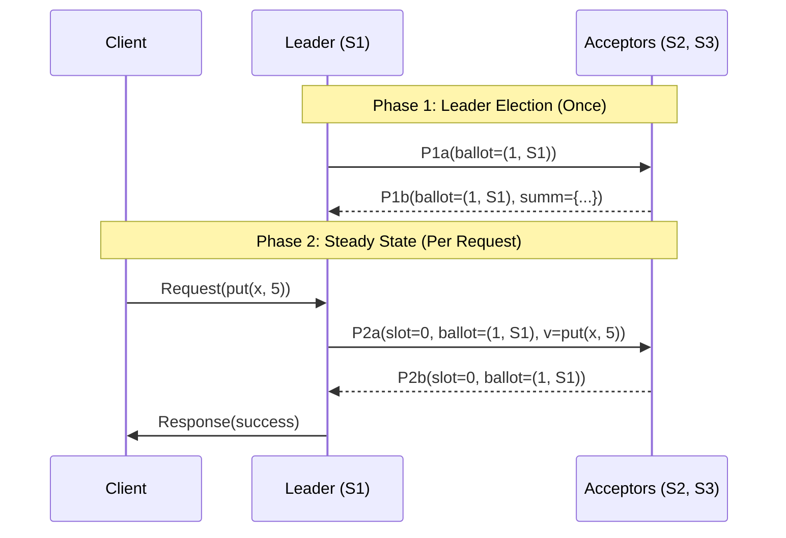

# CSE452: Multi-Paxos

**Multi-Paxos** builds on [[Single Paxos|Single Decree Paxos]] to reach consensus on an entire **sequence of log slots**, rather than just a single value. The key optimization is the **Distinguished Proposer**: a stable elected leader that amortizes the Phase 1 cost across many proposals, reducing the common-case cost from 2 round trips to 1.

## Notation & Data Structures
Multi-Paxos uses the following standardized notation for its protocol messages and local state.

### Core Data Types
```cpp
// Ballot Number (r): A unique tuple (seq_num, server_id)
struct Ballot {
    int seq_num;        
    std::string server_id; // Unique tie-breaker (e.g., IP address)

    // Lexicographical comparison: Higher seq_num wins; server_id breaks ties.
    bool operator>(const Ballot& other) const {
        if (seq_num != other.seq_num) return seq_num > other.seq_num;
        return server_id > other.server_id;
    }
};

// Value (v): The AMO Log Entry
struct AMOCommand {
    std::string client_id;
    int sequence_number;
    std::string command; // e.g., "put(x, 10)"
};

// PaxosLogSlotStatus: The lifecycle of a single log slot
enum class PaxosLogSlotStatus {
    EMPTY,    // No command known
    ACCEPTED, // Received P2a and voted
    CHOSEN,   // Majority has accepted; immutable
    CLEARED   // Garbage collected after execution
};

// Summary Entry (AcceptedValue): Used in P1b to report history
struct AcceptedValue {
    Ballot r;      // Ballot previously voted for
    AMOCommand v;  // Value previously voted for
};
```

### Network Messages (RPCs)
In the **Distinguished Proposer** optimization, Phase 1 is combined across all slots to reduce latency.

| Message | Format                                        | Purpose                                                                                              |
| :------ | :-------------------------------------------- | :--------------------------------------------------------------------------------------------------- |
| **P1a** | `P1a(Ballot r)`                               | **Prepare**: Attempt to become leader for ballot `r` across the entire log.                          |
| **P1b** | `P1b(Ballot r, map<int, AcceptedValue> summ)` | **Promise**: Acceptor promises to follow `r` and provides a **Summary** (`summ`) of all prior votes. |
| **P2a** | `P2a(int s, Ballot r, AMOCommand v)`          | **Accept Request**: Leader proposes value `v` for slot `s`.                                          |
| **P2b** | `P2b(int s, Ballot r)`                        | **Accepted Response**: Acceptor confirms vote for `s` in ballot `r`.                                 |

---

## Core Protocol Rules

### 1. The "Accept is Loose" Rule (Acceptance)

#### Formal Definition
$$\text{P2a.ballot} > \text{local.promise} \implies \text{Update Log}(s)\ \text{and Reply P2b}$$

#### Simplified Explanation
If a leader comes to you with a ballot that is higher than any promise you've made, you **must** accept their proposal. You cannot reject a value just because you already have something else in that slot — the only thing that matters is the ballot number.

### 2. The Safety Invariant (Leader Recovery)

#### Formal Definition
$$v_{new} = \begin{cases} v_{max\_ballot} \in \{summ\} & \text{if } \{summ\} \neq \emptyset \\ v_{client} & \text{otherwise} \end{cases}$$

#### Simplified Explanation
When a new leader takes over, it must honor the past. It looks at all the summaries (`summ`) from a majority. For any slot where someone has already voted, the leader **must** pick the value that had the highest ballot number. Only if a slot is truly empty can the leader use it for a new client request.

### 3. Sequential Execution

#### Formal Definition
$$Execute(s) \iff \forall i < s:\ Status(i) = \text{CHOSEN} \land Executed(i)$$

#### Simplified Explanation
You can decide slots in any order, but you must execute them like reading a book. You cannot execute page 5 (Slot 5) until you have finished pages 1 through 4. If there is a gap, the state machine stops and waits.

---

## The Distinguished Proposer Optimization
By electing a stable leader, Multi-Paxos reduces the common-case cost from **2 Round Trips to 1 Round Trip**.



For the detailed mechanics of heartbeat-based failure detection, see [[Failure Detection|Failure Detection]].

---

## Implementation Strategy (Lab 3)

### Development Order
1. **Ballots**: Implement lexicographical comparison.
2. **Log Structure**: Build the `LogEntry` map and implement slot pointers ($S_i, S_o, S_{gc}$).
3. **Phase 2**: Implement the steady-state push path (P2a/P2b/Decisions).
4. **Phase 1**: Implement the combined election logic and **Log Merging**.
5. **Recovery**: Handle gap-filling using **No-Ops**. See [[Holes in the Log|Holes in the Log]].
6. **Maintenance**: Add heartbeats and garbage collection. See [[Log|Log]].

### Critical Considerations
- **Dueling Proposers**: Use randomized back-off when a `P1a` is rejected to prevent two nodes from livelocking the system.
- **Commit Index**: Piggyback the highest chosen slot (`leaderCommit`) on all outgoing messages so followers can execute.
- **AMO State**: The state machine must track the highest sequence number per client to ensure "At-Most-Once" semantics.

---

## Detailed Components
- [[Leader Election|Leader Election]] — Steady-state details, leases, and the rejection logic.
- [[Log|Log]] — Slot pointers, garbage collection, snapshots, and catching up.
- [[Failure Detection|Failure Detection]] — Heartbeat mechanics and election timers.
- [[Holes in the Log|Holes in the Log]] — The specific logic for proposing No-Ops to fill gaps.

## Industry Standard Terms

| CSE452 Term | Industry / Standard Term |
| :--- | :--- |
| **Multi-Paxos** | Multi-Paxos / replicated log consensus |
| **Distinguished Proposer** | Leader |
| **Log Slot** | Log index / log entry |
| **No-Op** | No-op log entry / filler entry |
| **leaderCommit** | Commit index |
| **InstallSnapshot** | Snapshot transfer RPC |
| **AMO Semantics** | Exactly-once / idempotent request handling |

---

## Related
- [[Paxos|Paxos Overview]]
- [[Single Paxos|Single Decree Paxos]]
- [[Paxos Invariants|Invariants & Safety Proofs]]
- [[Fast Reads in Multi-Paxos|Fast Reads in Multi-Paxos]] — read optimizations that bypass the leader log
- [[Sharding|Sharding]] — Multi-Paxos as the consensus engine for each replica group
