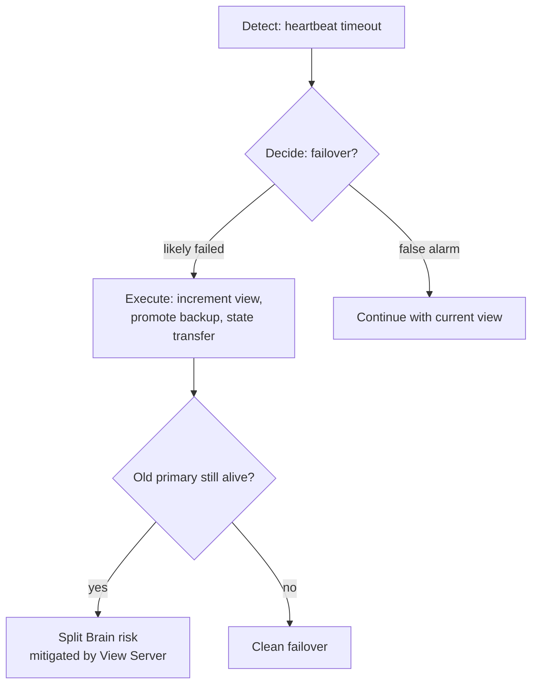

# Distributed Systems: Failover Protocol

## What is Failover?

**Failover** is the process of replacing one node in a role (primary or backup) with another node — conceptually, transferring the role to a new machine. If the primary fails, the backup takes over as the new primary.

---

## Why Failover is Hard

The fundamental problem: **you cannot know with certainty that a node has failed**.

When a node becomes unreachable, there are two possible explanations:
1. The **machine** has crashed.
2. The **network** has failed (the machine is still running but we can't communicate with it).

These two scenarios are indistinguishable from the outside. Acting on a false assumption causes problems:
- If you promote a new primary while the old primary is still running, you get a **split brain** — two machines both acting as primary simultaneously, causing diverging state.

---

## Failover Process

The ideal process:
1. **Detect** that a failure has likely occurred (via heartbeat timeouts or similar).
2. **Decide** whether to failover (use approximate failure detection — see [[Primary Backup#Approximate Failure Detection|Approximate Failure Detection]]).
3. **Execute** the view change: update the [[View Server|View Server]], perform state transfer to the new backup if needed.

Because detection is imperfect, systems accept the risk of false positives and design protocols (like the View Server) to handle the edge cases safely.

---

## Industry Standard Terms

| CSE452 Term | Industry / Standard Term |
| :--- | :--- |
| **Failover** | Failover / leader election |
| **Split Brain** | Split-brain syndrome |
| **Approximate Failure Detection** | Heartbeat-based failure detector |

---

## Related
- [[Primary Backup|Primary-Backup Replication]] — the full replication protocol that failover supports
- [[View Server|View Server]] — the authority that executes the view change during failover
- [[Fault Model|Fault Model]] — the types of failures that trigger failover
- [[Why Not Just Use TCP|Why Not Just Use TCP]] — why TCP cannot substitute for an application-level failover protocol
