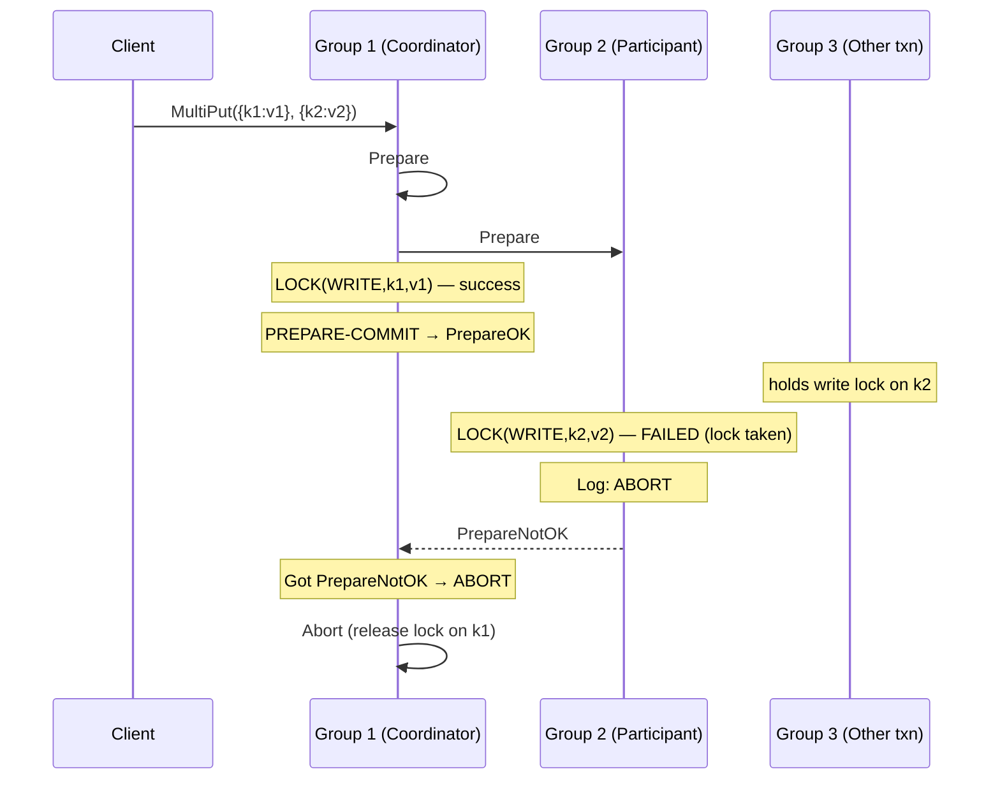
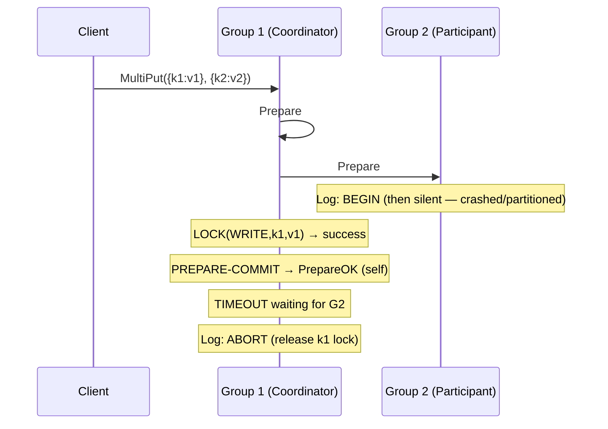

# Distributed Systems: 2PC Failure Scenarios

[[Transactions|Two-Phase Commit (2PC)]] must handle failures at any point in the protocol. Two fundamental failure modes arise during the Prepare phase: a participant cannot acquire a lock, and the coordinator stops hearing from a participant. In both cases, the [[Log Operations|log]] is the record of what happened and drives the recovery path.

---

## Failure 1: Lock Is Taken

### Scenario

During the Prepare phase, a participant attempts to acquire a write lock on a key it is responsible for, but that key's lock is **already held** by a different in-progress transaction.

### Walkthrough

The coordinator (Group 1) is running `MultiPut({k1: v1}, {k2: v2})`. Group 1 successfully acquires a write lock on `k1` and logs `PREPARE-COMMIT`. It sends `PrepareOK` to itself.

Group 2 attempts to acquire a write lock on `k2`, but Group 3 is currently executing a transaction that holds the write lock on `k2`. Group 2 cannot acquire the lock. Rather than waiting (which could cause a deadlock), Group 2 uses **abort-on-conflict**: it immediately logs `ABORT`, undoes any temporary state changes, and replies `PrepareNotOK` to the coordinator.

```
Group 1 Log:              Group 2 Log:
┌──────────────────┐      ┌──────────────────┐
│  BEGIN           │      │  BEGIN           │
│  LOCK(WRITE,k1,v1)│     │  ABORT           │
│  PREPARE-COMMIT  │      └──────────────────┘
└──────────────────┘
```

### Coordinator Response

The coordinator receives `PrepareOK` from Group 1 and `PrepareNotOK` from Group 2. Since **not all** participants are ready, the coordinator must abort the entire transaction. It logs `ABORT` in its own log and sends `Abort` to Group 1 (which already sent `PrepareOK` and is holding a write lock on `k1`).

```
Group 1 Log (final):       Group 2 Log (final):
┌──────────────────┐       ┌──────────────────┐
│  BEGIN           │       │  BEGIN           │
│  LOCK(WRITE,k1,v1)│      │  ABORT           │
│  PREPARE-COMMIT  │       └──────────────────┘
│  ABORT           │
└──────────────────┘

Group 1 KVStore: {}
Group 2 KVStore: {}
```

Group 1 receives the `Abort` message, logs `ABORT`, releases its write lock on `k1`, and discards its tentative write. No data has been modified on either group. The client must retry the transaction later, once the conflicting transaction on Group 3 completes and the write lock on `k2` is released.



---

## Failure 2: Coordinator Doesn't Hear Back from Participant (Timeout)

### Scenario

The coordinator sends `Prepare` to all participants and receives `PrepareOK` from some of them, but one participant — which may have crashed, be partitioned, or simply be slow — **never responds**. The coordinator eventually **times out** waiting.

### Walkthrough

Group 1 (coordinator) sends `Prepare` to itself and Group 2. Group 1 successfully acquires a write lock on `k1`, logs `PREPARE-COMMIT`, and sends `PrepareOK`. Group 2 receives the `Prepare` message and logs `BEGIN`, but then becomes unresponsive (e.g., it crashes before it can acquire the lock).

```
Group 1 Log:              Group 2 Log:
┌──────────────────┐      ┌──────────────────┐
│  BEGIN           │      │  BEGIN           │
│  LOCK(WRITE,k1,v1)│     └──────────────────┘
│  PREPARE-COMMIT  │            (silent)
└──────────────────┘
```

The coordinator waits for `PrepareOK` from Group 2. After a timeout expires, the coordinator treats the non-response as a failure — equivalent to `PrepareNotOK`. The coordinator logs `ABORT` and sends `Abort` to Group 1 (itself, which is holding the write lock on `k1`).

```
Group 1 Log (final):       Group 2 Log (stuck):
┌──────────────────┐       ┌──────────────────┐
│  BEGIN           │       │  BEGIN           │
│  LOCK(WRITE,k1,v1)│      └──────────────────┘
│  PREPARE-COMMIT  │
│  ABORT           │
└──────────────────┘
```

Group 1 releases the write lock on `k1` and discards the tentative write.

### Recovery for the Stuck Participant

Group 2's log ends with `BEGIN` and nothing else. When Group 2 recovers (or the network partition heals), it has no `PREPARE-COMMIT` entry — meaning it never promised to commit. Since the coordinator has already aborted and released its side, the transaction is definitively dead. Group 2 can safely log `ABORT` for the orphaned transaction and clean up.

The key invariant: **a participant without a `PREPARE-COMMIT` entry can always safely abort**, because it never sent `PrepareOK` and the coordinator could not have decided to commit.



---

## Comparison of Failure Modes

| | Lock Is Taken | Participant Timeout |
| :--- | :--- | :--- |
| **Trigger** | Write lock held by another txn | Participant crashes or is partitioned |
| **Participant log (failed)** | `BEGIN → ABORT` | `BEGIN` (stuck) |
| **Coordinator response** | Abort immediately on `PrepareNotOK` | Abort after timeout |
| **Coordinator final log** | `... → PREPARE-COMMIT → ABORT` | `... → PREPARE-COMMIT → ABORT` |
| **Result** | Both sides clean, client retries | Coordinator clean; participant aborts on recovery |

---

## Industry Standard Terms

| CSE452 Term | Industry / Standard Term |
| :--- | :--- |
| **Abort-on-conflict** | No-wait deadlock prevention policy |
| **PrepareNotOK** | Vote-abort |
| **Coordinator timeout** | Presumed-abort (in the presumed-abort optimization) |
| **Stuck participant (BEGIN only)** | In-doubt transaction |

---

## Related

- [[Transactions|Transactions (2PC)]] — hub file
- [[Log Operations|Log Operations]] — semantics of ABORT and PREPARE-COMMIT
- [[MultiPut Walkthrough|MultiPut Walkthrough]] — the happy-path version of this same scenario
- [[Phases and Roles|Phases and Roles]] — the protocol phases these failures interrupt
- [[Locking and Deadlock|Locking and Deadlock]] — abort-on-conflict and why participants never wait for a lock
